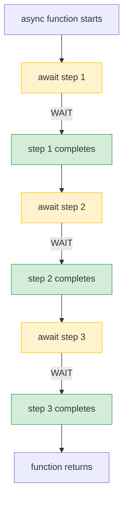
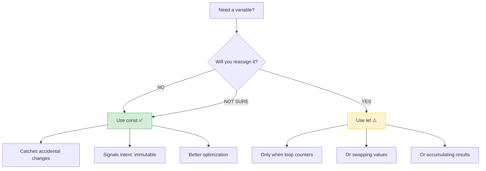
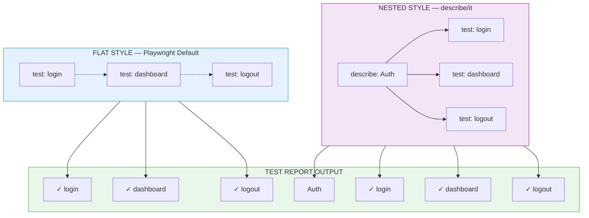
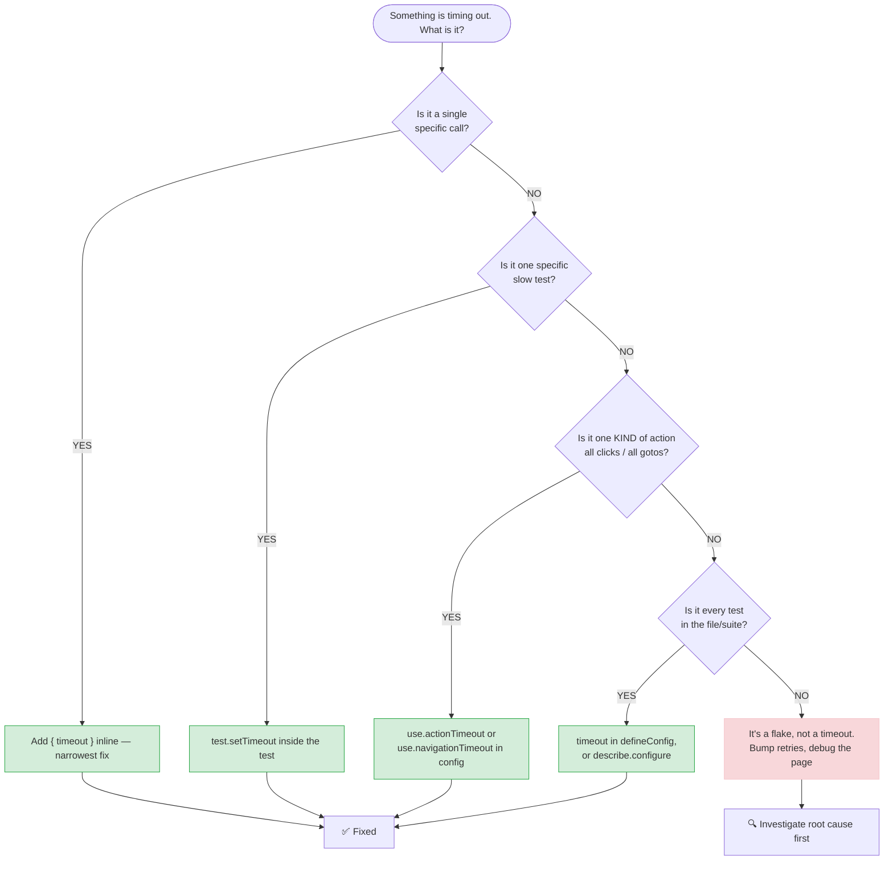

# The Playwright Guide — From "Wait, What?" to "Wait, That's It?"

> *"I'm gonna make him an offer he can't refuse." — The Godfather*
>
> Playwright makes testing so easy, you'll wonder why you ever did it any other way.

**The one consolidated guide.** Covers the basics, intermediate patterns, page objects, and the timeouts deep dive — all in one place.

Pick a rail — both share the same content, separated by how much you want to read right now.

### 🛤️ Rail A — Quick Path (ship today)
New to e2e, want green tests inside an hour.

1. [Chapter 1 — Your first test](#-chapter-1-your-first-test--the-hello-world-that-actually-does-something) — `test`, `await`, `expect`
2. [Chapter 4 — `test` vs `describe`](#-chapter-4-the-great-debate--test-vs-describeit) — pick a style
3. [Chapter 11 — Locators](#-chapter-11-locators--finding-page-elements-with-x-ray-vision) — `getByRole` first
4. [Chapter 12 — Assertions](#-chapter-12-assertions--expect-with-superpowers) — auto-retry magic
5. [Chapter 13 — `playwright.config.ts`](#-chapter-13-the-playwrightconfigts--mission-control) — browsers, retries, parallel
6. [Bonus Cheat Sheet](#-bonus-cheat-sheet-for-your-wall) — print, stick to monitor

### 🛤️ Rail B — Deep Path (understand every clock)
Tests work, but flakes are eating CI. You want root-cause literacy.

1. Everything in Rail A, plus:
2. [Chapter 6 — Hooks](#-chapter-6-hooks--the-beforeafter-magic) — `beforeAll` at file scope, shared-state trap
3. [Chapter 7 — Fixtures](#-chapter-7-fixtures--the-playwright-superpower) — isolation, not free parallelism
4. [Chapter 14 — Debugging](#-chapter-14-debugging--when-the-test-goes-rogue) — UI Mode, Inspector, Trace Viewer
5. [Chapter 15 — API testing](#-chapter-15-api-testing--the-backstage-pass) — seed via API, assert via UI
6. [Chapter 16 — Page Objects](#-chapter-16-page-objects--because-copy-paste-is-not-a-design-pattern) — one class per page
7. [Part III — Timeouts Deep Dive (Appendix A–K)](#part-iii--the-timeouts-deep-dive) — every clock, traced

```text
┌──────────────────────────────────────────────────────────────────────┐
│  WHAT'S INSIDE                                                       │
├──────────────────────────────────────────────────────────────────────┤
│  Part I  — The Basics          (Chapters 1–10): test, await, fixtures │
│  Part II — Beyond the Basics   (Chapters 11–16): locators, asserts,   │
│                                       config, debugging, API, POs    │
│  Part III— Timeouts Deep Dive  (Appendix A–K): every clock, explained │
└──────────────────────────────────────────────────────────────────────┘
```

---

## 🎬 Scene Setting: Why Are We Here?

You've heard the buzz. "Playwright is the new hotness." "Cypress is so 2020." "Selenium? That's vintage."

You open the docs. You see `async`, `await`, `page.goto()`, `expect()`, `describe`, `test`, `it`, `beforeAll`, `afterEach`, **fixtures**...

And your brain goes: **"Excuse me what the actual fork?"**

*Relax. Grab coffee. We're doing this together — step by step, human to human. No capes required (but encouraged).*

---

## 🎯 Chapter 1: Your First Test — The "Hello World" That Actually Does Something

### The Code

```typescript
import { test, expect } from '@playwright/test';

test('homepage has the expected title', async ({ page }) => {
    await page.goto('https://playwright.dev/');
    await expect(page).toHaveTitle(/Playwright/);
});
```

A real assertion on a real page. If you run this, it goes green. Let's pull it apart.

### What Just Happened? (In Plain English)

| Line | Translation |
|------|-------------|
| `import { test, expect }` | "Hey Playwright, give me your testing tools — and your assert hero." |
| `test('name', async ...)` | "Here's a test. It runs async stuff. Thanks." |
| `{ page }` | "Give me a browser tab. I'll call it `page`." |
| `await page.goto(...)` | "Go to this URL. **Wait until you're there.**" |
| `await expect(page).toHaveTitle(/Playwright/)` | "Keep retrying until the tab title matches — or 5s pass and we fail." |

A test without an `expect(...)` is not a test — it's a script that runs and reports nothing. The `expect()` line is what makes this go **green** or **red**. Don't skip it. (More on the auto-retry magic behind `expect` in [Chapter 12](#-chapter-12-assertions--expect-with-superpowers).)

### The Magic Words: `async` and `await`

With `async`/`await` comes... actually readable async code.

Think of it like preparing a utility belt:

```typescript
async function prepareUtilityBelt() {
    const batarang = await forgeBatarang();      // Pause. Wait for forging.
    const grapple = await buildGrappleGun();     // Pause. Wait for engineering.
    const smoke = await mixSmokePellets();       // Pause. Wait for chemistry.
    await attachToBelt(batarang, grapple, smoke); // Pause. Wait for mounting.
    return utilityBelt;
}
```

**Without `await`**: You'd hand them a box of raw metal, chemicals, and a cold forge and call it "ready."

**With `await`**: Each gadget is *finished* before the next starts. No mid-air grapple failures.

#### The Cheat Sheet

| Keyword | Job | Analogy |
|---------|-----|---------|
| `async` on function | "I promise this function has pauses" | "This mission has wait times" |
| `await` on line | "Pause **this line** until done" | "Hold position. Don't move until signal." |

> **Rule**: If you use `await` anywhere, the function **must** say `async`. It's the law. JavaScript enforces it.

---

### 📊 VISUAL: How `async`/`await` Flow Works



> 🖼️ **Illustration**: [`01-async-await-flow.png`](assets/posts/playwright-guide-illustrations/01-async-await-flow.png) — sequential, not simultaneous.

```text
┌─────────────────────────────────────────────────────────────────────┐
│                    WITHOUT await (CHAOS)                            │
├─────────────────────────────────────────────────────────────────────┤
│  Start → Step 1 → Step 2 → Step 3 → End (all at once!)            │
│    │       │       │       │                                        │
│    ▼       ▼       ▼       ▼                                        │
│  Raw     Raw     Raw     Raw                                        │
│  metal   chem    forge   belt   = DISASTER                          │
└─────────────────────────────────────────────────────────────────────┘

┌─────────────────────────────────────────────────────────────────────┐
│                    WITH await (ORDER)                               │
├─────────────────────────────────────────────────────────────────────┤
│  Start ──wait──→ Step 1 ──wait──→ Step 2 ──wait──→ Step 3 → End   │
│    │             │             │             │                      │
│    ▼             ▼             ▼             ▼                      │
│  Forge      Complete     Build        Complete     Mix       Done!  │
│  batarang   batarang!   grapple      grapple!   smoke       ✅      │
└─────────────────────────────────────────────────────────────────────┘
```

---

## 🎭 Chapter 2: Two Ways to Get a Title — Old vs. New

### ❌ The "Grandpa" Way (Promise `.then()`)

```typescript
// This works. But it's 2015 calling.
await page.title().then(title => {
    console.log(title);
});
```

**Translation**: "Go get the title. When you *eventually* have it, run this callback function."

Problems:
- Callback hell awaits (pun intended)
- Harder to debug — breakpoints get weird
- Mixing `async`/`await` with `.then()` is like wearing your underwear outside your pants (Superman style, but not in a good way)

### ✅ The Modern Way (Just `await`)

```typescript
const title = await page.title();
console.log(title);
```

**Translation**: "Get the title. **Wait right here** until you have it. Then continue."

Benefits:
- Reads top-to-bottom like a comic book
- Debugger stops *exactly* where you expect
- Standard in all Playwright docs
- Easy to add `expect(title).toContain('Automation')` next line

---

### 📊 VISUAL: `.then()` vs `await` — The Showdown

```mermaid
flowchart LR
    subgraph OLD[❌ OLD WAY — .then() callback style]
        A1[page.title()] --> B1[.then(title => {]
        B1 --> C1[console.log(title)
        C1 --> D1[});]
    end
    
    subgraph NEW[✅ NEW WAY — await style]
        A2[const title =] --> B2[await page.title()]
        B2 --> C2[console.log(title)]
    end
    
    style OLD fill:#f8d7da,stroke:#f5c6cb
    style NEW fill:#d4edda,stroke:#c3e6cb
```

```text
╔═══════════════════════════════════════════════════════════════════════╗
║                    CALLBACK HELL VISUALIZATION                        ║
╠═══════════════════════════════════════════════════════════════════════╣
║                                                                       ║
║   .then() STYLE (nested callbacks = pyramid of doom):                ║
║                                                                       ║
║   getUser()                                                            ║
║     .then(user => getPosts(user.id))                                  ║
║       .then(posts => getComments(posts[0].id))                        ║
║         .then(comments => getLikes(comments[0].id))                   ║
║           .then(likes => console.log(likes))                          ║
║             .catch(err => handleError(err))                           ║
║                                                                       ║
║   ▼ ▼ ▼ ▼ ▼ ▼ ▼ ▼ ▼ ▼ ▼ ▼ ▼ ▼ ▼ ▼ ▼ ▼ ▼ ▼ ▼ ▼ ▼ ▼ ▼ ▼ ▼ ▼            ║
║                                                                       ║
║   await STYLE (flat, readable, debuggable):                           ║
║                                                                       ║
║   const user = await getUser()        ← Debugger stops HERE          ║
║   const posts = await getPosts(user.id)  ← Or HERE                   ║
║   const comments = await getComments(posts[0].id)  ← Or HERE         ║
║   const likes = await getLikes(comments[0].id)       ← Or HERE       ║
║   console.log(likes)                                             ║
║                                                                       ║
╚═══════════════════════════════════════════════════════════════════════╝
```

---

## 🧠 Chapter 3: `const` vs `let` — The "I Promise Not to Change This" Rule

```typescript
const title = await page.title();  // "This value stays put — like Superman's moral compass"
let villainCount = 0;              // "I might increment this later"
villainCount = villainCount + 1;   // OK, we said we'd change it
```

**Golden Rule**: Default to `const`. Only use `let` when you *know* you'll reassign. It catches bugs early.

> *"I find your lack of `const` disturbing." — definitely a developer in another life*

---

### 📊 VISUAL: When to Use Which



```text
┌────────────────────────────────────────────────────────────────┐
│                    CONST VS LET — QUICK REFERENCE              │
├──────────────────┬─────────────────────────────────────────────┤
│ SCENARIO         │ CHOICE                                      │
├──────────────────┼─────────────────────────────────────────────┤
│ Page title       │ const title = await page.title()           │
│ Loop counter     │ let i = 0; i++                               │
│ Config object    │ const config = { url: '...', timeout: 5000 }│
│ Accumulator      │ let total = 0; total += item.price          │
│ Swapping values  │ let temp = a; a = b; b = temp               │
│ Test data        │ const testUser = { name: 'Admin', role: 1 } │
└──────────────────┴─────────────────────────────────────────────┘

💡 PRO TIP: If you're not sure, use const. Change to let only when
   TypeScript yells at you. It's like a safety net — free insurance.
```

---

## 🏗️ Chapter 4: The Great Debate — `test` vs `describe`/`it`

### Style 1: Flat (Playwright's Way) — *Lone Wolf Style*

```typescript
import { test, expect } from '@playwright/test';

test('user can login', async ({ page }) => { ... });
test('user sees dashboard', async ({ page }) => { ... });
test('user can logout', async ({ page }) => { ... });
```

Think: lone wolf. Works alone. Gets the job done. No drama.

### Style 2: Nested (Jest/Jasmine Way)

```typescript
import { test, expect } from '@playwright/test';

test.describe('User authentication', () => {
    test('user can login', async ({ page }) => { /* ... */ });
    test('user sees dashboard', async ({ page }) => { /* ... */ });
    test('user can logout', async ({ page }) => { /* ... */ });
});
```

Think: teamwork. Group photo at the end.

### Plot Twist: **They're the Same Thing**

```typescript
// Inside Playwright source code:
export const it = test;  // ← it IS test. Just an alias with a cooler name.
```

Playwright gives you `describe` for grouping. That's it. `it` is just `test` wearing a disguise.

---

### 📊 VISUAL: The Two Styles Side by Side



> 🖼️ **Illustration**: [`02-flat-vs-nested.png`](assets/posts/playwright-guide-illustrations/02-flat-vs-nested.png) — two syntaxes, one parallelism engine.

```text
╔════════════════════════════════════════════════════════════════════════════╗
║                    FLAT vs NESTED — VISUAL COMPARISON                      ║
╠════════════════════════════════════════════════════════════════════════════╣
║                                                                           ║
║  FLAT (Playwright style)              NESTED (Jest style)                ║
║  ─────────────────────                ───────────────────                ║
║  test('login')          ──────►       test.describe('Auth')              ║
║  test('dashboard')                    ├─ test('login')                   ║
║  test('logout')                       ├─ test('dashboard')               ║
║                                        └─ test('logout')                 ║
║                                                                           ║
║  REPORT:                                 REPORT:                         ║
║  ✓ login                                 Auth                            ║
║  ✓ dashboard                               ✓ login                      ║
║  ✓ logout                                  ✓ dashboard                  ║
║                                               ✓ logout                   ║
║                                                                           ║
║  ✅ Files run in PARALLEL by default      ✅ Visual grouping in reports   ║
║  ✅ No shared state (per-test isolation)  ⚠️  Can share state (hooks)    ║
║  ✅ Simpler mental model                  😐 Extra indentation          ║
║  ❌ No visual grouping                    ⚠️ Tests in one file serial by default  ║
║                                                                           ║
║  * Tests within a single file run serial unless fullyParallel or        ║
║    test.describe.configure({ mode: 'parallel' }). Flat vs describe     ║
║    is grouping, not the parallelism engine.                           ║
║                                                                           ║
╚════════════════════════════════════════════════════════════════════════════╝
```

---

## ⚔️ Chapter 5: When to Use Which? (The Decision Matrix)

| Situation | Use | Hero Equivalent |
|-----------|-----|-----------------|
| Starting fresh | Flat `test` + fixtures | build it right from scratch |
| Tests share login/setup | `describe` + hooks **or** fixtures | shared mission, shared resources |
| Migrating from Jest | `describe`/`it` (familiar) | friendly neighborhood, familiar vibes |
| Want pretty report folders | `describe` | organized, labeled, tidy |
| Need parallel within file | `test.describe.configure({ mode: 'parallel' })` or `fullyParallel` | files already parallel; speed within file requires opt-in |
| Different users per test | Fixtures (admin, user, guest) | shape-shifts per scenario |

> **My Take**: Start flat. Graduate to `describe` when you *feel the pain* of repeated setup. Don't pre-optimize — even Iron Man built Mark I in a cave before Mark L.

---

### 📊 VISUAL: Decision Flowchart

```mermaid
flowchart TD
    START([New Test File?]) --> Q1{Share setup\nacross tests?}
    
    Q1 -->|NO| FLAT[Flat test + fixtures]
    Q1 -->|YES| Q2{Setup complex\nor file-specific?}
    
    Q2 -->|File-specific only| DESC[describe + hooks]
    Q2 -->|Reusable across files| FIXTURES[Fixtures ✨]
    
    Q2 -->|Migrating from Jest| DESC
    Q2 -->|Want report folders| DESC
    Q2 -->|Want tests in one file to run concurrently| CONFIGURE[fullyParallel / test.describe.configure({ mode: 'parallel' })]
    
    FLAT --> END[🎉 Happy Testing!]
    DESC --> END
    FIXTURES --> END
    CONFIGURE --> END
    
    style FLAT fill:#e3f2fd,stroke:#2196f3
    style DESC fill:#f3e5f5,stroke:#9c27b0
    style FIXTURES fill:#e8f5e9,stroke:#4caf50
    style CONFIGURE fill:#fff3cd,stroke:#ffc107
    style END fill:#fff3e0,stroke:#ff9800
```

```text
┌─────────────────────────────────────────────────────────────────────────┐
│                        QUICK DECISION GUIDE                              │
├─────────────────────────────────────────────────────────────────────────┤
│                                                                          │
│   ┌─────────────┐     ┌─────────────┐     ┌─────────────┐              │
│   │   FLAT      │     │  DESCRIBE   │     │  FIXTURES   │              │
│   │   TEST      │     │   + HOOKS   │     │   (BEST)    │              │
│   └──────┬──────┘     └──────┬──────┘     └──────┬──────┘              │
│          │                   │                   │                      │
│   ┌──────▼───────────────────▼───────────────────▼──────┐              │
│   │                  USE WHEN...                          │              │
│   ├──────────────────────────────────────────────────────┤              │
│   │ • Simple tests, no shared setup      • Familiar Jest      │              │
│   │ • Starting fresh                     • File-only setup    │              │
│   │ • Independent test cases             • Visual reports     │              │
│   │                                      • Migration path     │              │
│   └──────────────────────────────────────────────────────┘              │
│                                                                          │
│   💡 START HERE → Move right when you feel pain                         │
│                                                                          │
└─────────────────────────────────────────────────────────────────────────┘
```

---

## 🪝 Chapter 6: Hooks — The "Before/After" Magic

> Hooks live on `test` — there's no bare `beforeAll`/`afterAll` named export. You call `test.beforeAll`, `test.beforeEach`, etc. And they work **at file scope too**, not only inside `test.describe`. A `test.beforeAll(...)` written at the top of a file runs once before any test in that file.

```typescript
import { test, expect } from '@playwright/test';

test.describe('Logged-in dashboard', () => {
    let userToken: string;

    // Runs ONCE before everything in this describe block
    test.beforeAll(async ({ browser }) => {
        const context = await browser.newContext();
        const page = await context.newPage();
        await page.goto('/login');
        await page.fill('#user', 'admin');
        await page.fill('#pass', 'secret');
        await page.click('button:has-text("Login")');
        userToken = await page.evaluate(() => localStorage.getItem('token'));
        await context.close();
    });

    // Runs BEFORE EACH test in this describe block
    test.beforeEach(async ({ page }) => {
        await page.goto('/dashboard');
        await page.evaluate((token) => localStorage.setItem('token', token), userToken);
        await page.reload();
    });

    test('shows welcome', async ({ page }) => { /* ... */ });
    test('shows stats', async ({ page }) => { /* ... */ });

    // Runs ONCE after everything in this describe block
    test.afterAll(async () => { /* cleanup */ });
});
```

### Hook Cheatsheet

| Hook | Runs | Use For |
|------|------|---------|
| `test.beforeAll` | Once, before all tests in the scope (file or `test.describe`) | Heavy setup (create test data, not login — use a fixture for that) |
| `test.beforeEach` | Before **each** test | Reset state the previous test polluted |
| `test.afterEach` | After **each** test | Capture artifacts on failure (Playwright already screenshots on retry — check before you write your own) |
| `test.afterAll` | Once, after all tests in the scope | Delete test users, tear down shared resources |

> ⚠️ **Warning**: `test.beforeAll` shares state across every test in its scope. If Test 1 deletes the user, Test 2 & 3 fail mysteriously. That's the same "shared state" trap the next chapter solves with **fixtures** — each test gets fresh setup and teardown.

---

### 📊 VISUAL: Hook Execution Timeline

```mermaid
gantt
    title Hook Execution Timeline for describe Block
    dateFormat  X
    axisFormat  %S
    
    section beforeAll
    Login & Token :done, a1, 0, 3
    
    section Test 1
    beforeEach :active, b1, 3, 2
    Test: Welcome :crit, t1, 5, 3
    afterEach :done, c1, 8, 1
    
    section Test 2
    beforeEach :active, b2, 9, 2
    Test: Stats :crit, t2, 11, 3
    afterEach :done, c2, 14, 1
    
    section Test 3
    beforeEach :active, b3, 15, 2
    Test: Profile :crit, t3, 17, 3
    afterEach :done, c3, 20, 1
    
    section afterAll
    Cleanup :done, a2, 21, 2
```

> 🖼️ **Illustration**: [`03-hooks-timeline.png`](assets/posts/playwright-guide-illustrations/03-hooks-timeline.png) — `beforeAll` → `beforeEach` → test → `afterEach` → `afterAll`.

```text
╠══════════════════════════════════════════════════════════════════════════════╣
║                                                                            ║
║  test.describe('Auth', () => {                                            ║
║      │                                                                     ║
║      ▼                                                                    ║
║  ┌─────────────────────────────────────┐                                  ║
║  │ test.beforeAll() ──────────────── │  ← RUNS ONCE                    ║
║  │   Login once, get token             │                                  ║
║  └─────────────────────────────────────┘                                  ║
║      │                                                                    ║
║      ▼                                                                    ║
║  ┌─────────────────────────────────────┐                                  ║
║  │ test.beforeEach() ─────────────── │  ← RUNS 3 TIMES                 ║
║  │   Restore token, goto dashboard     │                                  ║
║  └─────────────────────────────────────┘                                  ║
║      │                                                                    ║
║      ▼                                                                    ║
║  ┌──────────────┐  ┌──────────────┐  ┌──────────────┐                   ║
║  │ test 1       │  │ test 2       │  │ test 3       │                   ║
║  │ 'welcome'    │  │ 'stats'      │  │ 'profile'    │                   ║
║  └──────────────┘  └──────────────┘  └──────────────┘                   ║
║      │                                                                    ║
║      ▼                                                                    ║
║  ┌─────────────────────────────────────┐                                  ║
║  │ test.afterEach() ─────────────── │  ← RUNS 3 TIMES                 ║
║  │   Screenshot on fail, cleanup      │                                  ║
║  └─────────────────────────────────────┘                                  ║
║      │                                                                    ║
║      ▼                                                                    ║
║  ┌─────────────────────────────────────┐                                  ║
║  │ test.afterAll() ───────────────── │  ← RUNS ONCE                    ║
║  │   Logout, delete test users        │                                  ║
║  └─────────────────────────────────────┘                                  ║
║                                                                            ║
╚═════════════════════════════════════════════════════════════════════════════╝

⚠️  DANGER ZONE: test.beforeAll shares state across tests in its scope!
    If test 1 deletes the user, test 2 & 3 will fail mysteriously.
    This is why fixtures (next chapter) are safer — each test gets fresh state.

    Also note: hooks aren't limited to test.describe. test.beforeAll at file
    scope runs once before any test IN THAT FILE. Hooks never escape their file.
```

---

## 🧪 Chapter 7: Fixtures — The Playwright Superpower

> Why do we use fixtures? So we don't repeat ourselves. Work smarter, not harder — shrink the problem.

### The Problem

5 test files. Each needs "logged in as admin." Copy-paste `beforeAll` everywhere? **No.** That's busywork, not a solution.

### The Solution: `fixtures.ts` — build the gadget once

```typescript
// fixtures.ts — build the gadget once
import { test as base, Page } from '@playwright/test';

type MyFixtures = {
    loggedInPage: Page;
};

export const test = base.extend<MyFixtures>({
    loggedInPage: async ({ page }, use) => {
        // SETUP: Login once
        await page.goto('/login');
        await page.fill('#user', 'admin');
        await page.fill('#pass', 'secret');
        await page.click('button:has-text("Login")');
        await page.waitForURL('/dashboard');

        // HAND OVER to the test — "Here, use this."
        await use(page);

        // TEARDOWN: Runs after test — self-destruct sequence
        await page.evaluate(() => localStorage.clear());
    },
});
```

### Using It

```typescript
// dashboard.test.ts
import { test, expect } from './fixtures';

test('dashboard shows welcome', async ({ loggedInPage }) => {
    await expect(loggedInPage.locator('h1')).toContainText('Welcome');
});

test('dashboard shows stats', async ({ loggedInPage }) => {
    await expect(loggedInPage.locator('.stats')).toBeVisible();
});
```

### Why Fixtures Win

| Feature | `describe` + hooks | Fixtures |
|---------|-------------------|----------|
| Isolation | ❌ Shared state breaks | ✅ Each test gets fresh fixture |
| TypeScript support | 😐 Manual types | ✅ Full autocomplete |
| Reuse across files | ❌ Copy-paste | ✅ Import once, use everywhere |
| Multiple users | 😰 Nested describes | ✅ `adminPage`, `userPage`, `guestPage` |
| Dependencies | Hidden | ✅ Explicit in test signature |

```typescript
// Different fixtures for different needs — your own roster
test('admin sees all', async ({ adminPage }) => { ... });
test('user sees own', async ({ userPage }) => { ... });
test('guest sees login', async ({ guestPage }) => { ... });
```

---

### 📊 VISUAL: Fixtures Architecture

```mermaid
flowchart TB
    subgraph FIXTURE[fixtures.ts]
        direction TB
        F1[base.extend] --> F2[loggedInPage fixture]
        F2 --> F3[SETUP: login]
        F3 --> F4[use(page)]
        F4 --> F5[TEARDOWN: cleanup]
    end
    
    subgraph TESTS[Test Files]
        direction TB
        T1[dashboard.test.ts]
        T2[profile.test.ts]
        T3[settings.test.ts]
    end
    
    subgraph RUN[Test Execution]
        direction TB
        R1[Test 1: loggedInPage]
        R2[Test 2: loggedInPage]
        R3[Test 3: loggedInPage]
    end
    
    FIXTURE -.->|import| TESTS
    TESTS -.->|use| RUN
    
    style FIXTURE fill:#e8f5e9,stroke:#4caf50
    style TESTS fill:#e3f2fd,stroke:#2196f3
    style RUN fill:#fff3e0,stroke:#ff9800
```

> 🖼️ **Illustration**: [`04-fixtures-isolation.png`](assets/posts/playwright-guide-illustrations/04-fixtures-isolation.png) — isolation, not free parallelism.

```text
╔══════════════════════════════════════════════════════════════════════════════╗
║                    FIXTURES vs HOOKS — ISOLATION, NOT PARALLELISM            ║
╠══════════════════════════════════════════════════════════════════════════════╣
║                                                                            ║
║  PARALLELISM RULE (from Playwright docs):                                  ║
║  ═══════════════════════════════════════                                   ║
║  • Test FILES run in parallel by default (across workers).                ║
║  • Tests WITHIN a single file run SERIALLY by default.                    ║
║  • To run tests in one file in parallel: set fullyParallel: true or      ║
║    test.describe.configure({ mode: 'parallel' }).                         ║
║  • Flat vs describe is GROUPING — not the parallelism engine.             ║
║                                                                            ║
║  ────────────────────────────────────────────────────────────────────────  ║
║                                                                            ║
║  HOOKS (beforeAll) — shared state risk, not a parallelism blocker:         ║
║  ═══════════════════════════════════════                                   ║
║                                                                            ║
║  Worker 1:  [beforeAll] → [test 1] → [test 2] → [test 3] → [afterAll]    ║
║                ▲           ▲          ▲          ▲                         ║
║                └───────────┴──────────┴──────────┘                         ║
║                SHARED STATE = DANGER                                        ║
║                                                                            ║
║  Worker 2 runs OTHER test FILES in parallel (different file = different   ║
║  worker). Tests in a single file are serial regardless of hooks.          ║
║                                                                            ║
║  ────────────────────────────────────────────────────────────────────────  ║
║                                                                            ║
║  FIXTURES — ISOLATION, not free parallelism:                                ║
║  ═══════════════════════════════════════                                   ║
║                                                                            ║
║  Worker 1:  [fixture setup] → [test 1] → [fixture teardown]               ║
║  Worker 1:  [fixture setup] → [test 2] → [fixture teardown]               ║
║  Worker 1:  [fixture setup] → [test 3] → [fixture teardown]               ║
║                                                                            ║
║  Tests in a file still run serial unless fullyParallel or                 ║
║  test.describe.configure({ mode: 'parallel' }). Fixtures guarantee        ║
║  each test gets a FRESH instance — isolation, not parallel magic.         ║
║                                                                            ║
╚══════════════════════════════════════════════════════════════════════════════╝

┌─────────────────────────────────────────────────────────────────────────┐
│                    MULTIPLE FIXTURES                                       │
├─────────────────────────────────────────────────────────────────────────┤
│                                                                          │
│   fixtures.ts                                                            │
│   ┌─────────────────────────────────────────────────────────────────┐   │
│   │ export const test = base.extend({                                │   │
│   │   adminPage:   async ({ page }, use) => { login('admin'); ... },│   │
│   │   userPage:    async ({ page }, use) => { login('user'); ... }, │   │
│   │   guestPage:   async ({ page }, use) => { /* no login */ ... }, │   │
│   │   mobilePage:  async ({ page }, use) => { setMobile(); ... },   │   │
│   │   darkModePage: async ({ page }, use) => { setDarkMode(); ... },│   │
│   │ });                                                                │   │
│   └─────────────────────────────────────────────────────────────────┘   │
│                                                                          │
│   Tests pick what they need:                                             │
│   ┌─────────────────────────────────────────────────────────────────┐   │
│   │ test('admin dashboard', async ({ adminPage }) => { ... });      │   │
│   │ test('user profile', async ({ userPage }) => { ... });          │   │
│   │ test('guest landing', async ({ guestPage }) => { ... });        │   │
│   │ test('mobile nav', async ({ mobilePage }) => { ... });          │   │
│   │ test('dark mode', async ({ darkModePage }) => { ... });         │   │
│   └─────────────────────────────────────────────────────────────────┘   │
│                                                                          │
│   ✅ TypeScript knows exactly which fixture each test gets              │
│   ✅ Autocomplete works: loggedInPage. ← type-safe                       │
│   ✅ Run any combo in parallel                                          │
│                                                                          │
└─────────────────────────────────────────────────────────────────────────┘
```

---

## 📊 Chapter 8: Reports — What You'll See

### Flat Tests
```
✓ login works
✓ dashboard loads
✓ logout works
```

### With `describe`
```
Auth
  ✓ login works
  ✓ dashboard loads
  ✓ logout works
```

Both work in HTML report. `describe` adds folder-like grouping. Flat and describe produce the same execution — `describe` is only a report grouping tool.

---

### 📊 VISUAL: HTML Report Comparison

```text
┌─────────────────────────────────────────────────────────────────────────────┐
│                         PLAYWRIGHT HTML REPORT                               │
├─────────────────────────────────────────────────────────────────────────────┤
│                                                                              │
│  FLAT TESTS                          GROUPED WITH describe                  │
│  ──────────────                      ───────────────────                    │
│                                                                              │
│  ▼ All Tests (3 passed)             ▼ Auth (3 passed)                       │
│     ✓ login works    1.2s               ✓ login works    1.2s              │
│     ✓ dashboard      0.8s               ✓ dashboard      0.8s              │
│     ✓ logout         0.5s               ✓ logout         0.5s              │
│                                                                              │
│  ▼ Cart (2 passed)                  ▼ Checkout (1 passed)                  │
│     ✓ add item       0.9s               ✓ pay with card    2.1s            │
│     ✓ remove item    0.4s                                                                  │
│                                                                              │
│  SEARCH: "login"                    SEARCH: "Auth"                          │
│  → Finds flat test                  → Runs all 3 tests in Auth             │
│                                                                              │
│                                                                              │
│  PARALLELISM: Files run in parallel (4 workers). Tests inside each         │
│  file run serial by default. Flat and describe are both file-level         │
│  grouping — the engine is the same.                                        │
│                                                                              │
└─────────────────────────────────────────────────────────────────────────────┘
```

---

## 🏃 Chapter 9: Running Just One Test (Because Life's Short)

```bash
# Run one test by name (works both styles)
npx playwright test -g "login works"

# Run all tests in a describe block
npx playwright test -g "Auth"

# Run specific file
npx playwright test tests/dashboard.test.ts
```

> You don't need to run all tests every time. Run just what you need. Stay green.

---

### 📊 VISUAL: Test Filtering Commands

```text
┌────────────────────────────────────────────────────────────────────────────┐
│                       PLAYWRIGHT TEST FILTERING                            │
├────────────────────────────────────────────────────────────────────────────┤
│  PROJECT STRUCTURE:                                                         │
│  tests/                                                                     │
│  ├── auth.test.ts          # test.describe('Auth', ...)                     │
│  │   ├── test('login')                                                      │
│  │   └── test('logout')                                                      │
│  ├── dashboard.test.ts     # flat tests                                     │
│  │   ├── test('welcome')                                                     │
│  │   └── test('stats')                                                       │
│  └── checkout.test.ts                                                       │
│      └── test('pay with card')                                               │
├────────────────────────────────────────────────────────────────────────────┤
│  COMMAND                          │  WHAT RUNS                              │
├───────────────────────────────────┼────────────────────────────────────────┤
│  npx playwright test              │  ALL tests                              │
│  npx playwright test tests/auth…  │  Auth file only                         │
│  npx playwright test -g "login"   │  Any test with "login" in name          │
│  npx playwright test -g "Auth"    │  All tests in Auth describe              │
│  npx playwright test -g "welcome|stats"  │  Tests matching regex             │
│  npx playwright test --project=chromium  │  Specific browser only            │
│  npx playwright test --headed     │  See browser (debug mode)               │
│  npx playwright test --debug      │  Inspector + headed + pause             │
├────────────────────────────────────────────────────────────────────────────┤
│  PRO TIPS:                                                                  │
│  • Use descriptive test names: "user can login with valid credentials"     │
│  • Grep is case-insensitive: -g "LOGIN" works                               │
│  • Combine: npx playwright test -g "Auth" --project=firefox                 │
│  • Skip: npx playwright test --grep-invert "flaky"                          │
└────────────────────────────────────────────────────────────────────────────┘
```

---

## 🎓 Chapter 10: Your Learning Path (TL;DR)

### Week 1: Just Write Tests
```typescript
test('thing works', async ({ page }) => {
    await page.goto('/');
    await expect(page.locator('h1')).toBeVisible();
});
```
- Learn `page.goto`, `page.click`, `page.fill`, `expect`
- Don't touch `describe`, fixtures, hooks yet
- Just get a test green. Figure out the basics first.

### Week 2: Feel the Pain
- Notice you're logging in 50 times
- Tests slow because each logs in fresh
- Realize "there's gotta be a better way."

### Week 3: Discover Fixtures
- Move login to `fixtures.ts`
- Import `loggedInPage` everywhere
- Each test now runs in isolation with fresh state — no shared-state surprises
- Watch `fullyParallel` + fresh fixtures give clean, isolated runs 🚀

### Week 4 (Optional): `describe` for Organization
- Group related tests for reports
- Use hooks only when fixture feels heavy
- Team organized and ready for CI.

---

### 📊 VISUAL: 4-Week Learning Journey

```mermaid
journey
    title Your Playwright Learning Journey
    section Week 1: Origin
      Write first test: 5: You
      Learn basics: 4: You
      Tests pass: 5: You
    section Week 2: Pain
      Copy-paste login: 2: You
      Tests slow: 1: You
      Frustration: 3: You
    section Week 3: Breakthrough
      Create fixtures: 5: You
      Parallel runs: 5: You
      Clean code: 5: You
    section Week 4: Mastery
      Organize reports: 4: You
      Team adopts: 5: You
      Ship confidently: 5: You
```

```text
╔════════════╦══════════════════════════════╗
║   WEEK    ║         FOCUS                ║
╠════════════╬══════════════════════════════╣
║  WEEK 1   ║  Syntax & Basics             ║
║           ║  • test(), page, expect      ║
║           ║  • async/await               ║
║           ║  • const/let                 ║
╠════════════╬══════════════════════════════╣
║  WEEK 2   ║  Feel the Pain               ║
║           ║  • Repeated setup            ║
║           ║  • Slow tests                ║
║           ║  • Copy-paste fatigue        ║
╠════════════╬══════════════════════════════╣
║  WEEK 3   ║  Fixtures = Superpower       ║
║           ║  • base.extend()             ║
║           ║  • Type-safe fixtures        ║
║           ║  • Per-test isolation        ║
╠════════════╬══════════════════════════════╣
║  WEEK 4   ║  Polish & Organize           ║
║           ║  • describe for reports      ║
║           ║  • Hooks when needed         ║
║           ║  • CI/CD integration         ║
╚════════════╩══════════════════════════════╝
```

---

## 🎁 Bonus: Cheat Sheet for Your Wall

```
┌─────────────────────────────────────────────────────────────┐
│  PLAYWRIGHT BEGINNER SURVIVAL GUIDE                         │
├─────────────────────────────────────────────────────────────┤
│  ✅ test('name', async ({ page }) => { ... })               │
│  ✅ await page.goto('url')          // Go + wait            │
│  ✅ await page.click('button')      // Click + wait         │
│  ✅ await page.fill('#id', 'text')  // Type + wait          │
│  ✅ const text = await page.textContent('h1')               │
│  ✅ expect(locator).toBeVisible()   // Assertions           │
│  ✅ expect(locator).toHaveText('x')                         │
│                                                             │
│  🔑 const > let (unless reassignment)                       │
│  🔑 async function + await = readable async                 │
│  🔑 Fixtures > hooks for shared setup                       │
│  🔑 describe = optional grouping, not required              │
└─────────────────────────────────────────────────────────────┘
```

---

### 📊 VISUAL: Complete Mental Model Map

```mermaid
mindmap
  root((Playwright<br>Testing))
    Basics
      test()
      async/await
      page fixture
      expect()
    Patterns
      Flat tests
      describe/it
      Hooks
      Fixtures ★
    Fixtures
      base.extend()
      Type-safe
      Reusable
      Parallel
      Multiple types
    Reports
      Flat list
      Grouped tree
      HTML/JSON/JUnit
    Commands
      -g filter
      --project
      --headed
      --debug
    Progression
      Week 1: Basics
      Week 2: Pain
      Week 3: Fixtures
      Week 4: Organize
```
---

# Part II — Beyond the Basics

> You can write a test that passes. Now write tests that **survive** — flake-free, debuggable, fast, and easy to refactor when the UI changes next sprint.

---

## 🎯 Chapter 11: Locators — Finding Page Elements With X-Ray Vision

> *"You either die a hero, or you live long enough to see yourself use XPath." — paraphrased*
>
> Locators are how your test finds a button, an input, a heading on the page. Get this right and the rest is downhill.

A **locator** is a *resilient* pointer to an element. You create it once; Playwright re-resolves it every time you use it. That's huge — if the DOM shifts, the locator still finds the element. Old Selenium code grabbed an element *once* and held onto it. Playwright grabs a *description* of the element.

```typescript
import { test, expect } from '@playwright/test';

test('homepage heroes are reachable', async ({ page }) => {
    await page.goto('https://playwright.dev/');

    // Each of these is a Locator (resilient, re-resolved on use)
    const getStartedLink = page.getByRole('link', { name: 'Get started' });
    const mainHeading    = page.getByRole('heading', { level: 1 }).first();
    const searchButton   = page.getByRole('button', { name: 'Search' });

    await expect(getStartedLink).toBeVisible();
    await expect(mainHeading).toContainText('Playwright');
    await expect(searchButton).toBeVisible();
});
```

Wait — was the title correct? Playwright gives you two assertion shapes:

### `expect()` vs `expect.soft()`

| Assertion | Stops on fail? | Use when |
|-----------|----------------|----------|
| `await expect(loc).toBeVisible({ timeout: 5000 })` | ✅ Yes — test ends | You *need* this to be true to continue (login button visible before click) |
| `expect.soft(loc).toBeVisible()` | ❌ No — keeps going | You want a full report of everything that's broken, not just the first failure |

Use `expect.soft` sparingly. Most of the time, **fail fast** — that's the default `expect`.

### The Locator Hierarchy — Best to Worst

```text
╔══════════════════════════════════════════════════════════════════╗
║   LOCATOR PREFERENCE — "RESILIENT FIRST" RANKING                ║
╠══════╦══════════════════════════╦════════════════════════════════╣
║ RANK ║ METHOD                   ║ WHY                           ║
╠══════╬══════════════════════════╬════════════════════════════════╣
║  1   ║ getByRole                ║ How users & a11y see the page ║
║  2   ║ getByLabel               ║ Form inputs by label text     ║
║  3   ║ getByText                ║ Visible text (headings, links)║
║  4   ║ getByPlaceholder         ║ Inputs with no label          ║
║  5   ║ getByAltText             ║ Images, area maps             ║
║  6   ║ getByTitle               ║ Hover tooltips                ║
║  7   ║ getByTestId              ║ Stable anchor (data-testid=…) ║
╠══════╬══════════════════════════╬════════════════════════════════╣
║  --  ║ page.locator('css')      ║ OK fallback — ties to layout  ║
║  --  ║ page.locator('xpath=…')  ║ Last resort, avoid if possible║
╚══════╩══════════════════════════╩════════════════════════════════╝
```

> 🖼️ **Illustration**: [`05-locator-ranking.png`](assets/posts/playwright-guide-illustrations/05-locator-ranking.png) — resilient first.

> **Rule of thumb**: If a screen reader can find it, your test can find it. `getByRole` is the gold standard because it tests your accessibility *for free*.

#### Cheat sheet — your everyday selectors

| Want to find… | Use |
|---------------|-----|
| A "Sign in" button | `page.getByRole('button', { name: 'Sign in' })` |
| An email input | `page.getByLabel('Email')` |
| The page heading | `page.getByRole('heading', { level: 1 })` |
| A link "Prices" | `page.getByRole('link', { name: 'Prices' })` |
| An input with placeholder | `page.getByPlaceholder('you@example.com')` |
| A card with text "Premium" | `page.getByText('Premium', { exact: true })` |
| Anything tagged for tests | `page.getByTestId('checkout-button')` |

#### Filtering & chaining — narrowing it down

```typescript
// Find a specific row inside the cart, then the "Remove" button inside it
const row = page.getByRole('row', { name: 'Bicycle' });
await row.getByRole('button', { name: 'Remove' }).click();

// Multiple matches? Filter by text
await page.getByRole('listitem').filter({ hasText: 'In stock' }).first().click();

// Narrowing by child element
const cardWithPrice = page.locator('.card').filter({ has: page.getByText('$199') });
```

---

## 🔎 Chapter 12: Assertions — `expect()` With Superpowers

> *"With great power comes great responsibility." — Spider-Man's Uncle Ben, again, because he was right.*
>
> Playwright `expect` doesn't just *check* — it **retries**. That's the magic that makes your tests stable.

A normal `expect(value === 5)` checks once and either passes or fails. A Playwright `expect(locator).toBeVisible()` checks… *and rechecks*… *and rechecks*… up to your **expect timeout** (default 5,000ms, set in `playwright.config.ts`). The moment it becomes true, it short-circuits and passes. This is why flaky `setTimeout` waits are unnecessary in Playwright.

### The Assert Menu

| Assertion | Direction | Reads as |
|-----------|-----------|----------|
| `toBeVisible()` | state | "is shown on the page" |
| `toBeHidden()` | state | "is NOT shown (display:none, hidden, off-screen)" |
| `toBeEnabled()` | state | "can be interacted with" |
| `toBeDisabled()` | state | "greyed out / can't be clicked" |
| `toBeChecked()` | state | "checkbox/radio selected" |
| `toHaveText('x')` | content | "exact text equals 'x'" |
| `toContainText('x')` | content | "text includes 'x' somewhere" |
| `toHaveValue('x')` | form | "input value equals 'x'" |
| `toHaveCount(3)` | list | "exactly 3 matching elements" |
| `toHaveURL(/dashboard/)` | nav | "current URL matches regex" |
| `toHaveTitle(/Welcome/)` | nav | "tab title matches regex" |
| `toHaveAttribute('href', '/x')` | attr | "attribute matches" |
| `toHaveScreenshot('btn.png')` | visual | "looks identical to saved snapshot" |

### Negating — pass when something is NOT true

```typescript
await expect(locator).not.toBeVisible();        // It stays hidden
await expect(locator).not.toHaveText('Error');   // Error never appears
```

### The two kinds of `expect` — pick the right one

```typescript
// SNAPSHOT — runs ONCE, no retries. For non-DOM values.
expect(typeof title).toBe('string');
expect([1, 2, 3]).toHaveLength(3);
expect(myArray).toContain('admin');

// AUTO-RETRY — keeps polling until true or timeout. For locator-based checks.
await expect(page.getByRole('button')).toBeVisible();     // ← note the await
await expect(page.getByText('Saved')).toBeVisible();
```

> ⚠️ **Beginner trap**: forgetting `await` on a locator-based `expect`. Playwright will warn, and the assertion becomes a single check — flaky.
> If you're asserting a **locator**, you almost always want **`await expect(locator).toBe...()`**.

### The "Soft" Mode — See All The Broken Things At Once

```typescript
// Without soft: stops at the first failure. You fix one thing, run again, find two more.
// With soft:   runs every expect, then reports all of them.
await expect.soft(page.getByText('Total')).toBeVisible();
await expect.soft(page.getByText('Subtotal')).toBeVisible();
await expect.soft(page.getByText('Tax')).toBeVisible();
```

Great for "smoke" checks where you want a full triage list, not whack-a-mole debugging.

---

## ⚙️ Chapter 13: The `playwright.config.ts` — Mission Control

> The config file is where you decide *everything* about how your tests run: browsers, timeouts, retries, parallelism. It's your mission brief before tests run.

Here's a representative `playwright.config.ts` for a TypeScript project, annotated:

```typescript
// playwright.config.ts
import { defineConfig, devices } from '@playwright/test';

export default defineConfig({
  testDir: './tests',          // ← where the .spec.ts files live
  fullyParallel: true,         // ← tests run side-by-side, not in a queue
  timeout: 30 * 1000,          // ← each test gets 30s before it's killed
  expect: { timeout: 5000 },  // ← each expect() retries for up to 5s
  forbidOnly: !!process.env.CI,        // ← test.only is a crime on CI
  retries: process.env.CI ? 2 : 0,     // ← flakes get a second chance on CI
  workers: process.env.CI ? 1 : undefined, // ← one worker on CI, all of them locally
  reporter: 'html',            // ← produces playwright-report/index.html

  use: {
    trace: 'on-first-retry',   // ← record a trace when a retry happens
    browserName: 'chromium',   // ← default browser (overridden per project)
    headless: true,            // ← no visible browser window
    screenshot: 'only-on-failure',
    video: 'retain-on-failure',
  },

  projects: [
    { name: 'chromium', use: { ...devices['Desktop Chrome'] } },
    { name: 'firefox',  use: { ...devices['Desktop Firefox'] } },
    { name: 'webkit',   use: { ...devices['Desktop Safari'] } },
  ],
});
```

### Settings worth memorizing

| Setting | Default | Tune it when… |
|---------|---------|---------------|
| `timeout` | 30s | Tests time out before finishing long flows — bump it |
| `expect.timeout` | 5s | Stable asserts keep failing — page is slow, not broken |
| `retries` | 0 (CI: 2) | You want to distinguish *flaky* from *broken* |
| `workers` | auto | CI is overloaded (lower it) or local has cores to spare |
| `fullyParallel` | `true` | You have shared mutable state — go serial |
| `trace` | `off` | You can't reproduce a CI failure — turn on `'on-first-retry'` |

### Projects — the same tests, different heroes

```typescript
projects: [
  { name: 'chromium', use: { ...devices['Desktop Chrome'] } },
  { name: 'firefox',  use: { ...devices['Desktop Firefox'] } },
  { name: 'webkit',   use: { ...devices['Desktop Safari'] } },
  // { name: 'Mobile Chrome', use: { ...devices['Pixel 5'] } },
  // { name: 'iPhone 12',     use: { ...devices['iPhone 12'] } },
]

// Run just one browser's suite
//   npx playwright test --project=firefox
// Run the desktop trio, skip mobile
//   npx playwright test --project=chromium --project=firefox --project=webkit
```

> 💡 **Pro tip**: tests run once *per project*. Three projects = three runs. That's the price of confidence. If CI is slow, trim the project list or shard.

### `use.baseURL` — save yourself the URL ritual

```typescript
use: { baseURL: 'https://playwright.dev' }
// Now in your tests:
await page.goto('/docs/intro');  // ← relative URL, prepended automatically
await page.goto('/');           // ← homepage
```

---

## 🐞 Chapter 14: Debugging — When the Test Goes Rogue

> Tests will fail. That's the point. The goal isn't to *avoid* failure — it's to **find it fast** and **understand it**.

### The Three Musketeers of Debugging

| Tool | One-liner | What you get |
|------|-----------|--------------|
| **UI Mode** | `npx playwright test --ui` | Interactive watch mode. Click to rerun, hover to time-travel, filter by status |
| **Inspector** | `npx playwright test --debug` | Browser opens, pauses *before each action*, shows the locator it's about to hit |
| **Trace Viewer** | `npx playwright show-trace trace.zip` | Post-mortem: every action, screenshot, DOM snapshot, network call, console log |

#### `--debug` — step through live

```bash
npx playwright test tests/login.spec.ts --debug
```

- Browser opens visibly (headless = false).
- Playwright **pauses** before every action.
- Press ▶ to step. Watch what it actually clicks.
- Use the **Pick locator** button to grab a selector and try it live.

#### `--ui` — your testing dashboard

```bash
npx playwright test --ui
```

A side panel lists every test. Click one to run it. Files watch for changes. You get a timeline, a screenshot gallery, and a built-in locator explorer. **This is what you'll use 90% of the time locally.**

#### Trace Viewer — the autopsy

If `trace: 'on-first-retry'` is set, every test that fails-and-retries records a **trace**. Open it after the run:

```bash
npx playwright show-trace test-results/.../trace.zip
```

You'll see a filmstrip of the run: every action with a *before* and *after* DOM snapshot, console output, network requests, and the exact locator used. It's a flight-data recorder for your test.

### The Beginner's Anti-Flake Checklist

```text
╔═══════════════════════════════════════════════════════════════════════╗
║   "MY TEST WORKS LOCALLY BUT FAILS ON CI" — A CHECKLIST              ║
╠═══════════════════════════════════════════════════════════════════════╣
║  ☐ Did I wait for a network-idle state that never comes on slow CI?  ║
║     → Drop waitForLoadState('networkidle'), use locator-based waits   ║
║  ☐ Am I using a time-based sleep? (page.waitForTimeout(2000))         ║
║     → Replace with `await expect(locator).toBeVisible()`              ║
║  ☐ Is my selector layout-dependent? ('.col-md-4 > div:nth-child(2)') ║
║     → Switch to getByRole / getByLabel / getByTestId                  ║
║  ☐ Does my test depend on a specific screen size?                     ║
║     → Set `use: { viewport: { width, height } }` explicitly          ║
║  ☐ Am I sharing state across tests in a describe?                     ║
║     → Each test should log in with fresh state — use a fixture        ║
║  ☐ Is the date/time timezone-dependent? (toLocaleString())            ║
║     → Pin the timezone in the test, or stub `Date`                    ║
║  ☐ Is there a hidden animation still in progress?                     ║
║     → await page.waitForFunction(() => !document.hidden)             ║
╚═══════════════════════════════════════════════════════════════════════╝
```

> **Iron Law**: If you reach for `page.waitForTimeout(3000)`, stop. You're guessing. Use a locator-based assertion instead. The clock is a liar; the DOM is the truth.

> 🪓 **War story.** A checkout test was flaky on CI for two weeks. Locally it passed every time. Trace viewer showed the failure landing at the "Place order" click. Root cause: a cookie banner appeared ~1.5s after `load` — slowmarketing script on CI took longer than on my laptop. The click hit the banner, not the button. Two-line fix: `await expect(page.getByRole('button', { name: 'Accept all' })).toBeHidden()` before clicking place order, then `await locator.click({ timeout: 5000 })`. Flakes went to zero. The clock was lying; the DOM told the truth. Lesson: every "flaky on CI" bug I've chased was a missing actionability wait, never a missing sleep.

---

## 📡 Chapter 15: API Testing — The Backstage Pass

> Some tests just want to skip the UI. And they should — API tests run **10× faster** and cut out the flaky middleman.

You don't have a browser in API tests; you have a `request` object Playwright hands you. It hits endpoints directly.

```typescript
import { test, expect } from '@playwright/test';

test('GET /api/products returns a list', async ({ request }) => {
    const response = await request.get('/api/products');

    // Status
    expect(response.ok()).toBeTruthy();              // 2xx
    expect(response.status()).toBe(200);

    // Body — automatically parsed as JSON
    const body = await response.json();
    expect(Array.isArray(body)).toBe(true);
    expect(body.length).toBeGreaterThan(0);
    expect(body[0]).toHaveProperty('name');
});

test('POST /api/login returns a token', async ({ request }) => {
    const response = await request.post('/api/login', {
        data: { email: 'admin@demo.com', password: 'secret' },
    });
    const body = await response.json();
    expect(body.token).toBeDefined();
});
```

### Why mix API + UI in one test?

The killer pattern: **set up state via API, assert via UI**. No more "log in via the UI 40 times."

```typescript
import { test, expect } from '@playwright/test';

test('logged-in user sees their purchases', async ({ request, page }) => {
    // 1. Log in via API (fast, no clicks, no rendering)
    const login = await request.post('/api/login', {
        data: { email: 'admin@demo.com', password: 'secret' },
    });
    const { token } = await login.json();

    // 2. Seed some purchased items via API
    await request.post('/api/cart', {
        data: { sku: 'BIKE-001', qty: 1 },
        headers: { Authorization: `Bearer ${token}` },
    });

    // 3. Inject the token into the browser session
    await page.addInitScript((t) => localStorage.setItem('token', t), token);
    await page.goto('/dashboard');

    // 4. Assert only the meaningful UI behavior
    await expect(page.getByText('Bicycle')).toBeVisible();
});
```

> 💡 This is the same idea as fixtures (Chapter 7), just using the network. Use API for **setup**, UI for **assertions**.

### The Methods

| Method | Use | Example |
|--------|-----|---------|
| `request.get(url)` | Read | Fetch a list |
| `request.post(url, { data })` | Create | Submit a form |
| `request.put(url, { data })` | Replace | Update a whole record |
| `request.patch(url, { data })` | Modify | Update one field |
| `request.delete(url)` | Remove | Tear down what you made |
| `request.fetch(url, { method })` | Custom | Anything weird |

All return a `response` with `.ok()`, `.status()`, `.json()`, `.text()`, `.headers()`.

---

## 🏛️ Chapter 16: Page Objects — Because Copy-Paste Is Not a Design Pattern

> Page Objects (PO) are how you keep your tests from rotting. When the button "Sign in" becomes "Continue", you change **one** line in the PO, not thirty lines across thirty tests.

### The Pain (without Page Objects)

```typescript
test('user can log in', async ({ page }) => {
    await page.goto('https://demo.example.com/login');
    await page.getByLabel('Email').fill('admin@demo.com');
    await page.getByLabel('Password').fill('secret');
    await page.getByRole('button', { name: 'Sign in' }).click();
    await expect(page.getByText('Welcome')).toBeVisible();
});

test('admin sees dashboard', async ({ page }) => {
    await page.goto('https://demo.example.com/login');
    await page.getByLabel('Email').fill('admin@demo.com');
    await page.getByLabel('Password').fill('secret');
    await page.getByRole('button', { name: 'Sign in' }).click();
    await expect(page.getByText('Welcome')).toBeVisible();
    await expect(page.getByText('Admin Console')).toBeVisible();
});
```

Copy-paste the login four times? When the button label changes, you update four tests. Multiply by twenty files. **This is a bug farm.**

### The Fix: One Class Per Page (or Component)

```typescript
// pages/LoginPage.ts
import { Page, Locator, expect } from '@playwright/test';

export class LoginPage {
    private readonly emailField: Locator;
    private readonly passwordField: Locator;
    private readonly signInButton: Locator;
    private readonly welcomeMessage: Locator;

    constructor(private readonly page: Page) {
        this.emailField = page.getByLabel('Email');
        this.passwordField = page.getByLabel('Password');
        this.signInButton = page.getByRole('button', { name: 'Sign in' });
        this.welcomeMessage = page.getByText('Welcome');
    }

    async goto() {
        await this.page.goto('https://demo.example.com/login');
    }

    async login(email: string, password: string) {
        await this.emailField.fill(email);
        await this.passwordField.fill(password);
        await this.signInButton.click();
        await expect(this.welcomeMessage).toBeVisible();
    }
}
```

### Using It in a Test — *Clean, Readable, Reusable*

```typescript
// tests/login.spec.ts
import { test, expect } from '@playwright/test';
import { LoginPage } from '../pages/LoginPage';

test('user can log in', async ({ page }) => {
    const login = new LoginPage(page);
    await login.goto();
    await login.login('admin@demo.com', 'secret');
    // Welcome assertion ran inside login() — no need to repeat it here
    await expect(page).toHaveURL(/dashboard/);
});

test('admin sees the console', async ({ page }) => {
    const login = new LoginPage(page);
    await login.goto();
    await login.login('admin@demo.com', 'secret');
    await expect(page.getByText('Admin Console')).toBeVisible();
});
```

When the button label changes from "Sign in" to "Continue", you edit **one line** in `LoginPage.ts`. Every test that calls `login()` keeps working. **That's the whole idea.**

### The Three Laws of Page Objects

```text
╔═══════════════════════════════════════════════════════════════════════╗
║   1. ENCAPSULATE — the test knows NOTHING about HTML.                 ║
║        Tests talk to methods. Methods talk to locators. Locators      ║
║        talk to the DOM. Never skip a layer.                         ║
║                                                                       ║
║   2. ASSERT INCREMENTALLY — Page Objects make ASSERTIONS, not        ║
║        return raw element handles.                                   ║
║        ✅ login(...) returns void and asserts "Welcome"              ║
║        ❌ getEmailField() returns a Locator for the test to assert   ║
║        (small exceptions for shared POs called from many tests)      ║
║                                                                       ║
║   3. ONE CLASS PER PAGE — don't glue "LoginPage + DashboardPage"    ║
║        into a single "App". Each page is its own unit.              ║
║        Composition over inheritance unless you genuinely share it.   ║
╚═══════════════════════════════════════════════════════════════════════╝
```

### Page Object vs Fixture — Pick a Lane

| Situation | Reach for |
|-----------|-----------|
| A single page reused across many tests | **Page Object** (LoginPage, CartPage) |
| Cross-cutting state *before* the test (log in once, seed data) | **Fixture** (Chapter 7) |
| Both | A fixture that *yields* a PO |
| Flaky low-level UI interaction (drag-drop, file upload) | Helper method on the PO |

```typescript
// The combo move: a fixture gives you a ready-to-use Page Object
export const test = base.extend<{ loginPage: LoginPage }>({
    loginPage: async ({ page }, use) => {
        const lp = new LoginPage(page);
        await lp.goto();
        await use(lp);
    },
});

test('go straight to dashboard', async ({ loginPage }) => {
    await loginPage.login('admin@demo.com', 'secret');
});
```

### Component-vs-Page: When to Split

A **Page Object** owns a *whole route* (`/login`, `/cart`, `/checkout`). A **Component** owns a *widget* reused on many routes (a `<Header>`, a `<ProductCard>`). Build both when the widget shows up in 3+ pages.

> 🧠 **Iron Law**: If you can write the same selector twice without flinching, it belongs in a PO. If you can write the same *page flow* twice, it belongs in a PO **method**.

---

## 🎬 Part II Closing Credits

> You don't need a bigger boat. You need **fixtures**, **locators**, and **Page Objects**.

Start small. Write ugly tests. Make them pass. Then refactor.

The best test is the one that catches a bug at 2 AM before production reaches the water supply.

**Happy testing! 🎭**

---

*Found this helpful? Star the repo. Found a typo? PR welcome. Confused? Open an issue — I answer like a human, not a bot.*

---

*Previous chapters: The Basics → Locators → Assertions → Config → Debugging → API → Page Objects.*
*Next up: [Part III — The Timeouts Deep Dive](#part-iii--the-timeouts-deep-dive)*

# Part III — The Timeouts Deep Dive

> A timeout is not a number. It's a **promise**: "I'll wait *this long* for reality to match expectation, and if it doesn't, something is genuinely wrong." Get this wrong and you get either flakes (timeout too short) or slow tests (timeout too long).

This appendix goes one layer deeper than the basics. If `test` / `await` / fixtures are still fuzzy, read Part I first.

---

## Appendix A — Map of the Territory


```mermaid
mindmap
  root((Timeouts))
    Per-test
      test.timeout  (30s whole-test ceiling)
      expect.timeout (5s assertion polling window)
    Per-action (config overrides)
      actionTimeout
        covers click / fill / press / check / hover...
      navigationTimeout
        covers goto / waitForURL / reload / goBack
      (per-call inline { timeout } always wins)
    Whole-run
      globalTimeout (total run ceiling, not per-action)
    Fixture-scoped
      test.setTimeout(value) inside a fixture
    Avoid
      waitForTimeout  (sleep)
      waitForLoadState networkidle
```

> 🖼️ **Illustration**: [`07-timeout-layers.png`](assets/posts/playwright-guide-illustrations/07-timeout-layers.png) — narrowest wins.

```text
╔═══════════════════════════════════════════════════════════════════════╗
║   THE FOUR LAYERS OF TIMEOUTS — NARROWEST TO WIDEST                   ║
╠════════════════════════╦═══════════════════╦═══════════════════════════╣
║  LAYER                 ║  SCOPE            ║  EXAMPLE                          ║
╠════════════════════════╬═══════════════════╬═══════════════════════════╣
║  1. Inline 3rd arg     ║  ONE call         ║  page.goto(url, { timeout: 10000 }) ║
║  2. test.setTimeout    ║  ONE test         ║  test.setTimeout(60000)              ║
║  3. use.actionTimeout  ║  ALL actions      ║  use: { actionTimeout: 8000 }         ║
║  4. config-level       ║  EVERYTHING       ║  timeout / expect.timeout             ║
╚════════════════════════╩═══════════════════╩═════════════════════════════════════╝

   Rule: the NARROWER layer WINS. Inline argument beats config setting.
```

---

## Appendix B - The Two Big Numbers in `playwright.config.ts`

```typescript
export default defineConfig({
  timeout: 30 * 1000,        // ← (1) whole-test ceiling
  expect:  { timeout: 5000 }, // ← (2) per-assertion polling window
});
```

### (1) `timeout` — the whole-test ceiling

This is the **execution timeout** for one test (including all `beforeEach`/`afterEach` for that test). If the test body + fixtures exceed `30 * 1000` ms, Playwright kills the worker and marks the test **timed out** — not failed, *timed out*.

- Default: **30 seconds**
- Set per test: `test.setTimeout(120000)` (override just one slow test)
- Inside a test: `test.setTimeout(test.info().timeout + 10_000)` (extend the current budget)

### (2) `expect.timeout` — the assertion polling window

This is how long `await expect(locator).toBeVisible()` will **re-check** the page before giving up. The whole point of `expect` is *retry-on-truth*. If the element becomes visible in 80ms, the assert passes in 80ms. If it never appears, the assert polls until `expect.timeout` then fails.

- Default: **5 seconds**
- Override per assertion: `expect(loc, { timeout: 10000 }).toBeVisible()`

> ⚠️ **Beginner trap**: Bumping `expect.timeout` to "fix" a flaky assert. If an assertion consistently needs > 5s, the page is *genuinely slow* or your selector is wrong — investigate, don't widen the window.

---

## Appendix C - Action Timeouts — `click`, `fill`, `press`…

Every method that interacts with the DOM takes an optional **second/ third argument** `{ timeout }`. This is the **actionability timeout**: Playwright waits for the element to be *visible, stable, enabled, and receptive* before performing the action.

```typescript
// Click a button — wait up to 10s for it to become actionable
await page.getByRole('button', { name: 'Buy' }).click({ timeout: 10000 });

// Fill an input — wait up to 10s for it to accept text
await page.getByLabel('Email').fill('admin@demo.com', { timeout: 10000 });
```

| Method | Default timeout | Tunable? |
|--------|----------------|----------|
| `page.goto` | 30s | ✅ `{ timeout }` |
| `page.waitForURL` | 30s | ✅ `{ timeout }` |
| `locator.click` | `actionTimeout` (default ∞ until actionability fails) | ✅ `{ timeout }` |
| `locator.fill` | `actionTimeout` | ✅ `{ timeout }` |
| `locator.press` | `actionTimeout` | ✅ `{ timeout }` |
| `locator.selectOption` | `actionTimeout` | ✅ `{ timeout }` |
| `locator.check` / `.uncheck` | `actionTimeout` | ✅ `{ timeout }` |

### Actionability — what "clickable" actually means

Before `click()` fires, Playwright silently waits until the element satisfies **all** of:

1. **Visible** — has non-empty bounding box, no `display:none` / `visibility:hidden`.
2. **Stable** — not animating (the bounding box is the same for two consecutive animation frames).
3. **Enabled** — no `disabled` attribute, not a descendant of an `[aria-disabled=true]` element.
4. **Receives events** — the point it's about to click isn't intercepted by an overlay, modal, or `pointer-events: none`.

If any of these are false when the `{ timeout }` elapses, the action **fails** — but *with a great message*. Read those failures carefully: they tell you *which* of the four failed and why.

```text
╔══════════════════════════════════════════════════════════════════════╗
║   "ELEMENT IS NOT INTERACTABLE" — READ THE FOUR BLOCKERS           ║
╠══════════════════╦════════════════════════════╦══════════════════════╗
║  SYMPTOM          ║  REAL CAUSE                 ║  FIX                       ║
╠══════════════════╬════════════════════════════╬══════════════════════╗
║  "element is hidden"║ display:none still set      ║ Wait for a state          ║
║                     ║ or in a closed menu        ║ transition to finish      ║
║ "element not stable"║ CSS animation running      ║ await it; or .first()     ║
║ "element is detached"║ DOM node replaced        ║ Query locator fresh       ║
║ "intercepts pointer"║ Overlay/modal on top       ║ Close the overlay,        ║
║                     ║ (cookie banner!)          ║ or use force:true         ║
╚══════════════════╩════════════════════════════╩══════════════════════╝
```

> 💡 The `force: true` option **skips** actionability checks. Use sparingly — it's "I know, just click it anyway." You lose resilience and you lose the diagnostic message on failure.

> 🖼️ **Illustration**: [`06-actionability.png`](assets/posts/playwright-guide-illustrations/06-actionability.png) — the four blockers Playwright waits for before an action.

---

## Appendix D - Navigation Timeouts — `goto`, `waitForURL`, `loadState`

`page.goto(url)` does **two things**:
1. Triggers the navigation.
2. Waits for the page's **load state**.

### Load states — the four you should know

| State | Meaning | Use cases |
|-------|---------|-----------|
| `'commit'` | Network response received, document starts parsing | "Did the request even land?" |
| `'domcontentloaded'` | DOM parsed, but stylesheets/images may not be done | Most page-level asserts |
| `'load'` (default for `goto`) | `window.onload` fired | "Page is fully rendered" |
| `'networkidle'` | No network requests for **500ms** | ⚠️ Avoid on streaming/polling apps |

```typescript
// Default: waits for 'load'.
await page.goto('/dashboard');

// Wait specifically for DOM to be parsed (faster, often all you need)
await page.goto('/dashboard', { waitUntil: 'domcontentloaded' });

// Faster still — just want the response status, not the render
await page.goto('/dashboard', { waitUntil: 'commit' });
```

### The `networkidle` trap

> `networkidle` is the option every new Playwright user reaches for — and the one that **refuses** to settle down on any modern SPA.

`networkidle` requires **0 network requests for 500ms**. That works for static pages. On a dashboard with websockets, analytics beacons, polling, or a heartbeat, `networkidle` may **never** settle — your `goto` times out at 30s.

**Reach for `networkidle` only when**:
- You're testing a static marketing page.
- You're integrating with a third-party site you can't control.

**Prefer**:
- `waitUntil: 'domcontentloaded'` for the navigation.
- Then `await expect(locator).toBeVisible()` for the actual condition you care about. The **locator assertion** replaces the brittle load-state guess.

### `waitForURL` — asserting the navigation actually landed

After a click that should redirect, don't assume — assert:

```typescript
await page.getByRole('link', { name: 'Profile' }).click();
await page.waitForURL('**/profile', { timeout: 10000 });
// Or with a regex
await page.waitForURL(/profile\/\d+/, { timeout: 10000 });
```

Bonus: `waitForURL` is **interceptable**. Playwright knows about redirects, SPA route changes, and `history.pushState`. A naive `await page.waitForTimeout(1000)` knows nothing.

---

## Appendix E - The Per-Test Override — `test.setTimeout`

```typescript
test('checkout with 50 items', async ({ page }) => {
    test.setTimeout(120000);              // ← this test gets 2 minutes
    test.slow();                          // ← shortcut: triple the default timeout

    // ... long flow ...
});
```

| Call | Effect |
|------|--------|
| `test.setTimeout(60_000)` | Sets the whole-test ceiling to 60s, *replacing* the config value |
| `test.slow()` | Multiplies the config timeout by 3 — handy for known-slow tests |
| `test.setTimeout(0)` | Disables the timeout entirely (use only for interactive debugging) |
| `test.info().timeout` | Reads the current timeout (useful for relative bumps) |

### Times up *mid-test*? Use `test.info().setTimeout`

```typescript
// Discover the file is bigger than expected — extend the budget conditionally
const fileSize = await page.locator('.upload-progress').getAttribute('data-size');
if (Number(fileSize) > 10_000_000) {
    test.info().setTimeout(test.info().timeout + 60_000); // +60s for big uploads
}
```

---

## Appendix F - Config-Level Overrides — `actionTimeout`, `navigationTimeout`

Want to set a default timeout for **every** click, fill, and goto without touching every call site? Use these in `playwright.config.ts → use`:

```typescript
export default defineConfig({
  use: {
    actionTimeout: 10_000,        // ← every action (click / fill / press / check / hover) gets 10s by default
    navigationTimeout: 20_000,   // ← every goto / waitForURL / reload gets 20s
  },
});
```

| Setting | Applies to | Default |
|---------|-----------|---------|
| `actionTimeout` | `click`, `fill`, `press`, `check`, `selectOption`, `hover`, … | none — only the whole-test `timeout` caps it |
| `navigationTimeout` | `goto`, `goBack`, `goForward`, `reload`, `waitForURL` | none — falls through to the whole-test `timeout` |
| per-call `{ timeout }` | One specific call (e.g. `locator.click({ timeout: 5000 })`) | always wins over the two settings above |

> ⚠️ There are **no** `clickTimeout` / `fillTimeout` / `pressTimeout` config keys. `actionTimeout` covers all of them as a group. To tune one specific action, pass `{ timeout }` on that call.

> ⚠️ `actionTimeout` and `navigationTimeout` are **ignored** when you pass `{ timeout }` on a specific call — the inline argument always wins.

---

## Appendix G - The `waitFor*` Family — When Not to Use Them

| Method | What it does | When to use |
|--------|-------------|-------------|
| `locator.waitFor({ state: 'attached' })` | Wait for element to be in DOM | It may never become visible (hidden tab) |
| `locator.waitFor({ state: 'visible' })` | Wait for it to be rendered | Manual waits before non-assert code |
| `locator.waitFor({ state: 'detached' })` | Wait for it to disappear | Modal closed, spinner removed |
| `page.waitForResponse(urlOrPredicate)` | Wait for a specific network call | You kicked off an XHR and need its result |
| `page.waitForRequest(...)` | Wait for an outbound request | "Did we actually fire the analytics call?" |
| `page.waitForFunction(() => …)` | Wait for arbitrary JS condition | Page state not expressible as a locator |
| `page.waitForTimeout(ms)` | **Sleep** | ❌ **Never** (see below) |
| `page.waitForLoadState('load')` | Wait for a load state | Rarely — `goto` already does this |

```typescript
// GOOD — wait for a locator, get auto-retry for free
await expect(page.getByText('Saving complete')).toBeVisible();

// GOOD — explicit waitFor before a non-assert operation
await page.getByText('Saving complete').waitFor();
await page.screenshot({ path: 'saved.png' });  // non-assert, can't be wrapped in expect

// GOOD — wait for a specific network call
await page.click('Download');
const [response] = await Promise.all([
    page.waitForResponse(r => r.url().includes('/export') && r.status() === 200),
    page.click('Confirm'),
]);

// BAD — fixed sleep. You're literally guessing. Never do this.
await page.waitForTimeout(2000);
```

> ❌ **The Iron Law of `waitForTimeout`**: every `waitForTimeout` in your test is a bug you haven't found yet. Replace it with a locator-based assertion or `waitForResponse`. The clock is a liar; the DOM is the truth.

### When `waitForFunction` is genuinely the right tool

```typescript
// Infinite scroll: wait until row count stopped growing for 200ms
await page.waitForFunction(() => {
    const rows = document.querySelectorAll('.row');
    const count = rows.length;
    if (count === (window as any).__lastRows) return true;
    (window as any).__lastRows = count;
    return false;
}, undefined, { timeout: 10000 });
```

Use `waitForFunction` when the readiness signal isn't expressible as a DOM element you can `expect`. Otherwise, prefer assertions.

---

## Appendix H - Retries — the Soft Side of Timeouts

A retry is a timeout you're willing to be wrong about *once*. Configure in `playwright.config.ts`:

```typescript
export default defineConfig({
  retries: 2,                              // ← retry every failing test twice
  // retries: process.env.CI ? 2 : 0,      // ← only on CI (common pattern)
});
```

### How retries interact with timeouts

```text
╔═══════════════════════════════════════════════════════════════════════╗
║   FLOW: a test hits the 30s whole-test timeout                         ║
╠═══════════════════════════════════════════════════════════════════════╗
║                                                                       ║
║  Run #1:  ... ☠ Test "timed out" after 30000ms                       ║
║              │                                                        ║
║              ▼                                                        ║
║          Is retries > 0?  ──no──► FAIL (no retry)                    ║
║              │ yes                                                    ║
║              ▼                                                        ║
║  Run #2:  ... ✓ Pass                                                 ║
║              │                                                        ║
║              ▼                                                        ║
║          → marked FLAKY in the report                                 ║
║            (failed first, passed on retry = the official definition) ║
║                                                                       ║
║  Run #2:  ... ☠ Same failure?                                       ║
║              │ yes, retries > 1                                       ║
║              ▼                                                        ║
║  Run #3:  ... ☠ Still failing → FAIL (hard)                          ║
║                                                                       ║
║  Each RETRY replays the whole test on a fresh worker, with the       ║
║  FULL timeout budget again. There is no other retry mode.            ║
╚═══════════════════════════════════════════════════════════════════════╝
```

| What you set | Effect |
|--------------|--------|
| `retries: 0` | A failure is a failure. Strictest — every red is a real red. |
| `retries: 2` | A failing test is retried up to 2 more times (3 runs total). A test that **fails first, passes on retry** is reported as **flaky** — surfaced in the report but not blocking CI. That's the official definition of "flaky" in Playwright: failed-then-passed-on-retry. |
| `retries: process.env.CI ? 2 : 0` | Common pattern — be strict locally, give CI a second chance (CI machines are noisier than your laptop). |

> ⚠️ There is **no `retries: { mode: ... }` object form**. Retries is just a number. Each retry replays the whole test from scratch on a fresh worker — that's the only behavior, no opt-in required.

> 💡 **What "flaky" means in a Playwright report.** A test that **failed first, passed on retry** is marked flaky. The opposite case — passing first, then failing on a later run — is not the Playwright definition of flaky; that's intermittent breakage and you should debug root cause, not widen retry windows. If a test *consistently* needs 2 runs to pass, bump the timeout or fix the selector — don't bump retries.

### `--retry` from the CLI

```bash
npx playwright test --retries=3                                           # one-off override
npx playwright test --grep-invert flaky --retries=1                        # be strict about known-flaky tests
```

---

## Appendix I - Fixtures and Timeouts — Easy to Get Surprised

A fixture's setup and teardown count toward the **test's** timeout budget. If your `loggedInPage` fixture takes 20s to log in, your test has only 10s left of a 30s ceiling.

### The fix: `test.setTimeout(...)` in the fixture

```typescript
export const test = base.extend<{ loggedInPage: Page }>({
    loggedInPage: async ({ page }, use) => {
        test.setTimeout(60_000);          // ← this test (and fixture) gets 60s
        await login(page);
        await use(page);                  // ← test runs with the remaining budget
        await page.context().storageState(); // ← teardown also counts!
    },
});
```

> ⚠️ `test.setTimeout` inside a fixture **applies to the test that uses it**. If multiple fixtures call it, the last one wins. Pick one fixture to be "budget owner" and let it set the timeout.

### Worker-scoped fixtures and the worker timeout

Worker fixtures (`test.extend` with the `{ scope: 'worker' }` option) run **once per worker**, not per test. They have their **own** 30s budget — set with `test.setTimeout` inside the fixture, just the same.

---

## Appendix J - The Decision Flowchart — "Which Timeout Is This?"



```text
╔═══════════════════════════════════════════════════════════════════════╗
║   THE 60-SECOND TIMEOUT TRIAGE                                          ║
╠══════════════════════════════════════════════════════════════════════╗
║                                                                       ║
║   "Test timed out 30000ms"            → whole-test ceiling. Bump      ║
║                                          `timeout` or test.setTimeout  ║
║   "expect…toBeVisible (5000ms)"        → assertion polling window.     ║
║                                          Bump `expect.timeout` or the  ║
║                                              inline arg                ║
║   "click timeout 10000ms"             → single action. Inline arg or   ║
║                                          use.actionTimeout             ║
║   "page.goto: Timeout 30000ms"        → navigation. Set navigation     ║
║                                          Timeout or pick a faster      ║
║                                          waitUntil                     ║
║   "Element is not interactable"        → not a timeout. Actionability  ║
║                                          check failed. Fix the page.   ║
║   "Test passed on retry" (report)      → flaky. Page is slow or        ║
║                                          selector is brittle.          ║
║                                                                       ║
║   ⚠️  STEP ZERO BEFORE ANY OF THIS: read the full error. Playwright     ║
║       tells you where, what, and which timeout fired.                  ║
╚═══════════════════════════════════════════════════════════════════════╝
```

---

## Appendix K - The Timeouts Cheat Sheet

```text
┌──────────────────────────────────────────────────────────────────────┐
│  PLAYWRIGHT TIMEOUTS CHEAT SHEET                                     │
├──────────────────────────────────────────────────────────────────────┤
│  (1) test ceiling       defineConfig(timeout: 30_000)                │
│  (2) assert window      defineConfig(expect: { timeout: 5000 })      │
│  (3) all-navigation     use: { navigationTimeout: 20_000 }         │
│  (4) all-actions        use: { actionTimeout: 10_000 }              │
│  (5) one test           test.setTimeout(120_000) / test.slow()      │
│  (6) one call           page.goto(url, { timeout: 10000 })          │
│  (7) one assertion      expect(loc, { timeout: 10000 }).toBe...()   │
│                                                                      │
│  ❌ NEVER use          page.waitForTimeout(ms) — replace w/ expect  │
│  ⚠️  USE SPARINGLY    networkidle — modern SPAs don't settle        │
│  ✅ PREFER             locator-based expect() — auto-retry + fast   │
│  ✅ PREFER             waitForResponse for the network you triggered│
└──────────────────────────────────────────────────────────────────────┘
```

---

## 🎬 Closing Credits

> A good timeout is invisible. The clock is a liar; the DOM is the truth.

**Happy waiting (intelligently)! ⏳**

---

*Found this helpful? Star the repo. Found a typo? PR welcome. Confused? Open an issue — I answer like a human, not a bot.*

---

*The Playwright Guide — consolidated from the original beginner guide, BLOG_POST, and the timeouts deep dive. Covers Playwright 1.40+. Cross-checked against the official [timeouts docs](https://playwright.dev/docs/test-timeouts) and the [actionability spec](https://playwright.dev/docs/actionability).*

---

## 📚 Sources

Cross-checked against the official Playwright docs (Node.js). All facts in this guide — defaults, signatures, modes of parallelism, retry behavior, actionability criteria — were verified against these pages before publishing.

| Topic | Official URL |
|-------|--------------|
| Timeouts (test, expect, action, navigation, fixture, global) | https://playwright.dev/docs/test-timeouts |
| Actionability (visible, stable, enabled, receives events) | https://playwright.dev/docs/actionability |
| Fixtures (built-in, custom, worker-scoped, automatic, options) | https://playwright.dev/docs/test-fixtures |
| Parallelism (files parallel by default, serial tests, fullyParallel, configure modes) | https://playwright.dev/docs/test-parallel |
| Retries (number form, "flaky" = failed-then-passed, serial mode) | https://playwright.dev/docs/test-retries |
| Assertions (auto-retrying vs non-retrying, soft, expect.configure, expect.poll, expect.toPass) | https://playwright.dev/docs/test-assertions |
| Writing tests (basic shape, `await expect`, the `page` fixture) | https://playwright.dev/docs/writing-tests |
| Locators (getByRole / getByLabel / getByText and the resilience ranking) | https://playwright.dev/docs/locators |
| Page Object Models (the Playwright-canonical PO pattern) | https://playwright.dev/docs/pom |

If anything here contradicts the official docs, the docs win.
