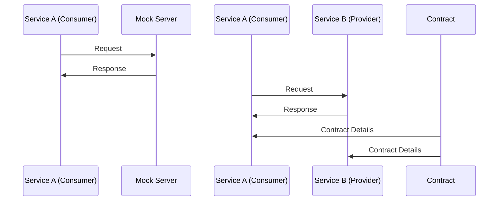

## The Metaphor

**Mocks are training wheels.** They let you develop without the real thing, fast and loose.

**Contracts are a legal binding.** Both sides agree to the terms, and you verify both follow them.

This is the difference. Here's the detail:

### Contract Testing (The Legal Binding)

In contract testing, a **contract** is a formal agreement: "This is what the consumer expects. This is what the provider promises." It's enforceable. Tools like Pact make it machine-readable.

- **Request format**: URL, method, headers, body — explicitly defined
- **Response format**: Status code, headers, JSON schema — explicitly defined

Both consumer *and* provider run tests against the same contract. If either breaks it, CI fails.

### Mock Servers (The Training Wheels)

Mocks simulate the provider service. They're fast, they're under your control, and they let you code while the real service is in another sprint.

- **Purpose**: Let the consumer dev team move fast without blocking on provider availability
- **Problem**: Mocks can lie. The mock responds with what you *think* the provider will send, not what it *actually* sends
- **Scope**: Consumer-only; the provider never sees the mock

### When You Should Care (The Real Difference)

**Mocks alone = disaster waiting to happen.** Your consumer tests pass. CI is green. You ship. Then production breaks because the provider changed the response format and you never noticed.

**Contracts = early warning system.** When the provider changes the format, their contract test fails. When the consumer expects a different format, the consumer's contract test fails. You catch the mismatch before merging.

### Quick Example

Imagine Service A (consumer, your payments team) needs `/user/{id}` from Service B (provider, the platform team).

**With mocks:**
- You mock `/user/123` to return `{ name: "Bob", email: "bob@x" }`
- Service A builds code expecting that format
- Later, the platform team changes it to `{ user_name: "Bob", user_email: "bob@x" }`
- Your tests still pass because they mock the old format
- Production breaks on day one

**With contracts:**
- Consumer and provider agree: `/user/{id}` returns `{ name: string, email: string }`
- Consumer test verifies it can parse that format
- Provider test verifies it *actually* returns that format
- If the provider changes the format, *their* contract test fails
- The breaking change is caught before merge

# Service Interaction Flow

## Mock Server Testing
1. **Service A (Consumer)** sends a request to the **Mock Server**.
2. The **Mock Server** responds back to **Service A**.

## Contract Testing
1. **Service A (Consumer)** sends a request to **Service B (Provider)**.
2. **Service B** responds back to **Service A**.

## Contract Details
1. The **Contract** provides details to both **Service A** and **Service B**.

<figure class="post-figure">
  
</figure>

### The Pattern I Use

Start with **mocks** — you need to move fast and you can't block on the provider team. But don't stop there.

Before merging anything that touches an API contract, add **contract tests**. It's one more CI job, maybe 30 seconds, and it saves the "why did production break?" conversation.

Mocks are training wheels. Contracts are insurance. Use both.

## Sources & Further Reading

1. [Pact — contract testing docs](https://docs.pact.io/)
2. [Pact Broker — publishing and verifying contracts](https://docs.pact.io/pact_broker)
3. [Martin Fowler — Consumer-Driven Contracts](https://martinfowler.com/articles/consumerDrivenContracts.html)
4. [Testing ASP.NET Core services — Microsoft](https://learn.microsoft.com/en-us/dotnet/architecture/microservices/multi-container-microservice-net-applications/test-aspnet-core-services-web-apps)

*See also:* [Comparing BDD, ATDD, and TDD (Sep 2024)]({{ site.baseurl }}) — different flavors of test-first thinking, same "agree before you code" energy.

