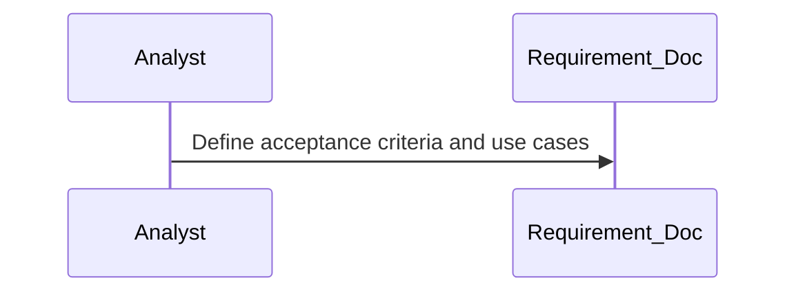
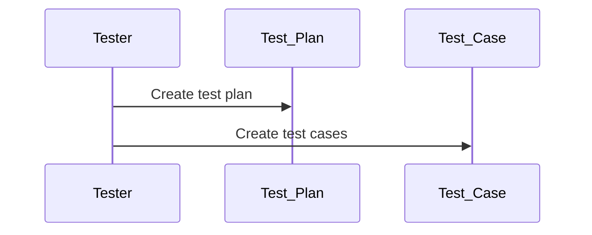
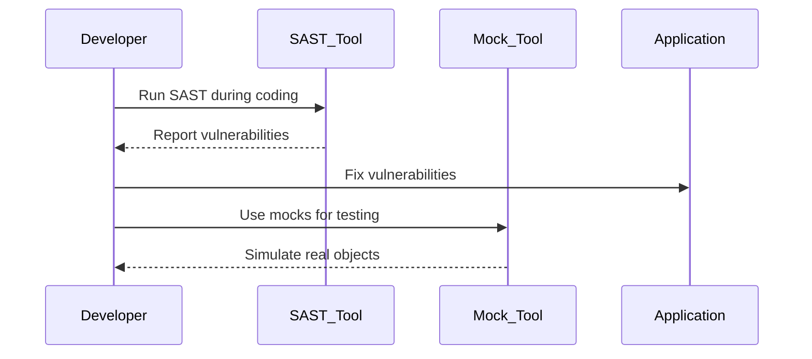
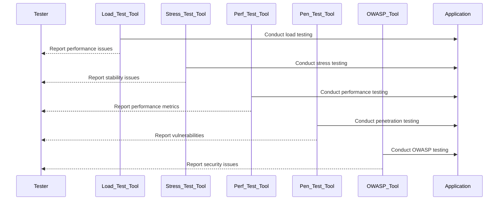
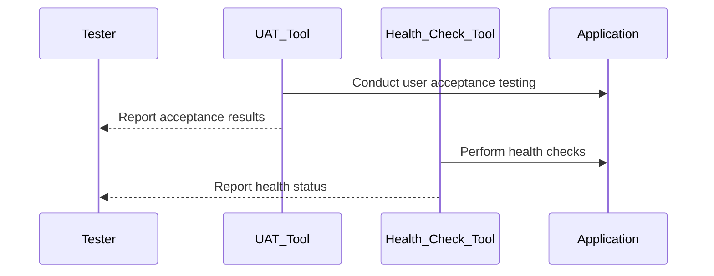
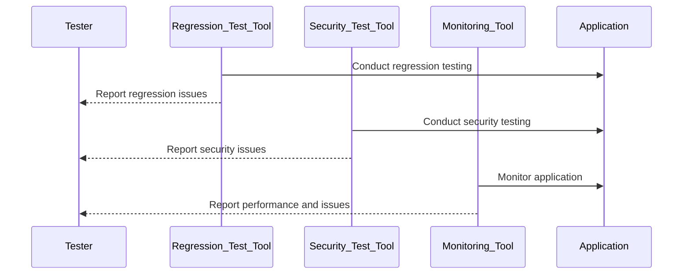
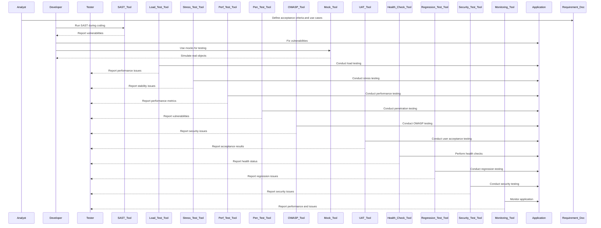

## Stages in SDLC

### Requirement Analysis
- **Acceptance Criteria**: Conditions that a software product must satisfy to be accepted by a user or customer.
- **Use Case**: A description of how users will interact with the system.

### Design
- **Test Plan**: A document describing the scope, approach, resources, and schedule of intended test activities.
- **Test Case**: A set of conditions under which a tester will determine whether an application is working correctly.

### Development
- **Unit Testing**: Testing individual components of the software.
- **SAST (Static Application Security Testing)**: Analyzing source code for security vulnerabilities.
- **Testing with Mock**: Using mock objects to simulate the behavior of real objects in controlled ways.

### Testing
- **Integration Testing**: Testing combined parts of an application to determine if they function together correctly.
- **System Testing**: Testing the complete and integrated software to evaluate the system's compliance with its specified requirements.
- **Load Testing**: Testing the application's ability to perform under expected user loads.
- **Stress Testing**: Testing the application's behavior under extreme conditions.
- **Performance Testing**: Testing to determine the speed, responsiveness, and stability of the application.
- **Penetration Testing**: Simulating attacks on the application to identify security vulnerabilities.
- **OWASP Testing**: Comprehensive security testing based on OWASP guidelines.

### Deployment
- **User Acceptance Testing (UAT)**: Testing conducted to determine if the system satisfies the acceptance criteria and is ready for production.
- **Health Checks**: Regular checks to ensure the application is running as expected.

### Maintenance
- **Regression Testing**: Testing existing software applications to ensure that a change or addition hasn't broken any existing functionality.
- **Security Testing**: Ensuring that the application is secure from external threats.
- **Application Monitoring**: Continuous monitoring of the application to ensure it is performing as expected and to detect any issues.

## Importance and Relationship

**Load Testing, Stress Testing, Performance Testing, SAST, Penetration Testing, and OWASP Testing** are all essential for ensuring the robustness, security, and efficiency of applications. Here's how they are important and related:

- **Load Testing**: Determines how the application behaves under expected user loads. It helps identify performance bottlenecks and ensures the application can handle the expected traffic.
- **Stress Testing**: Evaluates the application's behavior under extreme conditions, such as high traffic or limited resources, to identify breaking points and ensure stability under stress.
- **Performance Testing**: Measures the application's responsiveness, speed, and stability under various conditions. It includes load and stress testing as subsets.
- **SAST (Static Application Security Testing)**: Identifies security vulnerabilities in the source code early in the development process.
- **Penetration Testing**: Simulates real-world attacks on a running application to identify vulnerabilities that could be exploited by attackers.
- **OWASP Testing**: Provides a comprehensive framework for testing the security of web applications, covering various aspects such as configuration, authentication, and input validation.

### Relationship

- **Load, Stress, and Performance Testing**: Focus on the application's performance and stability under different conditions.
- **SAST and Penetration Testing**: Focus on identifying security vulnerabilities from different perspectives (code analysis vs. real-world attacks).
- **OWASP Testing**: Encompasses a broad range of security testing practices, including aspects covered by both SAST and penetration testing.
- **Combined Approach**: Using all these methods together provides a comprehensive assessment of the application's performance, stability, and security.

## Tools Used

- **Load Testing Tools**:
  - **Apache JMeter**
  - **LoadRunner**
  - **Gatling**

- **Stress Testing Tools**:
  - **Apache JMeter**
  - **LoadRunner**
  - **StressStimulus**

- **Performance Testing Tools**:
  - **Apache JMeter**
  - **LoadRunner**
  - **New Relic**

- **SAST Tools**:
  - **SonarQube**
  - **Checkmarx**
  - **Fortify Static Code Analyzer**

- **Penetration Testing Tools**:
  - **Metasploit**
  - **Burp Suite**
  - **OWASP ZAP**

- **OWASP Testing Tools**:
  - **OWASP ZAP**
  - **Burp Suite**
  - **Nessus**

### Requirement Analysis Phase

### Design Phase

### Development Phase

### Testing Phase

### Deployment Phase

### Maintenance Phase

### Consolidated Diagram

# Glossary of Testing Terms in SDLC

## Requirement Analysis
- **Acceptance Criteria**: Conditions that a software product must satisfy to be accepted by a user or customer.
- **Use Case**: A description of how users will interact with the system.

## Design
- **Test Plan**: A document describing the scope, approach, resources, and schedule of intended test activities.
- **Test Case**: A set of conditions under which a tester will determine whether an application is working correctly.

## Development
- **Unit Testing**: Testing individual components of the software to ensure they work as intended.
- **SAST (Static Application Security Testing)**: Analyzing source code for security vulnerabilities without executing the program.
- **Testing with Mock**: Using mock objects to simulate the behavior of real objects in controlled ways, often used in unit testing.
- **Bounded Context**: A design pattern in domain-driven design where a particular model is defined and applicable within a specific boundary.
- **Microservice**: An architectural style that structures an application as a collection of loosely coupled services.

## Testing
- **Integration Testing**: Testing combined parts of an application to determine if they function together correctly.
- **System Testing**: Testing the complete and integrated software to evaluate the system's compliance with its specified requirements.
- **Load Testing**: Testing the application's ability to perform under expected user loads.
- **Stress Testing**: Testing the application's behavior under extreme conditions, such as high traffic or limited resources.
- **Performance Testing**: Testing to determine the speed, responsiveness, and stability of the application.
- **Penetration Testing**: Simulating attacks on the application to identify security vulnerabilities.
- **OWASP Testing**: Comprehensive security testing based on OWASP guidelines, covering various aspects such as configuration, authentication, and input validation.

## Deployment
- **User Acceptance Testing (UAT)**: Testing conducted to determine if the system satisfies the acceptance criteria and is ready for production.
- **Health Checks**: Regular checks to ensure the application is running as expected and to detect any issues early.

## Maintenance
- **Regression Testing**: Testing existing software applications to ensure that a change or addition hasn't broken any existing functionality.
- **Security Testing**: Ensuring that the application is secure from external threats.
- **Application Monitoring**: Continuous monitoring of the application to ensure it is performing as expected and to detect any issues.

## Additional Terms
- **Mock Object**: An object that mimics the behavior of real objects in controlled ways, used in testing.
- **Bounded Context**: A design pattern in domain-driven design where a particular model is defined and applicable within a specific boundary.
- **Microservice**: An architectural style that structures an application as a collection of loosely coupled services.
- **Health Check**: A process to verify that a system is operating as expected.
- **Application Monitoring**: The process of continuously observing the performance and health of an application.

## Sources & Further Reading

1. [ISTQB — Software Testing Fundamentals](https://istqb.org/certifications/certified-tester-foundation-level)
2. [OWASP Testing Guide](https://owasp.org/www-project-web-security-testing-guide/)
3. [Microsoft — Performance testing guidance](https://learn.microsoft.com/en-us/azure/well-architected/performance-efficiency/performance-test)
4. [Shift-left testing — Wikipedia (solid overview)](https://en.wikipedia.org/wiki/Shift-left_testing)

*See also:* [Shift Left Using a Regression Suite (Sep 2024)]() — run that regression pack earlier, not after the release train leaves. · [Functional Testers in the Secure SDLC (Mar 2025)]() — where security testing actually slots in.

