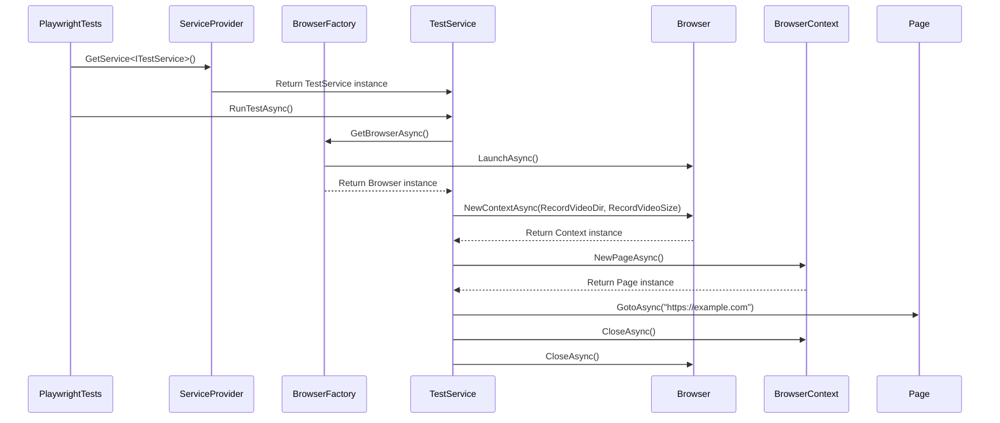
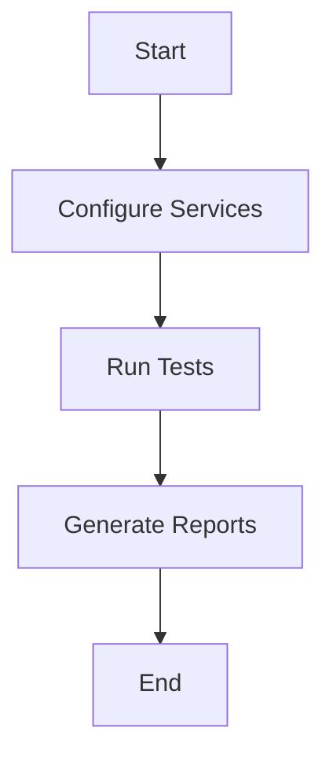
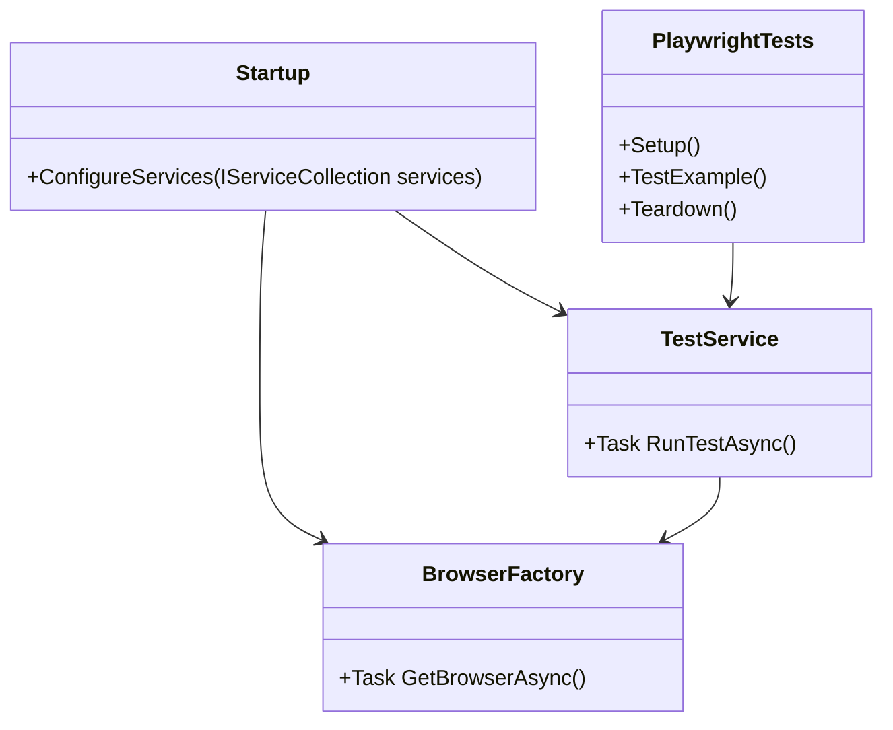

## Project Setup

### Project Name:
- **Project Name**: `DotNetPlaywrightFramework`

### .NET Version:
- **.NET Version**: .NET 8.0

## Step-by-Step Guide

### 1. Create a New .NET Project
Open your terminal or command prompt and run the following commands to create a new class library project:

```bash
dotnet new classlib -n DotNetPlaywrightFramework
cd DotNetPlaywrightFramework
```

### 2. Add Necessary NuGet Packages
Add the required NuGet packages for Playwright, Dependency Injection, NUnit, and other dependencies:

```bash
dotnet add package Microsoft.Playwright
dotnet add package Microsoft.Extensions.DependencyInjection
dotnet add package NUnit
dotnet add package NUnit3TestAdapter
dotnet add package Microsoft.NET.Test.Sdk
dotnet add package ReportUnit
dotnet add package ExtentReports
dotnet add package Allure.Commons
dotnet add package Allure.NUnit
```

### 3. Configure Dependency Injection
Create a `Startup` class to configure services for Dependency Injection.

```csharp
using Microsoft.Extensions.DependencyInjection;
using Microsoft.Playwright;

public class Startup
{
    // Configure services for Dependency Injection
    public void ConfigureServices(IServiceCollection services)
    {
        // Register BrowserFactory as a singleton service
        services.AddSingleton<IBrowserFactory, BrowserFactory>();
        // Register TestService as a singleton service
        services.AddSingleton<ITestService, TestService>();
    }
}
```

### 4. Implement BrowserFactory
Create a class to manage the Playwright browser instance.

```csharp
using Microsoft.Playwright;
using System.Threading.Tasks;

public interface IBrowserFactory
{
    // Method to get a browser instance
    Task<IBrowser> GetBrowserAsync();
}

public class BrowserFactory : IBrowserFactory
{
    private readonly IPlaywright _playwright;

    // Initialize Playwright
    public BrowserFactory()
    {
        _playwright = Playwright.CreateAsync().Result;
    }

    // Method to launch and return a browser instance
    public async Task<IBrowser> GetBrowserAsync()
    {
        return await _playwright.Chromium.LaunchAsync(new BrowserTypeLaunchOptions { Headless = false });
    }
}
```

### 5. Create a Test Service
Implement a service to handle test logic, including full-screen video recording.

```csharp
using Microsoft.Playwright;
using System.Threading.Tasks;

public interface ITestService
{
    // Method to run a test
    Task RunTestAsync();
}

public class TestService : ITestService
{
    private readonly IBrowserFactory _browserFactory;

    // Inject BrowserFactory via constructor
    public TestService(IBrowserFactory browserFactory)
    {
        _browserFactory = browserFactory;
    }

    // Method to run a test
    public async Task RunTestAsync()
    {
        var browser = await _browserFactory.GetBrowserAsync();
        var context = await browser.NewContextAsync(new BrowserNewContextOptions
        {
            RecordVideoDir = "bin\\Debug\\net8.0\\videos",
            RecordVideoSize = new RecordVideoSize { Width = 1920, Height = 1080 }
        });
        var page = await context.NewPageAsync();
        await page.GotoAsync("https://example.com");
        // Add more test steps here
        await context.CloseAsync();
        await browser.CloseAsync();
    }
}
```

### 6. Write Test Cases
Create test cases using NUnit and integrate Allure for detailed HTML reports.

```csharp
using NUnit.Framework;
using Microsoft.Extensions.DependencyInjection;
using Allure.Commons;
using Allure.NUnit.Attributes;

[TestFixture]
public class PlaywrightTests
{
    private ServiceProvider _serviceProvider;
    private AllureLifecycle _allure;

    // Setup method to configure services before each test
    [SetUp]
    public void Setup()
    {
        var serviceCollection = new ServiceCollection();
        var startup = new Startup();
        startup.ConfigureServices(serviceCollection);
        _serviceProvider = serviceCollection.BuildServiceProvider();

        // Initialize Allure
        _allure = AllureLifecycle.Instance;
    }

    // Example test method
    [Test, AllureNUnit]
    public async Task TestExample()
    {
        var testService = _serviceProvider.GetService<ITestService>();
        await testService.RunTestAsync();
        _allure.UpdateTestCase(testResult =>
        {
            testResult.status = Status.passed;
        });
    }

    // Teardown method to dispose services after each test
    [TearDown]
    public void Teardown()
    {
        _serviceProvider.Dispose();
    }
}
```

### Additional Configurations

#### Parallel Testing
Configure NUnit to run tests in parallel by adding a `Parallelizable` attribute to your test classes or methods.

```csharp
[TestFixture, Parallelizable(ParallelScope.All)]
public class PlaywrightTests
{
    // Test methods here
}
```

#### Publishing Reports
Use ReportUnit to generate HTML reports from NUnit XML results. Ensure the results are saved under `[bin\Debug\net8.0]`.

```bash
dotnet test --logger "nunit;LogFilePath=bin\Debug\net8.0\TestResults.xml"
ReportUnit bin\Debug\net8.0\TestResults.xml
```

#### XHR Handling
Playwright can intercept and handle XHR requests.

```csharp
await page.RouteAsync("**/*", async route =>
{
    var request = route.Request;
    if (request.ResourceType == "xhr")
    {
        // Handle XHR request
    }
    await route.ContinueAsync();
});
```

#### Screen Recording
Playwright supports screen recording.

```csharp
await page.StartVideoRecordingAsync(new PageStartVideoRecordingOptions
{
    Path = "bin\\Debug\\net8.0\\video.mp4"
});

// Perform actions

await page.StopVideoRecordingAsync();
```

#### Cross-Browser Testing
Launch different browsers using Playwright.

```csharp
var chromium = await _playwright.Chromium.LaunchAsync();
var firefox = await _playwright.Firefox.LaunchAsync();
var webkit = await _playwright.Webkit.LaunchAsync();
```

### Critical Considerations
- **Service Interception**: Ensure that your services are properly intercepted and managed by the DI container.
- **Autowaiting**: Playwright has built-in autowaiting mechanisms, but you can customize wait conditions as needed.
- **Error Handling**: Implement robust error handling and logging mechanisms to capture and manage test failures.

### Diagrams

#### Sequence Diagram


#### Flow Diagram


#### Class Diagram


This guide should now provide a complete and clear setup for your .NET 8.0 project with Microsoft Playwright, including Dependency Injection, parallel testing, publishing reports, XHR handling, full-screen video recording, and cross-browser testing.

*See also:* [Playwright MCP + Multi-Agent Testing in 2026 (Aug 2026)]() — the 2026 refresh with MCP server integration and multi-agent testing patterns.
