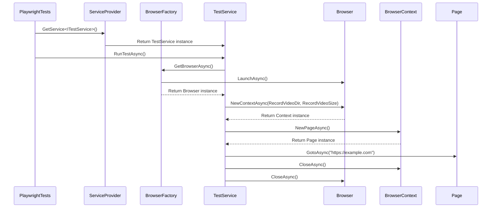
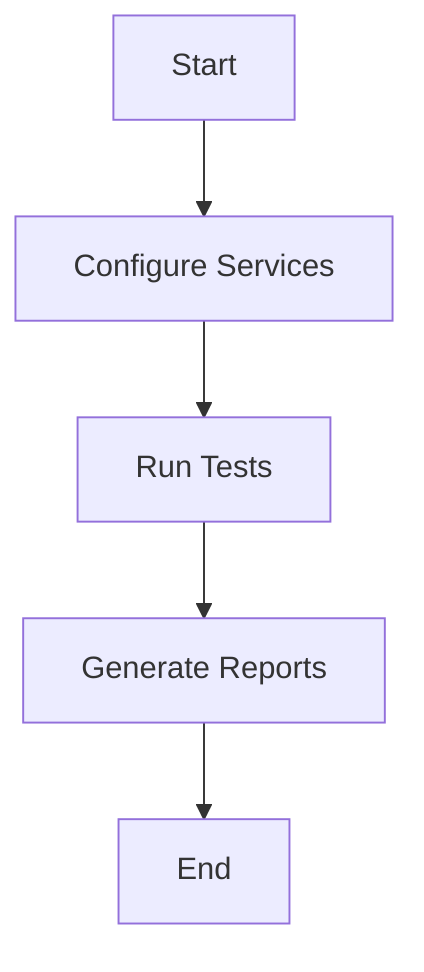
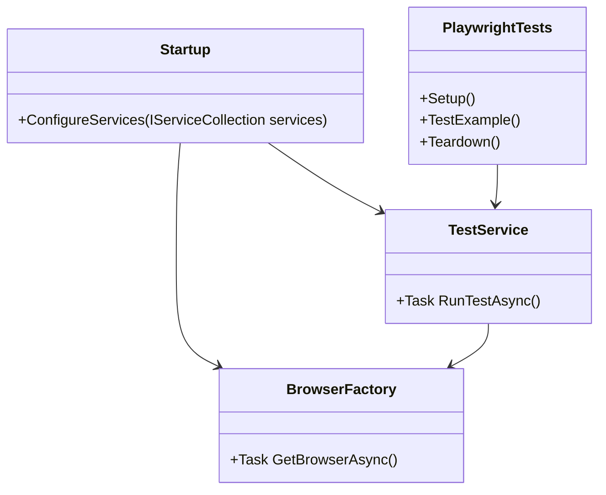

## Building a Reusable Test Framework with Dependency Injection

> *"The first test is free. The hundredth test costs you your sanity if you haven't built it right."*

You've written a Playwright test. It works. Then you write another. Then another. Before long, you've copy-pasted browser setup, context creation, and cleanup code 50 times across files. When you need to change how video recording works, you edit 50 places. **That's not scaling. That's snowballing.**

The fix is to build a **framework** — a reusable scaffolding that handles browser setup, dependency injection, and teardown for you. Each test then just grabs what it needs, runs its assertions, and the framework handles the rest.

This post walks you through building exactly that in .NET 8.0 with Playwright, using dependency injection to wire everything together cleanly.

---

## What We're Building

Think of it like building with LEGO. You don't want to glue individual bricks to each test. You want a **frame** (the framework) that holds the pieces (services), and each test just snaps into place.

Here's the structure:

- **BrowserFactory**: Launches and manages browser instances
- **TestService**: Orchestrates the test actions (navigate, click, assert)
- **Dependency Injection**: Wires the pieces together automatically
- **NUnit + Allure**: Runs the tests and generates beautiful reports
- **Parallel Testing**: Multiple tests run at once without conflicts

Let's build it.

---

## Step 1: Create the .NET Project

Open your terminal and run these commands to scaffold a new class library:

```bash
dotnet new classlib -n DotNetPlaywrightFramework
cd DotNetPlaywrightFramework
```

This creates a class library — the foundation for your reusable framework.

## Step 2: Add the Dependencies

Now install the packages you'll need: Playwright, dependency injection, NUnit for testing, and Allure for pretty reports.


```bash
dotnet add package Microsoft.Playwright
dotnet add package Microsoft.Extensions.DependencyInjection
dotnet add package NUnit
dotnet add package NUnit3TestAdapter
dotnet add package Microsoft.NET.Test.Sdk
dotnet add package ReportUnit
dotnet add package ExtentReports
dotnet add package Allure.Commons
dotnet add package Allure.NUnit
```

## Step 3: Wire Everything Together with Dependency Injection

Create a `Startup` class that tells the DI container how to build the pieces. When a test asks for a browser, the container knows to use `BrowserFactory`. When a test asks for a test service, the container wires in the factory automatically. This is where the "framework" magic happens.


```csharp
using Microsoft.Extensions.DependencyInjection;
using Microsoft.Playwright;

public class Startup
{
    // Configure services for Dependency Injection
    public void ConfigureServices(IServiceCollection services)
    {
        // Register BrowserFactory as a singleton service
        services.AddSingleton<IBrowserFactory, BrowserFactory>();
        // Register TestService as a singleton service
        services.AddSingleton<ITestService, TestService>();
    }
}
```

## Step 4: Build the BrowserFactory

This class is your browser machine. Every time a test needs a browser, it asks the factory, and the factory launches one. Playwright initialization, launch options, headless settings — all live here. Change it once, and every test benefits.


```csharp
using Microsoft.Playwright;
using System.Threading.Tasks;

public interface IBrowserFactory
{
    // Method to get a browser instance
    Task<IBrowser> GetBrowserAsync();
}

public class BrowserFactory : IBrowserFactory
{
    private readonly IPlaywright _playwright;

    // Initialize Playwright
    public BrowserFactory()
    {
        _playwright = Playwright.CreateAsync().Result;
    }

    // Method to launch and return a browser instance
    public async Task<IBrowser> GetBrowserAsync()
    {
        return await _playwright.Chromium.LaunchAsync(new BrowserTypeLaunchOptions { Headless = false });
    }
}
```

## Step 5: Create the TestService

This is where your actual test logic runs. It doesn't worry about launching browsers or managing contexts — the factory handles that. It just orchestrates the actions: "Go to the URL, click this, assert that." Clean separation of concerns.


```csharp
using Microsoft.Playwright;
using System.Threading.Tasks;

public interface ITestService
{
    // Method to run a test
    Task RunTestAsync();
}

public class TestService : ITestService
{
    private readonly IBrowserFactory _browserFactory;

    // Inject BrowserFactory via constructor
    public TestService(IBrowserFactory browserFactory)
    {
        _browserFactory = browserFactory;
    }

    // Method to run a test
    public async Task RunTestAsync()
    {
        var browser = await _browserFactory.GetBrowserAsync();
        var context = await browser.NewContextAsync(new BrowserNewContextOptions
        {
            RecordVideoDir = "bin\\Debug\\net8.0\\videos",
            RecordVideoSize = new RecordVideoSize { Width = 1920, Height = 1080 }
        });
        var page = await context.NewPageAsync();
        await page.GotoAsync("https://example.com");
        // Add more test steps here
        await context.CloseAsync();
        await browser.CloseAsync();
    }
}
```

## Step 6: Write Your First Test

Now the fun part. You use NUnit to write actual test methods. Each test method is simple: grab the services you need from the DI container, run your test, and NUnit + Allure handle the reporting automatically.


```csharp
using NUnit.Framework;
using Microsoft.Extensions.DependencyInjection;
using Allure.Commons;
using Allure.NUnit.Attributes;

[TestFixture]
public class PlaywrightTests
{
    private ServiceProvider _serviceProvider;
    private AllureLifecycle _allure;

    // Setup method to configure services before each test
    [SetUp]
    public void Setup()
    {
        var serviceCollection = new ServiceCollection();
        var startup = new Startup();
        startup.ConfigureServices(serviceCollection);
        _serviceProvider = serviceCollection.BuildServiceProvider();

        // Initialize Allure
        _allure = AllureLifecycle.Instance;
    }

    // Example test method
    [Test, AllureNUnit]
    public async Task TestExample()
    {
        var testService = _serviceProvider.GetService<ITestService>();
        await testService.RunTestAsync();
        _allure.UpdateTestCase(testResult =>
        {
            testResult.status = Status.passed;
        });
    }

    // Teardown method to dispose services after each test
    [TearDown]
    public void Teardown()
    {
        _serviceProvider.Dispose();
    }
}
```

---

## Extra Features: You Get All This Too

### Run Tests in Parallel

By default, NUnit runs tests one after another. If you have 50 tests and each takes 3 seconds, that's 150 seconds. With parallel testing, multiple tests run simultaneously (each with its own browser context), and the total time drops to ~15 seconds. Add the `Parallelizable` attribute to your test classes:


```csharp
[TestFixture, Parallelizable(ParallelScope.All)]
public class PlaywrightTests
{
    // Test methods here
}
```

### Generate Beautiful Reports

After tests run, you want to know what passed, what failed, and why. ReportUnit turns NUnit XML results into HTML reports you can open in a browser.


```bash
dotnet test --logger "nunit;LogFilePath=bin\Debug\net8.0\TestResults.xml"
ReportUnit bin\Debug\net8.0\TestResults.xml
```

### Intercept Network Requests (XHR Handling)

Some tests need to mock API responses or verify that a specific API call was made. Playwright can intercept requests before they reach the network and modify them.


```csharp
await page.RouteAsync("**/*", async route =>
{
    var request = route.Request;
    if (request.ResourceType == "xhr")
    {
        // Handle XHR request
    }
    await route.ContinueAsync();
});
```

### Record Video of Test Runs

When a test fails, a video is worth a thousand screenshots. You can see exactly where it broke, what the UI looked like, and what the user saw.


```csharp
await page.StartVideoRecordingAsync(new PageStartVideoRecordingOptions
{
    Path = "bin\\Debug\\net8.0\\video.mp4"
});

// Perform actions

await page.StopVideoRecordingAsync();
```

### Test Multiple Browsers at Once

Your app needs to work in Chrome, Firefox, and Safari. Instead of writing three separate test suites, you write once and tell Playwright to run it against every browser.


```csharp
var chromium = await _playwright.Chromium.LaunchAsync();
var firefox = await _playwright.Firefox.LaunchAsync();
var webkit = await _playwright.Webkit.LaunchAsync();
```

---

## Things to Watch Out For

**Dependency Injection is your friend, not your enemy.** Make sure every service is registered in the `Startup` class. If you forget to register something, the DI container throws an error immediately — that's a feature. You catch the mistake in dev, not in production.

**Playwright has auto-waiting built in.** Before you click something, Playwright verifies the element is actually clickable. You rarely need manual sleeps. Trust it.

**Log and capture errors aggressively.** When a test fails on CI but passes locally, the log is your lifeline. Capture network requests, screenshots, videos, console output — everything. Use Allure to tie it all together.

---

## How the Pieces Fit Together

Here are the architecture diagrams that show how everything connects:

### Sequence Diagram

#### Sequence Diagram

```mermaid
sequenceDiagram
    participant Test as PlaywrightTests
    participant DI as ServiceProvider
    participant BrowserFactory as BrowserFactory
    participant TestService as TestService
    participant Browser as Browser
    participant Context as BrowserContext
    participant Page as Page

    Test->>DI: GetService<ITestService>()
    DI->>TestService: Return TestService instance
    Test->>TestService: RunTestAsync()
    TestService->>BrowserFactory: GetBrowserAsync()
    BrowserFactory->>Browser: LaunchAsync()
    BrowserFactory-->>TestService: Return Browser instance
    TestService->>Browser: NewContextAsync(RecordVideoDir, RecordVideoSize)
    Browser-->>TestService: Return Context instance
    TestService->>Context: NewPageAsync()
    Context-->>TestService: Return Page instance
    TestService->>Page: GotoAsync("https://example.com")
    TestService->>Context: CloseAsync()
    TestService->>Browser: CloseAsync()
```

#### Flow Diagram

```mermaid
flowchart TD
    A[Start] --> B[Configure Services]
    B --> C[Run Tests]
    C --> D[Generate Reports]
    D --> E[End]
```

#### Class Diagram

```mermaid
classDiagram
    class Startup {
        +ConfigureServices(IServiceCollection services)
    }

    class BrowserFactory {
        +Task<IBrowser> GetBrowserAsync()
    }

    class TestService {
        +Task RunTestAsync()
    }

    class PlaywrightTests {
        +Setup()
        +TestExample()
        +Teardown()
    }

    Startup --> BrowserFactory
    Startup --> TestService
    PlaywrightTests --> TestService
    TestService --> BrowserFactory
```

---

## You're Not Gluing Bricks Anymore

What you've built is a reusable framework. The first test takes an hour (setup, wiring, learning curves). The second test takes 10 minutes. The hundredth test still takes 10 minutes because you've got structure. When you need to add video recording, change the browser to Firefox, or enable parallel testing, you update the framework once. Every test instantly gets the benefit.

I learned this the hard way by copy-pasting test code across 20 files, then spending a day updating all of them when the team decided we needed video recordings. Build the framework once. Build the tests many times. The ratio pays for itself by test five.

## Sources & Further Reading

1. [Playwright .NET — getting started](https://playwright.dev/dotnet/docs/intro)
2. [Playwright .NET — dependency injection pattern](https://playwright.dev/dotnet/docs/test-runners)
3. [Allure Report — Playwright integration](https://allurereport.org/docs/playwright/)
4. [NUnit — documentation](https://docs.nunit.org/)

*See also:* [Playwright MCP + Multi-Agent Testing in 2026 (Jul 2026)]({{ site.baseurl }}) — the 2026 refresh with MCP server integration and multi-agent testing patterns. · [Playwright AI Codegen in 2026 (Jul 2026)]({{ site.baseurl }}) — AI-generated Page Objects and test classes from natural language.
