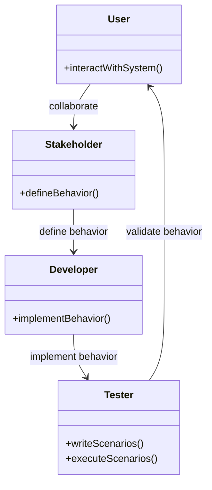
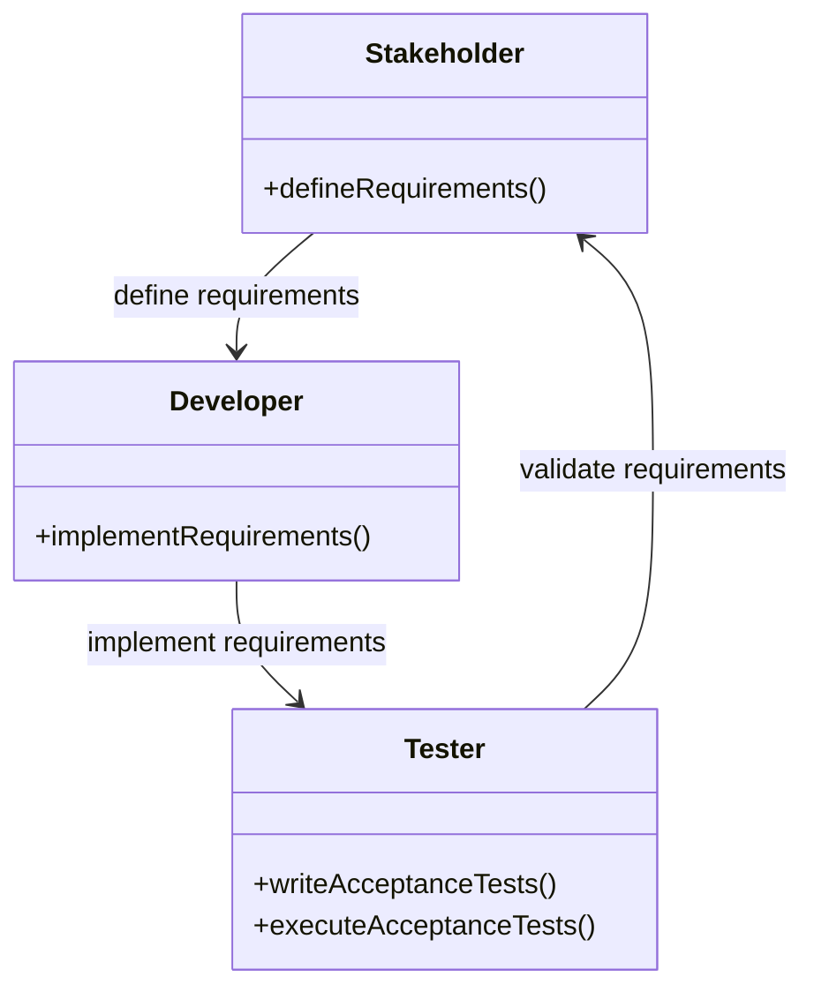
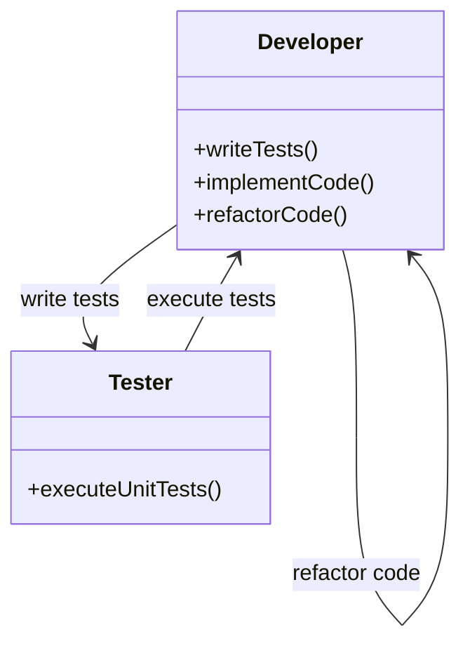
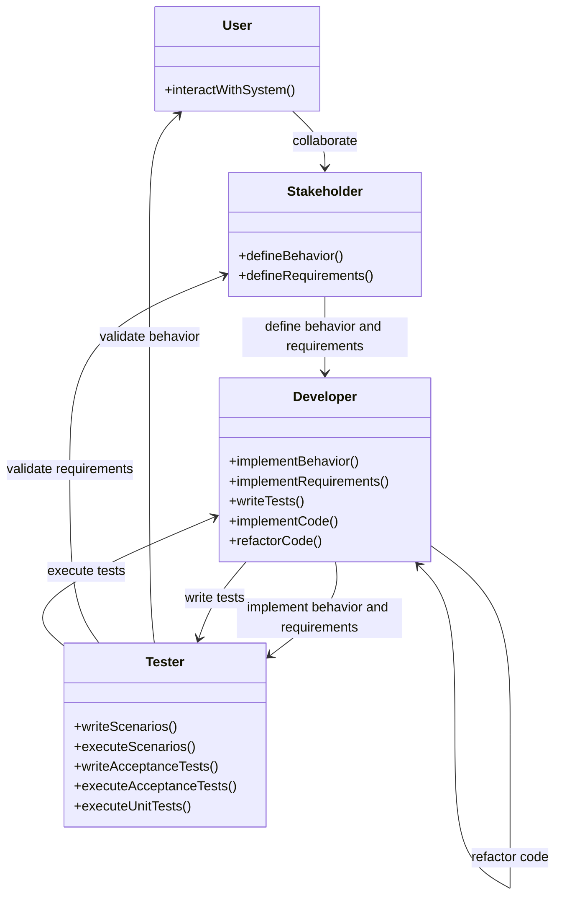
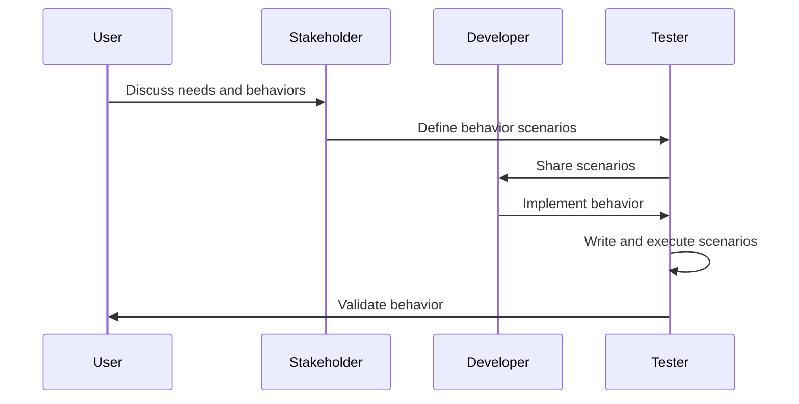
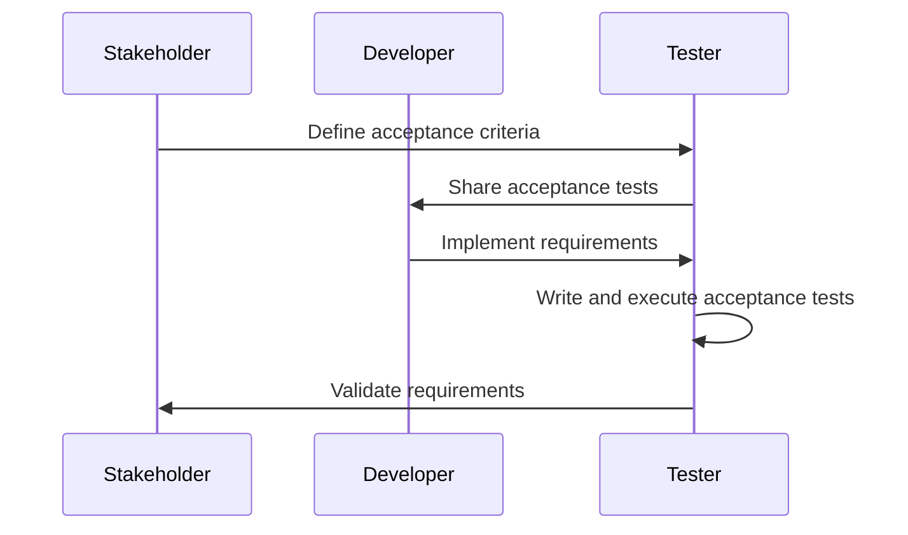
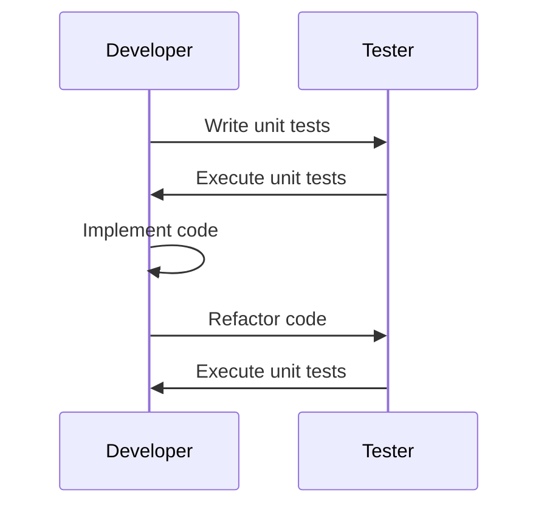
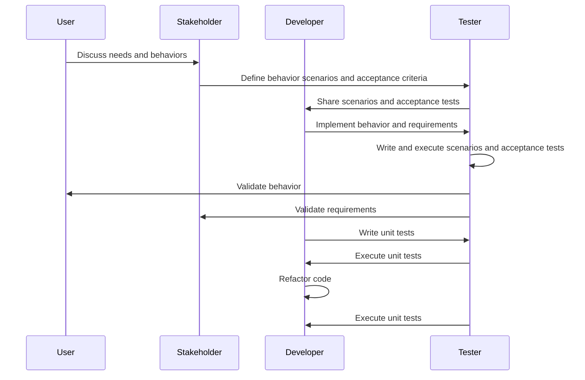

Understanding the differences between **Behavior-Driven Development (BDD)**, **Acceptance Test-Driven Development (ATDD)**, and **Test-Driven Development (TDD)** can help you choose the right approach for your project. Here's a detailed comparison:

| **Aspect**                     | **BDD (Behavior-Driven Development)**                                                                 | **ATDD (Acceptance Test-Driven Development)**                                                      | **TDD (Test-Driven Development)**                                                                 |
|--------------------------------|------------------------------------------------------------------------------------------------------|----------------------------------------------------------------------------------------------------|--------------------------------------------------------------------------------------------------|
| **Focus and Purpose**          | Centers on **user behavior** and ensuring the software behaves as expected by end-users.                 | Focuses on capturing precise **requirements** and **acceptance criteria** before development begins.       | Focuses on writing **unit tests** before the actual code to ensure each part of the software works correctly. |
| **Collaboration**              | Emphasizes **conversations** and **collaboration** among all stakeholders to define application behavior.    | Involves collaboration to define **acceptance tests** that validate functionality against requirements. | Primarily involves **developers** writing tests and code, with less direct input from non-technical stakeholders. |
| **Tools and Syntax**           | Uses **natural language tools** like Cucumber, SpecFlow, or Behave, which can introduce complexity.       | Often uses simpler **acceptance test frameworks** that are easier to adopt and integrate.              | Uses **unit testing frameworks** like JUnit, NUnit, or pytest, which are straightforward for developers. |
| **Outcome**                    | Produces **scenarios** describing expected behavior, guiding development to ensure intended behavior.    | Produces **acceptance tests** that validate functionality against business requirements.               | Produces **unit tests** that ensure individual components work as expected.                           |
| **Complexity in Tooling**      | Can be complex due to natural language tools, which may be challenging for some teams.               | Simpler tooling, making it easier for teams to adopt and integrate into their workflow.            | Generally simpler tooling focused on unit tests, making it easier for developers to adopt.        |
| **Focus on Behavior**          | Strong focus on **user behavior**, which may overlook specific business requirements.                    | Directly focuses on **business requirements**, ensuring all specified criteria are met.                | Focuses on the correctness of individual units of code, which may overlook broader behavior and requirements. |
| **User Behavior Emphasis**     | Ensures software aligns closely with **user interactions**, enhancing user satisfaction.                 | May not capture user behavior as effectively, focusing more on requirements.                       | Does not focus on user behavior, but ensures **code reliability** and correctness.                    |
| **Potential for Miscommunication** | Mitigates miscommunication through collaborative conversations and shared understanding.             | Can suffer from miscommunication if acceptance criteria are not well-defined or understood.        | Less risk of miscommunication as it involves primarily developers, but may miss broader context.  |

### Key Takeaways
- **BDD**: Best for ensuring software meets **user expectations** and behaviors, but can be complex.
- **ATDD**: Best for validating **business requirements** and acceptance criteria, but may miss user behavior nuances.
- **TDD**: Best for ensuring **code reliability** and correctness, but may overlook broader behavior and requirements.

By understanding these differences, you can leverage the strengths of each approach to enhance your development process. 

Illustrate the concepts of BDD, ATDD, and TDD, and then provide a summarizing diagram to show their relationships.

### BDD (Behavior-Driven Development)

### ATDD (Acceptance Test-Driven Development)

### TDD (Test-Driven Development)

### Summarizing Diagram

UML Sequence diagrams using Mermaid syntax to illustrate the workflows for BDD, ATDD, and TDD.

### BDD (Behavior-Driven Development) Sequence Diagram

### ATDD (Acceptance Test-Driven Development) Sequence Diagram

### TDD (Test-Driven Development) Sequence Diagram

### Summarizing Sequence Diagram

## Sources & Further Reading

1. [Cucumber — BDD introduction](https://cucumber.io/docs/bdd/)
2. [SpecFlow — documentation](https://specflow.org/docs/)
3. [Kent Beck — Test-Driven Development](https://www.amazon.com/Test-Driven-Development-Kent-Beck/dp/0321146530) *(the book that started it)*
4. [Cucumber — living documentation pattern](https://cucumber.io/docs/bdd/)

*See also:* [Building BDD Frameworks That Actually Work (Jun 2026)]() — what happens after you pick BDD and have to make it survive a real sprint. · [The Software Testing Pyramid (Sep 2024)]() — where unit vs integration vs E2E tests actually belong.

#AgileDevelopment #SoftwareTesting #BDD #ATDD #TDD #DevOps 🚀✨
