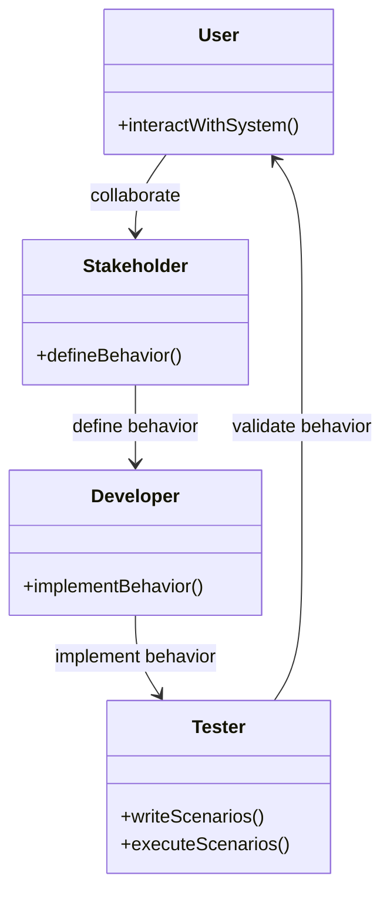
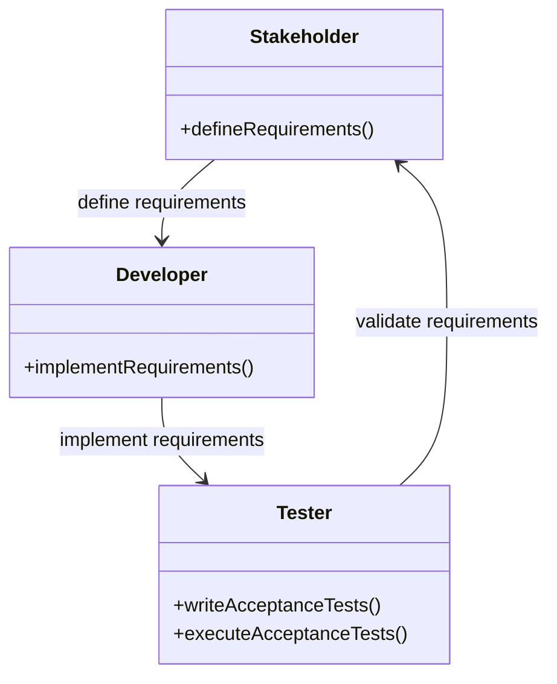
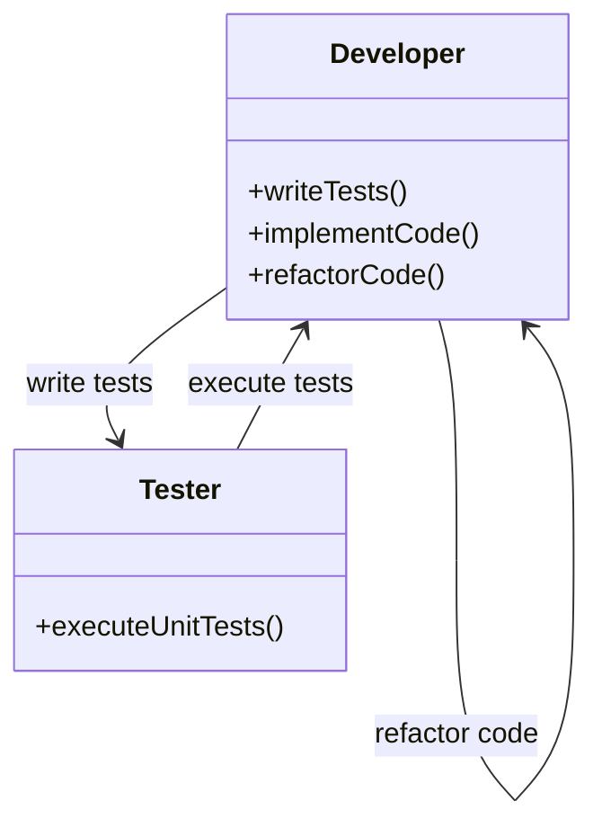
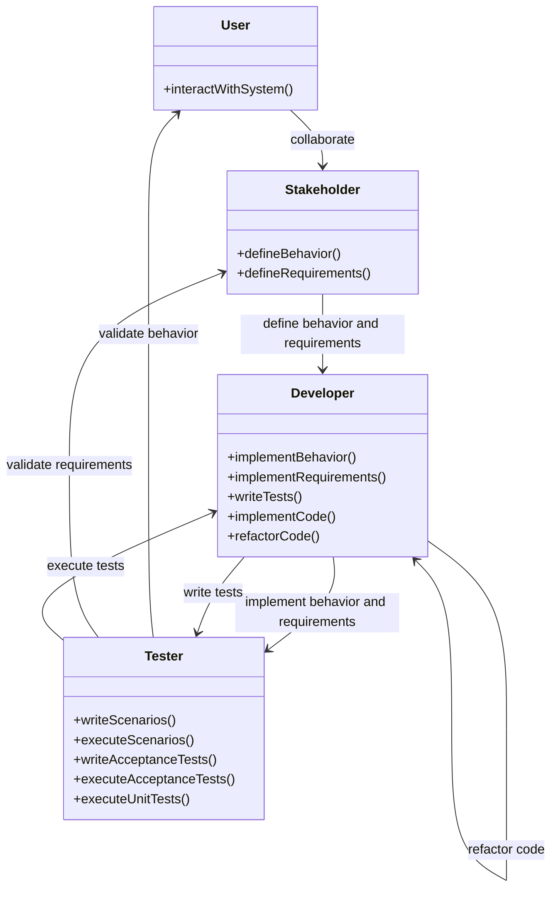
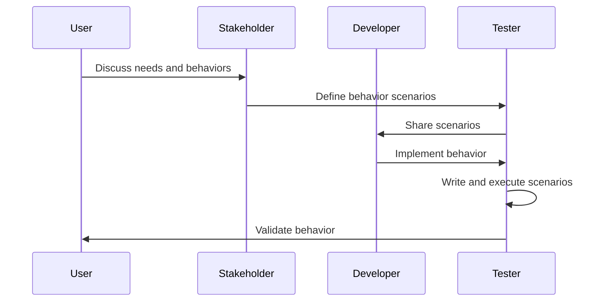
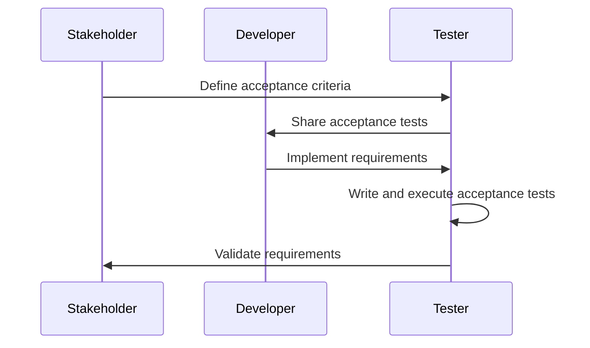
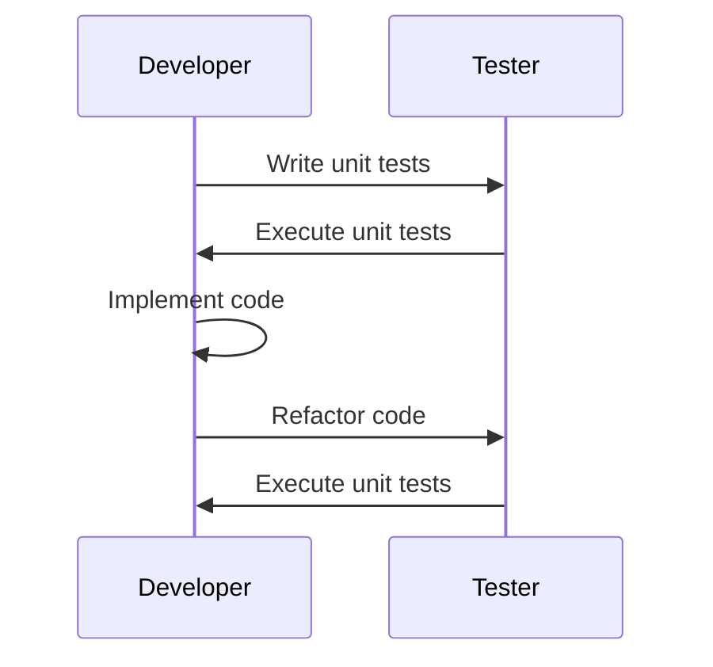
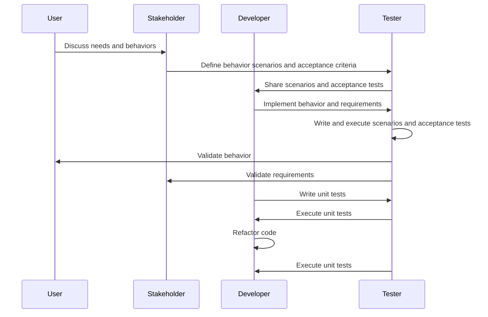

**BDD, ATDD, and TDD.** Three acronyms that sound identical until you try to use them. Here's what I've learned from shipping code with all three.

The intro says "no buzzword bingo." Then every resource you find delivers buzzword bingo — tables, definitions, no stories. Let me give you the stories first. Then the table makes sense.

### Why This Matters (The Stories)

**TDD** saved my sanity once. I wrote unit tests first, watched them fail, then wrote code. The test-first discipline forced me to think about edge cases before shipping them. No tests = no confidence. That's it.

**BDD** saved a project once when the product owner couldn't articulate requirements. We wrote scenarios in English that she could read and edit: "When the user clicks 'Pay', the form should show an error if the amount is empty." No interpreter needed. Suddenly everyone agreed on what "done" meant.

**ATDD** saved me from shipping half-finished work. It sits between BDD and TDD: the QA person writes acceptance tests *before* the dev starts. Those tests don't pass until the feature is actually done. It's a contract between the dev and the tester.

The wrong tool for the job? Chaos.

---

Now here's the comparison. Read the story, then the table:

| **Aspect**                     | **BDD (Behavior-Driven Development)**                                                                 | **ATDD (Acceptance Test-Driven Development)**                                                      | **TDD (Test-Driven Development)**                                                                 |
|--------------------------------|------------------------------------------------------------------------------------------------------|----------------------------------------------------------------------------------------------------|--------------------------------------------------------------------------------------------------|
| **Focus and Purpose**          | Centers on **user behavior** and ensuring the software behaves as expected by end-users.                 | Focuses on capturing precise **requirements** and **acceptance criteria** before development begins.       | Focuses on writing **unit tests** before the actual code to ensure each part of the software works correctly. |
| **Collaboration**              | Emphasizes **conversations** and **collaboration** among all stakeholders to define application behavior.    | Involves collaboration to define **acceptance tests** that validate functionality against requirements. | Primarily involves **developers** writing tests and code, with less direct input from non-technical stakeholders. |
| **Tools and Syntax**           | Uses **natural language tools** like Cucumber, SpecFlow, or Behave, which can introduce complexity.       | Often uses simpler **acceptance test frameworks** that are easier to adopt and integrate.              | Uses **unit testing frameworks** like JUnit, NUnit, or pytest, which are straightforward for developers. |
| **Outcome**                    | Produces **scenarios** describing expected behavior, guiding development to ensure intended behavior.    | Produces **acceptance tests** that validate functionality against business requirements.               | Produces **unit tests** that ensure individual components work as expected.                           |
| **Complexity in Tooling**      | Can be complex due to natural language tools, which may be challenging for some teams.               | Simpler tooling, making it easier for teams to adopt and integrate into their workflow.            | Generally simpler tooling focused on unit tests, making it easier for developers to adopt.        |
| **Focus on Behavior**          | Strong focus on **user behavior**, which may overlook specific business requirements.                    | Directly focuses on **business requirements**, ensuring all specified criteria are met.                | Focuses on the correctness of individual units of code, which may overlook broader behavior and requirements. |
| **User Behavior Emphasis**     | Ensures software aligns closely with **user interactions**, enhancing user satisfaction.                 | May not capture user behavior as effectively, focusing more on requirements.                       | Does not focus on user behavior, but ensures **code reliability** and correctness.                    |
| **Potential for Miscommunication** | Mitigates miscommunication through collaborative conversations and shared understanding.             | Can suffer from miscommunication if acceptance criteria are not well-defined or understood.        | Less risk of miscommunication as it involves primarily developers, but may miss broader context.  |

### Key Takeaways (When to Use Each)

**TDD** — You're alone or with a small dev team. You need discipline. Tight feedback loop. No stakeholder input needed. Risk: You might test implementation details instead of behavior.

**ATDD** — You have QA and dev working together. You need acceptance criteria *before* coding starts. Risk: The criteria might miss edge cases that TDD would catch.

**BDD** — The whole team (dev + QA + product) needs to be on the same page. Risk: It takes longer to get scenarios written, but you'll ship the right thing.

**All three together** — Some teams use all three: TDD for unit tests (fast feedback), ATDD for integration tests (acceptance gates), BDD for E2E scenarios (business language). It's layered confidence.

---

Here's how they relate:

### BDD (Behavior-Driven Development)

```mermaid
classDiagram
    class User {
        +interactWithSystem()
    }
    class Stakeholder {
        +defineBehavior()
    }
    class Developer {
        +implementBehavior()
    }
    class Tester {
        +writeScenarios()
        +executeScenarios()
    }
    User --> Stakeholder : collaborate
    Stakeholder --> Developer : define behavior
    Developer --> Tester : implement behavior
    Tester --> User : validate behavior
```

### ATDD (Acceptance Test-Driven Development)

```mermaid
classDiagram
    class Stakeholder {
        +defineRequirements()
    }
    class Developer {
        +implementRequirements()
    }
    class Tester {
        +writeAcceptanceTests()
        +executeAcceptanceTests()
    }
    Stakeholder --> Developer : define requirements
    Developer --> Tester : implement requirements
    Tester --> Stakeholder : validate requirements
```

### TDD (Test-Driven Development)

```mermaid
classDiagram
    class Developer {
        +writeTests()
        +implementCode()
        +refactorCode()
    }
    class Tester {
        +executeUnitTests()
    }
    Developer --> Tester : write tests
    Tester --> Developer : execute tests
    Developer --> Developer : refactor code
```

### Summarizing Diagram

```mermaid
classDiagram
    class User {
        +interactWithSystem()
    }
    class Stakeholder {
        +defineBehavior()
        +defineRequirements()
    }
    class Developer {
        +implementBehavior()
        +implementRequirements()
        +writeTests()
        +implementCode()
        +refactorCode()
    }
    class Tester {
        +writeScenarios()
        +executeScenarios()
        +writeAcceptanceTests()
        +executeAcceptanceTests()
        +executeUnitTests()
    }
    User --> Stakeholder : collaborate
    Stakeholder --> Developer : define behavior and requirements
    Developer --> Tester : implement behavior and requirements
    Tester --> User : validate behavior
    Tester --> Stakeholder : validate requirements
    Developer --> Tester : write tests
    Tester --> Developer : execute tests
    Developer --> Developer : refactor code
```

UML Sequence diagrams using Mermaid syntax to illustrate the workflows for BDD, ATDD, and TDD.

### BDD (Behavior-Driven Development) Sequence Diagram

```mermaid
sequenceDiagram
    participant User
    participant Stakeholder
    participant Developer
    participant Tester

    User->>Stakeholder: Discuss needs and behaviors
    Stakeholder->>Tester: Define behavior scenarios
    Tester->>Developer: Share scenarios
    Developer->>Tester: Implement behavior
    Tester->>Tester: Write and execute scenarios
    Tester->>User: Validate behavior
```

### ATDD (Acceptance Test-Driven Development) Sequence Diagram

```mermaid
sequenceDiagram
    participant Stakeholder
    participant Developer
    participant Tester

    Stakeholder->>Tester: Define acceptance criteria
    Tester->>Developer: Share acceptance tests
    Developer->>Tester: Implement requirements
    Tester->>Tester: Write and execute acceptance tests
    Tester->>Stakeholder: Validate requirements
```

### TDD (Test-Driven Development) Sequence Diagram

```mermaid
sequenceDiagram
    participant Developer
    participant Tester

    Developer->>Tester: Write unit tests
    Tester->>Developer: Execute unit tests
    Developer->>Developer: Implement code
    Developer->>Tester: Refactor code
    Tester->>Developer: Execute unit tests
```

### Summarizing Sequence Diagram

```mermaid
sequenceDiagram
    participant User
    participant Stakeholder
    participant Developer
    participant Tester

    User->>Stakeholder: Discuss needs and behaviors
    Stakeholder->>Tester: Define behavior scenarios and acceptance criteria
    Tester->>Developer: Share scenarios and acceptance tests
    Developer->>Tester: Implement behavior and requirements
    Tester->>Tester: Write and execute scenarios and acceptance tests
    Tester->>User: Validate behavior
    Tester->>Stakeholder: Validate requirements
    Developer->>Tester: Write unit tests
    Tester->>Developer: Execute unit tests
    Developer->>Developer: Refactor code
    Tester->>Developer: Execute unit tests
```

## Sources & Further Reading

1. [Cucumber — BDD introduction](https://cucumber.io/docs/bdd/)
2. [SpecFlow — documentation](https://specflow.org/docs/)
3. [Kent Beck — Test-Driven Development](https://www.amazon.com/Test-Driven-Development-Kent-Beck/dp/0321146530) *(the book that started it)*
4. [Cucumber — living documentation pattern](https://cucumber.io/docs/bdd/)

*See also:* [Building BDD Frameworks That Actually Work (Jun 2026)]({{ site.baseurl }}) — what happens after you pick BDD and have to make it survive a real sprint. · [The Software Testing Pyramid (Sep 2024)]({{ site.baseurl }}) — where unit vs integration vs E2E tests actually belong.

#AgileDevelopment #SoftwareTesting #BDD #ATDD #TDD #DevOps 🚀✨
