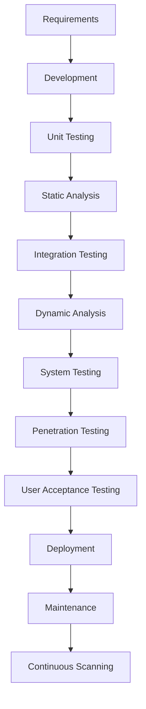
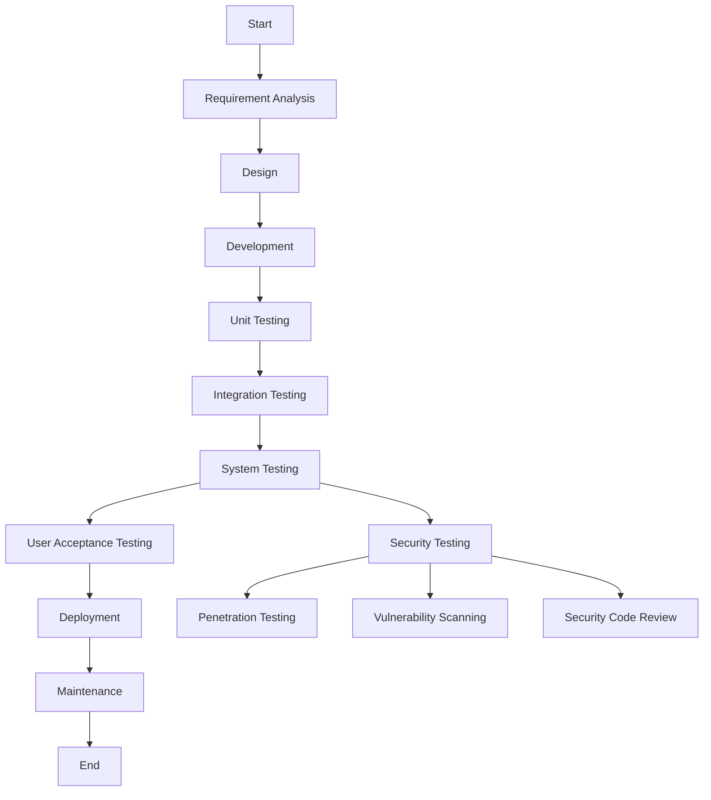

### Step-by-Step Tutorial for SDETs to Learn Security Testing

#### Step 1: Understand the Basics
- **Learn Security Fundamentals**: Start with basic security concepts such as authentication, authorization, encryption, and common vulnerabilities (e.g., SQL injection, XSS).
  - **Example**: Understanding how SQL injection works can help you prevent attacks that exploit vulnerabilities in your database queries.
  - **Resources**: 
    - [OWASP Top Ten](https://owasp.org/www-project-top-ten/)
    - [Security Testing - What is Security Testing?](https://www.youtube.com/watch?v=5ZGo_eR46To)

#### Step 2: Get Hands-On with Tools
- **Static Analysis Tools**: Familiarize yourself with tools like SonarQube, which can be integrated into CI/CD pipelines to catch vulnerabilities early.
  - **Example**: Using SonarQube to scan your codebase for vulnerabilities before deployment.
  - **Resources**: 
    - [SonarQube Documentation](https://docs.sonarqube.org/latest/)
    - [Security Testing - Importance of Security Testing with Examples](https://www.youtube.com/watch?v=Z0VjWxES-5M)
- **Dynamic Analysis Tools**: Learn to use tools like OWASP ZAP or Burp Suite for dynamic analysis and penetration testing.
  - **Example**: Running OWASP ZAP to test your application for common vulnerabilities like SQL injection and XSS.
  - **Resources**: 
    - [OWASP ZAP](https://www.zaproxy.org/)
    - [Burp Suite](https://portswigger.net/burp)

#### Step 3: Practice with Real-World Scenarios
- **Capture the Flag (CTF) Challenges**: Participate in CTF challenges to practice finding and exploiting vulnerabilities in a controlled environment.
  - **Example**: Solving a CTF challenge that involves exploiting a web application vulnerability.
  - **Resources**: 
    - [CTF Time](https://ctftime.org/)
    - [Hack The Box](https://www.hackthebox.com/)
- **Bug Bounty Programs**: Engage in bug bounty programs to gain real-world experience and potentially earn rewards.
  - **Example**: Reporting a security vulnerability in a major web application through a bug bounty program.
  - **Resources**: 
    - [Bugcrowd](https://www.bugcrowd.com/)
    - [HackerOne](https://www.hackerone.com/)

#### Step 4: Integrate Security into Development
- **Shift-Left Security**: Incorporate security testing early in the development lifecycle. Use tools and practices that integrate seamlessly with your existing workflows.
  - **Example**: Integrating security checks into your CI/CD pipeline to catch vulnerabilities early.
  - **Resources**: 
    - [Shift Left Security](https://www.shiftleft.io/)
    - [DevSecOps](https://www.redhat.com/en/topics/devops/what-is-devsecops)
- **Code Reviews**: Include security checks in code reviews to catch vulnerabilities before they reach production.
  - **Example**: Conducting a code review with a focus on identifying potential security issues.
  - **Resources**: 
    - [Code Review Best Practices](https://smartbear.com/learn/code-review/best-practices-for-peer-code-review/)
    - [Security Code Review](https://owasp.org/www-community/activities/Code_Review)

#### Step 5: Continuous Learning and Improvement
- **Stay Updated**: Follow security blogs, attend webinars, and participate in security forums to stay updated with the latest trends and threats.
  - **Example**: Regularly reading security blogs to stay informed about new vulnerabilities and attack vectors.
  - **Resources**: 
    - [Krebs on Security](https://krebsonsecurity.com/)
    - [Security Weekly](https://securityweekly.com/)
- **Certifications**: Consider obtaining certifications like Certified Ethical Hacker (CEH) or Offensive Security Certified Professional (OSCP) to validate your skills.
  - **Example**: Earning a CEH certification to demonstrate your knowledge of ethical hacking techniques.
  - **Resources**: 
    - [CEH Certification](https://www.eccouncil.org/programs/certified-ethical-hacker-ceh/)
    - [OSCP Certification](https://www.offensive-security.com/pwk-oscp/)

### Example: SQL Injection

**SQL Injection** is a common attack vector where malicious SQL statements are inserted into an entry field for execution. This can allow attackers to retrieve, modify, or delete data from the database.

- **Example**: Suppose you have a login form where users enter their username and password. An attacker might enter `' OR '1'='1` in the username field, which could trick the database into logging them in without a valid password.
- **Resource to Practice**: 
  - [SQL Injection Practice Labs](https://portswigger.net/web-security/sql-injection)
  - [SQL Injection Explained](https://www.youtube.com/watch?v=ciNHn38EyRc)

### Application Development and Testing Cycle
Below is a UML flowchart illustrating the application development and testing cycle, highlighting where security testing fits in:

### Explanation of Each Testing Level

1. **Unit Testing**: 
   - **When**: During the development phase.
   - **Example**: Testing individual functions or methods in isolation.
   - **Resources**: 
     - [Unit Testing Tutorial](https://www.youtube.com/watch?v=Eu35xM76kKY)
     - [JUnit Documentation](https://junit.org/junit5/)

2. **Static Analysis**:
   - **When**: After unit testing, during the development phase.
   - **Example**: Using tools like SonarQube to analyze code for potential vulnerabilities.
   - **Resources**: 
     - [SonarQube Documentation](https://docs.sonarqube.org/latest/)
     - [Static Code Analysis](https://www.youtube.com/watch?v=Z0VjWxES-5M)

3. **Integration Testing**:
   - **When**: After static analysis, during the development phase.
   - **Example**: Testing the interaction between different modules or services.
   - **Resources**: 
     - [Integration Testing Explained](https://www.youtube.com/watch?v=4jGmHM6ZWuA)
     - [Spring Integration Testing](https://spring.io/guides/gs/testing-web/)

4. **Dynamic Analysis**:
   - **When**: During the testing phase.
   - **Example**: Using tools like OWASP ZAP to test the application for runtime vulnerabilities.
   - **Resources**: 
     - [OWASP ZAP](https://www.zaproxy.org/)
     - [Dynamic Analysis Explained](https://www.youtube.com/watch?v=ciNHn38EyRc)

5. **System Testing**:
   - **When**: After dynamic analysis, during the testing phase.
   - **Example**: Testing the entire system as a whole to ensure it meets the requirements.
   - **Resources**: 
     - [System Testing Tutorial](https://www.youtube.com/watch?v=5ZGo_eR46To)
     - [System Testing Guide](https://www.guru99.com/system-testing.html)

6. **Penetration Testing**:
   - **When**: After system testing, before deployment.
   - **Example**: Performing manual penetration tests to identify complex vulnerabilities.
   - **Resources**: 
     - [Penetration Testing Explained](https://www.youtube.com/watch?v=ciNHn38EyRc)
     - [Kali Linux for Penetration Testing](https://www.kali.org/)

7. **User Acceptance Testing (UAT)**:
   - **When**: After penetration testing, before deployment.
   - **Example**: End-users test the application to ensure it meets their needs and requirements.
   - **Resources**: 
     - [UAT Explained](https://www.youtube.com/watch?v=5ZGo_eR46To)
     - [UAT Best Practices](https://www.guru99.com/user-acceptance-testing.html)

8. **Deployment**:
   - **When**: After UAT.
   - **Example**: Deploying the application to the production environment.
   - **Resources**: 
     - [Deployment Strategies](https://www.youtube.com/watch?v=5ZGo_eR46To)
     - [CI/CD Pipeline](https://www.redhat.com/en/topics/devops/what-is-ci-cd)

9. **Maintenance**:
   - **When**: Post-deployment.
   - **Example**: Ongoing monitoring and updating of the application.
   - **Resources**: 
     - [Software Maintenance](https://www.youtube.com/watch?v=5ZGo_eR46To)
     - [Continuous Monitoring](https://www.redhat.com/en/topics/devops/what-is-continuous-monitoring)

10. **Continuous Scanning**:
    - **When**: During maintenance.
    - **Example**: Regularly scanning the application for new vulnerabilities.
    - **Resources**: 
      - [Continuous Scanning Tools](https://www.youtube.com/watch?v=5ZGo_eR46To)
      - [Continuous Security](https://www.redhat.com/en/topics/devops/what-is-continuous-security)

This diagram and explanation provide a comprehensive view of how security testing and functional testing are integrated into the software development lifecycle.

## Sources & Further Reading

1. [OWASP Web Security Testing Guide](https://owasp.org/www-project-web-security-testing-guide/)
2. [OWASP Top 10](https://owasp.org/www-project-top-ten/)
3. [LambdaTest — Security Testing Learning Hub](https://www.lambdatest.com/learning-hub/security-testing)
4. [TestGuild — Why Security Testing Matters for QEs (Boris Arapovic)](https://testguild.com/podcast/automation/a514-boris/)

*See also:* [Functional Testers in the Secure SDLC (Mar 2025)]() · [The Secret to Secure Software Development (Sep 2024)]()
