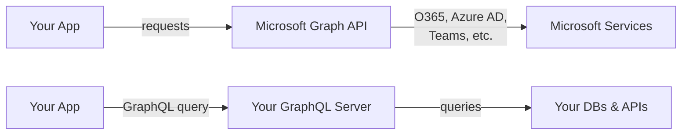

I get asked this once a month: "Should I use Graph API or GraphQL?" The answer is *neither*, until you know what problem you're solving.

**Microsoft Graph** is Microsoft's REST API for their services (Office 365, Azure AD, Teams, etc.). It's opinionated, stable, and *Microsoft-maintained*.

**GraphQL** is a *query language* for any API. It's flexible, efficient, and *you* maintain it.

These aren't competing products. They solve different problems. Here's when to pick each.

## When to Use Microsoft Graph

**You're building against Microsoft services.** Teams, Outlook, Azure AD, SharePoint — Microsoft Graph is the official, maintained API. It's your best choice if:

- Your app *primarily* integrates with Microsoft 365
- You need Azure AD as your auth source
- You're building Outlook plugins, Teams bots, or SharePoint extensions
- You want Microsoft to handle API versioning and security patches

**Example:** A corporate app that reads a user's Teams calendar, pulls their Outlook meetings, and syncs them to your dashboard. Graph API handles all three with consistent auth.

### The Trade-off

Microsoft Graph is opinionated. You get what Microsoft designed. If you need exactly `users/{id}/calendar/events`, it's perfect. If you need a custom shape (user's email + manager's team + direct reports' availability), you might over-fetch or make multiple requests.

## When to Use GraphQL

**You're building an API for your own users.** You control both sides — the server and the clients using it. GraphQL shines when:

- You have diverse clients (web, mobile, third-party) with different data needs
- Clients need to request *only* the fields they use (reduce bandwidth)
- You want to evolve your API without breaking old clients
- You're aggregating data from multiple backends (databases, third-party APIs)

**Example:** A dashboard app where the mobile client needs only user name + status, but the admin panel needs name + status + last login + permission groups. GraphQL lets each request exactly what it needs in one round-trip.

### The Trade-off

You maintain the GraphQL server. You version the schema. You handle deprecations. Clients gain flexibility; you take on maintenance.

## When You Have Both: Anti-Corruption Layers

Sometimes you're integrating Graph API *into* an existing system that already has a REST or GraphQL interface. You don't want Graph API bleeding into your core code. Enter the **Anti-Corruption Layer (ACL)** — a façade that translates between Graph API and your internal interfaces.

```
Your App  →  [ACL Layer]  →  Microsoft Graph
          ←  (translate)  ←
```

The ACL:
- Takes your internal request shape (your domain model)
- Translates it to Graph API calls
- Translates Graph responses back to your shape
- Keeps your core logic free of Graph API specifics

This matters when you might migrate away from Microsoft 365. The ACL lets you swap backends without rewriting everything.

## The Real Trade-off: Control vs. Consistency

Think of it this way:

**Microsoft Graph** = staying in the Microsoft ecosystem. You get stability and official support, but you bend to Microsoft's data model.

**GraphQL** = full control. You define the schema, you version it, you own the maintenance.

Neither is universally "better." Graph API is better for Microsoft-heavy shops. GraphQL is better for shops with diverse backends or strict client requirements.

### Visual: The Architecture Difference


```mermaid
graph LR
    A["Your App"] -->|requests| B["Microsoft Graph API"]
    B -->|O365, Azure AD,<br/> Teams, etc.| C["Microsoft Services"]
    
    D["Your App"] -->|GraphQL query| E["Your GraphQL Server"]
    E -->|queries| F["Your DBs & APIs"]
```

Graph API is direct — you talk to Microsoft's servers. GraphQL requires you to run a server in the middle, translating client needs into backend calls.

## Decision Matrix

| Scenario | Pick | Why |
|----------|------|-----|
| Building a Microsoft 365 integration | **Graph API** | Official, maintained, handles Azure AD auth natively |
| Mobile app with strict bandwidth constraints | **GraphQL** | Clients request only what they need |
| Dashboard pulling data from 5 different services | **GraphQL** | One query shape for diverse backends |
| Internal tool for Exchange calendar sync | **Graph API** | Proven, stable, built for this exact job |
| Third-party developers building on your platform | **GraphQL** | Flexibility attracts integrators |
| Monolith with one web client | Either | Graph API if Microsoft-heavy; GraphQL if you own the backend |


## Sources & Further Reading

1. [Microsoft Graph overview](https://learn.microsoft.com/en-us/graph/overview)
2. [Microsoft Graph best practices](https://learn.microsoft.com/en-us/graph/best-practices-concept)
3. [Anti-Corruption Layer — Azure Architecture Center](https://learn.microsoft.com/en-us/azure/architecture/patterns/anti-corruption-layer)
4. [GraphQL vs REST — AWS comparison](https://aws.amazon.com/compare/the-difference-between-graphql-and-rest/)

*See also:* [Mastering GraphQL (Sep 2024)]({{ site.baseurl }}) · [Hasura with Graph API and Hot Chocolate (Sep 2024)]({{ site.baseurl }})
