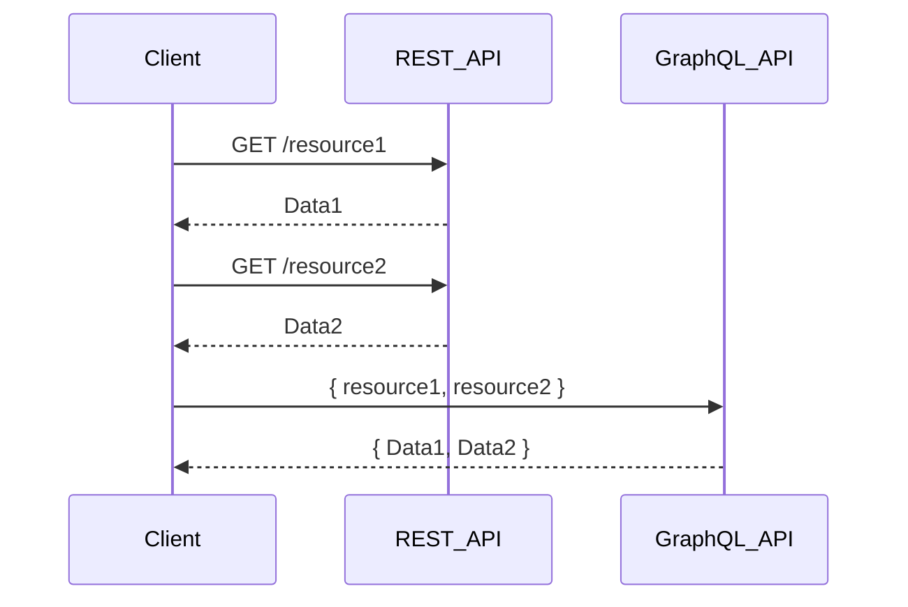
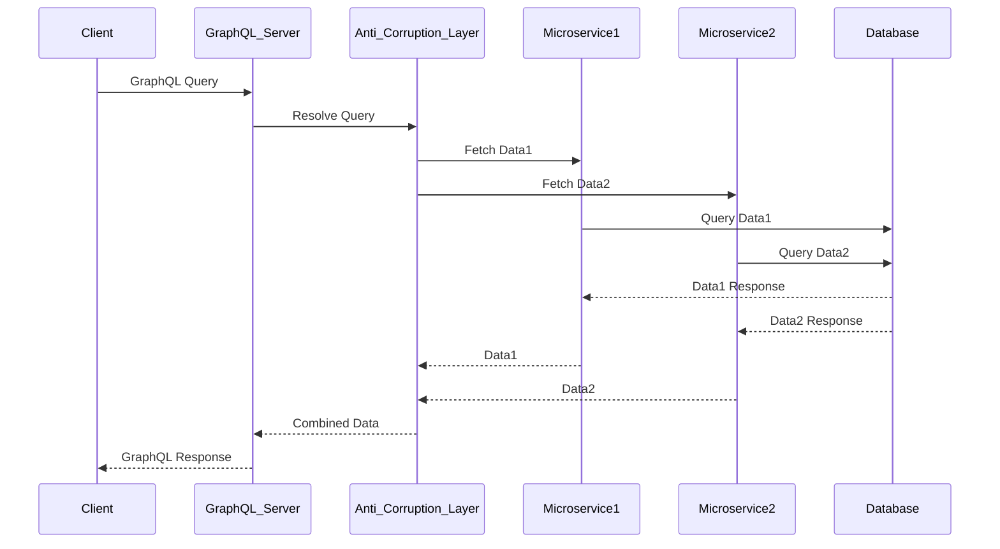

- [Modernizing Your Skills: Embracing GraphQL for Efficient Data Management](#modernizing-your-skills-embracing-graphql-for-efficient-data-management)
    - [Why Should a Company Plan to Move to GraphQL?](#why-should-a-company-plan-to-move-to-graphql)
      - [Glossary](#glossary)
    - [Architectural Diagram Using UML in Mermaid](#architectural-diagram-using-uml-in-mermaid)
      - [Explanation](#explanation)
    - [How This Architecture Improves Response Time](#how-this-architecture-improves-response-time)
    - [**Conclusion**](#conclusion)

# Modernizing Your Skills: Embracing GraphQL for Efficient Data Management

**Problem Statement:**
REST was fine until it wasn't. I'd fetch an entire user object — 40 fields — when the test only needed an email address. As a tester who's worn the QA, Scrum, and BA hats, I needed something that let me ask for exactly what I wanted. That's how I ended up on GraphQL.

**Quote to Inspire:**
_&quot;The only way to make sense out of change is to plunge into it, move with it, and join the dance.&quot; - Alan Watts_

**Why Modernize?**
To thrive in the modern tech world, we must think modern and do modern. Embracing new technologies like GraphQL not only enhances our capabilities but also opens up new opportunities for innovation and efficiency.

### Why Should a Company Plan to Move to GraphQL?

1. **Efficient Data Fetching**: GraphQL allows clients to request exactly the data they need, reducing over-fetching and under-fetching issues common with REST APIs. This leads to more efficient use of network resources and faster response times.

2. **Single Endpoint**: Unlike REST APIs, which often require multiple endpoints for different resources, GraphQL uses a single endpoint to handle all queries. This simplifies API management and reduces the complexity of maintaining multiple endpoints.

3. **Real-Time Data**: GraphQL supports subscriptions, enabling real-time updates. This is particularly beneficial for applications that require live data, such as chat applications, live sports updates, or financial tickers.

4. **Strong Typing**: GraphQL uses a strongly typed schema to define the capabilities of the API. This ensures that clients can only request data that the server can provide, reducing errors and improving the developer experience.

5. **Flexibility and Customization**: GraphQL's flexible query structure allows clients to specify exactly what data they need and how they need it. This customization reduces the need for multiple versions of an API to support different client requirements.

6. **Improved Developer Productivity**: With GraphQL, developers can work more efficiently by leveraging tools like GraphQL Playground and GraphiQL for testing and debugging. The strong typing and introspection capabilities of GraphQL also make it easier to understand and use the API.

7. **Incremental Adoption**: Companies can adopt GraphQL incrementally, integrating it with existing REST services. This allows for a smooth transition without the need for a complete overhaul of the existing system.

8. **Better Performance**: By reducing the number of requests and the amount of data transferred, GraphQL can significantly improve the performance of applications, especially those with complex data requirements or operating in environments with limited bandwidth.

**Key Takeaways:**

- **Client-Centric Design:** GraphQL empowers clients to request exactly the data they need, reversing the data fetching responsibility and leading to more efficient data use.
- **Scalability and Performance:** Developed to solve performance issues in mobile applications, GraphQL efficiently manages large datasets, delivering a seamless experience across devices.
- **Flexible API Structure:** Unlike REST, GraphQL allows for a single endpoint to handle various queries, reducing complexity and improving maintainability.
- **Real-Time Features:** Subscriptions in GraphQL enable real-time data updates, enhancing user engagement and experience.
- **Strong Typing:** GraphQL’s strong type system ensures predictability and reliability in API interactions, minimizing errors and improving developer experience.
- **Middleware Efficiency:** Pagination and filtering middleware enhance the performance of GraphQL APIs, allowing for efficient data handling and improved response times.
- **Integration with Existing Systems:** GraphQL can easily integrate with existing REST services, allowing organizations to adopt it incrementally while enhancing their APIs’ capabilities.

**Comparison Table: REST API vs. GraphQL**

| Feature                  | REST API                                      | GraphQL                                      |
|--------------------------|-----------------------------------------------|----------------------------------------------|
| **Data Fetching**        | Multiple endpoints, over-fetching/under-fetching | Single endpoint, precise data fetching       |
| **API Structure**        | Multiple endpoints for different resources    | Single endpoint for all queries              |
| **Real-Time Updates**    | Not inherently supported                      | Supported via subscriptions                  |
| **Typing**               | No strong typing                              | Strongly typed schema                        |
| **Performance**          | Can be less efficient due to multiple requests| More efficient with single request           |
| **Flexibility**          | Less flexible, fixed endpoints                | Highly flexible, customizable queries        |
| **Integration**          | Can be complex                                | Easier integration with existing systems     |

**Why Move from REST API to GraphQL?**

- **Efficient Data Fetching**: GraphQL allows clients to request only the data they need, reducing over-fetching and under-fetching issues common with REST.
- **Single Endpoint**: Simplifies API management by consolidating multiple REST endpoints into a single GraphQL endpoint.
- **Real-Time Data**: Supports subscriptions for real-time updates, which are harder to implement with REST.
- **Strong Typing**: Uses a schema to define the capabilities of the API, making it easier to understand and use.

**Explanation of Key Terms in GraphQL**

- **Schema**: Defines the types and relationships in the API.
- **Query**: Operation to fetch data.
- **Mutation**: Operation to modify data.
- **Subscription**: Operation for real-time data updates.
- **Resolver**: Function that resolves a value for a type or field in the schema.

**UML Sequence Diagram Using Mermaid**

#### Glossary

- **Endpoint**: A specific URL where an API can be accessed by a client.
- **Over-fetching**: Retrieving more data than necessary.
- **Under-fetching**: Retrieving insufficient data, requiring additional requests.
- **Schema**: A formal definition of the structure and types of data that can be queried or mutated in GraphQL.
- **Query**: A read-only operation in GraphQL to fetch data.
- **Mutation**: An operation in GraphQL to modify data.
- **Subscription**: A real-time operation in GraphQL to receive updates when data changes.
- **Resolver**: A function in GraphQL that resolves a value for a type or field.

### Architectural Diagram Using UML in Mermaid

#### Explanation

1. **Client**: The front-end application sends a GraphQL query to the GraphQL server.
2. **GraphQL Server**: Receives the query and uses resolvers to fetch the required data.
3. **Anti-Corruption Layer**: Acts as an intermediary to ensure that the data fetched from the microservices is in a format that the GraphQL server can use.
4. **Microservices**: Individual services that handle specific business logic and data fetching.
5. **Database**: The data storage layer where the actual data resides.

### How This Architecture Improves Response Time

- **Single Request**: The client makes a single request to the GraphQL server, which reduces the number of network round trips compared to multiple REST API calls.
- **Efficient Data Fetching**: GraphQL allows the client to request only the data it needs, reducing the amount of data transferred over the network.
- **Parallel Data Fetching**: The anti-corruption layer can fetch data from multiple microservices in parallel, further reducing the overall response time.
- **Optimized Data Processing**: The anti-corruption layer processes and combines the data before sending it back to the GraphQL server, ensuring that the client receives a single, optimized response.

By adopting this architecture, companies can achieve more efficient data management, faster response times, and a better overall user experience. This approach also allows for a smooth transition from existing REST APIs to GraphQL, leveraging the benefits of both technologies.
**Modernizing Legacy Services:**
To modernize legacy services, start by integrating GraphQL incrementally. Use it alongside existing REST services to enhance capabilities without a complete overhaul. This approach allows for a smooth transition and gradual adoption of modern practices.

     
### Conclusion
When deciding between GraphQL and REST, consider the following:
- **GraphQL** is ideal for applications requiring efficient data fetching, real-time updates, and a flexible API structure.
- **REST** remains suitable for simpler, well-defined operations with less complexity.

Pick the tool that matches the problem. GraphQL when you're tired of over-fetching; REST when the API is simple and everyone's happy. Either way — keep learning, but skip the buzzword treadmill. 🚀

## Sources & Further Reading

- [Michael Staib — GraphQL in .NET with Hot Chocolate (YouTube)](https://youtu.be/qrh97hToWpM?si=_6BLSFqo7SYKeHjW)
- [Mastering GraphQL: Key Concepts & Best Practices (Sep 2024)]()
- [Why Choose Hasura Over Other Tools (Sep 2024)]()

*See also:* [Graph API vs GraphQL (Sep 2024)]() — yes, those are different things, and yes, I confused them once too.

