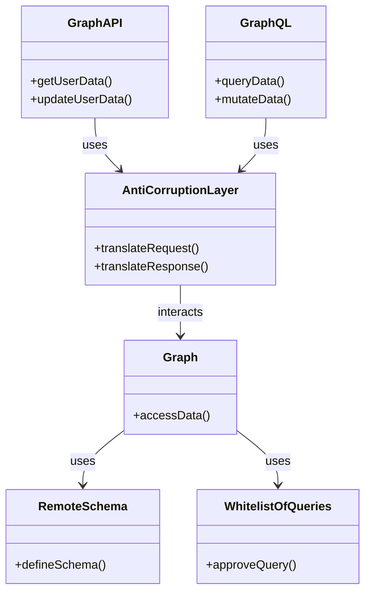

# 1. Graph API vs GraphQL

**Graph API**:
- **Definition**: A RESTful API that allows developers to access and interact with data from various Microsoft services like Office 365, Azure AD, and more.
- **Usage**: Uses standard HTTP methods (GET, POST, PUT, DELETE) to perform CRUD operations on resources.
- **Example**: Fetching user data from Azure AD using a GET request.

**GraphQL**:
- **Definition**: A query language for APIs and a runtime for executing those queries by using a type system you define for your data.
- **Usage**: Allows clients to request exactly the data they need, reducing over-fetching and under-fetching of data.
- **Example**: Fetching specific fields of user data in a single query.

### Connecting Graph API to REST or WCF on an Anti-Corruption Layer

**Anti-Corruption Layer (ACL)**:
- **Definition**: A design pattern used to isolate different subsystems by translating requests and responses between them, ensuring that the core system remains unaffected by external systems[^1^].
- **Usage**: Acts as a mediator to prevent the &quot;corruption&quot; of the core system by external systems with different semantics or data models[^1^].

To connect Graph API to REST or WCF using an ACL:
1. **Implement the ACL**: Create a façade or adapter that translates Graph API requests to REST or WCF calls.
2. **Translate Requests**: Ensure that the ACL translates the data models and protocols between Graph API and the target system.
3. **Maintain Isolation**: Keep the core system's design clean and unaffected by external dependencies[^1^].

### 2. Graph API - Remote Schema, Whitelist of Queries, and Graph

**Remote Schema**:
- **Definition**: A schema that defines how external content will be used in various Microsoft Graph experiences[^14^].
- **Usage**: Register the schema before adding items to the connection.

**Whitelist of Queries**:
- **Definition**: A list of pre-approved queries that can be executed against the API.
- **Usage**: Enhances security by restricting the queries that can be run.

**Graph**:
- **Definition**: Refers to the Microsoft Graph API, which provides a unified endpoint to access data from various Microsoft services.
- **Usage**: Allows developers to interact with a wide range of Microsoft services through a single API endpoint.

### Relationship and UML Diagram

These terms are related through their use in API design and data access. Here's a UML diagram in Mermaid to illustrate their relationships:

### Comparison Table

| Term                  | Definition                                                                 | Usage                                                                                   |
|-----------------------|-----------------------------------------------------------------------------|-----------------------------------------------------------------------------------------|
| Graph API             | RESTful API for Microsoft services                                          | CRUD operations on resources using HTTP methods                                         |
| GraphQL               | Query language for APIs                                                     | Request specific data fields, reducing over-fetching and under-fetching                 |
| Anti-Corruption Layer | Design pattern to isolate subsystems                                        | Translates requests and responses between different systems                             |
| Remote Schema         | Schema defining external content usage                                      | Register schema before adding items to the connection                                   |
| Whitelist of Queries  | Pre-approved list of queries                                                | Enhances security by restricting executable queries                                     |
| Graph                 | Unified endpoint for accessing Microsoft services                           | Interact with various Microsoft services through a single API endpoint                  |

Source: 
([1](https://learn.microsoft.com/en-us/azure/architecture/patterns/anti-corruption-layer)) Anti-corruption Layer pattern - Azure Architecture Center. https://learn.microsoft.com/en-us/azure/architecture/patterns/anti-corruption-layer.
(2) schema resource type - Microsoft Graph v1.0 | Microsoft Learn. https://learn.microsoft.com/en-us/graph/api/resources/externalconnectors-schema?view=graph-rest-[1](https://learn.microsoft.com/en-us/azure/architecture/patterns/anti-corruption-layer).0.
(3) Wrapping your business logic with anti-corruption layers – NET Core. https://www.thereformedprogrammer.net/wrapping-your-business-logic-with-anti-corruption-layers-net-core/.
(4) The Anti-Corruption Layer Pattern - DEV Community. https://dev.to/asarnaout/the-anti-corruption-layer-pattern-pcd.
(5) GraphQL vs REST APIs: What's the difference?. https://graphapi.com/learn/graphql/vs-rest/.
(6) GraphQL vs REST API - Difference Between API Design Architectures - AWS. https://aws.amazon.com/compare/the-difference-between-graphql-and-rest/.
(7) GraphQL Vs. REST APIs: A comprehensive comparison for developers. https://hygraph.com/blog/graphql-vs-rest-apis.
(8) GraphQL vs. REST - Postman Blog. https://blog.postman.com/graphql-vs-rest/.
(9) GraphQL vs REST APIs - Built In. https://builtin.com/software-engineering-perspectives/graphql-vs-rest.
(10) Anti-corruption layer pattern - AWS Prescriptive Guidance. https://docs.aws.amazon.com/prescriptive-guidance/latest/cloud-design-patterns/acl.html.
(11) Anti-Corruption Layer | Cloud Patterns | Learn | CodeWithStu's Blog. https://im5tu.io/learn/cloud-patterns/anti-corruption-layer/.
(1[2](https://learn.microsoft.com/en-us/graph/api/resources/externalconnectors-schema?view=graph-rest-1.0)) Anti-Corruption Layer | Dremio. https://www.dremio.com/wiki/anti-corruption-layer/.
(13) Anti-Corruption Layer : Transforming Legacy Applications into Modern .... https://blogit.michelin.io/anti-corruption-layer/.
(14) Use query parameters to customize responses - Microsoft Graph. https://learn.microsoft.com/en-us/graph/query-parameters.
(15) GitHub GraphQL API documentation - GitHub Docs. https://docs.github.com/en/graphql.
(16) Best practices for working with Microsoft Graph. https://learn.microsoft.com/en-us/graph/best-practices-concept.
