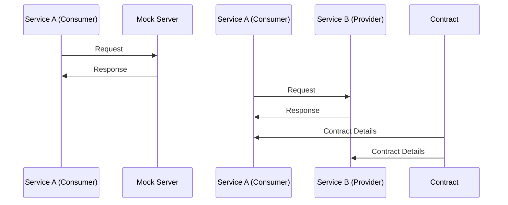

### Contract in Contract Testing

    

In the context of contract testing, a **contract** is a formal agreement that specifies how two services (a consumer and a provider) will interact. This contract includes details like:
- **Request**: The exact format of the request the consumer will send (e.g., HTTP method, URL, headers, body).
- **Response**: The exact format of the response the provider will return (e.g., status code, headers, body).

### Mock Servers
- **Purpose**: Simulate the provider service for testing the consumer service.
- **Functionality**: Return predefined responses to specific requests.
- **Scope**: Primarily used to test the consumer service in isolation.

### Contract Testing
- **Purpose**: Ensure both the consumer and provider adhere to the agreed-upon contract.
- **Functionality**: Validate that the actual interactions match the contract.
- **Scope**: Covers both the consumer and provider, ensuring they can work together in a real environment.

### Key Differences
- **Mock Servers**: Focus on simulating the provider for the consumer's benefit. They are often used to test the consumer service in isolation.
- **Contract Testing**: Focuses on the agreement between both services. It ensures that both the consumer and provider meet the expectations defined in the contract.

### Example
Imagine you have a service (Service A) that needs to get user data from another service (Service B).

- **Using a Mock Server**: You set up a mock server to simulate Service B. When Service A requests user data, the mock server returns a predefined response. This helps you test Service A's ability to handle the response.

- **Contract Testing**: You define a contract that specifies how Service A will request user data and how Service B will respond. Contract testing ensures that Service A sends the correct request and that Service B responds correctly, according to the contract. This way, you know that when Service A and Service B interact in production, they will work together seamlessly.

# Service Interaction Flow

## Mock Server Testing
1. **Service A (Consumer)** sends a request to the **Mock Server**.
2. The **Mock Server** responds back to **Service A**.

## Contract Testing
1. **Service A (Consumer)** sends a request to **Service B (Provider)**.
2. **Service B** responds back to **Service A**.

## Contract Details
1. The **Contract** provides details to both **Service A** and **Service B**.

    

### Summary
- **Mock Servers**: Simulate the provider for the consumer's benefit.
- **Contract Testing**: Ensures both consumer and provider adhere to the contract, covering the entire interaction.

