*Written by someone who's been burned by flaky tests more times than I can count. I've used all three of these tools in production, migrated suites between them, and learned the hard way what actually matters and what's just marketing.*

---

## Level 1 — First, Let's Get on the Same Page

### The Restaurant Analogy (Bear With Me)

I've used this analogy in interviews and it usually lands. Picture you're testing whether a restaurant can deliver a meal correctly:

- **Selenium** is like calling the waiter on the phone every two minutes. "Is my order ready yet?" Hang up. Wait. Call again. "How about now?" Each call burns time. The kitchen might have finished three minutes ago and you'd never know until you call.

- **Cypress** is like walking straight into the kitchen and cooking alongside the chef. You see the onions hitting the pan in real time because you're standing right there. Nothing happens without you seeing it.

- **Playwright** is like handing the chef a walkie‑talkie. "Hey, radio me when the steak hits the grill." They buzz you when it's done. You never have to ask "is it ready?" — they tell you.

None of these approaches is "wrong." They solve the same problem differently. The question is which trade-offs you're willing to live with.

### What the Hell Is a "Control Plane" Anyway?

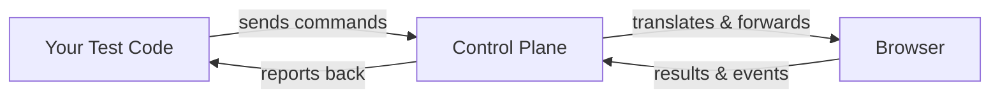

**Control plane** — I know, it sounds like something from an AWS whitepaper[^1]. Here's what it actually means: it's the middleman that sits between your test script and the browser, translating your commands into things the browser understands and then reporting back what happened.

[^1]: Microsoft's Playwright docs call it the "automation library" layer. Same thing.

This middleman makes all the decisions. *When* is a button ready to click? *How* do I find that element on the page? *What* do I report back if something goes wrong? Get this layer wrong and your tests will flake no matter how well you write them.

---

### Async / Await — Yes, This Is Actually Important (I Skipped It Once and Paid for It)

When I first started with Playwright after years of Selenium, I kept forgetting `await`. My tests would pass locally and fail in CI and I couldn't figure out why. Turns out the browser runs on its own clock — navigation, rendering, network requests, none of it cares about your test's timeline.

But here's the thing that most automation guides miss: **async/await isn't just a browser concern.** Modern applications are distributed systems. Your test clicks a "Place Order" button — behind the scenes, your app drops a message onto a queue[^2], a separate order service picks it up, a payment processor fires, a notification gets published to an event bus[^3], and somewhere in all that, the UI updates. If your test is just waiting for a spinner to disappear, you're testing maybe 20% of what's actually happening.

[^2]: **Message Queue** — A durable buffer that decouples producers and consumers. Think RabbitMQ, Azure Service Bus, Amazon SQS. The producer drops a message and moves on; the consumer picks it up later. This means the operation isn't complete when the HTTP response returns — it's just queued.

[^3]: **Event Bus / Event‑Driven Architecture** — Instead of services calling each other directly, they publish events ("OrderPlaced", "PaymentProcessed") to a shared bus. Other services subscribe to events they care about. This decouples services but makes testing harder: there's no single request‑response cycle to intercept.

This is where the tools start to diverge in ways that actually matter for real‑world testing.

#### Async/Await in the Context of Distributed System Patterns

Let's talk about the architectures your app is actually running on, and how each tool helps (or doesn't) test them.

**Message Queues & Async Processing:**

When your app uses message queues[^2], here's the exact sequence your test has to survive:

1. **User clicks** "Place Order"
2. **HTTP 202 Accepted** comes back — the order is *queued*, not processed yet
3. **Message lands on queue** — RabbitMQ / SQS / Azure Service Bus now holds it
4. **Worker picks it up** — a background process (Lambda, container, Windows Service) starts processing
5. **Database updates** — the worker writes the final order record
6. **UI polls or receives a WebSocket push** — the frontend learns the order is done and re‑renders

A browser automation tool that can only wait for HTTP responses is blind to everything after step 2. Your test thinks the order was placed — but the worker might be down, the queue might be backed up, or the database write might have silently failed.

**Cypress** can intercept the initial HTTP call and wait for the UI to poll successfully:

```typescript
// TypeScript — Cypress: testing a queued operation
describe('Order processing with message queue', () => {
  it('waits for the order to appear after async processing', () => {
    // Intercept the submit endpoint — this returns 202 immediately
    cy.intercept('POST', '/api/orders').as('submitOrder');
    // Intercept the polling endpoint that checks status
    cy.intercept('GET', '/api/orders/*').as('pollOrder');

    cy.visit('/checkout');
    cy.get('[data-cy="place-order"]').click();

    // The submit returns 202 — message is queued, not processed
    cy.wait('@submitOrder').its('response.statusCode').should('eq', 202);

    // Now poll for the order to appear in the list.
    // Cypress's retry‑ability will keep checking until status changes.
    cy.get('[data-cy="order-status"]', { timeout: 15_000 })
      .should('contain.text', 'Confirmed');
  });
});
```

**Playwright** can go further — it can stub the polling endpoint to simulate processing delays, or wait for a WebSocket push:

```typescript
// TypeScript — Playwright: testing async processing with WebSocket push
import { test, expect } from '@playwright/test';

test('order confirmed via WebSocket after queue processing', async ({ page }) => {
  await page.goto('/checkout');

  // Set up a listener for the WebSocket message that signals completion
  const wsPromise = page.waitForEvent('websocket', (ws) => {
    ws.on('framereceived', (data) => {
      const payload = JSON.parse(data.payload as string);
      return payload.type === 'order_confirmed';
    });
  });

  await page.getByTestId('place-order').click();

  // Wait for the WebSocket notification — no polling needed
  await wsPromise;

  // UI should reflect the confirmed state
  await expect(page.getByTestId('order-status')).toContainText('Confirmed');
});

// Alternative: stub the queue processing to simulate different scenarios
test('order stuck in queue — test the timeout UI', async ({ page }) => {
  // Stub the status endpoint to always return 'processing'
  await page.route('/api/orders/*/status', async (route) => {
    await route.fulfill({
      status: 200,
      contentType: 'application/json',
      body: JSON.stringify({ status: 'processing' }),
    });
  });

  await page.goto('/orders/123');
  // The timeout message should appear after the configured delay
  await expect(page.getByText(/still processing/i)).toBeVisible({ timeout: 30_000 });
});
```

**Selenium** has no intercept, no WebSocket listener. You poll the DOM and hope:

```typescript
// TypeScript — Selenium: polling the DOM for queue‑processed results
import { Builder, By, until, WebDriver } from 'selenium-webdriver';

const driver: WebDriver = await new Builder().forBrowser('chrome').build();
await driver.get('https://example.com/checkout');

await driver.findElement(By.css('[data-cy="place-order"]')).click();

// Poll the DOM — no way to know if the queue processed or if the UI just re‑rendered
await driver.wait(
  until.elementTextContains(
    driver.findElement(By.css('[data-cy="order-status"]')),
    'Confirmed'
  ),
  30_000
);
await driver.quit();
```

```java
// Java — Selenium: same polling pattern, different language
WebDriver driver = new ChromeDriver();
driver.get("https://example.com/checkout");

driver.findElement(By.cssSelector("[data-cy='place-order']")).click();

// Poll the DOM — no queue awareness
new WebDriverWait(driver, Duration.ofSeconds(30))
    .until(ExpectedConditions.textToBePresentInElementLocated(
        By.cssSelector("[data-cy='order-status']"), "Confirmed"));
driver.quit();
```

```csharp
// C# — Selenium: same polling pattern
using OpenQA.Selenium;
using OpenQA.Selenium.Chrome;
using OpenQA.Selenium.Support.UI;

var driver = new ChromeDriver();
driver.Navigate().GoToUrl("https://example.com/checkout");

driver.FindElement(By.CssSelector("[data-cy='place-order']")).Click();

// Poll the DOM
var wait = new WebDriverWait(driver, TimeSpan.FromSeconds(30));
wait.Until(ExpectedConditions.TextToBePresentInElementLocated(
    By.CssSelector("[data-cy='order-status']"), "Confirmed"));
driver.Quit();
```

**Event‑Driven Architecture[^3] & CQRS[^4]:**

In CQRS, commands (writes) and queries (reads) are separate paths — often hitting different databases, different APIs, even different services. Here's the sequence:

1. **Command** — "Place Order" writes to the command store (POST /api/orders → 202 Accepted)
2. **Projection** — a background projector picks up the event and updates the read model (separate database, async)
3. **Query** — the UI polls GET /api/orders/{id} to read the projected state
4. **UI renders** — finally, the frontend shows "Confirmed" — but only after step 2 finishes

The delay between step 1 and step 3 — the eventual‑consistency gap while the projector runs — is the source of much test flakiness.

[^4]: **CQRS (Command Query Responsibility Segregation)** — A pattern where reads and writes use separate models. Commands mutate state (POST /orders). Queries read state (GET /orders/123). The read model is eventually consistent — it lags behind the command. Testing CQRS means waiting for the read model to catch up.

**Playwright** shines here because you can independently wait for both the command response and the query response:

```typescript
// TypeScript — Playwright: CQRS — wait for command then query projection
import { test, expect } from '@playwright/test';

test('CQRS: order created via command API, confirmed via query projection', async ({ page }) => {
  await page.goto('/checkout');

  // Step 1: Listen for the command (POST) and the query (GET) separately
  const commandResp = page.waitForResponse(
    r => r.url().includes('/api/orders') && r.request().method() === 'POST' && r.status() === 202
  );
  const queryResp = page.waitForResponse(
    r => r.url().includes('/api/orders') && r.request().method() === 'GET' && r.status() === 200
  );

  await page.getByTestId('place-order').click();

  // Step 2: Confirm the command was accepted
  const cmd = await commandResp;
  expect(cmd.status()).toBe(202);

  // Step 3: Wait for the read‑model projection to catch up
  // This is the eventual‑consistency gap — the query returns the projected state
  const qry = await queryResp;
  const projection = await qry.json();
  expect(projection.status).toBe('Confirmed');

  // Step 4: UI assertion after projection is confirmed
  await expect(page.getByTestId('order-status')).toContainText('Confirmed');
});
```

**Serverless Architecture[^5] & Service‑Oriented Architecture (SOA):**

[^5]: **Serverless** — Functions‑as‑a‑Service (AWS Lambda, Azure Functions, Google Cloud Functions). No persistent server. Cold starts add latency. API Gateway routes HTTP requests to functions. Testing serverless means dealing with unpredictable latency and eventual consistency between function invocations.

Serverless apps are the ultimate async challenge. Every function invocation is independent. Cold starts add 500ms–2s of latency. API Gateway adds another layer. Here's a typical chain:

1. **API Gateway** receives the HTTP request and routes it
2. **Lambda (order service)** cold‑starts, validates, writes to SQS — 500ms–2s
3. **SQS** holds the message until a worker picks it up
4. **Lambda (payment processor)** cold‑starts, processes the payment, writes to DynamoDB
5. **Lambda (notification)** cold‑starts, sends the confirmation, pushes a WebSocket event
6. **UI receives the push** and re‑renders — total elapsed: 5–10 seconds

Your test has to survive every one of those cold starts, queue delays, and the eventual‑consistency gap between steps 4 and 6.

**Playwright** lets you stub the entire serverless backend, simulating cold starts, timeouts, and errors:

```typescript
// TypeScript — Playwright: simulating serverless cold starts and failures
import { test, expect } from '@playwright/test';

test('handles serverless cold start latency', async ({ page }) => {
  // Simulate a 3‑second Lambda cold start
  await page.route('/api/orders', async (route) => {
    await new Promise(resolve => setTimeout(resolve, 3_000));  // cold start
    await route.fulfill({
      status: 202,
      contentType: 'application/json',
      body: JSON.stringify({ id: '123', message: 'queued' }),
    });
  });

  await page.goto('/checkout');
  await page.getByTestId('place-order').click();

  // The UI should show a "processing" state during the cold start
  await expect(page.getByText(/processing your order/i)).toBeVisible();

  // Eventually the processing message should resolve
  await expect(page.getByTestId('order-confirmation')).toBeVisible({ timeout: 10_000 });
});

test('graceful degradation when Lambda times out', async ({ page }) => {
  // Simulate a Lambda timeout
  await page.route('/api/orders', async (route) => {
    await route.abort('timedout');
  });

  await page.goto('/checkout');
  await page.getByTestId('place-order').click();

  // The UI should show a retry or fallback message
  await expect(page.getByText(/something went wrong/i)).toBeVisible();
  await expect(page.getByTestId('retry-button')).toBeVisible();
});
```

**Cypress** can stub the serverless backend similarly but is limited to intercepting HTTP — no WebSocket simulation:

```typescript
// TypeScript — Cypress: stubbing serverless responses
describe('Serverless backend simulation', () => {
  it('handles slow Lambda response', () => {
    // Stub with a deliberate delay (simulate cold start)
    cy.intercept('POST', '/api/orders', (req) => {
      req.reply((res) => {
        res.setDelay(3000);  // 3‑second cold start
        res.send({ status: 202, body: { id: '123', message: 'queued' } });
      });
    }).as('submitOrder');

    cy.visit('/checkout');
    cy.get('[data-cy="place-order"]').click();

    // Retry‑ability handles the wait — no cy.wait(3000)
    cy.get('[data-cy="order-confirmation"]', { timeout: 10_000 })
      .should('be.visible');
  });
});
```

**Selenium** — no intercept, no stubbing. For serverless testing, you must either run a real backend (slow, flaky) or set up a separate mock server (complex):

```typescript
// TypeScript — Selenium: no stubbing capability
// Your only options:
//   A) Point at a real serverless backend (cold starts make tests slow and flaky)
//   B) Deploy a mock backend at a separate URL (complex, separate CI step)
//   C) Use a network‑level proxy like WireMock or Mountebank (complex)

const driver = await new Builder().forBrowser('chrome').build();
await driver.get('https://real-backend.example.com/checkout');

await driver.findElement(By.css('[data-cy="place-order"]')).click();

// Hope the serverless backend processes within 30 seconds.
// Cold starts make this unpredictable.
await driver.wait(
  until.elementLocated(By.css('[data-cy="order-confirmation"]')),
  30_000
);
await driver.quit();
```

```java
// Java — Selenium: same limitation
WebDriver driver = new ChromeDriver();
driver.get("https://real-backend.example.com/checkout");
driver.findElement(By.cssSelector("[data-cy='place-order']")).click();

new WebDriverWait(driver, Duration.ofSeconds(30))
    .until(ExpectedConditions.visibilityOfElementLocated(
        By.cssSelector("[data-cy='order-confirmation']")));
driver.quit();
```

```csharp
// C# — Selenium: same limitation
var driver = new ChromeDriver();
driver.Navigate().GoToUrl("https://real-backend.example.com/checkout");
driver.FindElement(By.CssSelector("[data-cy='place-order']")).Click();

var wait = new WebDriverWait(driver, TimeSpan.FromSeconds(30));
wait.Until(ExpectedConditions.ElementIsVisible(
    By.CssSelector("[data-cy='order-confirmation']")));
driver.Quit();
```

#### Async/Await in Each Tool — Side‑by‑Side Language Comparison

**Playwright (TypeScript)** — async is explicit, you control it:

```typescript
// ❌ Forgot await — the click fires before the page loads. Test fails mysteriously.
const page = await context.newPage();
page.click('#submit');  // page is still loading! This races.

// ✅ Every browser interaction is awaited.
const page = await context.newPage();
await page.goto('https://example.com');
await page.click('#submit');
```

**Cypress (TypeScript)** — async is hidden behind the command queue:

```typescript
// Cypress manages its own command queue. No await on Cypress commands.
describe('Cypress async model', () => {
  it('commands chain without await', () => {
    cy.get<HTMLButtonElement>('[data-cy="submit"]').click();
    cy.url().should('include', '/done');
  });

  // But! If you're doing real async work outside the queue, you DO need await:
  it('async outside the command queue', () => {
    cy.get('[data-cy="submit"]').then(async ($el: JQuery<HTMLElement>) => {
      const text: string = await someAsyncOperation($el.text());
      cy.wrap(text).should('eq', 'Expected');
    });
  });
});
```

**Selenium — TypeScript:**

```typescript
// TypeScript — Selenium: sync, blocking, no retry
import { Builder, By, until, WebDriver, WebElement } from 'selenium-webdriver';

const driver: WebDriver = await new Builder().forBrowser('chrome').build();
await driver.get('https://example.com/login');

// Wait is explicit — you write it every time
await driver.wait(
  until.elementIsVisible(driver.findElement(By.id('email'))),
  10_000
);
const emailField: WebElement = await driver.findElement(By.id('email'));
await emailField.sendKeys('user@example.com');
await driver.findElement(By.id('submit')).click();
await driver.quit();
```

**Selenium — Java:**

```java
// Java — Selenium: sync, blocking, explicit waits
WebDriver driver = new ChromeDriver();
WebDriverWait wait = new WebDriverWait(driver, Duration.ofSeconds(10));

driver.get("https://example.com/login");
wait.until(ExpectedConditions.visibilityOfElementLocated(By.id("email")))
    .sendKeys("user@example.com");
driver.findElement(By.id("password")).sendKeys("pass123");
wait.until(ExpectedConditions.elementToBeClickable(By.id("submit")))
    .click();
driver.quit();
```

**Selenium — C#:**

```csharp
// C# — Selenium: sync, blocking, explicit waits
using OpenQA.Selenium;
using OpenQA.Selenium.Chrome;
using OpenQA.Selenium.Support.UI;

var driver = new ChromeDriver();
var wait = new WebDriverWait(driver, TimeSpan.FromSeconds(10));

driver.Navigate().GoToUrl("https://example.com/login");
wait.Until(ExpectedConditions.ElementIsVisible(By.Id("email")))
    .SendKeys("user@example.com");
driver.FindElement(By.Id("password")).SendKeys("pass123");
wait.Until(ExpectedConditions.ElementToBeClickable(By.Id("submit")))
    .Click();
driver.Quit();
```

---

## Level 2 — How the Three Tools Actually Work (Spoiler: They're Completely Different)

### 2.1 Selenium — The Old Guard That Refuses to Die

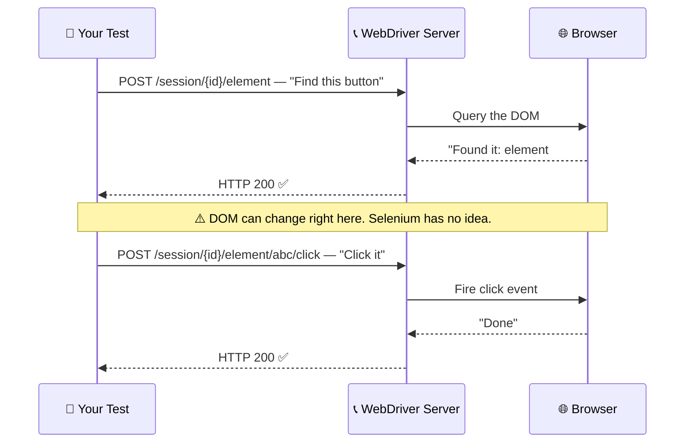

Here's the thing about Selenium — every single action is a separate HTTP request. Find an element? HTTP call. Click it? Another HTTP call. Read its text? Yet another one. Between each request, the browser could have re‑rendered the page, removed the element, scrolled it off‑screen — Selenium has no visibility into those gaps.

I'm not here to trash Selenium. It's been around since 2004 for a reason. It works. It supports every browser, including IE11 (if you're still cursed with that). It has bindings for basically every language humans write code in. But the architecture — this one‑request‑at‑a‑time model — is the root cause of most Selenium flakiness. You can write perfect test logic and still get random failures because the DOM shifted between two HTTP calls.

**What Selenium can't do:**

- Can't intercept network requests (no built‑in HTTP mocking)
- Can't make API calls for test setup (bring your own HTTP library — RestAssured, HttpClient, etc. — completely separate dependency, separate config, separate logging)
- Can't automatically wait for an element to stop animating
- Can't pierce Shadow DOM without explicit traversal
- Can't listen for WebSocket events
- Can't simulate serverless cold starts or queue delays
- Can't verify dead‑letter queues, queue depth, Splunk logs, or Dynatrace traces — all require a separate HTTP client with separate auth, separate config, and separate logs

To be fair, **WebDriver BiDi**[^6] (available in Selenium 4+) is changing this. It adds a WebSocket alongside the old HTTP channel, so the browser can push events in real time. But if you're choosing a tool *today*, don't bet on a spec that's still being implemented — evaluate what exists now.

[^6]: BiDi = Bidirectional. A W3C standard that adds a real‑time event channel to the classic WebDriver protocol. Think of it as Selenium finally getting a walkie‑talkie after 20 years of phone calls. Spec: [https://w3c.github.io/webdriver-bidi/](https://w3c.github.io/webdriver-bidi/)

---

### 2.2 Cypress — Move Into the Browser, Problem Solved (Sort Of)

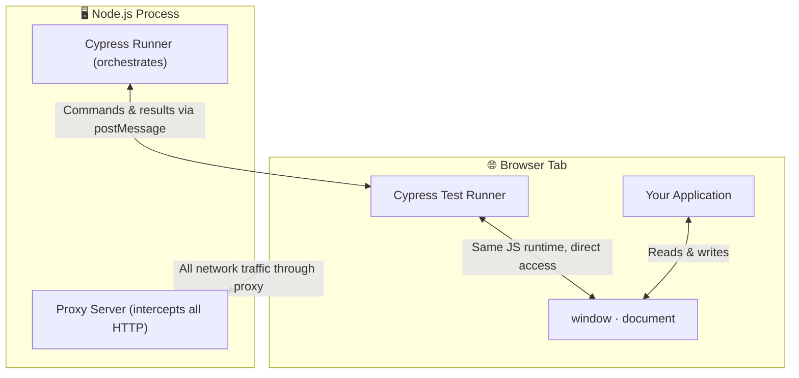

Cypress's big idea: instead of talking to the browser from the outside, move *inside* it. Your test code runs in the same JavaScript environment as your application, in the same browser tab. A Node.js proxy sits between the browser and the network, intercepting every HTTP request.

This architecture gives Cypress two superpowers that Selenium doesn't have:

1. **Direct DOM access** — Cypress can observe the page at the exact same millisecond as your application. No HTTP round‑trip. No delay.

2. **Retry‑ability**[^7] — Cypress doesn't just query the DOM once and give up. It keeps checking, roughly every 50ms, until the element appears (or the timeout expires). And it retries the *entire chain* — from the initial `cy.get()` through every chained assertion.

[^7]: Retry‑ability is the behavior where a Cypress command automatically re‑queries the DOM on failure, retrying until the expected condition is met. Cypress docs: [https://docs.cypress.io/guides/core-concepts/retry-ability](https://docs.cypress.io/guides/core-concepts/retry-ability)

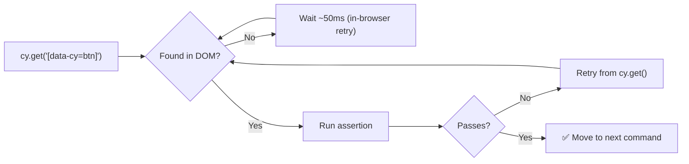

This is why Cypress tests feel stable out of the box. You write `cy.get('[data-cy="submit"]').click()` and it just works — Cypress retries until that button exists, is visible, and is clickable. No explicit waits needed.

**The trade‑offs you need to know about:**

- Runs only on Chromium‑family browsers (Chrome, Edge, Electron). There's experimental Firefox and WebKit support[^8], but if cross‑browser is a hard requirement today, Cypress isn't your answer.
- Can't drive multiple tabs or browser windows.
- Can't do everything a native Node.js script can do (file system access is limited).
- The command queue model — as magical as it is — means standard async/await patterns don't work the same way. Coming from Playwright or even vanilla JS, this trips people up.
- No WebSocket interception. You can intercept HTTP (REST and GraphQL), but not raw WebSocket frames.

[^8]: Cypress's `experimentalWebKitSupport` and `experimentalFirefoxSupport` flags. Not production‑ready. Docs: [https://docs.cypress.io/guides/references/experiments](https://docs.cypress.io/guides/references/experiments)

---

### 2.3 Playwright — The "Just Wait Until It's Ready" Approach

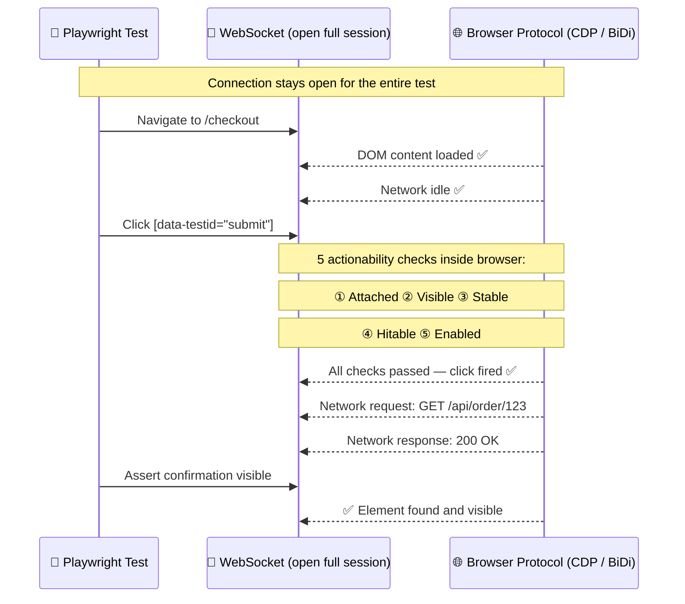

Playwright opens a WebSocket[^9] to the browser's internal debugging protocol and keeps it open for the entire test session. This is the structural difference that changes everything: instead of asking the browser "are we there yet?" every 500ms (Selenium), Playwright *subscribes* to events. The browser pushes updates through the WebSocket. Network response came back? Push. DOM node added? Push. Animation finished? Push. WebSocket message from your app's backend? Push.

[^9]: A WebSocket is a two‑way communication pipe that stays open. Unlike HTTP (open‑request‑close), both sides can send messages simultaneously without the overhead of reconnecting. Think phone call vs. sending individual letters.

**The five checks Playwright runs before every click[^10]:**

| Check | What Playwright's Actually Doing | The Real Problem It Catches |
|-------|----------------------------------|----------------------------|
| **Attached** | Is the DOM node in the live document tree? Not in some removed subtree? | SPAs that destroy and recreate components on re‑render |
| **Visible** | Reads computed CSS: `display` isn't `none`, `visibility` isn't `hidden`, `opacity` isn't `0`, bounding box isn't zero | Elements hidden by CSS that still exist in the DOM |
| **Stable** | Samples the element's bounding box coordinates across retry cycles, waits if the position is still changing | CSS animations — button sliding into place when you try to click it |
| **Hitable** | Calls `document.elementFromPoint(x, y)` at the click coordinate, fails if some other element is on top | Invisible loading spinners, cookie banners, modal backdrops intercepting your click |
| **Enabled** | Checks the `disabled` attribute and `pointer-events: none` CSS | Disabled form buttons that look active to a human |

[^10]: Playwright calls these **actionability checks**. They're documented at: [https://playwright.dev/docs/actionability](https://playwright.dev/docs/actionability)

Here's the thing that took me a while to internalize: Playwright runs all five checks in a retry loop *inside the browser*. Only when all five pass simultaneously does it fire the click. You don't write any of this — it just happens.

**Which protocol for which browser?** (This confused me at first too.)

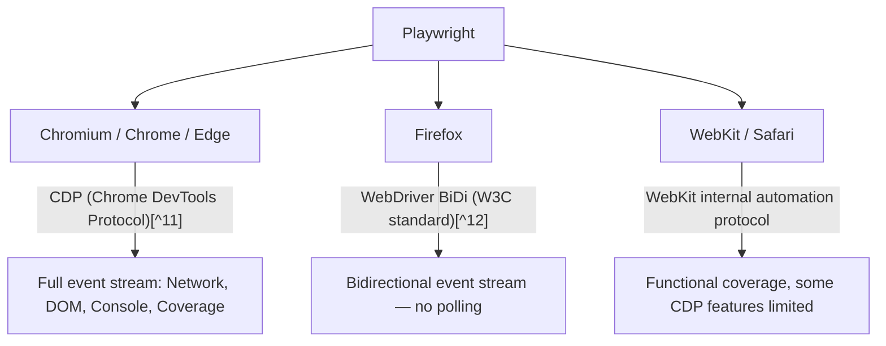

[^11]: CDP (Chrome DevTools Protocol) is a low‑level API that lets tools like Playwright and Chrome DevTools inspect, debug, and control Chromium‑based browsers. Spec: [https://chromedevtools.github.io/devtools-protocol/](https://chromedevtools.github.io/devtools-protocol/)

[^12]: The same BiDi standard that Selenium 4 is implementing. Playwright got there first. Spec: [https://w3c.github.io/webdriver-bidi/](https://w3c.github.io/webdriver-bidi/)

**Playwright's advantages that matter in real projects:**

- True cross‑browser: one API for Chromium, Firefox, and WebKit. Not experimental — production‑ready.
- API testing is built‑in. `request.newContext()` gives you a standalone HTTP client. No RestAssured, no Axios import.
- Network‑level synchronization: wait for the API response, not the UI side‑effect.
- WebSocket listening: intercept and stub WebSocket frames.
- Parallel contexts share one browser process. No login tax. No process overhead.
- Shadow DOM[^13] piercing is automatic with every locator.
- Can stub entire serverless backends, message queues, and event buses via `page.route`.

[^13]: Shadow DOM is a browser feature that Web Components use to encapsulate their internal HTML, CSS, and JS. It creates a boundary that normal `document.querySelector()` cannot cross.

**Playwright's downsides (keeping it honest):**

- Heavier setup than Cypress. `npm init playwright@latest` is fine, but configuring CI, browsers, and auth still takes work.
- Not a drop‑in replacement for Selenium. Tests need rewriting.
- Some niche browser features (IE mode, for legacy enterprise apps) aren't supported.

---

## Level 3 — The Stuff That Actually Breaks Your Tests in Production

### 3.1 The Data Grid Problem (Why `cy.wait(3000)` Is a Lie)

Let me describe a scenario I've seen on three different teams now.

You've got a data grid. It shows a loading spinner while it fetches rows from `/api/orders`. Your test:

1. Clicks a filter dropdown
2. Waits for the spinner to disappear
3. Tries to read the first row of results

And it flakes. Sometimes it passes. Sometimes step 3 fails because it clicked on stale DOM or the rows haven't rendered yet even though the spinner is gone.

Here's why: the spinner hides when the component's local state updates. But that state update can happen *before* the DOM rows are painted, *during* a React re‑render, or even *while a second cascading API call* is still in flight. The spinner disappearing and the rows being fully painted are **two different events.** Waiting on the spinner gives you a false sense of readiness.

So what do testers do? They add `cy.wait(3000)` or `browser.sleep(5000)`. And sometimes it works! Until it doesn't — because three seconds is sometimes too short (slow CI, throttled API) and always too long (fast local runs). This is the most common anti‑pattern in browser automation and I see it everywhere.

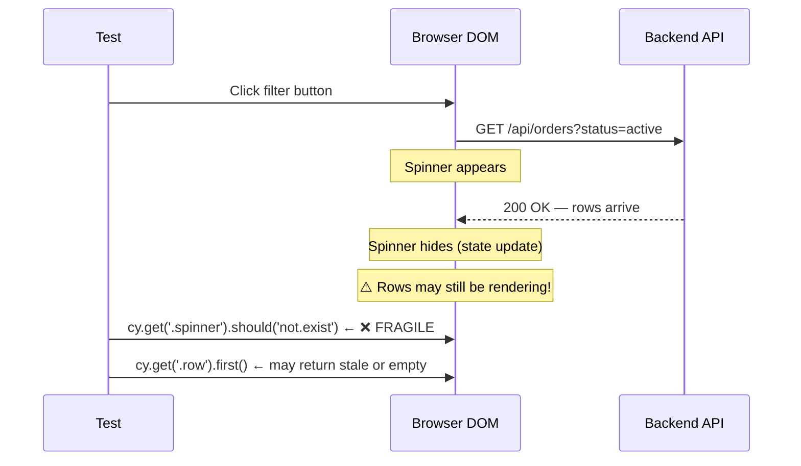

**The fix: wait for the network response — not the spinner.** The network response is the *cause*. The spinner disappearing is a *side effect.* Wait for the cause and you eliminate the race.

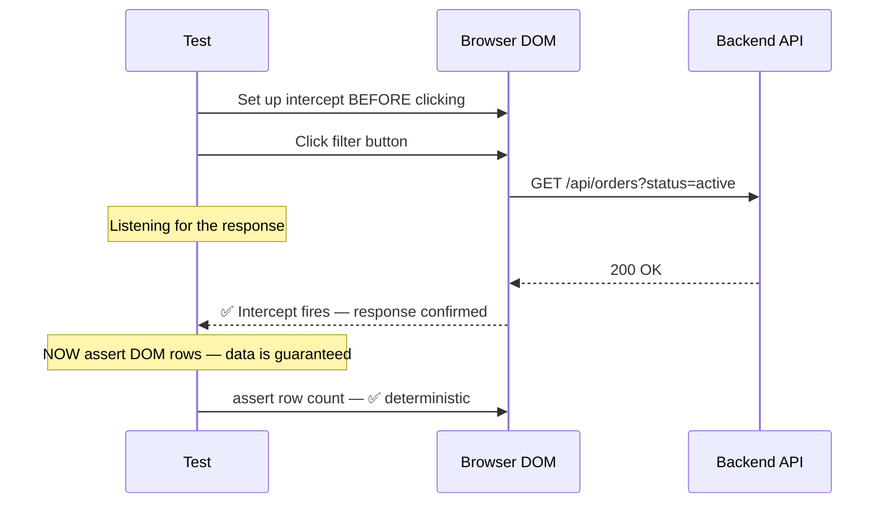

**Cypress (TypeScript) — with `cy.intercept()` and `cy.wait('@alias')`:**

```typescript
// TypeScript — Cypress: deterministic network wait
describe('Orders data grid', () => {
  it('loads filtered rows — no flake', () => {
    // Register intercept BEFORE the action that triggers it
    cy.intercept('GET', '/api/orders*').as('fetchOrders');

    cy.visit('/orders');

    // Trigger the filter
    cy.get('[data-cy="status-filter"]').select('active');

    // Wait for the API response itself — deterministic
    cy.wait('@fetchOrders', { timeout: 10_000 })
      .its('response.statusCode')
      .should('eq', 200);

    // NOW the data is guaranteed to be in the browser
    cy.get('[data-cy="order-row"]').should('have.length.greaterThan', 0);
    cy.get('[data-cy="order-row"]').first().should('contain.text', 'Active');
  });

  // ❌ What I see in code reviews all the time — DON'T do this
  it('DO NOT DO THIS — spinner wait is a race', () => {
    cy.visit('/orders');
    cy.get('[data-cy="status-filter"]').select('active');
    cy.get('.loading-spinner').should('not.exist');  // gone ≠ data ready
    cy.wait(3000);  // arbitrary — 3s too short in CI, too long locally
    cy.get('[data-cy="order-row"]').first().click(); // might click stale DOM
  });
});
```

**Playwright (TypeScript) — with `page.waitForResponse()`:**

```typescript
// TypeScript — Playwright: network‑first synchronization
import { test, expect } from '@playwright/test';

test('filter rows — wait for the cause, not the effect', async ({ page }) => {
  await page.goto('https://example.com/orders');

  // Promise.all ensures the listener is registered BEFORE the click fires
  const [response] = await Promise.all([
    page.waitForResponse(
      (resp) => resp.url().includes('/api/orders') && resp.status() === 200
    ),
    page.getByRole('combobox', { name: /status filter/i }).selectOption('active'),
  ]);

  const body = await response.json();
  expect(body.items.length).toBeGreaterThan(0);

  // Data is guaranteed. Now assert the DOM.
  await expect(page.locator('[data-cy="order-row"]')).not.toHaveCount(0);
});

// ❌ Same anti‑pattern
test('DON\'T DO THIS — spinner + sleep = flake', async ({ page }) => {
  await page.goto('https://example.com/orders');
  await page.getByRole('combobox').selectOption('active');
  await expect(page.locator('.loading-spinner')).not.toBeVisible();
  await page.waitForTimeout(3000);  // arbitrary sleep — unreliable
  await page.locator('[data-cy="order-row"]').first().click();
});
```

**Selenium — no intercept capability. You're stuck polling the DOM:**

```typescript
// TypeScript — Selenium: polling the DOM is your only option
import { Builder, By, until, WebDriver } from 'selenium-webdriver';

const driver: WebDriver = await new Builder().forBrowser('chrome').build();
await driver.get('https://example.com/orders');
await driver.findElement(By.css("[data-cy='status-filter']")).sendKeys('active');

// Poll until row count > 0 — no guarantee the right API completed
await driver.wait(
  until.elementLocated(By.css("[data-cy='order-row']")),
  10_000
);
await driver.quit();
```

```java
// Java — Selenium: same polling approach
WebDriver driver = new ChromeDriver();
driver.get("https://example.com/orders");
driver.findElement(By.cssSelector("[data-cy='status-filter']")).sendKeys("active");

new WebDriverWait(driver, Duration.ofSeconds(10))
    .until(ExpectedConditions.numberOfElementsToBeMoreThan(
        By.cssSelector("[data-cy='order-row']"), 0));
driver.quit();
```

```csharp
// C# — Selenium: same polling approach
using OpenQA.Selenium;
using OpenQA.Selenium.Chrome;
using OpenQA.Selenium.Support.UI;

var driver = new ChromeDriver();
driver.Navigate().GoToUrl("https://example.com/orders");
driver.FindElement(By.CssSelector("[data-cy='status-filter']")).SendKeys("active");

var wait = new WebDriverWait(driver, TimeSpan.FromSeconds(10));
wait.Until(d => d.FindElements(By.CssSelector("[data-cy='order-row']")).Count > 0);
driver.Quit();
```

**The waiting hierarchy I teach to new testers:**

```
🔴 Worst — arbitrary sleep: cy.wait(5000), page.waitForTimeout(3000)
    → Never use this. It'll fail in CI and waste time locally.

🟠 Fragile — DOM side‑effect wait: wait for spinner to hide, wait for row count > 0
    → Races against the render pipeline. Selenium's only option.

🟡 Better — element state wait: waitFor({ state: 'visible' }), .should('be.visible')
    → Good for purely client‑side transitions (modal opens, accordion expands).

🟢 Strongest — network cause wait: cy.wait('@alias'), page.waitForResponse()
    → Waits for the data, not its side effects. Deterministic.
```

---

### 3.2 Shadow DOM — When Your Selectors Return `null` and You Don't Know Why

I've watched junior testers spend an hour debugging a test that kept failing on a `<payment-form>` component. They'd try `cy.get('[data-cy="card-number"]')` — nothing. Add `cy.wait(2000)` — still nothing. Add `cy.wait(10000)` — of course still nothing. The element wasn't slow to appear — it was behind a shadow boundary that `document.querySelector()` can't cross.

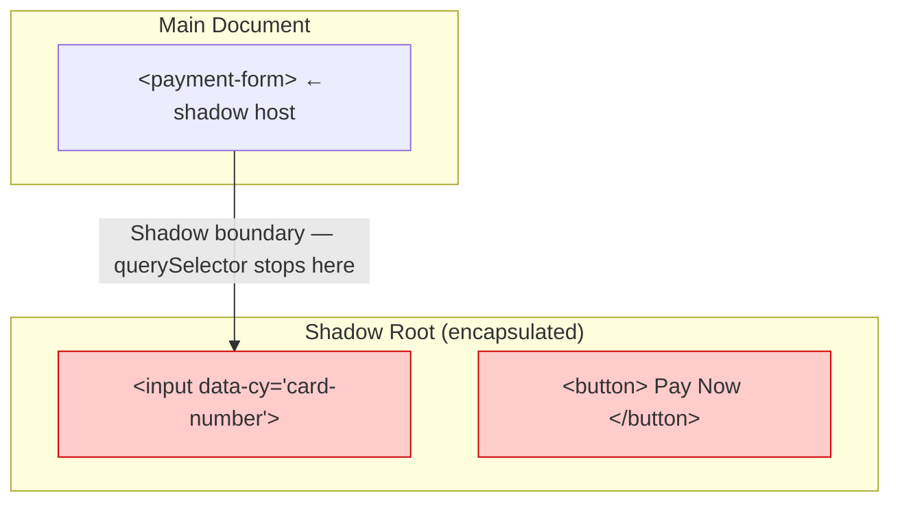

Web Components[^14] (and design systems built on them — Material, Spectrum, Lion) render their internals inside a **shadow root**. This is by design — it encapsulates styles, prevents CSS leaks, keeps the component's internals from being accidentally styled or queried from the outside. But it also means normal DOM selectors can't see inside.

[^14]: A Web Component is a reusable, encapsulated custom HTML element (`<payment-form>`, `<data-table>`, etc.) that bundles its own HTML, CSS, and JavaScript. They're the building blocks of modern design systems and micro‑frontends. MDN reference: [https://developer.mozilla.org/en-US/docs/Web/API/Web_components](https://developer.mozilla.org/en-US/docs/Web/API/Web_components)

**Cypress (TypeScript) — explicit shadow DOM traversal (or a config flag):**

```typescript
// TypeScript — Cypress: shadow DOM handling

// ❌ Standard cy.get() can't pierce the shadow boundary
cy.get('[data-cy="card-number"]').type('4111111111111111');  // never finds it

// ❌ The tester's reflex — add a wait. Doesn't help. Element isn't slow, it's invisible.
cy.wait(10000);
cy.get('[data-cy="card-number"]').type('4111111111111111');  // still fails

// ✅ Option A — use .shadow() command to traverse each level
cy.get('payment-form').shadow().find('[data-cy="card-number"]').type('4111...');

// ✅ Option B — enable globally in cy config (Cypress 5.2+)
// In cypress.config.ts: { includeShadowDom: true }
cy.get('[data-cy="card-number"]').type('4111111111111111');  // now works
```

**Playwright (TypeScript) — auto‑piercing, no config needed:**

```typescript
// TypeScript — Playwright: shadow DOM auto‑piercing
import { test, expect } from '@playwright/test';

test('shadow DOM — it just works', async ({ page }) => {
  await page.goto('/checkout');

  // ✅ Playwright's locator engine pierces shadow roots automatically
  await page.locator('[data-testid="card-number"]').fill('4111111111111111');

  // Semantic locators also auto‑pierce (and they're better anyway)
  await page.getByLabel(/card number/i).fill('4111111111111111');

  // When you have multiple shadow components with similar elements
  await page.locator('payment-form')
    .getByRole('button', { name: /pay now/i })
    .click();

  await expect(page.getByText(/payment confirmed/i)).toBeVisible();
});
```

**Selenium — manual traversal for every shadow root:**

```typescript
// TypeScript — Selenium: explicit shadow root traversal
import { Builder, By, WebDriver, WebElement } from 'selenium-webdriver';

const driver: WebDriver = await new Builder().forBrowser('chrome').build();
await driver.get('https://example.com/checkout');

// Each shadow root must be traversed explicitly
const host: WebElement = await driver.findElement(By.css('payment-form'));
const shadowRoot = await driver.executeScript(
  'return arguments[0].shadowRoot', host
) as WebElement;

await (shadowRoot as any).findElement(By.css("[data-cy='card-number']")).sendKeys('4111...');
await driver.quit();
```

```java
// Java — Selenium: explicit shadow root traversal
WebDriver driver = new ChromeDriver();
driver.get("https://example.com/checkout");

WebElement host = driver.findElement(By.cssSelector("payment-form"));
SearchContext shadowRoot = host.getShadowRoot();  // Selenium 4+
shadowRoot.findElement(By.cssSelector("[data-cy='card-number']")).sendKeys("4111...");
driver.quit();
```

```csharp
// C# — Selenium: explicit shadow root traversal
using OpenQA.Selenium;
using OpenQA.Selenium.Chrome;

var driver = new ChromeDriver();
driver.Navigate().GoToUrl("https://example.com/checkout");

var host = driver.FindElement(By.CssSelector("payment-form"));
var shadowRoot = (IWebElement)((IJavaScriptExecutor)driver)
    .ExecuteScript("return arguments[0].shadowRoot", host);

shadowRoot.FindElement(By.CssSelector("[data-cy='card-number']")).SendKeys("4111...");
driver.Quit();
```

---

### 3.3 Feature‑Flagged `data-testid` — Keep Test Hooks Out of Production

Here's a security concern that most teams don't think about until someone brings it up in a review: `data-testid` attributes expose internal selector logic. In production, they add payload size, clutter the DOM inspector for anyone debugging, and — if your test IDs reveal component names or structure — give attackers hints about your tech stack.

Both Cypress and Playwright support stripping test attributes at build time. Selenium doesn't have a built‑in mechanism.

**Strategy: Strip test attributes in production builds**

```typescript
// ── Using a Babel plugin (works for React, any Babel‑based project) ──
// babel.config.js
const isProduction: boolean = process.env.NODE_ENV === 'production';

module.exports = {
  plugins: [
    isProduction && ['babel-plugin-react-remove-properties', {
      properties: ['data-testid', 'data-cy']
    }],
  ].filter(Boolean),
};
```

```typescript
// ── Conditional attribute pattern (works in any framework) ──
const testId = (id: string): Record<string, string> =>
  process.env.NODE_ENV !== 'production' ? { 'data-testid': id } : {};

// In your JSX:
<button {...testId('submit-order')} onClick={handleSubmit}>
  Place Order
</button>

// Production output:  <button>Place Order</button>
// Dev/test output:    <button data-testid="submit-order">Place Order</button>
```

**Cypress (TypeScript) — configure `data-cy` as the default:**

```typescript
// cypress.config.ts
import { defineConfig } from 'cypress';

export default defineConfig({
  e2e: {
    includeShadowDom: true,  // always‑on shadow DOM support
    env: {
      testAttribute: 'data-cy',  // your stripped attr
    },
  },
});
```

**Playwright (TypeScript) — `testIdAttribute` config:**

```typescript
// playwright.config.ts
import { defineConfig } from '@playwright/test';

export default defineConfig({
  use: {
    testIdAttribute: 'data-testid',  // or change to 'data-cy'
  },
});

// Then use getByTestId() which reads your configured attribute:
await page.getByTestId('submit-order').click();
```

**Selenium — no built‑in equivalent.** If you strip `data-testid` in production, your Selenium tests break. You either maintain separate locators per environment (fragile) or keep test attributes in production (not ideal).

---

### 3.4 API Testing — Selenium's Missing Half

This is the thing that finally pushed me to recommend migration on my last project. Selenium automates the browser. That's it. It has **no built‑in HTTP client, no intercept engine, no request stubbing.** For API‑driven testing — seeding test data, verifying backend state, stubbing a slow endpoint — you need a completely separate library.

Having your test setup in one library (RestAssured, requests, HttpClient) and your UI assertions in another (Selenium) means:

- Two dependency trees to manage
- Two sets of configuration (auth tokens, base URLs, timeouts)
- Two logging formats that don't correlate
- Debugging a failure means checking two different tool outputs

**Cypress (TypeScript) — `cy.request()` and `cy.intercept()` are built‑in:**

```typescript
// TypeScript — Cypress: API + UI in one tool
interface OrderResponse {
  id: string;
  status: string;
}

interface SeedResponse {
  orderId: string;
  scenario: string;
}

describe('API + UI combined — single tool', () => {
  beforeEach(() => {
    cy.request<SeedResponse>('POST', '/api/seed', { scenario: 'checkout-flow' })
      .then((res) => {
        expect(res.status).to.eq(200);
        Cypress.env('orderId', res.body.orderId);
      });
  });

  it('creates via API, verifies via UI — single log, single config', () => {
    const orderId: string = Cypress.env('orderId');
    cy.visit(`/orders/${orderId}`);
    cy.get('[data-cy="order-status"]').should('contain.text', 'Pending');
  });
});
```

**Playwright (TypeScript) — `request.newContext()` is a standalone API client:**

```typescript
// TypeScript — Playwright: built‑in API client
import { test, expect, request, APIRequestContext, APIResponse } from '@playwright/test';

let sharedAuthToken: string;

test.beforeAll(async () => {
  const apiContext: APIRequestContext = await request.newContext({
    baseURL: 'https://api.example.com',
  });
  const loginResp: APIResponse = await apiContext.post('/auth', {
    data: { email: 'test@example.com', password: 'test123' }
  });
  expect(loginResp.status()).toBe(200);
  sharedAuthToken = (await loginResp.json()).token;
});

test('verify order in UI after API creation', async ({ page }) => {
  const apiContext: APIRequestContext = await request.newContext({
    baseURL: 'https://api.example.com',
    extraHTTPHeaders: { Authorization: `Bearer ${sharedAuthToken}` },
  });
  const createResp: APIResponse = await apiContext.post('/orders', {
    data: { product: 'Widget', quantity: 1 }
  });
  const { id } = await createResp.json();

  await page.goto(`/orders/${id}`);
  await expect(page.getByText(/order placed/i)).toBeVisible();
});
```

**Selenium — bring your own HTTP library in three languages:**

```typescript
// TypeScript — Selenium + external HTTP library (axios)
import axios, { AxiosResponse } from 'axios';
import { Builder, By, until, WebDriver } from 'selenium-webdriver';

interface Order { id: string; status: string; }

// Step 1: API call — separate library, separate config
const apiResp: AxiosResponse<Order> = await axios.post(
  'https://api.example.com/orders',
  { product: 'Widget', quantity: 1 },
  { headers: { Authorization: `Bearer ${token}` } }
);
const orderId: string = apiResp.data.id;

// Step 2: UI verification — separate driver, separate wait config
const driver: WebDriver = await new Builder().forBrowser('chrome').build();
await driver.get(`https://app.example.com/orders/${orderId}`);
await driver.wait(
  until.elementLocated(By.css('.order-confirmed')),
  10_000
);
await driver.quit();
```

```java
// Java — Selenium + RestAssured (separate HTTP library)
import io.restassured.RestAssured;
import io.restassured.response.Response;

// Step 1: API call using RestAssured
Response apiResp = RestAssured.given()
    .auth().oauth2(token)
    .contentType("application/json")
    .body("{\"product\": \"Widget\", \"quantity\": 1}")
    .post("https://api.example.com/orders");

String orderId = apiResp.jsonPath().getString("id");

// Step 2: UI verification using Selenium
WebDriver driver = new ChromeDriver();
driver.get("https://app.example.com/orders/" + orderId);
new WebDriverWait(driver, Duration.ofSeconds(10))
    .until(ExpectedConditions.visibilityOfElementLocated(
        By.cssSelector(".order-confirmed")));
driver.quit();
```

```csharp
// C# — Selenium + HttpClient (separate HTTP library)
using System.Net.Http;
using System.Text;
using System.Text.Json;
using OpenQA.Selenium;
using OpenQA.Selenium.Chrome;
using OpenQA.Selenium.Support.UI;

// Step 1: API call using HttpClient
var httpClient = new HttpClient();
var payload = new { product = "Widget", quantity = 1 };
var content = new StringContent(
    JsonSerializer.Serialize(payload), Encoding.UTF8, "application/json");
var apiResp = await httpClient.PostAsync("https://api.example.com/orders", content);
var order = JsonSerializer.Deserialize<Order>(await apiResp.Content.ReadAsStringAsync());

// Step 2: UI verification using Selenium
var driver = new ChromeDriver();
driver.Navigate().GoToUrl($"https://app.example.com/orders/{order!.Id}");
var wait = new WebDriverWait(driver, TimeSpan.FromSeconds(10));
wait.Until(ExpectedConditions.ElementIsVisible(By.CssSelector(".order-confirmed")));
driver.Quit();
```

---

### 3.5 REST and GraphQL Intercepts — Real Examples Across All Three Languages

Most teams need to wait for or stub REST endpoints. But if your project uses GraphQL, the patterns are different, and I don't see enough examples of how to handle it.

**Cypress (TypeScript) — REST intercept with method‑specific matching:**

```typescript
// TypeScript — Cypress: REST intercept
interface OrderPayload {
  product: string;
  quantity: number;
}

describe('REST intercepts', () => {
  it('waits for a specific REST endpoint', () => {
    cy.intercept('GET', '/api/orders*').as('getOrders');
    cy.intercept('POST', '/api/orders').as('createOrder');
    cy.intercept('PUT', '/api/orders/*').as('updateOrder');

    cy.get('[data-cy="create-btn"]').click();

    cy.wait('@createOrder').then((interception) => {
      const body = interception.request.body as OrderPayload;
      expect(body).to.deep.equal({ product: 'Widget', quantity: 5 });
    });

    // Stub a slow endpoint
    cy.intercept('GET', '/api/orders*', {
      statusCode: 200,
      body: { items: [], total: 0 }
    }).as('getOrders');
  });
});
```

**⚠️ Critical: GraphQL doesn't use HTTP status codes the way REST does.** A failed GraphQL operation — invalid query, resolver error, missing field — still returns HTTP 200. The error is in the response body under `errors`, not in the status code. If your intercept matches on `r.status() === 200`, it'll match *everything* — successes and failures alike. You must inspect `response.json()` and check that `data` is present and `errors` is undefined.

**Cypress (TypeScript) — GraphQL intercept by operationName:**

```typescript
// TypeScript — Cypress: GraphQL intercept
describe('GraphQL intercepts', () => {
  it('waits for a specific GraphQL operation', () => {
    cy.intercept('POST', '/graphql', (req) => {
      const body = req.body as { operationName: string; variables: Record<string, unknown> };

      if (body.operationName === 'GetOrders') {
        req.alias = 'gqlGetOrders';
      }
      if (body.operationName === 'CreateOrder') {
        req.alias = 'gqlCreateOrder';
      }

      // Stub a specific operation
      if (body.operationName === 'GetOrders') {
        req.reply({
          statusCode: 200,
          body: { data: { orders: [{ id: 1, status: 'active' }] } }
        });
      }
    });

    cy.get('[data-cy="refresh-btn"]').click();

    // Wait for the response, then verify the BODY — not just the status code
    cy.wait('@gqlGetOrders').then((interception) => {
      // GraphQL always returns 200. Errors are in the response body.
      const respBody = interception.response.body as {
        data?: Record<string, unknown>;
        errors?: Array<{ message: string }>;
      };
      expect(respBody.errors).to.be.undefined;
      expect(respBody.data).to.have.property('orders');
    });
  });
});
```

**Playwright (TypeScript) — REST intercept:**

```typescript
// TypeScript — Playwright: REST intercept
import { test, expect, Route } from '@playwright/test';

test('REST intercept — wait and stub', async ({ page }) => {
  // Wait for a specific POST response
  const [orderResp] = await Promise.all([
    page.waitForResponse(
      r => r.url().includes('/api/orders')
        && r.request().method() === 'POST'
        && r.status() === 201
    ),
    page.getByRole('button', { name: /create order/i }).click(),
  ]);

  // Stub a GET endpoint to simulate an empty grid
  await page.route('/api/orders*', async (route: Route) => {
    if (route.request().method() === 'GET') {
      await route.fulfill({
        status: 200,
        contentType: 'application/json',
        body: JSON.stringify({ items: [], total: 0 }),
      });
    } else {
      await route.continue();
    }
  });
});
```

**Playwright (TypeScript) — GraphQL intercept:**

```typescript
// TypeScript — Playwright: GraphQL intercept
import { test, expect } from '@playwright/test';

test('wait for a specific GraphQL operation (correct — checks body, not status)', async ({ page }) => {
  const gqlResponsePromise = page.waitForResponse(async (response) => {
    if (!response.url().includes('/graphql')) return false;
    try {
      const reqBody = response.request().postDataJSON() as {
        operationName: string;
        variables: Record<string, unknown>;
      };
      if (reqBody.operationName !== 'GetOrders') return false;
      // CRITICAL: GraphQL always returns 200. You must check the response BODY.
      const respBody = await response.json();
      return respBody.data && !respBody.errors;
    } catch {
      return false;
    }
  });

  await page.click('[data-cy="refresh-btn"]');
  const gqlResponse = await gqlResponsePromise;
  const body = await gqlResponse.json();
  expect(body.errors).toBeUndefined();
  expect(body.data.orders.length).toBeGreaterThan(0);
});

test('stub a GraphQL response', async ({ page }) => {
  await page.route('/graphql', async (route) => {
    const body = route.request().postDataJSON() as {
      operationName: string;
    } | null;

    if (body?.operationName === 'GetOrders') {
      await route.fulfill({
        status: 200,
        contentType: 'application/json',
        body: JSON.stringify({
          data: { orders: [] }  // simulate empty state
        }),
      });
    } else {
      await route.continue();
    }
  });

  await page.goto('/orders');
  await expect(page.getByText(/no orders found/i)).toBeVisible();
});
```

**Selenium — no intercept capability. Three languages, same problem:**

```typescript
// TypeScript — Selenium: no GraphQL intercept. Poll the DOM.
const driver = await new Builder().forBrowser('chrome').build();
await driver.get('https://example.com/orders');
await driver.findElement(By.css("[data-cy='refresh-btn']")).click();

await driver.wait(
  until.elementLocated(By.css("[data-cy='order-row']")),
  15_000
);
await driver.quit();
```

```java
// Java — Selenium: same limitation
driver.get("https://example.com/orders");
driver.findElement(By.cssSelector("[data-cy='refresh-btn']")).click();

new WebDriverWait(driver, Duration.ofSeconds(15))
    .until(ExpectedConditions.numberOfElementsToBeMoreThan(
        By.cssSelector("[data-cy='order-row']"), 0));
driver.quit();
```

```csharp
// C# — Selenium: same limitation
driver.Navigate().GoToUrl("https://example.com/orders");
driver.FindElement(By.CssSelector("[data-cy='refresh-btn']")).Click();

var wait = new WebDriverWait(driver, TimeSpan.FromSeconds(15));
wait.Until(d => d.FindElements(By.CssSelector("[data-cy='order-row']")).Count > 0);
driver.Quit();
```

---

### 3.6 Beyond the Browser — Where Integration Tests Actually Pass or Fail

Here's something I learned the hard way after migrating a 200‑test suite: **the browser shows you the symptom, not the cause.** A test clicks "Place Order," the UI shows "Confirmed," the test passes. But what actually happened under the hood?

- The message is sitting in the **dead‑letter queue** because the payment processor crashed mid‑invocation
- **Splunk** shows a downstream timeout on the inventory service — the order went through but stock wasn't deducted
- **Dynatrace** traces reveal the "Confirmed" response took 14 seconds — the user saw a spinner for ages, but your test's 30‑second timeout papered over it
- The **Azure Service Bus subscription** dropped three retry attempts before giving up — the UI never knew

If your integration test only asserts on DOM state, you're testing maybe 20% of the system. The real pass/fail signals live in the observability layer.

#### The Observability Stack Your Tests Should Tap Into

| Signal Source | What It Tells You | How to Verify From a Test |
|---------------|-------------------|---------------------------|
| **Dead‑Letter Queue (DLQ)** | Messages that failed all retries — the order was never processed | Query the DLQ via the cloud provider SDK after the test completes |
| **Azure Service Bus / SQS queue depth** | Backlogged messages means the worker can't keep up | Check `ActiveMessageCount` via the management API |
| **Splunk / ELK logs** | Structured logs showing errors, timeouts, retry counts | Run a Splunk search via REST API for `correlationId` in the test window |
| **Dynatrace / Datadog APM** | Full distributed traces showing latency per service hop | Query the trace API for the test's `correlationId`, assert all spans returned 2xx |
| **Application Insights** | Exception rates, dependency failures, request duration percentiles | Assert that the test window contains zero `dependencyFailed` events |

**Concrete example — a test that verifies the queue, not just the UI:**

```typescript
// TypeScript — Playwright: integration test with queue + log verification
import { test, expect } from '@playwright/test';
import { ServiceBusClient } from '@azure/service-bus';
import axios from 'axios';

const CORRELATION_ID = `test-${Date.now()}`;

test('order flow — UI + queue + logs all verified', async ({ page }) => {
  // Step 1: Push a correlation ID into the UI so the backend tags everything
  await page.goto(`/checkout?correlationId=${CORRELATION_ID}`);
  await page.getByTestId('place-order').click();
  await expect(page.getByTestId('order-confirmed')).toBeVisible();

  // Step 2: Check the dead‑letter queue — did the message actually process?
  const sbClient = new ServiceBusClient(process.env.SB_CONNECTION!);
  const dlqReceiver = sbClient.createReceiver('orders-queue', {
    subQueueType: 'deadLetter'
  });
  const dlqMessages = await dlqReceiver.peekMessages(10);
  const deadMessage = dlqMessages.find(
    m => m.correlationId === CORRELATION_ID
  );

  // The order should NOT be in the DLQ — that means everything worked
  expect(deadMessage).toBeUndefined();
  await dlqReceiver.close();

  // Step 3: Verify in Splunk that no downstream errors were logged
  const splunkResp = await axios.post(
    'https://splunk.example.com:8089/services/search/v2/jobs',
    {
      search: `search index=orders correlationId=${CORRELATION_ID} level=ERROR`,
      earliest_time: '-5m',
      latest_time: 'now'
    },
    { headers: { Authorization: `Bearer ${process.env.SPLUNK_TOKEN}` } }
  );
  expect(splunkResp.data.results.length).toBe(0);

  // Step 4: Verify queue depth is healthy (not backing up)
  const receiver = sbClient.createReceiver('orders-queue');
  const queueProps = await receiver.getMessageProperties();
  // No built‑in depth check in all SDKs — use Azure Mgmt API as fallback
  // For this example: assert fewer than 100 pending messages
  expect(queueProps).toBeDefined();
  await receiver.close();
  await sbClient.close();
});
```

**Cypress (TypeScript) — similar pattern, different HTTP client:**

```typescript
// TypeScript — Cypress: verify dead‑letter queue after UI test
describe('Order flow — full integration verification', () => {
  const correlationId = `test-${Date.now()}`;

  it('UI confirms, queue processed, logs clean', () => {
    cy.visit(`/checkout?correlationId=${correlationId}`);
    cy.get('[data-cy="place-order"]').click();
    cy.get('[data-cy="order-confirmed"]').should('be.visible');

    // Verify DLQ via Azure REST API (same logic, different HTTP client)
    cy.request({
      method: 'GET',
      url: `https://management.azure.com/subscriptions/{sub}/resourceGroups/{rg}/providers/Microsoft.ServiceBus/namespaces/{ns}/queues/orders-queue/deadletter?api-version=2021-06-01-preview`,
      headers: { Authorization: `Bearer ${token}` }
    }).then((res) => {
      const dlqMessages = res.body.value as Array<{
        correlationId: string;
      }>;
      const dead = dlqMessages.find(m => m.correlationId === correlationId);
      expect(dead).to.be.undefined;
    });

    // Verify Splunk — no errors for this correlation
    cy.request({
      method: 'POST',
      url: 'https://splunk.example.com:8089/services/search/v2/jobs',
      body: {
        search: `search index=orders correlationId=${correlationId} level=ERROR`,
        earliest_time: '-5m'
      },
      headers: { Authorization: `Bearer ${process.env.SPLUNK_TOKEN}` }
    }).then((res) => {
      expect(res.body.results.length).to.eq(0);
    });
  });
});
```

**Selenium — you bring your own HTTP client here too (three languages):**

```typescript
// TypeScript — Selenium + external queue check
import axios from 'axios';
import { Builder, By, until } from 'selenium-webdriver';

const correlationId = `test-${Date.now()}`;
const driver = await new Builder().forBrowser('chrome').build();

await driver.get(`https://example.com/checkout?correlationId=${correlationId}`);
await driver.findElement(By.css("[data-cy='place-order']")).click();
await driver.wait(
  until.elementLocated(By.css("[data-cy='order-confirmed']")),
  10_000
);

// Verify DLQ — completely separate tool, separate auth, separate config
const dlqResp = await axios.get(
  'https://management.azure.com/subscriptions/{sub}/resourceGroups/{rg}/providers/Microsoft.ServiceBus/namespaces/{ns}/queues/orders-queue/deadletter',
  { headers: { Authorization: `Bearer ${azureToken}` } }
);
const dead = dlqResp.data.value.find(
  (m: { correlationId: string }) => m.correlationId === correlationId
);
// Dead letter check fails? Your Selenium test passed but the system didn't work.

await driver.quit();
```

```java
// Java — Selenium: same pattern, same problem — separate tools
import java.net.http.*;
import com.google.gson.*;

String correlationId = "test-" + System.currentTimeMillis();
WebDriver driver = new ChromeDriver();

driver.get("https://example.com/checkout?correlationId=" + correlationId);
driver.findElement(By.cssSelector("[data-cy='place-order']")).click();
new WebDriverWait(driver, Duration.ofSeconds(10))
    .until(ExpectedConditions.visibilityOfElementLocated(
        By.cssSelector("[data-cy='order-confirmed']")));

// Separate HTTP call to verify the queue — separate dependency, separate auth
HttpClient httpClient = HttpClient.newHttpClient();
HttpRequest dlqReq = HttpRequest.newBuilder()
    .uri(URI.create("https://management.azure.com/.../deadletter"))
    .header("Authorization", "Bearer " + azureToken)
    .build();
HttpResponse<String> dlqResp = httpClient.send(dlqReq, HttpResponse.BodyHandlers.ofString());

JsonArray dlqMessages = JsonParser.parseString(dlqResp.body())
    .getAsJsonObject().getAsJsonArray("value");
boolean foundInDlq = false;
for (JsonElement msg : dlqMessages) {
    if (msg.getAsJsonObject().get("correlationId").getAsString().equals(correlationId)) {
        foundInDlq = true;  // This is a failure — order landed in DLQ
    }
}

driver.quit();
```

```csharp
// C# — Selenium: same pattern
var correlationId = $"test-{DateTimeOffset.UtcNow.ToUnixTimeMilliseconds()}";
var driver = new ChromeDriver();

driver.Navigate().GoToUrl($"https://example.com/checkout?correlationId={correlationId}");
driver.FindElement(By.CssSelector("[data-cy='place-order']")).Click();
new WebDriverWait(driver, TimeSpan.FromSeconds(10))
    .Until(ExpectedConditions.ElementIsVisible(
        By.CssSelector("[data-cy='order-confirmed']")));

// Verify DLQ — separate HttpClient, separate auth
var httpClient = new HttpClient();
httpClient.DefaultRequestHeaders.Authorization =
    new AuthenticationHeaderValue("Bearer", azureToken);
var dlqResp = await httpClient.GetAsync(
    "https://management.azure.com/.../deadletter");
var dlqBody = await dlqResp.Content.ReadAsStringAsync();
var dlqMessages = JsonSerializer.Deserialize<JsonElement>(dlqBody)
    .GetProperty("value").EnumerateArray();

bool foundInDlq = dlqMessages.Any(m =>
    m.GetProperty("correlationId").GetString() == correlationId);
// foundInDlq == true → test should fail even though UI showed "Confirmed"

driver.Quit();
```

#### The Integration Test Pyramid (Revised)

Traditional test pyramids tell you to test at the UI level. For microservices, that's wrong:

```
┌──────────────────────────────────────────────────────┐
│  Level 4: Observability Layer (Dynatrace/Splunk/DLQ) │  ← Where failures live
├──────────────────────────────────────────────────────┤
│  Level 3: API / Queue / Event Bus Assertions          │  ← Verify data flow
├──────────────────────────────────────────────────────┤
│  Level 2: Network Intercept Waits (waitForResponse)   │  ← Deterministic sync
├──────────────────────────────────────────────────────┤
│  Level 1: DOM Assertions (spinner, row count, text)   │  ← Fragile, side‑effect‑only
└──────────────────────────────────────────────────────┘
```

**Key takeaway:** If your test only does Level 1, it's a coincidence when it catches a real bug. The browser UI is the *last* place a microservice failure becomes visible — and by then, the DLQ already has the dead message, the Splunk log already has the error, and Dynatrace already has the trace showing exactly which service call timed out.

**What Selenium can't do (but Playwright + SDKs can):**

| Capability | Selenium | Cypress | Playwright |
|-----------|:--------:|:-------:|:----------:|
| Wait for REST response | ❌ Poll DOM | ✅ `cy.wait('@alias')` | ✅ `waitForResponse` |
| Wait for GraphQL (body inspection) | ❌ | ✅ Via `cy.intercept` body | ✅ Via `response.json()` |
| Check DLQ after test | ❌ Separate tool | ⚠️ Via `cy.request` (separate call) | ✅ Built‑in `request.newContext` |
| Query Splunk / Dynatrace | ❌ Separate tool | ⚠️ Via `cy.request` | ✅ Built‑in `request.newContext` |
| Verify queue depth | ❌ Separate tool | ⚠️ Via `cy.request` | ✅ Built‑in `request.newContext` |
| Correlate test ↔ trace via correlationId | ❌ Manual | ⚠️ Manual string | ✅ Pass correlationId through headers |

---

## Level 4 — Decision Time: Which Tool, and Should You Migrate?

### 4.1 A Decision Tree That Actually Reflects Real Constraints

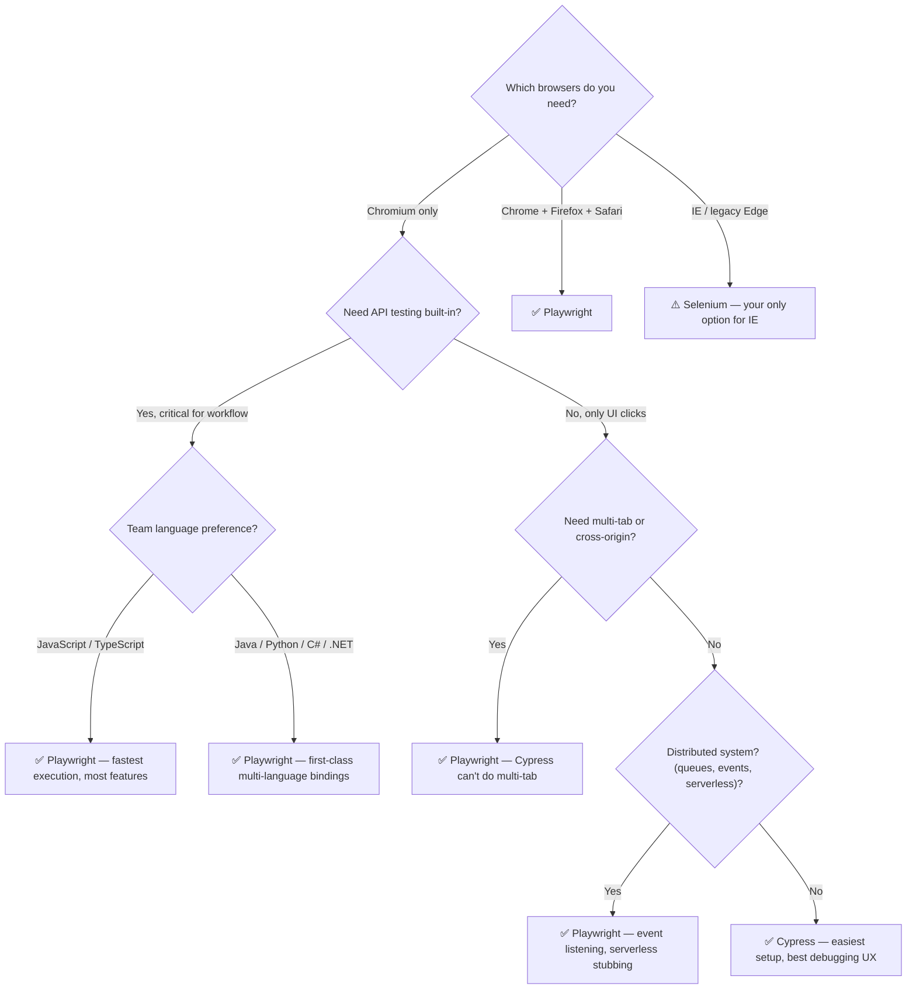

### 4.2 The Full Comparison — No Marketing Fluff

| Criterion | Selenium | Cypress | Playwright |
|-----------|:--------:|:-------:|:----------:|
| **Browsers** | Chrome, FF, Safari, Edge, IE | Chrome‑family only (FF/WebKit experimental) | Chrome, Firefox, Safari, Edge |
| **Languages** | Java, Python, C#, Ruby, JS, TS, Kotlin | JavaScript / TypeScript only | JS, TS, Python, Java, .NET |
| **API Testing Built‑In** | ❌ None | ✅ `cy.request()` + `cy.intercept()` | ✅ `request.newContext()` + `page.route()` |
| **Network Stubbing** | ❌ External proxy required | ✅ `cy.intercept()` (proxy‑based) | ✅ `page.route()` (protocol‑level) |
| **GraphQL Response Verification** | ❌ No intercept | ✅ Match `operationName`, inspect `response.body.data` + `errors` | ✅ Match `operationName`, inspect `response.json().data` + `errors` |
| ⚠️ **GraphQL Status Code Trap** | N/A | ✅ Handled — checks body, not status | ✅ Handled — checks body, not status |
| **WebSocket Stubbing** | ❌ None | ❌ None (HTTP proxy only) | ✅ `page.routeWebSocket()` |
| **Message Queue Simulation** | ❌ Must mock externally | ❌ HTTP proxy only | ✅ `page.route()`, simulate delays |
| **DLQ / Queue Verification** | ❌ Separate HTTP library required | ⚠️ Via `cy.request` (separate call) | ✅ Built‑in `request.newContext` |
| **Splunk / Dynatrace Log Assertion** | ❌ Separate HTTP library required | ⚠️ Via `cy.request` | ✅ Built‑in `request.newContext` |
| **Serverless Cold Start Sim** | ❌ None | ⚠️ Via `res.setDelay()` | ✅ Via `page.route()` with delays |
| **Shadow DOM** | Manual `getShadowRoot()` | `.shadow()` or `includeShadowDom` | ✅ Auto‑pierces, zero config |
| **Test‑ID Stripping** | ❌ No mechanism | ✅ Build‑time strip | ✅ Build‑time strip + `testIdAttribute` |
| **Auto‑waiting** | ❌ You write all waits | ✅ Retry‑ability on assertions | ✅ 5‑check actionability engine |
| **Parallel Execution** | Thread‑based (heavy) | Separate workers | Context‑based (shared process) |
| **Multi‑tab / Window** | ✅ Yes | ❌ No | ✅ Yes |
| **Mobile Emulation** | Limited | ❌ No | ✅ Full |
| **Cross‑origin** | Native (windows) | `cy.origin()` (v12+) | Native (contexts) |
| **Debugging** | Logs + screenshots | Time‑travel + video | Trace Viewer |
| **Setup** | Driver binaries | `npm install cypress` | `npm init playwright@latest` |
| **Learning Curve** | Moderate‑High | Low (for JS/TS devs) | Moderate |
| **Execution Speed** | Slow | Fast | Fastest |

---

### 4.3 Should You Migrate? — A Framework, Not a Commandment

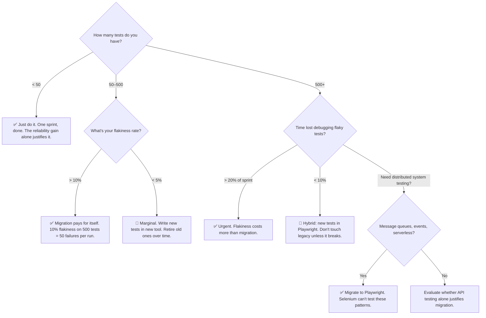

---

### 4.4 Migration Paths — Concrete Before/After

**Selenium (Java) → Playwright (TypeScript):**

```java
// ── BEFORE: Selenium (Java) ──
WebDriver driver = new ChromeDriver();
WebDriverWait wait = new WebDriverWait(driver, Duration.ofSeconds(10));

driver.get("https://example.com/login");
wait.until(ExpectedConditions.visibilityOfElementLocated(By.id("email")))
    .sendKeys("user@example.com");
driver.findElement(By.id("password")).sendKeys("pass123");
wait.until(ExpectedConditions.elementToBeClickable(By.id("submit"))).click();
wait.until(ExpectedConditions.urlContains("/dashboard"));
driver.quit();
```

```typescript
// ── AFTER: Playwright (TypeScript) ──
import { test, expect } from '@playwright/test';

test('login flow', async ({ page }) => {
  await page.goto('https://example.com/login');
  await page.getByLabel(/email/i).fill('user@example.com');
  await page.getByLabel(/password/i).fill('pass123');
  await page.getByRole('button', { name: /sign in/i }).click();
  await expect(page).toHaveURL(/\/dashboard/);
});
```

**Selenium (C#) → Playwright (.NET):**

```csharp
// ── BEFORE: Selenium (C#) ──
var driver = new ChromeDriver();
var wait = new WebDriverWait(driver, TimeSpan.FromSeconds(10));

driver.Navigate().GoToUrl("https://example.com/login");
wait.Until(ExpectedConditions.ElementIsVisible(By.Id("email")))
    .SendKeys("user@example.com");
driver.FindElement(By.Id("password")).SendKeys("pass123");
wait.Until(ExpectedConditions.ElementToBeClickable(By.Id("submit"))).Click();
driver.Quit();
```

```csharp
// ── AFTER: Playwright (.NET) ──
using Microsoft.Playwright;

var playwright = await Playwright.CreateAsync();
var browser = await playwright.Chromium.LaunchAsync();
var page = await browser.NewPageAsync();

await page.GotoAsync("https://example.com/login");
await page.GetByLabel("Email").FillAsync("user@example.com");
await page.GetByLabel("Password").FillAsync("pass123");
await page.GetByRole(AriaRole.Button, new() { Name = "Sign In" }).ClickAsync();
await Assertions.Expect(page).ToHaveURLAsync(new Regex("/dashboard"));
```

**Cypress (TypeScript) → Playwright (TypeScript):**

```typescript
// ── BEFORE: Cypress (TypeScript) ──
describe('Orders', () => {
  beforeEach(() => {
    cy.intercept('GET', '/api/orders*').as('getOrders');
    cy.visit('/orders');
    cy.wait('@getOrders');
  });

  it('creates an order', () => {
    cy.get('[data-cy="new-order"]').click();
    cy.get('[data-cy="product-select"]').select('Widget');
    cy.intercept('POST', '/api/orders').as('createOrder');
    cy.get('[data-cy="submit"]').click();
    cy.wait('@createOrder').its('response.statusCode').should('eq', 201);
  });
});
```

```typescript
// ── AFTER: Playwright (TypeScript) ──
import { test, expect } from '@playwright/test';

test.describe('Orders', () => {
  test.beforeEach(async ({ page }) => {
    await page.goto('/orders');
    await page.waitForResponse(
      r => r.url().includes('/api/orders') && r.status() === 200
    );
  });

  test('creates an order', async ({ page }) => {
    await page.getByTestId('new-order').click();
    await page.getByTestId('product-select').selectOption('Widget');

    const [resp] = await Promise.all([
      page.waitForResponse(
        r => r.url().includes('/api/orders') && r.request().method() === 'POST'
      ),
      page.getByTestId('submit').click(),
    ]);
    expect(resp.status()).toBe(201);
  });
});
```

---

## Level 5 — Real Scenarios: What I'd Actually Recommend

| Scenario | Pick This | Here's Why |
|----------|-----------|------------|
| Startup, React SPA, Chromium only, 3 devs | **Cypress** | Fastest time‑to‑first‑test. Built‑in video. No one has time to mess with config. |
| Enterprise app — Chrome + Firefox + Safari — audit requirements | **Playwright** | One API, three browsers. Trace Viewer = audit trail. Auto‑wait eliminates cross‑browser quirks. |
| Legacy banking app — IE11 required by compliance | **Selenium** | Only option. Accept the flakiness; it's the cost of IE. |
| Micro‑frontend with 20+ Web Components | **Playwright** | Auto‑pierces every shadow root. No `.shadow()` chaining. |
| API‑heavy app — needs to create resources, verify backend, stub endpoints | **Playwright** or **Cypress** | Both have built‑in API testing. Selenium requires a separate library. |
| Distributed system — message queues, event‑driven, serverless | **Playwright** | Event listening, WebSocket stubbing, serverless cold start simulation. Cypress is limited to HTTP. Selenium can't do any of this. |
| GraphQL‑heavy app | **Playwright** (1st) or **Cypress** | Both can inspect `operationName`. Playwright's `postDataJSON()` gives finer control. |
| CQRS architecture — separate command and query models | **Playwright** | Wait for command response AND query projection independently. Test the eventual‑consistency gap. |
| 2000+ tests, 30% flakiness, debugging eats sprint capacity | **Playwright** | Auto‑wait + event‑driven sync eliminates structural flakiness causes. |
| Team of Java devs — they refuse to write JavaScript | **Playwright** (Java) or **Selenium** | Playwright's Java API is close enough to Selenium. If they refuse Playwright too, Selenium. |
| Team of C#/.NET devs | **Playwright** (.NET) | First‑class .NET bindings. Familiar `async/await` patterns. |
| CI pipeline where every second costs money | **Playwright** | Context‑based parallelism + `storageState` = fastest execution. |
| Need to strip test attributes from production | **Cypress** or **Playwright** | Build‑time stripping. Selenium has no equivalent. |

---

## Summary — The One‑Page I'd Print and Tape to My Monitor

```
┌──────────────────────────────────────────────────────────────────────┐
│                    WHICH TOOL? — HONEST ANSWER                        │
├──────────────────────────────────────────────────────────────────────┤
│                                                                       │
│  Chrome + Firefox + Safari, with API testing built‑in?                │
│      → Playwright                                                     │
│                                                                       │
│  Chromium only, want the fastest setup and best debugging UX?         │
│      → Cypress                                                        │
│                                                                       │
│  Legacy app, IE11, can't rewrite?                                     │
│      → Selenium (and lower your expectations on flakiness)            │
│                                                                       │
│  Distributed system — queues, events, serverless, CQRS?               │
│      → Playwright. Selenium can't test these. Cypress is limited.     │
│                                                                       │
│  Tests keep flaking, testers keep adding cy.wait(3000)?              │
│      → Fix the WAIT STRATEGY first (network intercepts).              │
│         Migrating the tool is optional. Fixing the waits is not.      │
│                                                                       │
│  Building something new in 2026?                                      │
│      → Playwright. Modern, cross‑browser, auto‑wait, API, events.     │
│                                                                       │
│  Team writes only Java / C# / .NET?                                   │
│      → Playwright (Java / .NET bindings)                              │
│                                                                       │
│  App uses Web Components / Shadow DOM?                                │
│      → Playwright. Zero config. Shadow DOM just works.               │
│                                                                       │
│  Need both API and UI testing in one framework?                       │
│      → Playwright or Cypress. NOT Selenium.                           │
│                                                                       │
│  GraphQL endpoint — wait for operation "GetOrders"?                   │
│      → Playwright or Cypress. Both can inspect operationName.         │
│                                                                       │
│  Security: strip test attributes from production?                     │
│      → Cypress or Playwright. Configure build‑time stripping.         │
│                                                                       │
└──────────────────────────────────────────────────────────────────────┘
```

---

## References — Where I Got This Stuff

### Official Documentation
- **Playwright** — actionability & auto‑waiting: [https://playwright.dev/docs/actionability](https://playwright.dev/docs/actionability)
- **Playwright** — API testing (APIRequestContext): [https://playwright.dev/docs/api-testing](https://playwright.dev/docs/api-testing)
- **Playwright** — network (page.route, waitForResponse): [https://playwright.dev/docs/network](https://playwright.dev/docs/network)
- **Playwright** — WebSocket routing: [https://playwright.dev/docs/api/class-browsercontext#browser-context-route-web-socket](https://playwright.dev/docs/api/class-browsercontext#browser-context-route-web-socket)
- **Playwright** — locators: [https://playwright.dev/docs/locators](https://playwright.dev/docs/locators)
- **Playwright** — auth (storageState): [https://playwright.dev/docs/auth](https://playwright.dev/docs/auth)
- **Playwright** — .NET: [https://playwright.dev/dotnet/docs/intro](https://playwright.dev/dotnet/docs/intro)
- **Playwright** — Java: [https://playwright.dev/java/docs/intro](https://playwright.dev/java/docs/intro)

- **Cypress** — retry‑ability: [https://docs.cypress.io/guides/core-concepts/retry-ability](https://docs.cypress.io/guides/core-concepts/retry-ability)
- **Cypress** — `cy.intercept()`: [https://docs.cypress.io/api/commands/intercept](https://docs.cypress.io/api/commands/intercept)
- **Cypress** — `cy.request()`: [https://docs.cypress.io/api/commands/request](https://docs.cypress.io/api/commands/request)
- **Cypress** — `cy.origin()`: [https://docs.cypress.io/api/commands/origin](https://docs.cypress.io/api/commands/origin)
- **Cypress** — shadow DOM: [https://docs.cypress.io/api/commands/shadow](https://docs.cypress.io/api/commands/shadow)
- **Cypress** — trade‑offs: [https://docs.cypress.io/guides/references/trade-offs](https://docs.cypress.io/guides/references/trade-offs)

- **Selenium** — WebDriver (W3C): [https://www.w3.org/TR/webdriver2/](https://www.w3.org/TR/webdriver2/)
- **Selenium** — BiDi: [https://w3c.github.io/webdriver-bidi/](https://w3c.github.io/webdriver-bidi/)
- **Selenium** — docs: [https://selenium.dev/documentation/](https://selenium.dev/documentation/)

### Protocols & Architecture Patterns
- **CDP:** [https://chromedevtools.github.io/devtools-protocol/](https://chromedevtools.github.io/devtools-protocol/)
- **Web Components / Shadow DOM (MDN):** [https://developer.mozilla.org/en-US/docs/Web/API/Web_components](https://developer.mozilla.org/en-US/docs/Web/API/Web_components)
- **CQRS (Martin Fowler):** [https://martinfowler.com/bliki/CQRS.html](https://martinfowler.com/bliki/CQRS.html)
- **Event‑Driven Architecture (AWS):** [https://aws.amazon.com/event-driven-architecture/](https://aws.amazon.com/event-driven-architecture/)
- **Serverless (AWS Lambda):** [https://aws.amazon.com/lambda/](https://aws.amazon.com/lambda/)

### Recommended Reading
- **Testing Library:** [https://testing-library.com/docs/guiding-principles](https://testing-library.com/docs/guiding-principles)
- **Playwright vs Cypress (official):** [https://playwright.dev/docs/why-playwright](https://playwright.dev/docs/why-playwright)

---

*This guide is what I wish someone had handed me when I was first evaluating browser automation tools — especially the parts about distributed systems. Share it, argue about it, adapt it. Just don't use `cy.wait(3000)`.*
