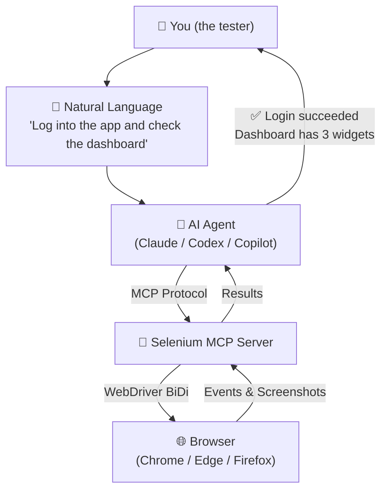
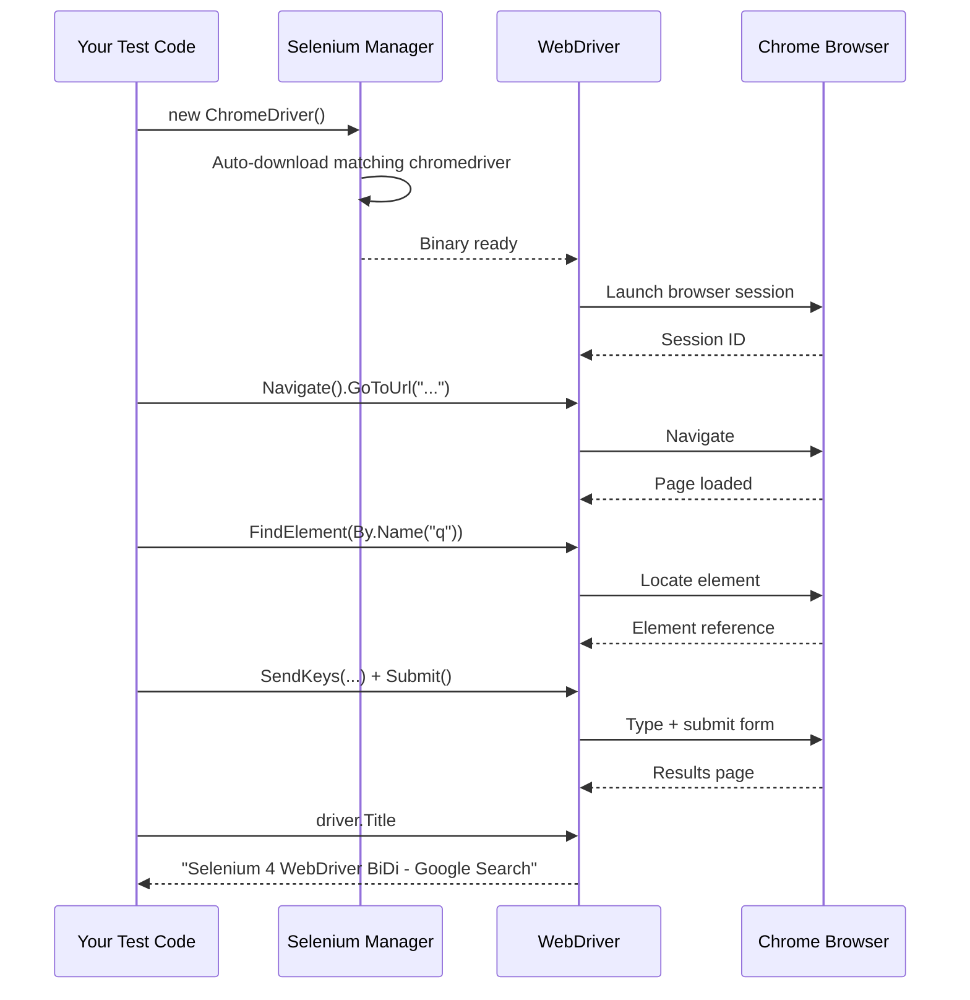
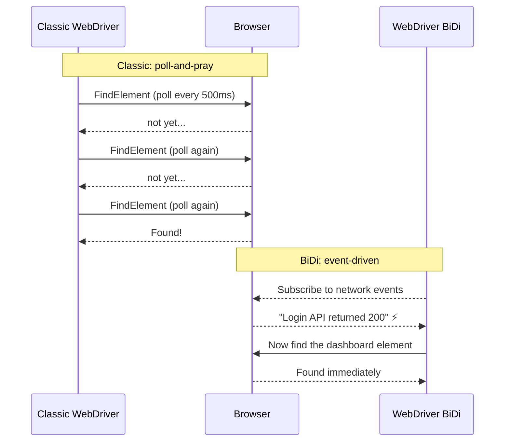
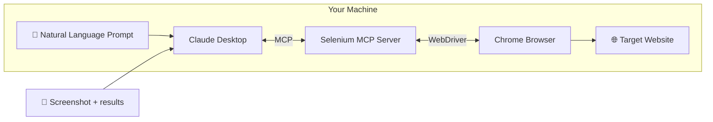
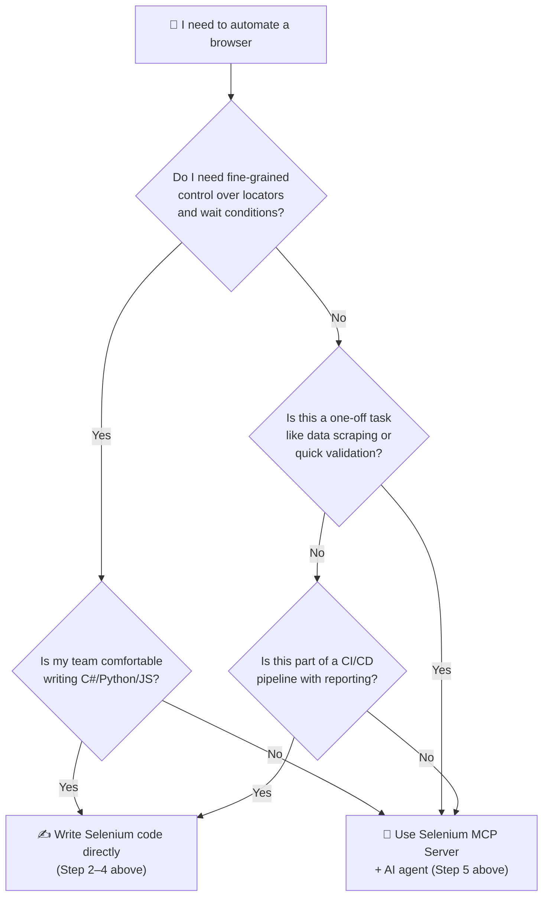

If you're new to test automation, Selenium is still the best place to start. It runs everywhere, speaks every language, and — as of 2026 — it has a built-in AI superpower: the **Model Context Protocol (MCP)**.

This guide walks you through what changed, how to set up your first test, and how to let an AI agent drive the browser for you. No prior Selenium knowledge needed.

## What Selenium Looks Like in 2026

If the last time you heard about Selenium was version 3, here's what changed:

| Feature | Selenium 3 (2021) | Selenium 4 (2026) |
|---------|-------------------|-------------------|
| Driver binaries | Manual download (`chromedriver.exe`) | **Selenium Manager** — auto-downloads the right binary |
| Locator strategy | `By.Id()`, `By.XPath()` only | **Relative Locators** — `above()`, `below()`, `near()` |
| Browser communication | One-way: send command, wait for reply | **WebDriver BiDi** — two-way over WebSocket |
| Network control | Not available | **CDP integration** — intercept requests, throttle network |
| AI agent control | Not possible | **MCP Server** — LLM sends natural-language commands |

The biggest mind-shift: you no longer tell Selenium *how* to find a button. You describe what the button is *near*, and the engine resolves it. And with MCP, you don't even write code — you tell an AI what you want, and it drives the browser.

## Architecture Overview

Here's how the pieces fit together in 2026:



The MCP server sits between your AI agent and the browser. It translates "check the dashboard" into WebDriver commands, executes them, and sends the result back. Your job shifts from writing locators to writing **intent**.

## Step 1: Install Selenium (60 Seconds)

In 2026 you don't need to hunt for `chromedriver.exe`. Selenium Manager ships with the library and resolves the correct binary automatically.

**C# / .NET (what this blog's code samples use):**

```bash
dotnet new xunit -n MyFirstSeleniumTest
cd MyFirstSeleniumTest
dotnet add package Selenium.WebDriver
dotnet add package Selenium.Support
```

**Python:**

```bash
pip install selenium
```

**Java / Maven:**

```xml
<dependency>
  <groupId>org.seleniumhq.selenium</groupId>
  <artifactId>selenium-java</artifactId>
  <version>4.29.0</version>
</dependency>
```

**JavaScript / Node.js:**

```bash
npm install selenium-webdriver
```

That's it. No `PATH` variables, no driver folders. Write code and run.

## Step 2: Your First Test — "Hello, Browser!"

Create a file called `FirstTest.cs` (C#), `first_test.py` (Python), or `first.test.js` (JS). The pattern is identical across languages:

```csharp
using OpenQA.Selenium;
using OpenQA.Selenium.Chrome;

public class FirstTest
{
    [Fact]
    public void HelloBrowser()
    {
        // Selenium Manager downloads the correct ChromeDriver automatically
        using IWebDriver driver = new ChromeDriver();

        // Navigate to a page
        driver.Navigate().GoToUrl("https://www.google.com");

        // Find the search box by its accessible name
        var searchBox = driver.FindElement(By.Name("q"));
        searchBox.SendKeys("Selenium 4 WebDriver BiDi");
        searchBox.Submit();

        // Wait for results and grab the page title
        var title = driver.Title;
        Assert.Contains("Selenium", title);

        // driver.Quit() is called automatically by the `using` block
    }
}
```



**Key takeaway:** you wrote zero driver-management code. Selenium Manager handled the binary; `using` handled cleanup. This is the 2026 baseline — no setup ceremony, just write the test.

## Step 3: Relative Locators — Find Elements Like a Human

Before Selenium 4, you needed CSS or XPath to locate elements. Now you describe *position*:

```csharp
// Find the password field ABOVE the submit button
var passwordBox = driver.FindElement(
    RelativeBy.WithLocator(By.TagName("input"))
              .Above(By.Id("submit-button"))
);

// Find the error message BELOW the email field
var errorMsg = driver.FindElement(
    RelativeBy.WithLocator(By.ClassName("error"))
              .Below(By.Name("email"))
);

// Find the label NEAR the checkbox
var termsCheckbox = driver.FindElement(
    RelativeBy.WithLocator(By.TagName("input"))
              .Near(By.XPath("//label[text()='I agree to the terms']"))
);
```

This mirrors how a human visually scans a page. No more brittle XPath chains.

## Step 4: WebDriver BiDi — The Browser Talks Back

Classic WebDriver is request-response: you ask, the browser answers. BiDi (bidirectional) opens a persistent WebSocket so the browser can **push events to you** in real time.

### Why It Matters for Beginners

Imagine a login form that shows a spinner for 3-5 seconds after clicking "Sign In." With classic Selenium, you add an explicit wait:

```csharp
var wait = new WebDriverWait(driver, TimeSpan.FromSeconds(10));
wait.Until(d => d.FindElement(By.ClassName("dashboard")).Displayed);
```

That's fragile — you're guessing the wait time. With BiDi, the browser **tells you** when the network request finished:

```csharp
// BiDi: listen for network events — no polling, no waits
var network = driver.Manage().Network;
network.NetworkResponseReceived += (_, e) =>
{
    if (e.ResponseUrl.Contains("/api/login") && e.ResponseStatusCode == 200)
        Console.WriteLine("Login API responded — dashboard is ready!");
};
```



No flaky waits. No `Thread.Sleep()`. The browser tells you when it's ready.

## Step 5: Selenium MCP Server — Let AI Drive the Browser

This is where Selenium in 2026 gets genuinely exciting. **MCP (Model Context Protocol)** lets an AI agent — Claude Desktop, GitHub Copilot, or a custom LLM — control your browser through natural language.

### How MCP Works (The Short Version)

```
You type:     "Fill the registration form with valid test data"
               ↓
AI Agent:     Parses intent → calls MCP tools (interact + send_keys)
               ↓
MCP Server:   Translates → driver.FindElement(...).SendKeys(...)
               ↓
Browser:      Form fields populate
               ↓
MCP Server:   Returns screenshot → AI confirms it looks correct
```

### The Original Selenium MCP Server

The first — and still most popular — Selenium MCP server was built by **Angie Jones** ([@angiejones/mcp-selenium](https://github.com/angiejones/mcp-selenium)). Angie is a well-known figure in the test automation community (ex-Applittools, ex-Test Automation University), and her `mcp-selenium` project was the proof-of-concept that showed the world AI agents could drive real browsers through Selenium.

Why it caught on:

- **Zero config** — runs via `npx`, no Python dependency, no virtual environment
- **Comprehensive tools** — goes beyond basic navigation to expose WebDriver BiDi diagnostics, accessibility tree snapshots, JavaScript execution, iframe management, alert handling, and cookie manipulation
- **Accessibility-first** — the `accessibility://current` resource gives the AI a compact, structured JSON tree of interactive elements so it can "see" the page without parsing raw HTML
- **Actively maintained** — regular releases through 2026, widely cited in guides from mcp.directory, Block's Goose, and Claude Code

### Setup (5 Minutes)

**Prerequisite:** You have Selenium installed from Step 1.

**1. Register the MCP server with your AI agent — no install step needed.**

Angie's `mcp-selenium` runs directly via `npx` (Node.js package runner). The AI agent downloads and launches it on demand:

For Claude Desktop, edit `claude_desktop_config.json`:
- **Windows:** `%APPDATA%\Claude\claude_desktop_config.json`
- **macOS:** `~/Library/Application Support/Claude/claude_desktop_config.json`

```json
{
  "mcpServers": {
    "selenium": {
      "command": "npx",
      "args": ["-y", "@angiejones/mcp-selenium@latest"],
      "env": {
        "SELENIUM_BROWSER": "chrome"
      }
    }
  }
}
```

> **Alternative (Python):** If you prefer Python, the `selenium-mcp` package (`pip install selenium-mcp`) offers a similar experience. But `@angiejones/mcp-selenium` remains the canonical implementation — it was first, has the largest toolset, and is what most tutorials reference.

**2. Restart Claude Desktop. You'll see a new 🔌 icon — Selenium is connected.**

**3. Start talking to your browser:**

```
You:    "Go to https://the-internet.herokuapp.com/login and fill in
         username 'tomsmith' and password 'SuperSecretPassword!'.
         Click Login. Tell me if it succeeded."

Claude: [Opens Chrome, navigates, fills fields, clicks]
        "✅ Login succeeded. The page now shows 'Secure Area'
         with a logout button. Screenshot attached."
```



### What You Can Ask the AI Agent to Do

| Task | Natural-language prompt | Underlying mcp-selenium tool |
|------|------------------------|------------------------------|
| Navigate | "Go to our staging site at https://staging.example.com" | `navigate` |
| Fill forms | "Fill the signup form with name 'Test User', email 'test@example.com'" | `interact` + `send_keys` |
| Assertions | "Is the dashboard showing 3 active projects?" | `get_element_text` |
| Screenshots | "Take a screenshot of the error state" | `take_screenshot` |
| Network check | "Tell me if any API call returned a 500 after submitting the form" | `diagnostics` (WebDriver BiDi) |
| Accessibility | "Check if every image on the page has alt text" | `accessibility://current` resource — structured JSON snapshot of all interactive elements |
| JavaScript | "What's the value of `window.__INITIAL_STATE__`?" | `execute_script` |
| Cookies | "Clear the session cookie and verify it redirects to login" | `get_cookies` / `delete_cookie` |
| Alerts | "Handle the 'Are you sure?' browser dialog and confirm" | `alert` |

You're no longer writing `driver.FindElement()` line-by-line. You describe the **outcome** you want, and the AI + MCP server figure out the *how*.

## Step 6: When to Use Each Approach

After setting up all three layers, here's how to think about which tool fits which job:



- **Raw Selenium code** → best for repeatable test suites in CI/CD, where you need deterministic results and reporting.
- **Selenium MCP + AI agent** → best for exploratory testing, one-off validations, accessibility checks, and prototyping.

## Where Existing Posts on This Blog Fit

This post is the 2026 refresh that connects to four earlier Selenium articles on techtalkwith-veeresh:

| Earlier post | What it covered | What changed by 2026 |
|---|---|---|
| [Selenium Page Locator Strategies (May 2020)]() | `By.Id()`, `By.XPath()`, CSS selectors, implicit/explicit waits | Relative Locators replace brittle XPath; BiDi replaces polled waits |
| [Drag-and-Drop in C# Selenium (Aug 2024)]() | 8 methods for drag-and-drop using `Actions` class and JavaScript fallback | CDP integration lets you simulate drag events at the protocol level — no JS hacks needed |
| [Selenium C# Framework Guide (Sep 2024)]() | xUnit + SpecFlow + DI framework architecture | Add MCP server as a new project dependency; Page Objects become optional when AI agents resolve locators dynamically |
| [Playwright vs Selenium in 2026 (Jun 2026)]() | Head-to-head comparison | Selenium now has BiDi + MCP, closing the event-driven gap with Playwright |

## Multi-Language Quick Reference

This guide used C# examples. Here's the equivalent syntax in **Java**, **TypeScript**, **JavaScript**, and **Python** for every operation covered:

### Creating a Driver

| Language | Code |
|---|---|
| **C#** | `using IWebDriver driver = new ChromeDriver();` |
| **Java** | `WebDriver driver = new ChromeDriver();` |
| **TypeScript** | `const driver = new Builder().forBrowser('chrome').build();` |
| **JavaScript** | `const driver = new Builder().forBrowser('chrome').build();` |
| **Python** | `driver = webdriver.Chrome()` |

### Finding Elements

| Language | Code |
|---|---|
| **C#** | `driver.FindElement(By.Name("q"))` |
| **Java** | `driver.findElement(By.name("q"))` |
| **TypeScript** | `driver.findElement(By.name('q'))` |
| **JavaScript** | `driver.findElement(By.name('q'))` |
| **Python** | `driver.find_element(By.NAME, "q")` |

### Relative Locators

| Language | Above / Below / Near |
|---|---|
| **C#** | `RelativeBy.WithLocator(By.TagName("input")).Above(By.Id("submit"))` |
| **Java** | `RelativeLocator.with(By.tagName("input")).above(By.id("submit"))` |
| **TypeScript** | `driver.findElement(locateWith(By.tagName('input')).above(By.id('submit')))` |
| **JavaScript** | `driver.findElement(locateWith(By.tagName('input')).above(By.id('submit')))` |
| **Python** | `driver.find_element(locate_with(By.TAG_NAME, "input").above((By.ID, "submit")))` |

### WebDriver Wait

| Language | Code |
|---|---|
| **C#** | `new WebDriverWait(driver, TimeSpan.FromSeconds(10)).Until(d => d.FindElement(By.ClassName("dashboard")).Displayed);` |
| **Java** | `new WebDriverWait(driver, Duration.ofSeconds(10)).until(d -> d.findElement(By.className("dashboard")).isDisplayed());` |
| **TypeScript** | `await driver.wait(until.elementLocated(By.className('dashboard')), 10000);` |
| **JavaScript** | `await driver.wait(until.elementLocated(By.className('dashboard')), 10000);` |
| **Python** | `WebDriverWait(driver, 10).until(lambda d: d.find_element(By.CLASS_NAME, "dashboard").is_displayed())` |

### Navigation

| Language | Code |
|---|---|
| **C#** | `driver.Navigate().GoToUrl("https://example.com");` |
| **Java** | `driver.navigate().to("https://example.com");` |
| **TypeScript** | `await driver.get('https://example.com');` |
| **JavaScript** | `await driver.get('https://example.com');` |
| **Python** | `driver.get("https://example.com")` |

### Test Framework + Assertion

| Language | Framework | Example assertion |
|---|---|---|
| **C#** | xUnit / NUnit | `Assert.Contains("Selenium", driver.Title);` |
| **Java** | JUnit / TestNG | `assertTrue(driver.getTitle().contains("Selenium"));` |
| **TypeScript** | Jest / Mocha | `expect(await driver.getTitle()).toContain('Selenium');` |
| **JavaScript** | Jest / Mocha | `expect(await driver.getTitle()).toContain('Selenium');` |
| **Python** | pytest | `assert "Selenium" in driver.title` |

> **BiDi and network interception** APIs vary by language binding. The C# examples in Step 4 use `driver.Manage().Network` — Java bindings use `devTools` session, while Python/JS use CDP directly. See the [official BiDi docs](https://www.selenium.dev/documentation/webdriver/bidi/) for your language.

## Sources & Further Reading

1. [Selenium WebDriver Documentation](https://www.selenium.dev/documentation/webdriver/) — official guides for all language bindings
2. [WebDriver BiDi Specification](https://www.selenium.dev/documentation/webdriver/bidi/) — bidirectional WebSocket protocol for real-time browser events
3. [Selenium Manager](https://www.selenium.dev/documentation/selenium_manager/) — automatic driver binary resolution (no more `chromedriver.exe` hunting)
4. [Angie Jones / mcp-selenium](https://github.com/angiejones/mcp-selenium) — the original Selenium MCP server, runs via `npx`, exposes 15+ browser automation tools

## What to Do Next

1. **Run Step 1–2 right now.** Install Selenium on your machine and run the Hello World test. It takes under 2 minutes.
2. **Read the BiDi docs.** Selenium's [official BiDi specification](https://www.selenium.dev/documentation/webdriver/bidi/) covers CDP integration, network interception, and log listeners.
3. **Try the MCP server.** If you have Claude Desktop, add the Selenium MCP config and ask it to navigate to any public website. The first time an AI drives your browser feels like magic.
4. **For CI/CD pipelines:** stick with raw Selenium code (Step 2–4). MCP is for exploratory work; deterministic test suites need explicit waits and assertions.
5. **Subscribe to this blog's [feed.xml]()** — followup posts on Playwright MCP, BiDi-vs-CDP deep-dives, and AI-assisted test generation are coming next.

*See also:* [AI-Driven Test Strategy: From Copilot to Multi-Agent Orchestration (Jun 2026)]() · [Self-Healing Test Suites (Sep 2026)]() — AI-powered locator healing in CI/CD, building on the Relative Locators and BiDi from this guide.
