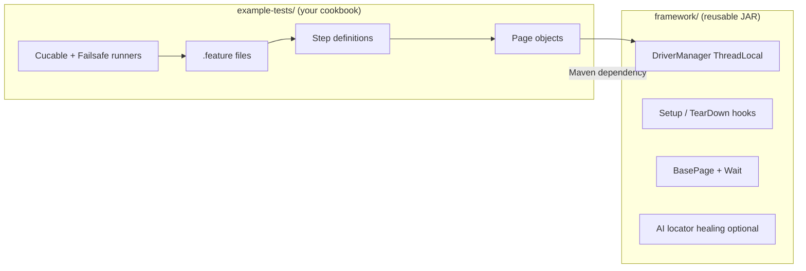
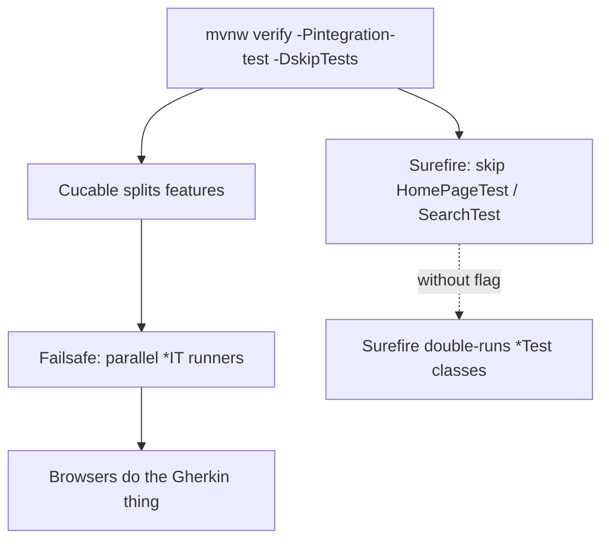
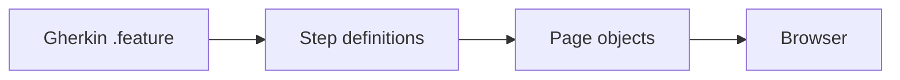
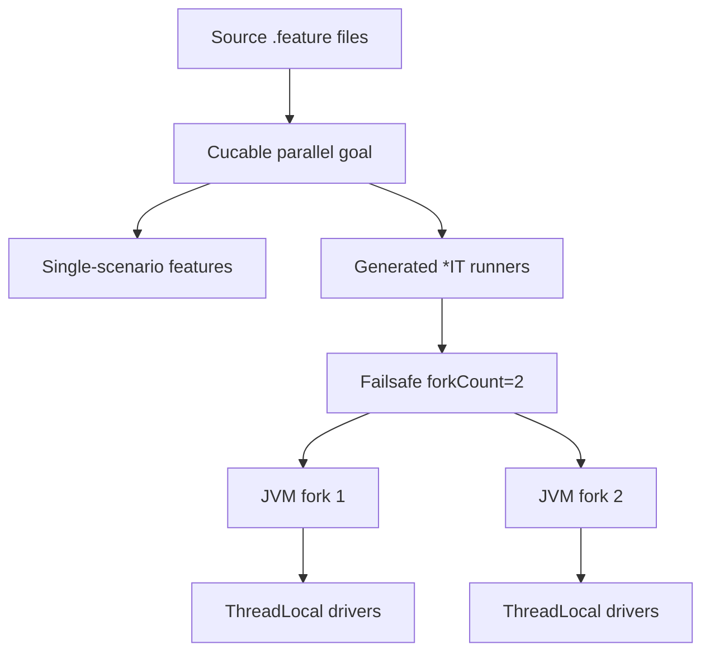
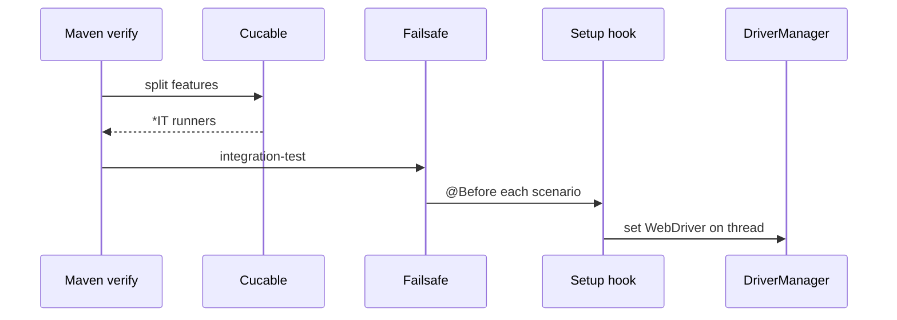
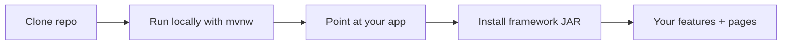
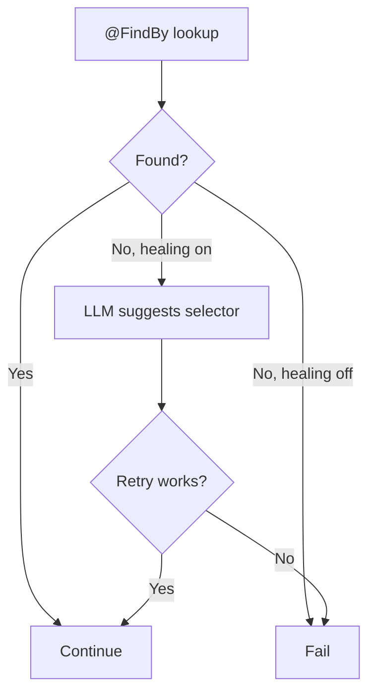

Your Cucumber suite is running scenarios one at a time. Chrome opens. Chrome closes. Chrome opens again. Somewhere, a CI meter spins like a slot machine nobody asked for.

BDD was supposed to keep tests readable. Parallel runs were supposed to keep feedback fast. In Java, those two goals often stare at each other across a conference table until someone says "we'll revisit in Q4" and Q4 never comes.

I built [cucumberBDDParallel](https://github.com/veeresh-bikkaneti/cucumberBDDParallel) because I got tired of that meeting. It's a small reusable core, a real working example (Google, not `example.com`), and enough structure that you can clone it, run it, and actually understand what's happening before lunch.

Pop quiz, hotshot ([*Speed*](https://en.wikipedia.org/wiki/Speed_(1994_film))): can you run parallel browser BDD without writing your own thread pool? If you nodded, keep reading anyway — the `-DskipTests` flag has fooled smarter people.

## What you're actually getting

Two core Maven modules — plus example cookbooks you can run without touching google.com.

| Module | What it does |
|--------|--------------|
| `framework/` | Reusable JAR: browser hooks, waits, `BasePage`, interaction helpers, optional AI locator healing |
| `example-tests/` | Working Cucumber + Selenium demo against google.com — copy the structure |
| `examples/ai-healing-demo/` | Deterministic broken-locator demo (mock LLM in CI) |
| `examples/web-patterns-demo/` | Tables, drag-drop, upload/download, PDF, QR, OCR — local fixtures only |

{:.post-illustration}
*Hand-drawn style illustration — steal the recipe, not the restaurant.*

Under the hood: [Cucumber 7.34.4](https://github.com/veeresh-bikkaneti/cucumberBDDParallel/blob/main/pom.xml), [Selenium 4.45.0](https://www.selenium.dev/documentation/webdriver/), [TestNG 7.12.0](https://testng.org/#_parallelism_and_time_outs), and the [Cucable plugin](https://github.com/trivago/cucable-plugin) to split scenarios so they can run side by side instead of forming a polite queue.

Optional AI healing calls **your chosen LLM** when a `@FindBy` locator dies after a markup change — Anthropic BYOK, OpenAI-compatible BYOK, or local [Ollama](https://ollama.com/). It's off by default. You don't need any API key to learn the framework — save that plot twist for later.



## Prerequisites (the short list)

- **JDK 21**
- **Maven 3.9+** — or just use the bundled `mvnw` / `mvnw.cmd` and pretend Maven isn't installed
- **Chrome or Firefox** — [WebDriverManager](https://bonigarcia.dev/webdrivermanager/) fetches the driver. Life finds a way ([*Jurassic Park*](https://www.uphe.com/movies/jurassic-park)).

**Or skip local installs for now** and read through the rest of this post first. You can always come back and run the Maven commands once JDK and a browser are in place.

## Step 1: Clone and run (local)

```bash
git clone https://github.com/veeresh-bikkaneti/cucumberBDDParallel.git
cd cucumberBDDParallel
```

**Linux/macOS:**

```bash
./mvnw clean verify -Pintegration-test -DskipTests -pl example-tests -am
```

**Windows:**

```powershell
.\mvnw.cmd clean verify -Pintegration-test -DskipTests -pl example-tests -am
```

Firefox enjoyers:

```bash
./mvnw clean verify -Pintegration-test -DskipTests -pl example-tests -am -Dbrowser=firefox
```

### The `-DskipTests` mind-bender

This flag does **not** mean "skip all testing." I know. The name is doing crimes.

It tells Maven Surefire to leave alone the hand-written `HomePageTest` and `SearchTest` runners during the `test` phase. Those are great for debugging one feature in your IDE. They're not how the parallel pipeline runs in CI.

The real show is Cucable-generated runners executed by the [Maven Failsafe Plugin](https://maven.apache.org/surefire/maven-failsafe-plugin/) during `integration-test`. There is no spoon — only phases ([*The Matrix*](https://www.warnerbros.com/movies/matrix)).

{:.post-illustration}



Green Cucumber output means you won. The demo hits live google.com, so you need network access and a browser that isn't decorative.

## Step 2: Folder layout (don't panic)

```
cucumberBDDParallel/
├── framework/          # Library you depend on
│   └── .../driver/     # Setup, TearDown, ThreadLocal DriverManager
│   └── .../page/       # BasePage
│   └── .../ai/         # Optional healing
└── example-tests/      # Copy this structure
    ├── features/
    ├── homepage/       # Page + steps
    └── runner/         # IDE-friendly single-feature runners
```

Three layers. Memorize these and you'll survive most BDD conversations:

1. **Gherkin** — what humans argue about in refinement
2. **Step definitions** — thin glue
3. **Page objects** — where Selenium actually touches the DOM

{:.post-illustration}

[Cucumber's step definition model](https://cucumber.io/docs/cucumber/step-definitions/) exists for exactly this split. Readable scenarios. Maintainable automation. Revolutionary concept, somehow.



## Step 3: Read a feature file

`example-tests/src/test/resources/features/Home_page.feature`:

```gherkin
Feature: Home page

  Scenario Outline: Check page display
    Given A user navigates to HomePage "<countryCode>"
    Then Google logo is displayed
    And search bar is displayed

    Examples:
      | countryCode |
      | fr          |
      | com         |

  Scenario: Check title
    Given A user navigates to HomePage "fr"
    Then page title is "Google"
```

Scenario Outline = same flow, different data. [Gherkin](https://cucumber.io/docs/gherkin/) reads like English on purpose.

You don't put Selenium in the feature file. If you do, a senior engineer will appear behind you like a horror-movie extra. No jump scare required; the disappointment is enough.

## Step 4: Follow a step into code

`HomePageSteps` stays thin:

```java
@Given("^A user navigates to HomePage \"([^\"]*)\"$")
public void aUserNavigatesToHomePage(String country) {
    this.homePage.goToHomePage(country);
}
```

`HomePage` extends `BasePage`:

```java
@FindBy(css = "#hplogo")
private WebElement logo;

@FindBy(css = "input[name=q]")
private WebElement searchInput;
```

`BasePage` pulls the driver from `DriverManager.get()`. You don't pass `WebDriver` through seventeen constructors like it's a family heirloom.

Drop `Setup` and `TearDown` into your runner's `glue` array and every scenario gets a fresh browser. `TearDown` quits the session and grabs a screenshot on failure — your mission, should you choose to accept it, leaves evidence behind ([*Mission: Impossible*](https://www.paramount.com/movies/mission-impossible)).

## Step 5: How parallel actually works

"Cucumber parallel" sounds like one checkbox. It isn't. Three mechanisms hold hands:

{:.post-illustration}

### 1. Cucable splits your features

At `generate-test-resources`, [Cucable](https://github.com/trivago/cucable-plugin) chops scenarios (and Scenario Outline rows) into individual feature files plus generated TestNG runners from `cucable.template`. `parallelizationMode=features` means each piece can run on its own.

One browser to rule them all? Not anymore ([*The Lord of the Rings*](https://www.warnerbros.com/movies/lord-rings-fellowship-ring)).

### 2. Failsafe forks JVMs

`example-tests/pom.xml` sets Failsafe `forkCount` to 2. Two JVM processes can chew through generated `*IT` runners simultaneously. More forks, more speed, more RAM sacrificed to the performance gods.

### 3. ThreadLocal keeps browsers from cross-contaminating

`DriverManager` stores each thread's `WebDriver` in a `ThreadLocal`. Without that, parallel runs produce the classic "why did my test click the wrong tab?" bug. Don't cross the streams ([*Ghostbusters*](https://www.sonypictures.com/movies/ghostbusters)).

```java
private static final ThreadLocal<WebDriver> DRIVER = new ThreadLocal<>();
```

`DriverManagerTest` proves two threads get two drivers. That's the safety net you want before trusting parallel BDD in CI. I can do this all day — but I'd rather the tests do it for me ([*Captain America: Civil War*](https://www.marvel.com/movies/captain-america-civil-war)).

{:.post-illustration}





## Step 6: Debug one feature in your IDE

Don't want the full parallel circus? Use the plain runners:

- `HomePageTest` → `Home_page.feature`
- `SearchTest` → `Search.feature`

Right-click, run, breathe. Single-threaded. No Cucable. Perfect for learning. CI uses the generated runners, not these — same way movie trailers show the good scenes and skip the credits.

## Step 7: Steal the framework for your app

When you're ready to aim at your own AUT instead of Google:

```bash
./mvnw -pl framework -am install
```

```xml
<dependency>
    <groupId>com.cucumberbddparallel</groupId>
    <artifactId>framework</artifactId>
    <version>1.0-SNAPSHOT</version>
</dependency>
```

Then: extend `BasePage`, add `Setup`/`TearDown` to `glue`, copy the Cucable + Failsafe bits from `example-tests/pom.xml`. `example-tests` is a cookbook, not a dependency you'll drag into production like an overstuffed suitcase.



## Optional: AI self-healing locators

Locator breaks after a CSS rename? The framework can send page HTML to an LLM, get a new selector, retry once. These aren't the droids you're looking for — until the second try ([*Star Wars*](https://www.starwars.com/films/star-wars-episode-iv-a-new-hope)).

{:.post-illustration}

**You pick the provider** — nothing is locked to Anthropic. Set `AI_HEALING_PROVIDER` and your credentials:

```bash
# Anthropic BYOK
export AI_HEALING_PROVIDER=anthropic
export AI_HEALING_API_KEY=sk-ant-...

# OpenAI-compatible BYOK (OpenAI, Azure, gateways)
export AI_HEALING_PROVIDER=openai
export AI_HEALING_API_KEY=sk-...

# Local Ollama (no cloud key)
export AI_HEALING_PROVIDER=ollama
export AI_HEALING_MODEL=llama3.2

./mvnw clean verify -Pintegration-test -DskipTests -pl example-tests -am
```

Legacy `ANTHROPIC_API_KEY` still works for Anthropic. Full reference: [docs/AI_HEALING.md](https://github.com/veeresh-bikkaneti/cucumberBDDParallel/blob/main/docs/AI_HEALING.md).

Force off:

```bash
-Dai.healing.enabled=false
```

My advice: learn parallel BDD and page objects first. Add healing when broken locators — not broken tests — are your bottleneck. Healing a bad assertion is like putting sunglasses on a broken leg. Stylish. Ineffective.



## Step 8: Web patterns cookbook (local fixtures)

Not every lesson needs live google.com. The `examples/web-patterns-demo` module spins up a tiny HTTP server on localhost and exercises the UI patterns that show up in almost every enterprise app — without the "works on my machine, cries in CI" energy.

| Demo test | What it proves | Framework helper |
|-----------|----------------|------------------|
| `TablePatternsTest` | Read grid headers and rows | `TableHelper` |
| `DragDropTest` | Move cards between lanes | `DragDropHelper` |
| `FileUploadDownloadTest` | Upload via hidden input + download to a configured folder | `FileUploadHelper` |
| `PdfValidationTest` | Pull text from a PDF with [PDFBox](https://pdfbox.apache.org/) | — |
| `QrCodeTest` | Decode a QR payload from a screenshot with [ZXing](https://github.com/zxing/zxing) | — |
| `OcrValidationTest` | OCR invoice text (Tesseract — Docker profile) | — |

{:.post-illustration}
*Local fixtures. No API keys. No praying to the CDN gods.*

Run the whole module:

```bash
./mvnw -pl examples/web-patterns-demo -am test
```

**Windows:**

```powershell
.\mvnw.cmd -pl examples/web-patterns-demo -am test
```

OCR needs Tesseract on the PATH (the Docker image installs it):

```bash
./mvnw -pl examples/web-patterns-demo -am test -Pocr-demo
```

Copy the pattern into your own Cucumber module: keep Gherkin readable, put Selenium in page objects, and lean on the helpers in `framework.interaction` instead of reinventing table-parsing XPath from 2014.

## Step 9: MCP Selenium — let an agent explore, you commit the BDD

[MCP](https://modelcontextprotocol.io/) is how IDE agents get tools. [Angie Jones' mcp-selenium](https://github.com/angiejones/mcp-selenium) gives an agent a real browser — navigate, click, read DOM — while **your repo** stays the source of truth for step definitions and CI.

Workflow I actually use:

1. Point MCP at the local fixture routes from `web-patterns-demo` (see [`docs/MCP_PLAYBOOK.md`](https://github.com/veeresh-bikkaneti/cucumberBDDParallel/blob/main/docs/MCP_PLAYBOOK.md)).
2. Let the agent poke at `/tables.html`, `/drag-drop.html`, `/upload.html` and propose selectors.
3. Translate the good ideas into Gherkin + page objects — **never** leave raw MCP calls in CI.

Example Cursor / Claude Desktop config (template also in the repo):

```json
{
  "mcpServers": {
    "selenium": {
      "command": "npx",
      "args": ["-y", "@angiejones/mcp-selenium"]
    }
  }
}
```

{:.post-illustration}

Agents are great at discovery. They're terrible at owning your regression suite. MCP is the reconnaissance drone; Cucumber is the army.

## Step 10: Docker — one command, all demos

Don't want Chrome and Maven on your laptop today? Fair. The repo ships a `Dockerfile` and `docker-compose.yml` that run the example modules headlessly:

```bash
docker compose build
docker compose run --rm cucumber-examples
```

That runs `ai-healing-demo` (mock) and `web-patterns-demo` inside a container with Chrome baked in. OCR optional profile:

```bash
docker compose --profile ocr run --rm cucumber-examples-ocr
```

Full google.com integration (network required):

```bash
docker compose --profile integration run --rm cucumber-integration
```

{:.post-illustration}

Bump `shm_size` in compose if Chrome throws a tantrum — same fix as the troubleshooting table below.

## What to expect

**Good fit:**

- Clone-and-run Java BDD with real structure
- Parallel scenarios without hand-rolling threads
- A `mvnw` wrapper so you don't need a global Maven install
- Local web-pattern examples (tables, files, PDF, QR) without flaky external sites
- MCP playbook for agent-driven exploration + committed Cucumber tests
- Docker path when local Chrome isn't happening
- A path from Google demo → your application

**Not a fit:**

- A permanent correctness gate on google.com (Google changes markup; your framework can be fine while the demo wheezes)
- Guaranteed reproducible browser versions without pinning (WebDriverManager resolves at runtime)

For production, point tests at your AUT and pin browser versions in `Setup` if your pipeline demands it. `PLAYBOOK.md` in the repo says the quiet part out loud.

## Troubleshooting (quick hits)

| Symptom | Likely cause | Fix |
|---------|--------------|-----|
| `No WebDriver set up for this thread` | `@Before` didn't run | Add `framework.driver` to runner `glue` |
| Tests run twice | Surefire picked up `*Test` | Keep `-DskipTests` on the Maven command |
| Chromedriver version mismatch | Browser updated itself again | Re-run; pin versions if CI demands it |
| Logo locator fails | Live Google demo drift | Expected. Use your own AUT. |
| Chrome crash in CI container | Low `/dev/shm` | Bump `shm_size` in your pipeline compose file |

## Where to go next

- [cucumberBDDParallel on GitHub](https://github.com/veeresh-bikkaneti/cucumberBDDParallel) — README, CI, examples, Docker
- [`docs/MCP_PLAYBOOK.md`](https://github.com/veeresh-bikkaneti/cucumberBDDParallel/blob/main/docs/MCP_PLAYBOOK.md) — wire mcp-selenium to these fixtures
- [`examples/web-patterns-demo/README.md`](https://github.com/veeresh-bikkaneti/cucumberBDDParallel/blob/main/examples/web-patterns-demo/README.md) — pattern matrix and commands
- `PLAYBOOK.md` — SOLID notes, cost model, extension points
- [Building BDD Frameworks That Actually Work]({{ site.baseurl }}) — Gherkin habits that won't embarrass you in refinement

Parallel BDD doesn't have to be a senior-engineer-only club. Clone it. Run one feature file end to end. Swap Google for your app.

And if something confuses you, open an issue on the repo. Good frameworks get better when beginners tell you exactly where they tripped — preferably with logs, not just vibes.