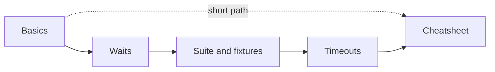
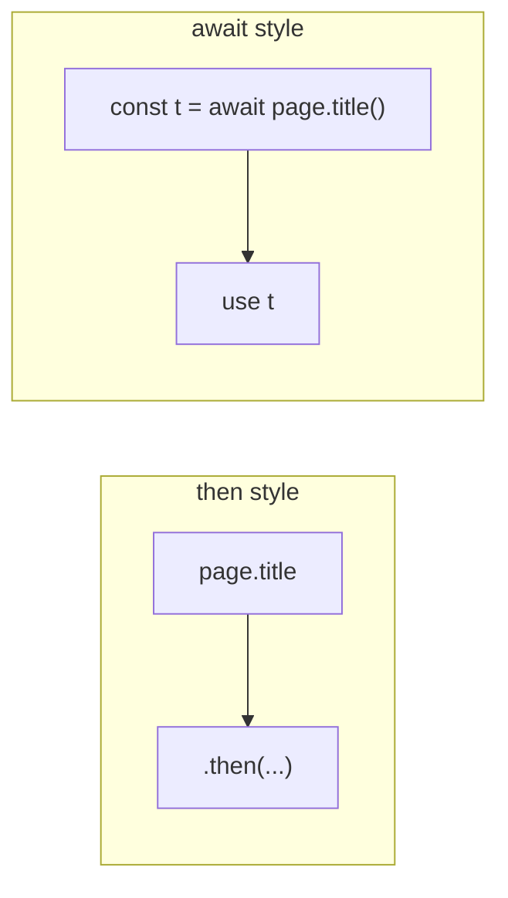
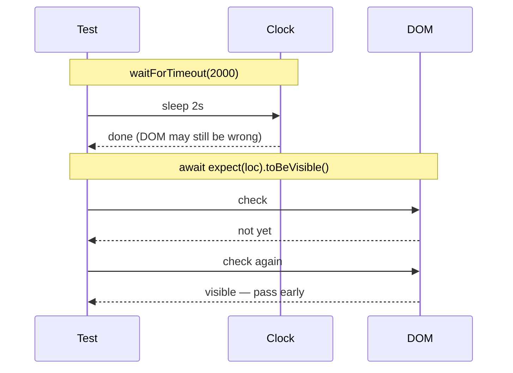
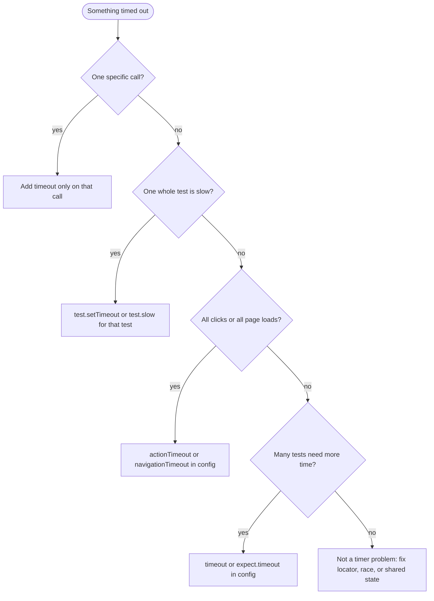

Opening a page, clicking a control, and asserting the result sounds simple until the first suite hits CI. Then you are juggling `async`/`await`, several different clocks, two styles of `expect`, and a stack of `*.spec.ts` files. The hard part is rarely TypeScript syntax. It is knowing **which wait**, **which structure**, and **which timeout** actually apply.

This guide walks those pieces in order: **async/await**, **sleep versus real waits**, **how to grow a suite** (Playwright’s `test` / `test.describe` API—not Jest’s free-standing `describe`/`it`), **hooks**, **fixtures**, and **timeout configuration**—with a cheatsheet and best practices at the end.

Examples use [playwright.dev](https://playwright.dev). Relative URLs assume `use.baseURL` where noted.

Related reading: [Playwright vs Selenium in 2026]({{ site.baseurl }})

## Table of contents {#toc}

1. [Reading paths](#reading-paths)
2. [Prerequisites](#prerequisites)
3. [Part I — Async and waiting](#part-i-async)
   - [Your first real test](#your-first-real-test)
   - [async and await](#async-and-await)
   - [Promise.all vs sequential await](#promiseall-vs-sequential-await)
   - [Sleep vs real waits](#sleep-vs-real-waits)
4. [Part II — Building a test suite](#part-ii-suite)
   - [Project layout](#project-layout)
   - [Playwright `test` (default) vs Jest/Jasmine `describe`/`it`](#playwright-test-vs-jest-jasmine)
   - [How a suite grows](#how-a-suite-grows)
   - [Hooks](#hooks)
   - [Fixtures](#fixtures)
5. [Part III — Timeouts](#part-iii-timeouts)
   - [The timeout confusion (why seniors get tripped up)](#timeout-confusion)
   - [Timeout comparison (plain English)](#timeout-comparison)
   - [Timeout strategy: where to start](#timeout-strategy)
   - [Recommended process](#recommended-process)
   - [The two big numbers (config)](#two-big-numbers)
   - [Action and navigation timeouts](#action-navigation)
   - [Triage flowchart](#triage-flowchart)
   - [Timeout checklist](#timeout-checklist)
6. [Locators and assertions](#locators-and-assertions)
7. [Config, debugging, API tests, page objects](#config-debug-api-pos)
8. [Cheatsheet](#cheatsheet)
9. [Best practices](#best-practices)
   - [Timeout antipatterns (from the field)](#antipatterns)
   - [Timeout decision matrix](#decision-matrix)
10. [Sources](#sources)

### Reading paths {#reading-paths}

| Audience | Start here | Goal |
|----------|------------|------|
| **New to Playwright** | [First test](#your-first-real-test) → [async](#async-and-await) → [Sleep vs real waits](#sleep-vs-real-waits) | Explain `await` and why fixed sleeps are unreliable |
| **Organizing a suite** | [Project layout](#project-layout) → [How a suite grows](#how-a-suite-grows) → [Fixtures](#fixtures) | Know when to use describe, hooks, and fixtures |
| **Timeout confusion** (all levels) | [Timeout confusion](#timeout-confusion) → [Timeout strategy](#timeout-strategy) → [Checklist](#timeout-checklist) | Pick the right timer for your slow test; understand why seniors get tripped up |
| **Debugging timeouts** | [Sleep vs real waits](#sleep-vs-real-waits) → [Triage flowchart](#triage-flowchart) → [Decision matrix](#decision-matrix) | Read the error, identify which timer failed, and fix it |
| **Copy-paste ready** | [Timeout quick reference](#quick-reference) → [Antipatterns](#antipatterns) | See what to do (and not do) with code examples |



---

## Prerequisites {#prerequisites}

- **Node.js 18+**
- `@playwright/test` installed
- Browsers via Playwright

```bash
npm init playwright@latest
# or
npm i -D @playwright/test
npx playwright install
```

```bash
npx playwright test
npx playwright test --ui
```

---

# Part I — Async and waiting {#part-i-async}

## Your first real test {#your-first-real-test}

A test without an assertion is only a script. Start with something that can fail for a clear reason.

```typescript
import { test, expect } from '@playwright/test';

// Think of it like: "Hey Playwright, when this test runs, give me a browser page
// and let me use await inside this function."
//
// ANALOGY: the shape of a Playwright test
// ┌──────────────────────────┬────────────────────────────────────────────────┐
// │ Piece                    │ Plain English                                  │
// ├──────────────────────────┼────────────────────────────────────────────────┤
// │ test('name', ...)        │ Register one case in the suite                 │
// │ async (...) => { }       │ This recipe may pause mid-step                 │
// │ { page }                 │ Built-in fixture: a fresh browser tab          │
// │ await ...                │ Pause THIS line until that step finishes       │
// │ expect(...)              │ Prove something — don't only log it            │
// └──────────────────────────┴────────────────────────────────────────────────┘

test('playwright.dev shows the get started link', async ({ page }) => {
  await page.goto('https://playwright.dev/');
  await expect(page).toHaveTitle(/Playwright/);
  await expect(page.getByRole('link', { name: 'Get started' })).toBeVisible();
});
```

| Line | Plain English |
|------|----------------|
| `import { test, expect }` | Pull in the runner and assertions |
| `async ({ page }) =>` | Allow pauses; inject a fresh `page` tab |
| `await page.goto(...)` | Navigate and wait for the load state |
| `await expect(...).toBeVisible()` | Poll until true or the **expect** timeout fires |

{:.post-illustration}
*With `await`, each step finishes before the next.*

## async and await {#async-and-await}

Browser automation is asynchronous: navigation, clicks, and network work finish later. `async`/`await` is how TypeScript expresses that without nested callbacks.

### Analogy: what each keyword does

| Keyword | Job |
|---------|-----|
| `async` on a function | “Allow `await` inside this function” (and return a `Promise`) |
| `await` on a line | “Pause **this line** until the Promise resolves, then continue” |

```typescript
// Think of it like: "Hey Playwright, when this test runs, give me a browser page
// and let me use await inside this function."
//
// ANALOGY: async vs await
// ┌─────────────────────┬────────────────────────────────────────────────┐
// │ Keyword             │ Job                                            │
// ├─────────────────────┼────────────────────────────────────────────────┤
// │ async on function   │ "Hey JS, allow await inside this function"     │
// │ await on line       │ "Pause THIS LINE until the Promise resolves"   │
// └─────────────────────┴────────────────────────────────────────────────┘
// You need BOTH.
//   async = "I'm allowing pauses in this recipe."
//   await = "Pause here until this step finishes."

import type { Page } from '@playwright/test';

async function preparePage(page: Page) {
  await page.goto('https://playwright.dev/');                    // pause until navigation finishes
  await page.getByRole('link', { name: 'Docs' }).click();       // pause until click + actionability done
  return page;
}
```

**Rule:** if a function body uses `await`, that function must be marked `async`. JavaScript enforces it. You need **both**: `async` opens the door; `await` actually pauses.

**Common mistake:** omitting `await` does not give you the finished value. You get a `Promise`. Playwright tests almost always use sequential `await` so each browser action completes before the next.

### Prefer `await` over `.then()` chains

```typescript
// ANALOGY: .then vs await
// ┌──────────────────┬──────────────────────────────────────────────────┐
// │ Style            │ Feels like                                       │
// ├──────────────────┼──────────────────────────────────────────────────┤
// │ .then(callback)  │ "When it finishes, run this nested note"         │
// │ await value      │ "Stay on this line until done, then keep going"  │
// └──────────────────┴──────────────────────────────────────────────────┘

// Works, harder to debug
await page.title().then((title) => console.log(title));

// Standard Playwright style
const title = await page.title();
await expect(page).toHaveTitle(/Playwright/);
```



### `const` vs `let`

Default to `const`. Use `let` only when you will reassign.

```typescript
// ANALOGY: const vs let
// ┌────────┬────────────────────────────────────────────┐
// │ Keyword│ Job                                        │
// ├────────┼────────────────────────────────────────────┤
// │ const  │ "This name stays put" (no reassignment)    │
// │ let    │ "I may reassign this later"                │
// └────────┴────────────────────────────────────────────┘

const title = await page.title();
let attempts = 0;
attempts += 1;
```

## Promise.all vs sequential await {#promiseall-vs-sequential-await}

Sequential `await` is the default for most steps:

```typescript
// ANALOGY: sequential vs Promise.all
// ┌─────────────────────┬──────────────────────────────────────────────────┐
// │ Pattern             │ Kitchen analogy                                  │
// ├─────────────────────┼──────────────────────────────────────────────────┤
// │ await a; await b;   │ Boil water, THEN cook pasta (one after another)  │
// │ Promise.all([a,b])  │ Start oven AND timer together; wait for both     │
// └─────────────────────┴──────────────────────────────────────────────────┘
// Promise.all is NOT a sleep. It is "start these jobs together."

await page.getByRole('button', { name: 'Save' }).click();
await expect(page.getByText('Saved')).toBeVisible();
```

Use `Promise.all` when you must **register a waiter before** (or at the same time as) the action that triggers it, so a fast response is not missed:

```typescript
const [response] = await Promise.all([
  page.waitForResponse((r) => r.url().includes('/api/save') && r.ok()),
  page.getByRole('button', { name: 'Save' }).click(),
]);
```

| Pattern | Meaning | Typical use |
|---------|---------|-------------|
| `await a; await b;` | Run a, then b | Most Playwright steps |
| `Promise.all([a, b])` | Start a and b, wait for both | Click + `waitForResponse` |
| `Promise.all` without `await` | Work started but not joined | Almost always a test bug |

`Promise.all` is not a sleep and not a timeout setting. It is concurrent promise coordination in JavaScript.

## Sleep vs real waits {#sleep-vs-real-waits}

Flaky suites often treat **fixed sleeps**, **condition-based waits**, **concurrent promises**, and **config timeouts** as if they were the same tool. They are not.

```text
// ANALOGY: families of "waiting"
// ┌────────────────────────────┬──────────────────────────────────────────────┐
// │ Family                     │ Plain English                                │
// ├────────────────────────────┼──────────────────────────────────────────────┤
// │ Fixed sleep                │ "Wait N ms no matter what" (guessing)        │
// │ Condition wait             │ "Wait until the page is actually ready"      │
// │ Promise.all                │ "Start two jobs together" (not a delay)      │
// │ Config timeout             │ "How long am I allowed to wait before fail?" │
// └────────────────────────────┴──────────────────────────────────────────────┘
// Sleep = close your eyes and hope. Condition wait = watch the door until it opens.
```

{:.post-illustration}
*Comparison of fixed sleeps, condition-based waits, concurrency, and config clocks.*

### Comparison

| Mechanism | Ecosystem | Behavior (simple English) | Simple analogy | Recommended process |
|-----------|-----------|---------------------------|----------------|---------------------|
| `browser.sleep(ms)` / `Thread.sleep` | Selenium / WebDriver (**not** Playwright) | Stop everything for a fixed number of ms | Close your eyes and count to three | **Do not use in Playwright.** Map old Selenium sleeps to `await expect(...)` or a real wait. |
| `page.waitForTimeout(ms)` | Playwright | Same idea: fixed sleep | Close your eyes and count | **Almost never.** Name what “ready” means, then wait for that condition. |
| `await expect(locator).toBeVisible()` | Playwright Test | Keep checking until true, or fail after the expect time (default 5s) | Watch the door until it opens (or give up) | **Default for UI truth.** Prefer this over sleeps. |
| `locator.waitFor({ state })` | Playwright | Wait until attached / visible / hidden / gone | Wait for a light to turn green before you move | Use when you need to wait **before** a step that is not an assert (e.g. screenshot). |
| `page.waitForResponse(...)` | Playwright | Wait for a network call **you** caused | Wait for the receipt after you pay | Register the waiter with the click via `Promise.all` so you don’t miss a fast response. |
| `Promise.all([...])` | JavaScript | Start two jobs together; wait until both finish | Start oven and timer at the same time | **Not a sleep.** Use for click + waitForResponse pairs. |
| `timeout` in config | Playwright Test | Max time for the **whole test** (default 30s) | End time for one full recipe | Keep default; for one long test use `test.setTimeout` / `test.slow()`, not a huge global. |
| `expect.timeout` | Playwright Test | Max time **one check** keeps re-looking (default 5s) | How long you re-check the oven light | Fix selector/condition first; raise only if the UI is truly slow. |
| `actionTimeout` / `navigationTimeout` | Playwright `use` | Max wait for clicks/fills or page loads (default: no separate limit) | How long you wait for the kettle / delivery | Set suite policy if hangs last forever; or `{ timeout }` on one call. |

**How to choose (short process):**

1. Need the **page** to show something? → `await expect(locator)…`  
2. Need a **network** result you triggered? → `waitForResponse` (+ often `Promise.all`)  
3. Need a wait that is **not** an assert? → `locator.waitFor`  
4. One step slow? → `{ timeout }` on that step  
5. Whole test long? → `test.setTimeout` / `test.slow()`  
6. Never “fix” flaky CI with sleep  

### Role-plays (one per family)

**Fixed sleep (`waitForTimeout` / Selenium `sleep`)**

- **Junior:** “CI is slow. I added `await page.waitForTimeout(3000)`.”  
- **Lead:** “You’re guessing. What means success—the Saved toast?”  
- **Junior:** “Yes.”  
- **Lead:** “Then `await expect(page.getByText('Saved')).toBeVisible()`. It finishes early when ready and fails with a clear message when not.”

**Condition wait (`expect` / `waitFor`)**

- **Junior:** “I’ll check `isVisible()` once right after click.”  
- **Lead:** “One check can race the UI. Use `await expect(...).toBeVisible()` so Playwright **keeps looking** until the expect time runs out.”

**Network wait (`waitForResponse` + `Promise.all`)**

- **Junior:** “I click Save, then wait for the response. Sometimes it already finished.”  
- **Lead:** “You started listening too late. Start the waiter and the click **together** with `Promise.all`.”

**Config timers (`timeout` / `expect.timeout` / action / navigation)**

- **Junior:** “One click is slow. I’ll set whole-suite `timeout: 120_000`.”  
- **Lead:** “That’s every test paying two minutes. Give **that click** more time, or fix why the button isn’t ready. Raise the whole-test time only for one long flow.”

### Event flow: sleep vs expect



---

# Part II — Building a test suite {#part-ii-suite}

## Project layout {#project-layout}

```text
// ANALOGY: rooms in a house
// ┌────────────────────┬────────────────────────────────────────────┐
// │ Path               │ Job                                        │
// ├────────────────────┼────────────────────────────────────────────┤
// │ playwright.config  │ House rules (timeouts, browsers, baseURL)  │
// │ tests/             │ The actual missions (spec files)           │
// │ fixtures/          │ Shared kit you hand into each test         │
// │ pages/             │ Optional maps of UI (page objects)         │
// └────────────────────┴────────────────────────────────────────────┘
```

{:.post-illustration}
*Typical layout: config, tests, fixtures, optional page objects.*

```text
my-app/
  playwright.config.ts
  tests/
    auth/login.spec.ts
    shop/cart.spec.ts
  fixtures/
    auth.ts
  pages/                 # optional page objects
  package.json
```

You do not need every folder on day one. Start with `tests/example.spec.ts`. Grow when pain appears.

## Playwright `test` (default) vs Jest/Jasmine `describe` / `it` {#playwright-test-vs-jest-jasmine}

**Wrong way to document this:** “`test` vs `describe` vs `it` as three equal Playwright keywords.”

**Right way:** they come from **different runners**.

| | Playwright Test (out of the box) | Jest / Jasmine (unit-test runners) |
|--|----------------------------------|-------------------------------------|
| **Primary import** | `import { test, expect } from '@playwright/test'` | `describe` / `it` / `test` as free-standing APIs (globals or `@jest/globals`) |
| **One case** | `test('…', async ({ page }) => { … })` | `it('…', …)` or `test('…', …)` |
| **Group cases** | **`test.describe(...)`** — a **method on `test`** | **`describe(...)`** — top-level suite function |
| **Hooks** | **`test.beforeEach` / `test.afterEach` / …** | **`beforeEach` / `afterEach` / …** (free-standing) |
| **Browser** | Built-in fixtures (`page`, `context`, …) | None unless you bolt on a driver |

Playwright’s default public surface is the **`test` object**. Grouping and hooks are not separate first-class imports next to `test`; they hang off it: `test.describe`, `test.beforeEach`, `test.afterAll`, `test.describe.configure`. Official docs teach that shape ([Writing tests](https://playwright.dev/docs/writing-tests), [Test API](https://playwright.dev/docs/api/class-test)).

Jest/Jasmine popularized free-standing **`describe` / `it`**. If you learned unit tests first, your fingers still type those names. That is fine—as long as you **translate** them into Playwright’s API (`test` / `test.describe`), not invent:

```ts
// Wrong for Playwright — these are not the default @playwright/test exports
import { test, describe, it, beforeEach } from '@playwright/test';
```

```text
// ANALOGY: same words, different toolboxes
// ┌────────────────────────────┬──────────────────────────────────────────────────┐
// │ What you type              │ Correct mental model                             │
// ├────────────────────────────┼──────────────────────────────────────────────────┤
// │ test('...', async () =>{}) │ Playwright default: one test case                │
// │ test.describe('...', ()=>) │ Playwright: group on the test object             │
// │ test.beforeEach(...)       │ Playwright: hook on the test object              │
// │ describe(...) / it(...)    │ Jest/Jasmine vocabulary (unit tests)             │
// └────────────────────────────┴──────────────────────────────────────────────────┘
// Do NOT teach: import { test, describe, it, beforeEach } from '@playwright/test'
// Do teach:     import { test, expect } from '@playwright/test'
//               then test.describe / test.beforeEach
```

### Playwright default (what you should write)

```typescript
import { test, expect } from '@playwright/test';

// Flat: one case — no grouping required
test('user can open docs', async ({ page }) => {
  await page.goto('https://playwright.dev/docs/intro');
  await expect(page.getByRole('heading', { name: 'Installation' })).toBeVisible();
});

// Grouped: describe is a METHOD of test (Playwright), not a free Jasmine global
test.describe('Documentation', () => {
  test('installation heading is visible', async ({ page }) => {
    await page.goto('https://playwright.dev/docs/intro');
    await expect(page.getByRole('heading', { name: 'Installation' })).toBeVisible();
  });

  test('writing tests page loads', async ({ page }) => {
    await page.goto('https://playwright.dev/docs/writing-tests');
    await expect(page.getByRole('heading', { name: 'Writing tests' })).toBeVisible();
  });
});
```

### If you are migrating from Jest/Jasmine

See: [Jest setup/teardown](https://jestjs.io/docs/setup-teardown), [Playwright Test API](https://playwright.dev/docs/api/class-test).

| Jest / Jasmine | Playwright Test (prefer) | Notes |
|----------------|--------------------------|--------|
| `describe('…', fn)` | `test.describe('…', fn)` | Grouping only; not a parallel switch by itself |
| `it('…', fn)` or `test('…', fn)` | `test('…', fn)` | Playwright’s primary case API is `test` |
| `beforeEach(fn)` | `test.beforeEach(fn)` | Same idea, different attachment point |
| `afterEach` / `beforeAll` / `afterAll` | `test.afterEach` / `test.beforeAll` / `test.afterAll` | Always via `test.*` |

Some teams keep the name `it` by aliasing (`const it = test`) for familiarity. That is a **local alias**, not “Playwright ships free-standing `it` as the default import.” Prefer what the docs show: **`test`**.

### Hooks and shared setup: the key difference

Your intuition is mostly right for **day-to-day suite code**: in Jest/Jasmine, setup is usually **declared again in each spec file** (or each `describe`). There is no built-in equivalent of Playwright’s typed **fixtures** that inject a prepared `page` / `loggedInPage` into every test across files.

Nuance (so we stay accurate):

| Concern | Jest / Jasmine | Playwright Test |
|---------|----------------|-----------------|
| Hooks in a **file** | `beforeEach` at top of file applies to tests in that file ([Jest setup/teardown](https://jestjs.io/docs/setup-teardown)) | `test.beforeEach` same idea, via `test.*` ([Playwright hooks](https://playwright.dev/docs/test-hooks)) |
| Hooks in a **describe** | Scoped to that block only | `test.describe` + hooks inside it ([Playwright describe](https://playwright.dev/docs/api/class-test#test-describe)) |
| Same login in **10 files** | You typically **copy** hooks/helpers into each file, or invent your own shared module | Prefer **`base.extend` fixtures** — import once, type-safe, setup/teardown around `use()` ([Playwright fixtures](https://playwright.dev/docs/test-fixtures)) |
| “Global” setup for whole run | Config-level: `setupFiles` / `setupFilesAfterEnv` (and sometimes `globalSetup`) — **not** a browser-aware fixture system | Config `globalSetup` / project dependencies **plus** first-class fixtures for browser state ([Playwright globalSetup](https://playwright.dev/docs/test-configuration#global-setup-and-teardown)) |
| Fresh browser tab per test | You wire that yourself (if at all) | Built-in `page` (and `context`) fixtures ([Playwright built-in fixtures](https://playwright.dev/docs/test-fixtures#built-in-fixtures)) |

So: Jest is not “zero global setup forever”—it has config hooks. What it lacks for E2E is Playwright’s **default harness**: browser lifecycle + per-test isolation + reusable fixtures without re-pasting hooks in every spec.

#### Example: Jest/Jasmine-style — hooks repeated per file

```typescript
// login.spec.ts  (Jest + something that drives a browser, illustrative)
import { describe, it, beforeEach, afterEach, expect } from '@jest/globals';

describe('login', () => {
  beforeEach(async () => {
    // paste or call helper — every file that needs a browser repeats this pattern
    await openBrowser();
    await gotoLogin();
  });

  afterEach(async () => {
    await closeBrowser();
  });

  it('shows error on bad password', async () => {
    // ...
    expect(true).toBe(true);
  });
});
```

```typescript
// cart.spec.ts  — same setup story, written again
import { describe, it, beforeEach, afterEach, expect } from '@jest/globals';

describe('cart', () => {
  beforeEach(async () => {
    await openBrowser();
    await loginAs('user@example.com'); // repeated in many files
  });

  afterEach(async () => {
    await closeBrowser();
  });

  it('adds an item', async () => {
    // ...
  });
});
```

#### Example: Playwright default — hooks when file-local is enough

```typescript
// tests/docs.spec.ts
import { test, expect } from '@playwright/test';

// Applies to every test in THIS file only
test.beforeEach(async ({ page }) => {
  await page.goto('https://playwright.dev/');
});

test('has Docs link', async ({ page }) => {
  await expect(page.getByRole('link', { name: 'Docs' })).toBeVisible();
});
```

#### Example: Playwright — shared setup across files without re-pasting hooks

```typescript
// fixtures/auth.ts
import { test as base, expect, type Page } from '@playwright/test';

export const test = base.extend<{ docsPage: Page }>({
  docsPage: async ({ page }, use) => {
    await page.goto('https://playwright.dev/docs/intro');
    await expect(page.getByRole('heading', { name: 'Installation' })).toBeVisible();
    await use(page);
  },
});
export { expect };

// tests/a.spec.ts  and  tests/b.spec.ts
import { test, expect } from '../fixtures/auth';

test('uses prepared docs page', async ({ docsPage }) => {
  await expect(docsPage.getByRole('link', { name: 'Writing tests' })).toBeVisible();
});
```

```text
// ANALOGY: repeating hooks vs fixtures
// ┌────────────────────────────┬────────────────────────────────────────────────┐
// │ Pattern                    │ Feels like                                     │
// ├────────────────────────────┼────────────────────────────────────────────────┤
// │ beforeEach in every file   │ Rewriting the same stage-setup script N times  │
// │ setupFilesAfterEnv (Jest)  │ One house rule file — still not "give me page" │
// │ Playwright fixture         │ Shared kit: prep → hand over → clean up        │
// └────────────────────────────┴────────────────────────────────────────────────┘
```

### When Jest/Jasmine is the better harness (advantages over Playwright Test)

Playwright Test is the right default **out of the box for browser E2E** ([Playwright vs other tools](https://playwright.dev/docs/why-playwright)). Jest/Jasmine still win for other jobs ([Jest documentation](https://jestjs.io/docs/getting-started)):

| Advantage of Jest/Jasmine | Why it matters |
|---------------------------|----------------|
| **Unit-test speed** | No browser launch; milliseconds for pure functions and modules |
| **Mocking ecosystem** | `jest.mock`, spies, module isolation are first-class |
| **Node / API unit tests** | Natural fit for services, reducers, validators without UI |
| **Frontend component unit tests** | Often paired with Testing Library + jsdom (not a real browser) |
| **Familiarity** | Huge community, snippets, and hiring muscle memory for unit layers |
| **Coverage tooling habits** | Mature unit-coverage workflows many teams already run in CI |

**Rule of thumb:** use **Jest (or similar) for the unit/integration layer**; use **Playwright Test for real-browser E2E**. Running full UI flows under Jest + a bolted-on browser driver is usually worse DX than `@playwright/test` defaults (fixtures, traces, multi-browser projects, UI Mode).

| Situation | Prefer |
|-----------|--------|
| Starting browser E2E on Playwright | Flat `test(...)` |
| Grouped reports or file-local hooks | `test.describe` + `test.beforeEach` |
| Same browser setup in many E2E files | **Fixtures** (`base.extend`) |
| Pure function / module unit tests | **Jest/Jasmine** (or Vitest), not Playwright |
| Parallel tests inside one Playwright file | `fullyParallel: true` or `test.describe.configure({ mode: 'parallel' })` |

### Parallelism (correct model)

```text
// ANALOGY: workers and files
// ┌────────────────────────────┬────────────────────────────────────────────┐
// │ Reality                    │ Analogy                                    │
// ├────────────────────────────┼────────────────────────────────────────────┤
// │ Separate .spec.ts files    │ Different rooms — can work at once         │
// │ Tests inside one file      │ Queue in one room (by default)             │
// │ fullyParallel / configure  │ Explicitly allow parallel in that room     │
// │ Fixtures                   │ Fresh tools per person — not more rooms    │
// └────────────────────────────┴────────────────────────────────────────────┘
```

{:.post-illustration}

1. **Files** can run on different workers at the same time.
2. **Tests in one file** run **sequentially** by default.
3. `test.describe` groups reporting; it is not itself a parallel switch.
4. Fixtures **isolate state**. They do not create workers.

## How a suite grows {#how-a-suite-grows}

A common failure mode: one good test becomes dozens of copy-pasted logins, then a shared `beforeAll` that mutates global state, then unexplained CI failures.

**A more stable growth path:**

1. One focused test with real assertions  
2. Split files by feature (`auth/`, `shop/`)  
3. Use `test.describe` when you need report structure or file-local hooks  
4. Move repeated setup into **fixtures**  
5. Configure **projects** for browsers and CI  
6. Introduce page objects when selectors and flows repeat (optional)  

{:.post-illustration}
*What runs when you execute `npx playwright test`.*

## Hooks {#hooks}

Hooks are methods on **`test`**. They work at **file scope** or inside `test.describe`.

```typescript
// ANALOGY: hooks as stage crew
// ┌──────────────────┬────────────────────────────────────────────────┐
// │ Hook             │ Job                                            │
// ├──────────────────┼────────────────────────────────────────────────┤
// │ beforeAll        │ Set the stage once (shared props — careful)    │
// │ beforeEach       │ Reset props before every scene                 │
// │ afterEach        │ Clean the stage after every scene              │
// │ afterAll         │ Strike the set once at the end                 │
// └──────────────────┴────────────────────────────────────────────────┘

import { test, expect } from '@playwright/test';

test.beforeEach(async ({ page }) => {
  await page.goto('https://playwright.dev/');
});

test('has docs link', async ({ page }) => {
  await expect(page.getByRole('link', { name: 'Docs' })).toBeVisible();
});

test.describe('API docs', () => {
  test.beforeAll(async () => {
    // once per worker for this group
  });

  test('Page class docs load', async ({ page }) => {
    await page.goto('https://playwright.dev/docs/api/class-page');
    await expect(page.getByRole('heading', { name: 'Page', exact: true })).toBeVisible();
  });
});
```

| Hook | Runs | Use for |
|------|------|---------|
| `test.beforeAll` | Once per worker/group | Expensive shared setup (careful: shared state) |
| `test.beforeEach` | Before each test | Fresh navigation |
| `test.afterEach` | After each test | Attachments, cleanup |
| `test.afterAll` | Once after group | Shared teardown |

**Caution:** `beforeAll` shares state within a worker. If one test mutates data another test depends on, failures become order-dependent. Prefer fixtures when each test needs isolated setup.

## Fixtures {#fixtures}

Fixtures are Playwright’s mechanism for reusable setup and teardown. You declare dependencies once, TypeScript types them on the test signature, and each test receives a clean instance by default—unlike a shared `beforeAll` bag of state.

### Custom fixture

```typescript
// fixtures/auth.ts
//
// Think of it like: "Build a prepared page, hand it to the test, clean up after."
//
// ANALOGY: fixture lifecycle
// ┌──────────────┬──────────────────────────────────────────────────────┐
// │ Phase        │ Plain English                                        │
// ├──────────────┼──────────────────────────────────────────────────────┤
// │ setup        │ Prep the kit (login, seed data, open a page)         │
// │ await use(x) │ Hand kit to the test body — test runs here           │
// │ after use()  │ Teardown / cleanup                                   │
// └──────────────┴──────────────────────────────────────────────────────┘
// Hooks = stage directions in one file.
// Fixtures = reusable kit you can import across many files.

import { test as base, expect, type Page } from '@playwright/test';

type MyFixtures = {
  docsPage: Page;
};

export const test = base.extend<MyFixtures>({
  docsPage: async ({ page }, use) => {
    // setup
    await page.goto('https://playwright.dev/docs/intro');
    await expect(page.getByRole('heading', { name: 'Installation' })).toBeVisible();
    await use(page); // test body runs with docsPage
    // teardown after use() returns
  },
});

export { expect };
```

```typescript
// tests/docs.spec.ts
import { test, expect } from '../fixtures/auth';

test('writing tests nav exists', async ({ docsPage }) => {
  await docsPage.getByRole('link', { name: 'Writing tests' }).click();
  await expect(docsPage.getByRole('heading', { name: 'Writing tests' })).toBeVisible();
});
```

{:.post-illustration}

| Concern | Hooks in a file | Fixtures |
|---------|-----------------|----------|
| Reuse across files | Copy-paste or helpers | Import an extended `test` |
| Per-test isolation | Easy to leak via `beforeAll` | Fresh setup per test by default |
| TypeScript autocomplete | Manual | Fixture names are typed |
| Parallel safety | Shared state is risky | Designed for isolation |

When the same login (or role) is needed in many files, extend `test` with a fixture such as `loggedInPage` instead of pasting the login steps. Teardown runs after `use()` returns.

### Filtering runs

```bash
npx playwright test -g "installation"
npx playwright test tests/docs.spec.ts
npx playwright test --project=chromium
npx playwright test --headed
npx playwright test --debug
npx playwright test --ui
```

---

# Part III — Timeouts {#part-iii-timeouts}

## The timeout confusion (why seniors get tripped up) {#timeout-confusion}

You’ve probably built test suites in other tools—Selenium, JUnit, Jest, Cypress. Each has its own clock model. Playwright’s is **different**, and that’s where the confusion lives.

**The question that catches everyone:**
> “My test is slow. Which timer do I turn up?”

Is it the whole-test timer? The expect timer? A click-specific timer? A fixture setup timer? There’s no single answer, and guessing wrong either hides real bugs or makes your CI crawl.

**What makes Playwright’s model different:**
- There is **no default** `clickTimeout` or `fillTimeout`. You set one timer (or don’t) and it covers **all** actions.
- `expect.timeout` works on **individual assertions**, not the test as a whole.
- **Fixtures get their own budget**, separate from the test body. Slow login doesn’t have to slow every assertion.
- `test.slow()` exists to raise time for **one test** without bloating your config.

This section cuts through that. By the end, you’ll know **exactly which timer to turn** and why—and when to leave them alone.

### Timeout comparison (plain English) {#timeout-comparison}

| Setting | Scope | Default | Everyday analogy | When to use |
|---------|-------|---------|------------------|------------|
| `timeout` (config) | Whole test (body only) | **30s** | Meeting end time for one scenario | Keep default. Raise only for one long flow via `test.setTimeout()` or `test.slow()`. |
| `expect.timeout` | One assertion’s auto-retry loop | **5s** | How long you re-check a status board | Prefer fixing the selector first. Raise only if the UI is genuinely slow. |
| `actionTimeout` | All clicks, fills, presses | **None** (falls through to test time) | How long you wait for button to become clickable | Set globally only if **all** actions hang. Usually unnecessary. Use `click({ timeout })` per call instead. |
| `navigationTimeout` | goto / reload / waitForURL | **None** (falls through to test time) | How long you wait for page load | Use sensible `waitUntil` + a locator assert. Almost never raise this globally. |
| `{ timeout: N }` (inline) | One method call only | Inherits config | Sticky note on one step | **Best first move** when one action is slow. More specific beats global. |
| Fixture `{ timeout: N }` | Fixture setup + teardown | Inherits test timeout | Extra time to prep tools before test | Use when login is slow; don’t let setup time bleed into test body. |
| `page.waitForTimeout(ms)` | Fixed sleep (not a timer) | N/A | Closing eyes and counting to N | Almost never. Playwright sees it as a dumb wait. Use `await expect(...)` instead. |

### Timeout strategy: where to start (decision tree) {#timeout-strategy}

You have a slow test. Follow this **in order**:

1. **Is it one specific step** (one click, one nav, one assertion)?  
   → Add `{ timeout }` to that call only. Fixes 80% of cases.

2. **Is it one whole test** (a long flow, checkout, complex wizard)?  
   → Use `test.setTimeout(...)` or `test.slow()` on that test. Keeps other tests fast.

3. **Is it a fixture setup** (login is slow, data seed is slow)?  
   → Put `{ timeout }` on the fixture function, not the test body.

4. **Do many tests have the same slow step** (all click the Save button, all navigate)?  
   → Then **maybe** set `actionTimeout` or `navigationTimeout` in config. But first ask: why is it slow? A selector issue? Missing an actionability wait?

5. **None of the above fixes it**?  
   → The problem is not a timer. It's a flaky selector, a race condition, or missing `Promise.all` for `waitForResponse`. Read the error closely ([Debugging section](#config-debug-api-pos)).

```text
// ANALOGY: kitchen timers (scope matters)
// ┌────────────────────┬──────────────────────────────────────────────────┐
// │ Setting            │ Affects                                          │
// ├────────────────────┼──────────────────────────────────────────────────┤
// │ timeout (config)   │ Every test (wide net, expensive)                 │
// │ test.setTimeout    │ One test only (surgical)                         │
// │ expect.timeout     │ One assertion's re-check loop                    │
// │ { timeout } inline │ One method call (most specific, best first)      │
// └────────────────────┴──────────────────────────────────────────────────┘
// Principle: **specificity wins**. Fix the narrowest problem first.
```

{:.post-illustration}
*Different timeout settings control different waits — start with the smallest fix.*

### Recommended process (when something times out) {#recommended-process}

**Order matters. Skip steps only when earlier ones fix it.**

1. **Read the full error message closely**  
   → It names the method (`click`, `goto`, `expect`, `waitForResponse`) and the timeout value.  
   → Example: `Timeout 5000ms exceeded while waiting for expect(…).toBeVisible()` means the **expect** timer, not the whole test.  
   → [Playwright Test — Timeouts](https://playwright.dev/docs/test-timeouts) docs explain each timer.

2. **Fix the condition, not the timer**  
   → Wrong selector? Missing `await expect(...)`? Locator race?  
   → Add `{ timeout: 10_000 }` to that one call and **move on**. The real fix is often selector precision or the right waiter (see [Sleep vs real waits](#sleep-vs-real-waits)).

3. **If only one action is slow**  
   → `click({ timeout: 10_000 })` or `page.goto(url, { timeout: 10_000 })`.  
   → This is surgical. Other tests stay fast.

4. **If one whole test is slow**  
   → `test.setTimeout(60_000)` or `test.slow()` at the top of the test.  
   → See [The two big numbers](#the-two-big-numbers-config) below.

5. **If a fixture’s setup is slow (login, seed data)**  
   → Apply `{ timeout }` **to the fixture function**, not the test body.  
   → See [Fixture timeouts](#fixture-timeouts) below.

6. **If many unrelated tests are slow**  
   → The problem is not the timer—it’s the environment (slow CI, slow app, or bad test design).  
   → Profile one slow test with UI Mode (`npx playwright test --ui`) and traces.

7. **Never “fix” flakes with `waitForTimeout`**  
   → A flaky test that passes on retry is a **root-cause problem**: race condition, stale element, or missing `Promise.all`.  
   → Raising `retries` or adding sleeps is debt that grows.

**Role-play — picking the right timer**

- **Junior:** “Everything times out. I’ll set `timeout: 120_000` for the whole suite.”  
- **Lead:** “What does the error say? One slow click, or the whole test?”  
- **Junior:** “Only `click` on Checkout.”  
- **Lead:** “Then give **that click** more time: `click({ timeout: 15_000 })`, or fix why the button isn’t ready. Don’t make every test wait two minutes.”  
- **Senior:** “Our Selenium tests run fine with `wait_for_element(30s)` global. Why is Playwright different?”  
- **Lead:** “Selenium’s global waiter applies to **every step**. Playwright’s model is: config sets a **policy**, but specific actions override it. You’re used to raising the waiter once; here, you raise it **surgically** per step so other tests stay fast.”

---

## The two big numbers (config) {#two-big-numbers}

```typescript
import { defineConfig } from '@playwright/test';

export default defineConfig({
  timeout: 30 * 1000,              // whole test: give up after 30s
  expect: { timeout: 5_000 },      // each auto-retry check: re-look up to 5s
});
```

1. **`timeout`** — time budget for **one full test** (setup + body). After the body finishes, cleanup hooks get a **separate** similar budget ([docs](https://playwright.dev/docs/test-timeouts)).  
2. **`expect.timeout`** — how long **one** `await expect(...)` keeps re-checking.

```typescript
test('slow checkout', async ({ page }) => {
  test.setTimeout(120_000); // this test only: allow 2 minutes
  // or: test.slow(); // allow about 3× the default for this test
});
```

**Role-play — whole test vs one check**

- **Junior:** “`toBeVisible` fails. I’ll raise the whole-test `timeout`.”  
- **Lead:** “That error is the **expect** timer (keeps re-looking), not the whole-test timer. Fix the locator, or raise `expect.timeout` / pass `{ timeout }` on that expect.”

---

## Action and navigation timeouts {#action-navigation}

By default there is **no separate** limit just for clicks or navigations (they still stop when the **whole test** time runs out).

```typescript
// Sticky note on ONE step: wait up to 10s for this click to be ready, then fail.
await page.getByRole('link', { name: 'Get started' }).click({ timeout: 10_000 });

// House rule for all actions / navigations (optional):
// use: { actionTimeout: 10_000, navigationTimeout: 30_000 }
```

There is **no** `use.clickTimeout` or `use.fillTimeout` — use `actionTimeout` or per-call `{ timeout }`.

**Role-play — one slow click**

- **Junior:** “Checkout click dies on CI. I added `waitForTimeout(5000)` before it.”  
- **Lead:** “That’s a blind wait. Prefer `click({ timeout: 10_000 })` or assert the button is visible first. Don’t pay five seconds on every run forever.”

### What “ready to click” means (actionability)

Before `click()`, Playwright waits until the target is, among other checks ([actionability](https://playwright.dev/docs/actionability)):

1. **Visible** on the page  
2. **Stable** — not mid-animation (two frames in a row, not a fixed sleep)  
3. **Enabled** — not disabled  
4. **Can receive the click** — not covered by a modal or banner  
5. Often **exactly one** match  

**Role-play — “it works on my machine”**

- **Junior:** “Button is there. Why timeout?”  
- **Lead:** “Cookie banner covers it, or two buttons match. Read the error: ‘intercepts pointer’ or strict mode. Fix the page state or the locator — more sleep won’t help.”

---

## Navigation load states

When you `goto`, you can choose **how finished** the page must be:

| `waitUntil` | Simple meaning |
|-------------|----------------|
| `commit` | Server answered; page started |
| `domcontentloaded` | HTML structure ready |
| `load` | Default — main load finished |
| `networkidle` | No network for 500 ms — **often never settles** on modern apps |

**Recommended process:** navigate with a sensible `waitUntil`, then assert what you care about with a **locator** (`await expect(...).toBeVisible()`).

**Role-play — networkidle**

- **Junior:** “I’ll wait for `networkidle` so the SPA is ‘fully loaded’.”  
- **Lead:** “Analytics never stop. Prefer `domcontentloaded` + expect the heading you need.”

---

## Retries

```typescript
// ANALOGY: retries
// "If the first take fails, try the whole test again N more times."
// retries is a NUMBER — not an object with fancy modes.
// "Flaky" (official) = failed first, then passed on a later try.

export default defineConfig({
  retries: process.env.CI ? 2 : 0, // number only
});
```

**Flaky (official):** failed first run, passed on a retry.  
There is **no** `retries: { mode: 'rewriteEach' }` API.

**Role-play — retries as a band-aid**

- **Junior:** “It’s flaky. `retries: 5`.”  
- **Lead:** “Retries hide the bug. Find the real wait or shared state. Keep retries low on CI (0–2).”

---

## Fixture timeouts

If login setup is slow, give **that setup** more time — not every assertion:

```typescript
heavy: [
  async ({}, use) => {
    await use('ready');
  },
  { timeout: 60_000 }, // up to 60s for this fixture’s setup/teardown budget
],
```

**Role-play — slow login fixture**

- **Junior:** “Login fixture is slow, so I raised every test’s expect timeout.”  
- **Lead:** “Give the **fixture** more time. Keep assertion checks tight so real UI bugs still fail fast.”

---

## Triage flowchart {#triage-flowchart}



| Error text looks like… | What it usually means | First move |
|------------------------|----------------------|------------|
| `Test timeout of 30000ms exceeded` | Whole test ran out of time | Speed up steps, or raise time for **that** test |
| `expect… timeout 5000ms` | One check never became true | Fix selector/condition; then maybe more expect time |
| `locator.click: Timeout` | Click never became ready | Fix overlay/locator; optional click `{ timeout }` |
| `page.goto: Timeout` | Navigation never finished | Check URL/network; avoid `networkidle` on chatty apps |
| Passed only on retry | **Flaky** | Fix root cause; don’t only raise retries |

### Timeout checklist (for the next slow test) {#timeout-checklist}

Use this when a test times out:

**□ Step 1: Read the full error message**
- It names the exact method that timed out (`click`, `goto`, `expect`).
- Search the [Playwright docs](https://playwright.dev/docs/test-timeouts) for that timeout’s name.
- Don’t guess—the error message tells you which timer fired.

**□ Step 2: Is the condition wrong?**
- Is the selector finding the right element? Use `locator.count()` to verify.
- Is the wait condition checking the right thing? (`toBeVisible` vs `toBeEnabled` vs `toHaveValue`)?
- **Fix the condition first.** Adding time won’t help if you’re checking the wrong thing.

**□ Step 3: Is this one slow action?**
- One click? One nav? One assertion? → Add `{ timeout: 10_000 }` on that call.
- Example: `await page.click(selector, { timeout: 10_000 })`.
- **This is your first move.** 80% of cases are fixed here.

**□ Step 4: Is the whole test long?**
- A multi-step flow (login → add item → checkout)?
- Add `test.setTimeout(60_000)` at the top of the test, or `test.slow()` to triple the default.
- This only affects **that** test, not the whole suite.

**□ Step 5: Is it a fixture setup that’s slow?**
- Login fixture taking forever? → Add `{ timeout: 60_000 }` **on the fixture function**, not the test.
- Example:
  ```typescript
  loggedInPage: async ({ page }, use) => {
    await login(page); // might take time
    await use(page);
  }, { timeout: 60_000 }
  ```

**□ Step 6: Do many tests fail on the same step?**
- All clicks time out? All navigations?
- **Maybe** set `actionTimeout` or `navigationTimeout` in config.
- But first: is this a selector problem? An overlay? Missing actionability wait?
- Config changes affect every test—fix the root cause first.

**□ Step 7: Did raising the timer fix it permanently?**
- If it’s still flaky after raising time, the problem is not timing.
- It’s a race condition, a stale element, shared state, or bad luck with `Promise.all`.
- Read the trace ([UI Mode](https://playwright.dev/docs/debug#ui-mode) or `playwright show-trace`), don’t just raise numbers again.

**□ Step 8: Document the decision**
- Add a one-line comment explaining **why** the timeout exists.
- Example: `click({ timeout: 15_000 }) // analytics dashboard takes 12–14s to respond`
- Future maintainers (including you) will thank you.

---

# Locators and assertions {#locators-and-assertions}

A **locator** re-resolves when you act. That is different from grabbing a DOM node once.

```text
// ANALOGY: locator vs element handle
// ┌────────────────────┬────────────────────────────────────────────────┐
// │ Idea               │ Plain English                                  │
// ├────────────────────┼────────────────────────────────────────────────┤
// │ Locator            │ Address / recipe — find it again each time     │
// │ Old element handle │ Photo of a seat — may be stale after the train │
// │ getByRole          │ "The Sign in button a user would hear/see"     │
// │ await expect(loc)  │ Keep checking until true (or expect timeout)   │
// │ expect(value)      │ Check a plain JS value once (no auto-retry)    │
// └────────────────────┴────────────────────────────────────────────────┘
```

{:.post-illustration}

| Rank | API |
|------|-----|
| 1 | `getByRole` |
| 2 | `getByLabel` |
| 3 | `getByText` / placeholder / alt / title |
| 4 | `getByTestId` |
| 5 | CSS locator |
| 6 | XPath last |

Locator `expect` **polls**. Plain value `expect` does not.

```typescript
// Think of it like: "Keep checking this address until the sign is visible."
await expect(page.getByRole('heading', { name: 'Installation' })).toBeVisible();
await expect(page.getByText('Slow')).toBeVisible({ timeout: 10_000 });
```

---

# Config, debugging, API tests, page objects {#config-debug-api-pos}

## Config sketch

```typescript
import { defineConfig, devices } from '@playwright/test';

export default defineConfig({
  testDir: './tests',
  fullyParallel: true,
  timeout: 30_000,
  expect: { timeout: 5_000 },
  forbidOnly: !!process.env.CI,
  retries: process.env.CI ? 2 : 0,
  workers: process.env.CI ? 2 : undefined,
  reporter: 'html',
  use: {
    baseURL: 'https://playwright.dev',
    trace: 'on-first-retry',
    screenshot: 'only-on-failure',
    video: 'retain-on-failure',
  },
  projects: [
    { name: 'chromium', use: { ...devices['Desktop Chrome'] } },
    { name: 'firefox', use: { ...devices['Desktop Firefox'] } },
    { name: 'webkit', use: { ...devices['Desktop Safari'] } },
  ],
});
```

## Debugging triad

```text
// ANALOGY: three tools, three moments
// ┌────────────┬────────────────────────────────────────────────────────┐
// │ Tool       │ When                                                   │
// ├────────────┼────────────────────────────────────────────────────────┤
// │ UI Mode    │ Daily development — watch, filter, re-run              │
// │ Inspector  │ Step live — see the click about to happen              │
// │ Trace      │ After CI failure — flight recorder of the run          │
// └────────────┴────────────────────────────────────────────────────────┘
```

{:.post-illustration}

| Tool | Command |
|------|---------|
| UI Mode | `npx playwright test --ui` |
| Inspector | `npx playwright test --debug` |
| Trace | `npx playwright show-trace trace.zip` |

## API fixture

```typescript
// ANALOGY: request fixture
// "Skip the UI stage crew — call the API directly."

test('docs site responds', async ({ request }) => {
  const response = await request.get('https://playwright.dev/');
  expect(response.ok()).toBeTruthy();
});
```

Strong pattern: seed via API, assert via UI.

## Page objects (opinion)

```text
// ANALOGY: page object vs fixture
// ┌──────────────┬──────────────────────────────────────────────────────┐
// │ Tool         │ Job                                                  │
// ├──────────────┼──────────────────────────────────────────────────────┤
// │ Page object  │ Map of one page's controls and flows                 │
// │ Fixture      │ Prep state (logged in, seeded data) for the test     │
// │ Combo        │ Fixture hands you a ready page object                │
// └──────────────┴──────────────────────────────────────────────────────┘
```

Encapsulate selectors and flows. Prefer fixtures for auth. Combine: fixture yields a page object.

---

# Cheatsheet {#cheatsheet}

```text
// One-line reminders (same analogies as the sections above)

ASYNC
  async fn  → "allow pauses in this recipe"
  await x   → "pause THIS line until x finishes"
  Promise.all([a,b]) → start both, wait both (not a sleep)

WAITS
  ❌ browser.sleep          → Selenium cousin, not Playwright
  ❌ waitForTimeout(ms)     → fixed sleep, last resort
  ✅ await expect(loc)...   → auto-retry UI truth
  ✅ waitForResponse        → network you caused
  ✅ Promise.all(click+wait)→ avoid missing fast events

SUITE (Playwright API — not free-standing Jest describe/it)
  import { test, expect } from '@playwright/test'
  test('name', async ({ page }) => {})
  test.describe('group', () => { ... })   // method on test
  test.beforeEach / afterEach / beforeAll / afterAll
  fixtures: base.extend + await use(value)
  // Jest/Jasmine: describe(...) + it(...) are a different runner's style

TIMEOUTS (when to use each one)
  Error: "Test timeout" (whole test 30s)        → test.setTimeout / test.slow() for that test
  Error: "expect timeout" (5s re-check)         → fix selector, or expect({timeout}) on this line
  Error: "click/goto: Timeout" (action/nav)     → click({timeout}), or check why not ready (overlay? disabled?)
  Slow fixture (login, setup)                    → [fixtureFunc, { timeout: 60_000 }]
  Every test slow (avoid)                        → Don't raise config.timeout globally; fix root cause
  Config defaults (rarely change)                → timeout: 30_000, expect.timeout: 5_000
  
  Process: read error → fix condition → inline timeout on one step → test.setTimeout/slow → config last

PARALLEL
  files parallel by default
  tests in a file serial unless fullyParallel / describe.configure
  fixtures isolate; they do not create workers
```

### Timeout quick reference (copy-paste ready) {#quick-reference}

Slow click? Add this:
```typescript
await page.getByRole('button', { name: 'Save' }).click({ timeout: 15_000 });
```

Slow navigation? Add this:
```typescript
await page.goto('https://app.example.com', { timeout: 20_000 });
```

Slow assertion? Add this:
```typescript
await expect(page.getByText('Success')).toBeVisible({ timeout: 10_000 });
```

Whole test is long (checkout flow, multi-page wizard):
```typescript
test('complete checkout', async ({ page }) => {
  test.setTimeout(90_000); // 90 seconds for this test only
  // ... rest of test
});

// OR: triple the default without specifying exact time
test('complete checkout', async ({ page }) => {
  test.slow(); // default 30s → ~90s
  // ... rest of test
});
```

Fixture setup is slow (login takes 10s, seed data takes 5s):
```typescript
export const test = base.extend<MyFixtures>({
  loggedIn: async ({ page }, use) => {
    await login(page);
    await use(page);
  }, { timeout: 30_000 }, // setup + teardown combined
});
```

**Never do this:**
```typescript
// ❌ Whole suite waiting 2 minutes
export default defineConfig({
  timeout: 120_000, // DON'T — every test pays this cost
});

// ❌ Blind sleep (Selenium habit)
await page.waitForTimeout(5000); // DON'T — guessing, not waiting for reality

// ❌ Raising expect.timeout to hide a bad selector
await expect(page.locator('very.wrong.selector')).toBeVisible({ timeout: 30_000 }); // DON'T
```

---

# Best practices {#best-practices}

**Do**

1. **Prefer `await expect(locator)…` as the default wait** for UI state.
2. **Read the full timeout error message before raising numbers.** It names the exact timer that fired.
3. **Fix the condition (selector, wait strategy) before raising a timeout.** A bad selector won’t suddenly work with more time.
4. **Use inline `{ timeout }` on slow steps.** It’s surgical and keeps other tests fast.
5. **Use `test.setTimeout()` or `test.slow()` for one long test.** Don’t make the whole suite wait.
6. **Use fixtures for shared setup (login, seeding).** Give the fixture its own `{ timeout }`, not the test body.
7. **Prefer `getByRole` / `getByLabel` / `getByTestId` over brittle CSS.** Resilient selectors = fewer waits.
8. **Pair `waitForResponse` with the triggering action via `Promise.all`** so you don’t miss fast responses.
9. **Keep `retries` modest** (0–2 on CI). Treat “flaky” as a defect signal, not a feature.
10. **Use UI Mode and traces before sleeps.** See what’s actually happening: `npx playwright test --ui` or `playwright show-trace trace.zip`.
11. **Document why the timeout exists.** A one-line comment saves the next maintainer’s debug time.

**Don’t**

1. **Do not assume `browser.sleep` exists** in Playwright (that’s Selenium/WebDriver).
2. **Do not use `page.waitForTimeout(ms)` for stability.** It’s a dumb sleep—use `await expect(...)` instead.
3. **Do not raise `timeout` globally** to hide flakes. That makes **every test** slower.
4. **Do not raise `expect.timeout` to 30s to hide a bad selector.** Fix the selector.
5. **Do not set `actionTimeout` or `navigationTimeout` unless you’ve measured that all actions/navigations are slow.** Usually unnecessary.
6. **Do not import free-standing Jest `describe` / `it` from `@playwright/test`.** Use `test` / `test.describe`.
7. **Do not share mutable `beforeAll` state** across independent tests (causes order-dependent failures).
8. **Do not copy-paste timeouts from other tests** without understanding why they exist.
9. **Do not treat retries as a fix.** Flaky tests that pass on retry have a real bug; retries only hide it.

### Timeout antipatterns (from the field) {#antipatterns}

**Antipattern: “The global 120-second timeout”**
```typescript
// ❌ DON’T: Every test waits up to 2 minutes now (slow CI)
export default defineConfig({
  timeout: 120_000,
});
```
**Why it hurts:** One slow test doesn’t mean all tests should wait. You’re paying 120s on every test, even the 500ms ones.

**Fix:** Use `test.setTimeout()` on the slow test only:
```typescript
test(‘slow checkout’, async ({ page }) => {
  test.setTimeout(120_000);
  // ... test body
});
```

**Antipattern: “I’ll just add more retries”**
```typescript
// ❌ DON’T: Flaky test, so 5 retries
export default defineConfig({
  retries: 5, // hiding a real bug
});
```
**Why it hurts:** A flaky test that passes on retry has a root cause (race, stale element, missing `Promise.all`). Retries hide it. On your next release, the bug surfaces in production.

**Fix:** Use UI Mode to watch the failure, then fix the actual cause:
```bash
npx playwright test --ui --headed
# Watch where it fails, pause, inspect the DOM
```

**Antipattern: “Different timeouts for different browsers”**
```typescript
// ❌ DON’T: Chromium gets 5s, Firefox gets 10s, Safari gets 15s (why?)
projects: [
  { name: ‘chromium’, use: { ...devices.chrome }, timeout: 5_000 },
  { name: ‘firefox’, use: { ...devices.firefox }, timeout: 10_000 },
  { name: ‘webkit’, use: { ...devices.webkit }, timeout: 15_000 },
],
```
**Why it hurts:** If Firefox needs 10s and Safari needs 15s, **every test in those projects** waits that long. You’re hiding the actual problem: why is this step slow in those browsers?

**Fix:** Measure with traces (`trace: ‘on-first-retry’`), then add `{ timeout }` to the slow **step**, not the browser:
```typescript
await page.getByRole(‘button’).click({ timeout: 15_000 }); // just this click
```

**Antipattern: “I’ll use `expect.timeout: 30_000` for everything”**
```typescript
// ❌ DON’T: Every assertion re-checks for 30 seconds
export default defineConfig({
  expect: { timeout: 30_000 }, // slow, slow feedback
});
```
**Why it hurts:** A failed assertion takes up to 30s to report. Slow feedback = slow development.

**Fix:** Keep the default (5s) and raise it per assertion if needed:
```typescript
// Default: 5s per assertion
await expect(page.getByText(‘Quick’)).toBeVisible();

// This one is slow: 15s just for this assertion
await expect(page.getByText(‘Analytics dashboard’)).toBeVisible({ timeout: 15_000 });
```

---

## Timeout decision matrix (for the uncertain) {#decision-matrix}

| Symptom | Root cause | First fix | Second fix (if first didn’t work) |
|---------|-----------|-----------|-----------------------------------|
| One click times out | Button not ready (overlay, disabled, animation) | Fix selector or add `waitFor` before click | `click({ timeout: 15_000 })` if the UI is genuinely slow |
| All clicks timeout | Config issue or app is generally slow | Check `actionTimeout`; more likely: profile with UI Mode | Add `{ timeout }` per call, not globally |
| Navigation hangs | Network slow, or bad `waitUntil` | Use `waitUntil: ‘domcontentloaded’` + a locator assert | `goto({ timeout: 20_000 })` on just this nav |
| Assertion times out | Selector wrong, or UI genuinely slow to update | Fix selector first; then expect `{ timeout }` | Check for race conditions (async state updates) |
| Whole test is slow | Multi-step flow, or steps are individually slow | Use `test.slow()` or `test.setTimeout()` | Profile with traces to find the slow steps |
| Fixture is slow | Login, seed data, or setup is expensive | `[fixtureFunc, { timeout: 60_000 }]` | Optimize the fixture (cache login, batch seed calls) |
| Test passes sometimes | Flaky, not slow | Root cause is a race or shared state | Use UI Mode to watch both passes and failures |

---

---

## Sources & Further Reading {#sources}

### Official Playwright documentation (cited in this post)

1. [**Playwright Test — Timeouts**](https://playwright.dev/docs/test-timeouts) — Core reference for all timeout types, examples, and defaults. Start here for `timeout`, `expect.timeout`, `actionTimeout`, `navigationTimeout`, and how they layer.

2. [**Playwright Test — Configuration**](https://playwright.dev/docs/test-configuration) — Config syntax for `timeout`, `expect`, `use`, and how to set defaults globally. Lists all available options.

3. [**Playwright Test — Fixtures**](https://playwright.dev/docs/test-fixtures) — Fixture lifecycle (`setup` → `await use()` → `teardown`), how to extend fixtures, and fixture-level `{ timeout }`.

4. [**Playwright — Actionability**](https://playwright.dev/docs/actionability) — What Playwright checks before a `click()` (visible, stable, enabled, unobstructed). Explains why clicks fail before you raise `actionTimeout`.

5. [**Playwright — Locators**](https://playwright.dev/docs/locators) — Locator re-resolution, how `await expect(locator)...` polls, and the preference ladder (getByRole first).

6. [**Playwright Test — Writing tests**](https://playwright.dev/docs/writing-tests) — API reference for `test`, `test.describe`, `test.beforeEach`, `test.setTimeout`, `test.slow`.

7. [**Playwright Test — Retries**](https://playwright.dev/docs/test-retries) — How `retries` works, what "flaky" means officially, and why retries are a band-aid, not a fix.

8. [**Playwright Test — Debug**](https://playwright.dev/docs/debug) — UI Mode, Inspector, and Trace Viewer. Essential for watching a slow test and finding the real bottleneck.

9. [**Playwright — Wait for navigation**](https://playwright.dev/docs/navigations) — `waitUntil` modes (`commit`, `domcontentloaded`, `load`, `networkidle`) and why `networkidle` often doesn't settle on modern apps.

### Jest/Jasmine documentation (for comparison)

10. [**Jest — Setup and Teardown**](https://jestjs.io/docs/setup-teardown) — Jest's `beforeEach`, `afterEach`, `beforeAll`, `afterAll` hooks and `setupFiles`/`setupFilesAfterEnv` patterns.

11. [**Jest — Getting Started**](https://jestjs.io/docs/getting-started) — Jest test runner, mocking, and module isolation for unit tests.

12. [**Playwright Test API**](https://playwright.dev/docs/api/class-test) — Complete API reference: `test`, `test.describe`, `test.beforeEach`, `test.afterEach`, hooks, and fixture extension (`base.extend`).

### Lived experience (patterns from shipping Playwright suites)

- **"Why does my Selenium timeout logic fail in Playwright?"** Selenium's `wait_for_element(30s)` is a global waiter that applies to every step. Playwright's model is: config sets policy, specific calls override it. You're used to one knob; Playwright has many, so you can be surgical instead of sledgehammer.

- **"Everything times out on CI but not locally."** CI is usually slow, but the culprit is often a misconfigured selector (finds 3 elements instead of 1), a missing `Promise.all` on a network wait, or a race with dynamic state updates. Add `trace: 'on-first-retry'` and read the trace, don't just raise time.

- **"I set `retries: 5` and now everything passes."** You're not fixing the bug; you're hiding it. That 5th-attempt pass will bite you in production. Use UI Mode to watch the failure sequence, then fix the actual cause (usually: selector race, stale element, or missing `await`).

- **"One test is slow, so I raised `timeout` globally."** Now **every test** waits longer. Use `test.setTimeout()` or `test.slow()` on just the slow test.

---

## Related articles

[**XPath for Test Automation**]() — Once your timeouts are stable, resilient selectors are your next step to reliability. This article covers XPath & CSS patterns for SDETs: SVG namespace, ARIA predicates, iframe/shadow-DOM piercing, modern CSS (`:has()`, `:is()`, `:where()`). Locator resilience = fewer waits = faster, more reliable suites.
