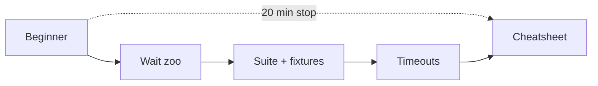
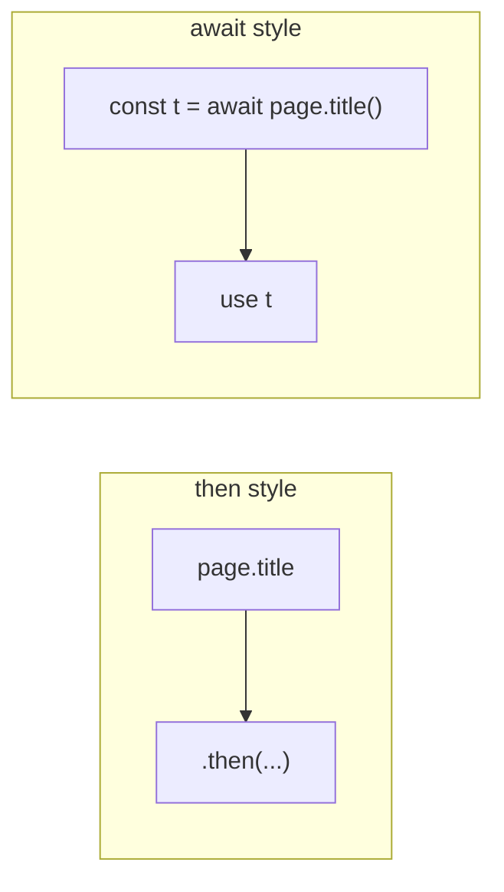
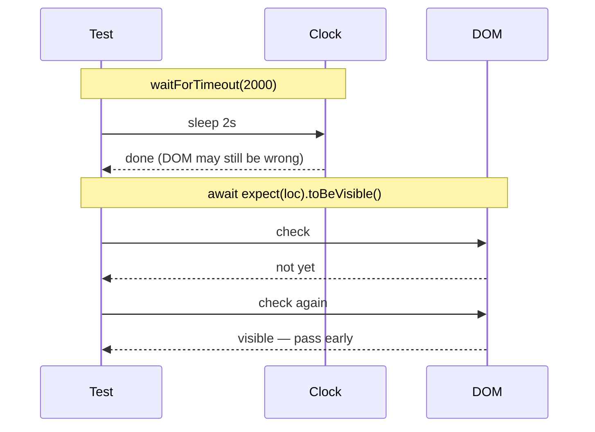
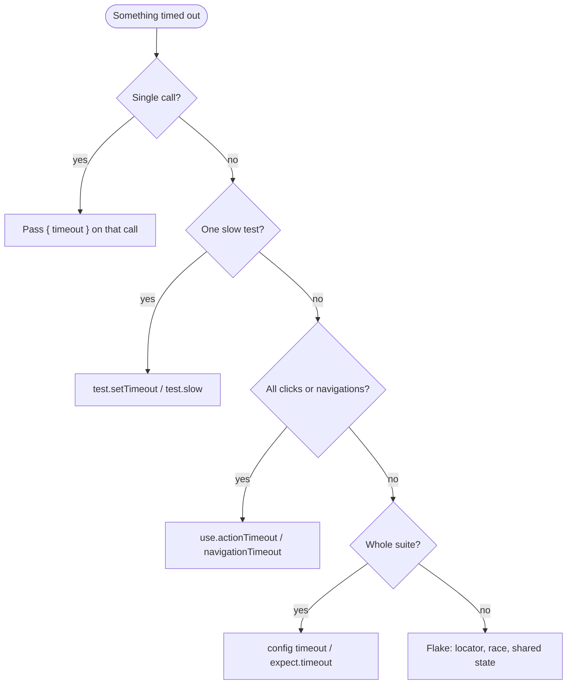

The job is simple on the briefing slide: "open the page, click the button, prove it worked."

Then someone hands you the earpiece and you hear three different clocks, two kinds of `expect`, a folder full of `*.spec.ts`, and a senior engineer muttering *just await it*. You are not failing at TypeScript. You are missing the mission map.

> *"Why do we fall, sir?"* — *Batman Begins*. So we can read the timeout error, name which clock fired, and stop bribing the suite with `waitForTimeout(2000)`.

This post is that map: **async/await**, the **wait zoo** (sleep cousins vs real waits), how you **build a suite** (`test` / `describe` / `it` / fixtures), and **timeouts** you can configure without guessing.

**Demo surface:** [playwright.dev](https://playwright.dev). Relative URLs assume `use.baseURL` when noted.

Related: .

## Table of contents {#toc}

1. [If you only have 20 minutes](#if-you-only-have-20-minutes)
2. [Prerequisites](#prerequisites)
3. [Act 1 — Async is the first boss](#act-1-async)
   - [Your first real test](#your-first-real-test)
   - [async and await](#async-and-await)
   - [Promise.all vs sequential await](#promiseall-vs-sequential-await)
   - [The wait zoo](#the-wait-zoo)
4. [Act 2 — Building the suite](#act-2-suite)
   - [Folder shape](#folder-shape)
   - [test vs describe vs it](#test-vs-describe-vs-it)
   - [How a suite grows](#how-a-suite-grows)
   - [Hooks](#hooks)
   - [Fixtures](#fixtures)
5. [Act 3 — Timeout mission control](#act-3-timeouts)
6. [Locators and assertions (support gear)](#locators-and-assertions)
7. [Config, debug, API, page objects](#config-debug-api-pos)
8. [Cheatsheet](#cheatsheet)
9. [Best practices](#best-practices)
10. [Sources](#sources)

### If you only have 20 minutes {#if-you-only-have-20-minutes}

| Track | Jump | Stop when |
|-------|------|-----------|
| **Beginner** | [First test](#your-first-real-test) → [async](#async-and-await) → [wait zoo](#the-wait-zoo) | You can explain `await` and why sleep is a trap |
| **Builder** | [Folder shape](#folder-shape) → [suite growth](#how-a-suite-grows) → [fixtures](#fixtures) | You know when to reach for fixtures |
| **Timeout hunter** | [Wait zoo](#the-wait-zoo) → [Act 3](#act-3-timeouts) → [Cheatsheet](#cheatsheet) | You can name which clock failed from the error text |



---

## Prerequisites {#prerequisites}

- **Node.js 18+**
- `@playwright/test` installed
- Browsers via Playwright

```bash
npm init playwright@latest
# or
npm i -D @playwright/test
npx playwright install
```

```bash
npx playwright test
npx playwright test --ui
```

---

# Act 1 — Async is the first boss {#act-1-async}

## Your first real test {#your-first-real-test}

A test without an assertion is a script wearing a badge. Start with something that can fail.

```typescript
import { test, expect } from '@playwright/test';

test('playwright.dev shows the get started link', async ({ page }) => {
  await page.goto('https://playwright.dev/');
  await expect(page).toHaveTitle(/Playwright/);
  await expect(page.getByRole('link', { name: 'Get started' })).toBeVisible();
});
```

| Line | Plain English |
|------|----------------|
| `import { test, expect }` | Pull in the runner and assertions |
| `async ({ page }) =>` | This mission may pause; `page` is a fresh tab fixture |
| `await page.goto(...)` | Navigate and wait for the load state |
| `await expect(...).toBeVisible()` | Poll until true or the **expect** timeout fires |

{:.post-illustration}
*English illustration: with `await`, each step finishes before the next.*

## async and await {#async-and-await}

Think of packing a kit bag. Each piece has to *exist* before you zip the bag.

```typescript
async function packMissionKit() {
  const map = await printMap();
  const radio = await chargeRadio();
  await stowInBag(map, radio);
  return 'ready';
}
```

| Keyword | Job |
|---------|-----|
| `async` on a function | "This function may pause." It returns a Promise. |
| `await` on an expression | Pause **this** async function until that Promise settles. |

**Rule:** if a function body uses `await`, that function must be `async`. JavaScript enforces it.

**Beginner trap:** without `await`, you do not get finished values. You get `Promise` objects. Playwright APIs almost always want sequential `await` so each browser action completes before the next.

### Prefer `await` over `.then()` chains

```typescript
// Works, harder to debug
await page.title().then((title) => console.log(title));

// Standard Playwright style
const title = await page.title();
await expect(page).toHaveTitle(/Playwright/);
```



### `const` vs `let`

Default to `const`. Use `let` only when you will reassign.

```typescript
const title = await page.title();
let attempts = 0;
attempts += 1;
```

## Promise.all vs sequential await {#promiseall-vs-sequential-await}

Sequential `await` is the default mission:

```typescript
await page.getByRole('button', { name: 'Save' }).click();
await expect(page.getByText('Saved')).toBeVisible();
```

`Promise.all` is for **starting two promises together** so you do not miss a fast event:

```typescript
const [response] = await Promise.all([
  page.waitForResponse((r) => r.url().includes('/api/save') && r.ok()),
  page.getByRole('button', { name: 'Save' }).click(),
]);
```

| Pattern | Means | Use when |
|---------|-------|----------|
| `await a; await b;` | Do a, then b | Most Playwright steps |
| `Promise.all([a, b])` | Start a and b, wait for both | Click + waitForResponse race |
| `Promise.all` without await | You only started work | Almost always a bug in a test |

`Promise.all` is **not** a sleep. It is not a timeout setting. It is JavaScript concurrency.

## The wait zoo {#the-wait-zoo}

Here is where most flaky suites are born: people mix **fixed sleeps**, **condition waits**, **concurrent promises**, and **config clocks** as if they were the same animal.

{:.post-illustration}
*English illustration: four families of "waiting" that are not interchangeable.*

### Side-by-side

| Tool | Ecosystem | What it does | When to use |
|------|-----------|--------------|-------------|
| `browser.sleep(ms)` / `Thread.sleep` | **Selenium / Java / WebDriver cousins** | Freeze the thread for N ms | **Not Playwright.** Migration footgun only. |
| `page.waitForTimeout(ms)` | Playwright | Fixed sleep in the page timeline | Almost **never** for stability |
| `await expect(locator).toBeVisible()` | Playwright Test | Poll until true or expect timeout | Default for UI truth |
| `locator.waitFor({ state })` | Playwright | Wait for attached/visible/hidden/detached | Before a non-assert action |
| `page.waitForResponse(...)` | Playwright | Wait for a network call you caused | Click that triggers API |
| `Promise.all([...])` | JavaScript | Run promises concurrently | Pair event + action |
| `timeout` in config | Playwright Test | Whole-test ceiling (default 30s) | Long flows |
| `expect.timeout` | Playwright Test | Assertion poll window (default 5s) | Slow UI, not first fix for flakes |
| `actionTimeout` / `navigationTimeout` | Playwright `use` | Cap actions / navigations (default **none**) | Policy across the suite |

> *"Are you not entertained?"* — *Gladiator*. Fixed sleeps entertain nobody in CI. They either pass by luck or fail by calendar.

### Event flow: sleep vs expect



**Role-play (two minutes):**

- **Junior:** "It fails on CI. I added `await page.waitForTimeout(3000)`."
- **Lead:** "You paid three seconds every run and still guess. What condition means success?"
- **Junior:** "The Save toast."
- **Lead:** "`await expect(page.getByText('Saved')).toBeVisible()` — it returns early when ready, fails with a real message when not."

---

# Act 2 — Building the suite {#act-2-suite}

## Folder shape {#folder-shape}

{:.post-illustration}
*English illustration: config, tests, fixtures, optional page objects.*

```text
my-app/
  playwright.config.ts
  tests/
    auth/login.spec.ts
    shop/cart.spec.ts
  fixtures/
    auth.ts
  pages/                 # optional page objects
  package.json
```

You do not need every folder on day one. Start with `tests/example.spec.ts`. Grow when pain appears.

## test vs describe vs it {#test-vs-describe-vs-it}

### Flat style

```typescript
import { test, expect } from '@playwright/test';

test('user can open docs', async ({ page }) => {
  await page.goto('https://playwright.dev/docs/intro');
  await expect(page.getByRole('heading', { name: 'Installation' })).toBeVisible();
});
```

### Grouped style

```typescript
import { test, expect } from '@playwright/test';

test.describe('Documentation', () => {
  test('installation heading is visible', async ({ page }) => {
    await page.goto('https://playwright.dev/docs/intro');
    await expect(page.getByRole('heading', { name: 'Installation' })).toBeVisible();
  });

  test('writing tests page loads', async ({ page }) => {
    await page.goto('https://playwright.dev/docs/writing-tests');
    await expect(page.getByRole('heading', { name: 'Writing tests' })).toBeVisible();
  });
});
```

**The `it` myth:** some teams write `const it = test` for Jest muscle memory. Official docs teach **`test`** and **`test.describe`**. Do not import free-standing `describe` / `beforeEach` from `@playwright/test` as if this were Jasmine globals.

| Situation | Prefer |
|-----------|--------|
| Starting fresh | Flat `test` |
| Report folders / shared file hooks | `test.describe` |
| Reuse login across files | **Fixtures** |
| In-file parallel | `fullyParallel: true` or `test.describe.configure({ mode: 'parallel' })` |

### Parallelism (do not invert this)

{:.post-illustration}

1. **Files** can run on different workers at once.
2. **Tests in one file** run **in order** by default.
3. `describe` groups reports; it is not a parallel switch by itself.
4. Fixtures **isolate state**. They do not create workers.

## How a suite grows {#how-a-suite-grows}

Story time. Week one you have one test. Week two you have forty copies of login. Week three someone invents a shared `beforeAll` that stores a cookie in a global. Week four CI is a mystery novel.

**Healthier growth path:**

1. One flat test with real `expect`
2. Split files by feature (`auth/`, `shop/`)
3. `test.describe` when reports need folders or file-local hooks
4. **Fixtures** when setup is reused across files
5. Projects for browsers / CI shape
6. Page objects when selectors repeat (optional)

{:.post-illustration}
*English illustration: what runs when you launch the suite.*

## Hooks {#hooks}

Hooks are methods on **`test`**. They work at **file scope** or inside `test.describe`.

```typescript
import { test, expect } from '@playwright/test';

test.beforeEach(async ({ page }) => {
  await page.goto('https://playwright.dev/');
});

test('has docs link', async ({ page }) => {
  await expect(page.getByRole('link', { name: 'Docs' })).toBeVisible();
});

test.describe('API docs', () => {
  test.beforeAll(async () => {
    // once per worker for this group
  });

  test('Page class docs load', async ({ page }) => {
    await page.goto('https://playwright.dev/docs/api/class-page');
    await expect(page.getByRole('heading', { name: 'Page', exact: true })).toBeVisible();
  });
});
```

| Hook | Runs | Use for |
|------|------|---------|
| `test.beforeAll` | Once per worker/group | Expensive shared setup (careful: shared state) |
| `test.beforeEach` | Before each test | Fresh navigation |
| `test.afterEach` | After each test | Attachments, cleanup |
| `test.afterAll` | Once after group | Shared teardown |

**Warning:** `beforeAll` shares state. If test 1 mutates what test 2 needs, you get a civil war inside one worker. Prefer fixtures for per-test isolation.

## Fixtures {#fixtures}

> *"I never leave home without the essentials."* — Q energy, *Skyfall* era. Fixtures are the kit that survives from mission to mission without leaking state between agents.

### Custom fixture

```typescript
// fixtures/auth.ts
import { test as base, expect, type Page } from '@playwright/test';

type MyFixtures = {
  docsPage: Page;
};

export const test = base.extend<MyFixtures>({
  docsPage: async ({ page }, use) => {
    await page.goto('https://playwright.dev/docs/intro');
    await expect(page.getByRole('heading', { name: 'Installation' })).toBeVisible();
    await use(page);
    // teardown after the test finishes with this fixture
  },
});

export { expect };
```

```typescript
// tests/docs.spec.ts
import { test, expect } from '../fixtures/auth';

test('writing tests nav exists', async ({ docsPage }) => {
  await docsPage.getByRole('link', { name: 'Writing tests' }).click();
  await expect(docsPage.getByRole('heading', { name: 'Writing tests' })).toBeVisible();
});
```

{:.post-illustration}

| Concern | Hooks in a file | Fixtures |
|---------|-----------------|----------|
| Reuse across files | Copy-paste | Import extended `test` |
| Per-test isolation | Easy to leak in `beforeAll` | Fresh setup per test by default |
| TypeScript autocomplete | Manual | Fixture names type-check |
| Parallel safety | Shared state footgun | Designed for isolation |

**Role-play:**

- **Agent:** "I need logged-in state in five files."
- **Q:** "Do not paste login. Extend `test` with `loggedInPage`. Each mission gets its own kit. Teardown after `use()`."

### Filtering runs

```bash
npx playwright test -g "installation"
npx playwright test tests/docs.spec.ts
npx playwright test --project=chromium
npx playwright test --headed
npx playwright test --debug
npx playwright test --ui
```

---

# Act 3 — Timeout mission control {#act-3-timeouts}

A timeout is a promise: "I will wait this long for reality to match expectation." Too short: flakes. Too long: slow feedback that hides real bugs.

{:.post-illustration}

## The two big numbers

```typescript
import { defineConfig } from '@playwright/test';

export default defineConfig({
  timeout: 30 * 1000,              // whole-test ceiling
  expect: { timeout: 5_000 },      // assertion polling window
});
```

1. **`timeout`** — test ceiling. Includes fixture **setup**, `beforeEach`, and the body. After the body, **teardown + afterEach share a separate budget of the same length** ([docs](https://playwright.dev/docs/test-timeouts)).
2. **`expect.timeout`** — how long auto-retrying assertions poll.

```typescript
test('slow checkout', async ({ page }) => {
  test.setTimeout(120_000);
  // or: test.slow(); // triples the default test timeout
});
```

## Action and navigation

Default **action** and **navigation** timeouts are **none** (still bounded by the test timeout).

```typescript
await page.getByRole('link', { name: 'Get started' }).click({ timeout: 10_000 });

// config-wide
// use: { actionTimeout: 10_000, navigationTimeout: 30_000 }
```

There is **no** `use.clickTimeout` or `use.fillTimeout`.

### Actionability (accurate)

Before `click()`, Playwright waits until the target is, among other checks ([actionability](https://playwright.dev/docs/actionability)):

1. **Visible**
2. **Stable** — two consecutive animation frames (not a fixed 500 ms sleep)
3. **Enabled** — not disabled (not "no overlay")
4. **Receives events** — not obscured
5. Often **exactly one** match

## Navigation load states

| `waitUntil` | Meaning |
|-------------|---------|
| `commit` | Navigation committed |
| `domcontentloaded` | DOM parsed |
| `load` | Default for `goto` |
| `networkidle` | No network for 500 ms — fragile on modern apps |

Prefer: navigate, then assert a **locator**.

## Retries

```typescript
export default defineConfig({
  retries: process.env.CI ? 2 : 0, // number only
});
```

**Flaky (official):** failed first run, passed on a retry.  
There is **no** `retries: { mode: 'rewriteEach' }` API.

## Fixture timeouts

```typescript
heavy: [
  async ({}, use) => {
    await use('ready');
  },
  { timeout: 60_000 },
],
```

## Triage



| Error shape | Likely clock |
|-------------|--------------|
| `Test timeout of 30000ms exceeded` | Test ceiling |
| `expect… timeout 5000ms` | Expect window |
| `locator.click: Timeout` | Action / actionability |
| `page.goto: Timeout` | Navigation |
| Passed on retry | **Flaky** — fix root cause |

---

# Locators and assertions (support gear) {#locators-and-assertions}

A **locator** re-resolves when you act. That is different from grabbing a DOM node once.

{:.post-illustration}

| Rank | API |
|------|-----|
| 1 | `getByRole` |
| 2 | `getByLabel` |
| 3 | `getByText` / placeholder / alt / title |
| 4 | `getByTestId` |
| 5 | CSS locator |
| 6 | XPath last |

Locator `expect` **polls**. Plain value `expect` does not.

```typescript
await expect(page.getByRole('heading', { name: 'Installation' })).toBeVisible();
await expect(page.getByText('Slow')).toBeVisible({ timeout: 10_000 });
```

---

# Config, debug, API, page objects {#config-debug-api-pos}

## Config sketch

```typescript
import { defineConfig, devices } from '@playwright/test';

export default defineConfig({
  testDir: './tests',
  fullyParallel: true,
  timeout: 30_000,
  expect: { timeout: 5_000 },
  forbidOnly: !!process.env.CI,
  retries: process.env.CI ? 2 : 0,
  workers: process.env.CI ? 2 : undefined,
  reporter: 'html',
  use: {
    baseURL: 'https://playwright.dev',
    trace: 'on-first-retry',
    screenshot: 'only-on-failure',
    video: 'retain-on-failure',
  },
  projects: [
    { name: 'chromium', use: { ...devices['Desktop Chrome'] } },
    { name: 'firefox', use: { ...devices['Desktop Firefox'] } },
    { name: 'webkit', use: { ...devices['Desktop Safari'] } },
  ],
});
```

## Debugging triad

{:.post-illustration}

| Tool | Command |
|------|---------|
| UI Mode | `npx playwright test --ui` |
| Inspector | `npx playwright test --debug` |
| Trace | `npx playwright show-trace trace.zip` |

## API fixture

```typescript
test('docs site responds', async ({ request }) => {
  const response = await request.get('https://playwright.dev/');
  expect(response.ok()).toBeTruthy();
});
```

Strong pattern: seed via API, assert via UI.

## Page objects (opinion)

Encapsulate selectors and flows. Prefer fixtures for auth. Combine: fixture yields a page object.

---

# Cheatsheet {#cheatsheet}

```text
ASYNC
  async fn  → may pause, returns Promise
  await x   → pause until x settles
  Promise.all([a,b]) → start both, wait both (not a sleep)

WAITS
  ❌ browser.sleep          → Selenium cousin, not Playwright
  ❌ waitForTimeout(ms)     → fixed sleep, last resort
  ✅ await expect(loc)...   → auto-retry UI truth
  ✅ waitForResponse        → network you caused
  ✅ Promise.all(click+wait)→ avoid missing fast events

SUITE
  test('name', async ({ page }) => {})
  test.describe('group', () => { ... })
  test.beforeEach / afterEach / beforeAll / afterAll
  fixtures: base.extend + await use(value)

TIMEOUTS
  (1) test ceiling     timeout: 30_000
  (2) assert window    expect: { timeout: 5_000 }
  (3) actions          use.actionTimeout (default none)
  (4) navigations      use.navigationTimeout (default none)
  (5) one test         test.setTimeout / test.slow()
  (6) one call         click({ timeout })
  (7) one expect       expect(loc).toBeVisible({ timeout })
  (8) one fixture      [fn, { timeout: 60_000 }]

PARALLEL
  files parallel by default
  tests in a file serial unless fullyParallel / describe.configure
  fixtures isolate; they do not create workers
```

---

# Best practices {#best-practices}

**Do**

1. Assert with `await expect(locator)...` as your default wait.
2. Prefer `getByRole` / `getByLabel` / `getByTestId`.
3. Grow suite folders by feature, not by "misc".
4. Use fixtures for shared setup that must not leak.
5. Read the full timeout error before raising numbers.
6. Pair `waitForResponse` with the click via `Promise.all` when needed.
7. Keep `retries` low and treat "flaky" as a bug report, not a feature.
8. Use `--ui` and traces before adding sleeps.

**Don't**

1. Do not use `browser.sleep` thinking it is Playwright.
2. Do not stabilize tests with `waitForTimeout`.
3. Do not import free `describe` / `beforeEach` as if globals always exist.
4. Do not treat flat vs nested as "parallel vs serial".
5. Do not invent `clickTimeout` / retry `mode` objects in config.
6. Do not share mutable `beforeAll` state across independent tests.
7. Do not bump `expect.timeout` to paper over a wrong selector.
8. Do not ship a first test with only `console.log`.

> *"The clock is a liar; the DOM is the truth."* Keep that line taped above the CI badge.

---

## Sources & Further Reading {#sources}

1. [Playwright Test — Timeouts](https://playwright.dev/docs/test-timeouts)
2. [Playwright Test — Parallelism](https://playwright.dev/docs/test-parallel)
3. [Playwright Test — Fixtures](https://playwright.dev/docs/test-fixtures)
4. [Playwright — Locators](https://playwright.dev/docs/locators)
5. [Playwright — Actionability](https://playwright.dev/docs/actionability)
6. [Playwright Test — Retries](https://playwright.dev/docs/test-retries)
7. [Playwright Test — Configuration](https://playwright.dev/docs/test-configuration)
8. [Playwright — Writing tests](https://playwright.dev/docs/writing-tests)
