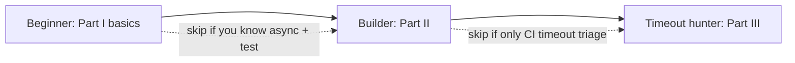
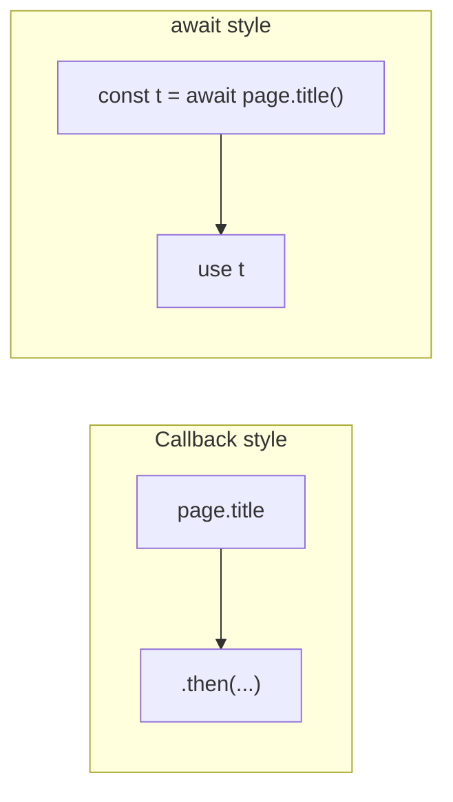
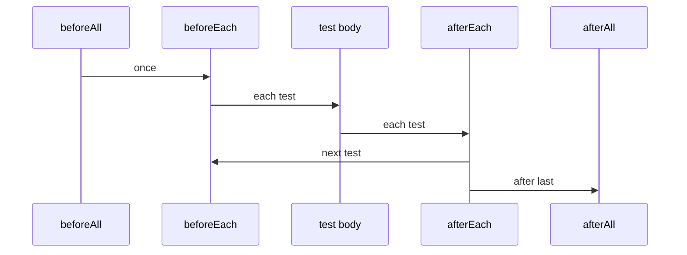
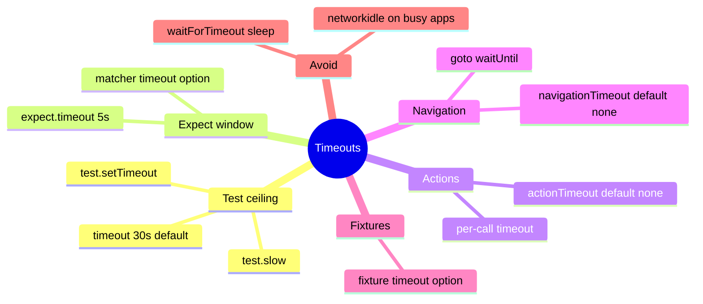
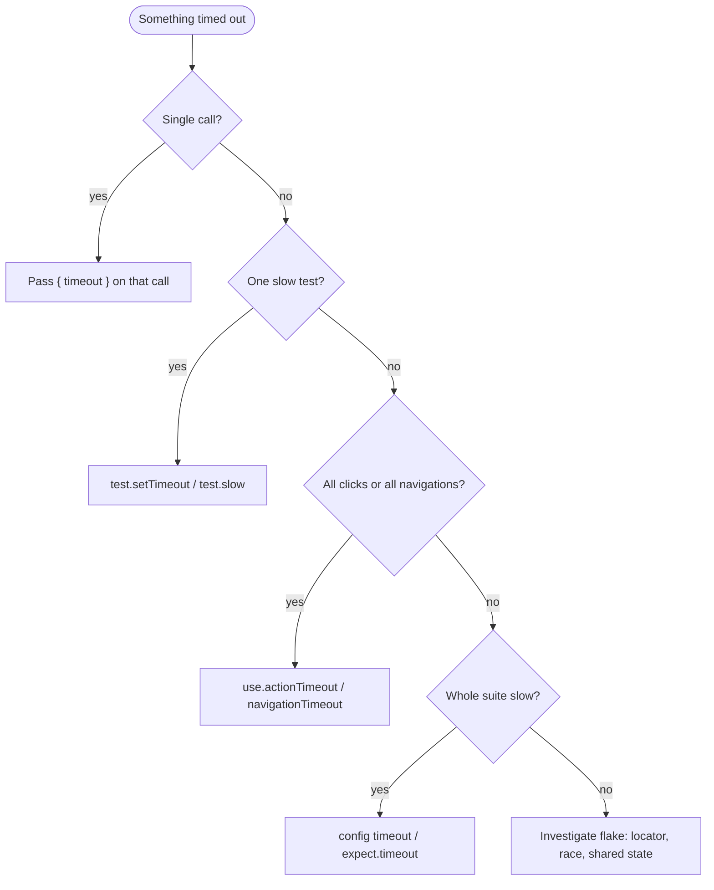

Your first Playwright file looks simple until it does not. Suddenly you are staring at `async`, fixtures, `fullyParallel`, and a timeout error that names three different clocks.

I spent years watching teams treat browser tests like Selenium with new syntax: copy-paste login, `waitForTimeout(2000)`, and a prayer for CI. This post is the map I wish we had. Beginner path for day one. Advanced path for the timeout that only fails at 2 AM.

> *"Why do we fall, sir?"* — *Batman Begins*. So we can read the error, fix the real clock, and stop guessing with sleeps.

**Demo surface used below:** [playwright.dev](https://playwright.dev) (stable, official). Relative URLs assume `use.baseURL` when noted.

Related reading on this site: .

## Dual-track map (read only what you need)

| Track | Read | Stop when |
|-------|------|-----------|
| **Beginner** | [Prerequisites](#prerequisites) → [Part I](#part-i-basics) through [Learning path](#learning-path-four-weeks) | You can write a test with `await expect(...)` and explain `async`/`await` |
| **Builder** | [Part II](#part-ii-builders) (locators, config, debug, API, page objects) | Locators and fixtures feel boring (that is success) |
| **Timeout hunter** | [Part III](#part-iii-timeouts) | You can name which timeout fired from the error text |



---

## Prerequisites

- **Node.js 18+** (LTS is fine)
- A project with `@playwright/test` installed
- Chromium via Playwright browsers

```bash
npm init playwright@latest
# or in an existing repo:
npm i -D @playwright/test
npx playwright install
```

Run one file:

```bash
npx playwright test
npx playwright test --ui
```

---

# Part I: The basics {#part-i-basics}

## Chapter 1: Your first real test

A test without an assertion is a script wearing a badge. Start with something that can fail.

```typescript
import { test, expect } from '@playwright/test';

test('playwright.dev shows the get started link', async ({ page }) => {
  await page.goto('https://playwright.dev/');
  await expect(page).toHaveTitle(/Playwright/);
  await expect(page.getByRole('link', { name: 'Get started' })).toBeVisible();
});
```

| Line | Plain English |
|------|----------------|
| `import { test, expect }` | Pull in the test runner and assertions |
| `test('…', async ({ page }) => {…})` | Register a test; `page` is a fresh tab fixture |
| `await page.goto(...)` | Navigate and wait for the load state |
| `await expect(...).toBeVisible()` | Poll until true or the expect timeout fires |

{:.post-illustration}
*English illustration: with `await`, each step finishes before the next; without it, you hold Promises, not results.*

### The magic words: `async` and `await`

Think of building a gadget belt one piece at a time:

```typescript
async function prepareUtilityBelt() {
  const batarang = await forgeBatarang();
  const grapple = await buildGrappleGun();
  await attachToBelt(batarang, grapple);
  return 'ready';
}
```

| Keyword | Job |
|---------|-----|
| `async` on a function | Marks that this function may pause; it returns a Promise |
| `await` on an expression | Pause **this** async function until that Promise settles |

**Rule:** if a function body uses `await`, that function must be `async`. JavaScript enforces it.

**Nuance beginners miss:** without `await`, you do not magically get finished values. You get `Promise` objects. Whether work overlaps depends on how you start those promises (`Promise.all` vs sequential `await`). Playwright APIs almost always want sequential `await` so each browser action completes before the next.

### Prefer `await` over `.then()` chains

```typescript
// Works, but harder to debug
await page.title().then((title) => {
  console.log(title);
});

// Standard Playwright style
const title = await page.title();
await expect(page).toHaveTitle(/Playwright/);
```



---

## Chapter 2: `const` vs `let`

```typescript
const title = await page.title(); // reassignment forbidden
let attempts = 0;                 // reassignment allowed
attempts += 1;
```

Default to `const`. Switch to `let` only when you will reassign (counters, swaps). TypeScript will yell when you picked wrong — that's free insurance.

---

## Chapter 3: `test` vs `test.describe` (and the `it` myth)

### Flat style (common Playwright style)

```typescript
import { test, expect } from '@playwright/test';

test('user can open docs', async ({ page }) => {
  await page.goto('https://playwright.dev/docs/intro');
  await expect(page.getByRole('heading', { name: 'Installation' })).toBeVisible();
});
```

### Grouped style

```typescript
import { test, expect } from '@playwright/test';

test.describe('Documentation', () => {
  test('installation heading is visible', async ({ page }) => {
    await page.goto('https://playwright.dev/docs/intro');
    await expect(page.getByRole('heading', { name: 'Installation' })).toBeVisible();
  });

  test('writing tests page loads', async ({ page }) => {
    await page.goto('https://playwright.dev/docs/writing-tests');
    await expect(page.getByRole('heading', { name: 'Writing tests' })).toBeVisible();
  });
});
```

**Plot twist people oversell:** some teams alias `const { it } = { it: test }` for Jest muscle memory. Teach and import **`test`**. Official docs use `test` and `test.describe`.

### When to use which

| Situation | Prefer |
|-----------|--------|
| Starting fresh, independent cases | Flat `test` |
| Want report folders / shared file hooks | `test.describe` |
| Reusable login / roles across files | **Fixtures** (next chapters) |
| Maximum in-file parallelism | `fullyParallel: true` or `test.describe.configure({ mode: 'parallel' })` — not "flat vs nested" |

**My take:** start flat. Add `describe` when report grouping or file-local hooks earn their keep. Don't pre-optimize.

{:.post-illustration}
*English illustration: files run across workers; in-file order is serial unless you opt into full parallel.*

### Parallelism — the claim that broke the old draft

**Default behavior** ([official docs](https://playwright.dev/docs/test-parallel)):

1. **Different files** can run on different workers at the same time.
2. **Tests in the same file** run **one after another** in that worker.
3. `test.describe` **groups** tests; it does **not** by itself mean "serial forever" or "parallel forever."
4. To run tests in a file concurrently: `fullyParallel: true` in config, or `test.describe.configure({ mode: 'parallel' })`.
5. **Fixtures isolate state** so parallel runs are safer. They do **not** create workers by themselves.

```typescript
import { test } from '@playwright/test';

test.describe.configure({ mode: 'parallel' });

test('a', async ({ page }) => { /* ... */ });
test('b', async ({ page }) => { /* ... */ });
```

---

## Chapter 4: Hooks (`test.beforeEach`, not free imports)

Hooks are methods on **`test`**. They work at **file scope** or inside `test.describe`. They are **not** limited to describe blocks.

```typescript
import { test, expect } from '@playwright/test';

// File-level hook — no describe required
test.beforeEach(async ({ page }) => {
  await page.goto('https://playwright.dev/');
});

test('has docs link', async ({ page }) => {
  await expect(page.getByRole('link', { name: 'Docs' })).toBeVisible();
});

test.describe('API section', () => {
  test.beforeAll(async () => {
    // once per worker for this group
  });

  test('api docs reachable', async ({ page }) => {
    await page.goto('https://playwright.dev/docs/api/class-page');
    await expect(page.getByRole('heading', { name: 'Page', exact: true })).toBeVisible();
  });
});
```

| Hook | Runs | Typical use |
|------|------|-------------|
| `test.beforeAll` | Once per worker / group | Expensive shared setup (careful with shared state) |
| `test.beforeEach` | Before each test | Fresh navigation, storage seed |
| `test.afterEach` | After each test | Attachments, cleanup |
| `test.afterAll` | Once after group | Shared teardown |

**Warning:** `beforeAll` shares state across tests in that worker. If test 1 mutates what test 2 needs, you get mystery failures. Prefer fixtures for per-test isolation.



---

## Chapter 5: Fixtures — the Playwright superpower

Fixtures are your Q branch: build the gadget once, hand it to the mission, clean up after.

### Custom fixture

```typescript
// fixtures.ts
import { test as base, expect, Page } from '@playwright/test';

type MyFixtures = {
  docsPage: Page;
};

export const test = base.extend<MyFixtures>({
  docsPage: async ({ page }, use) => {
    await page.goto('https://playwright.dev/docs/intro');
    await expect(page.getByRole('heading', { name: 'Installation' })).toBeVisible();
    await use(page);
    // teardown after the test finishes with this fixture
  },
});

export { expect };
```

```typescript
// docs.spec.ts
import { test, expect } from './fixtures';

test('writing tests nav exists', async ({ docsPage }) => {
  await docsPage.getByRole('link', { name: 'Writing tests' }).click();
  await expect(docsPage.getByRole('heading', { name: 'Writing tests' })).toBeVisible();
});
```

{:.post-illustration}
*English illustration: setup → `use()` hands control to the test → teardown runs after.*

| Concern | Hooks in a file | Fixtures |
|---------|-----------------|----------|
| Reuse across files | Copy-paste or helpers | Import extended `test` |
| Per-test isolation | Easy to share mutable state in `beforeAll` | Fresh setup per test by default |
| TypeScript autocomplete | Manual | Fixture names type-check |
| Parallel safety | Shared state is a footgun | Designed for isolation |

You can still run independent tests in parallel **across files** without custom fixtures. Fixtures shine when setup is non-trivial and must not leak between tests.

---

## Chapter 6: Filtering runs

```bash
npx playwright test -g "installation"
npx playwright test tests/docs.spec.ts
npx playwright test --project=chromium
npx playwright test --headed
npx playwright test --debug
npx playwright test --ui
```

---

## Learning path (four weeks)

1. **Week 1:** `test`, `page.goto`, role locators, `await expect` — no fixtures yet  
2. **Week 2:** Notice repeated login/setup pain  
3. **Week 3:** Move setup into fixtures; keep tests short  
4. **Week 4:** `test.describe` for report structure; wire CI retries carefully  

---

# Part II: Beyond the basics {#part-ii-builders}

## Chapter 7: Locators

A **locator** is a description Playwright re-resolves when you act. That is different from grabbing a DOM node once and hoping it is still attached.

```typescript
import { test, expect } from '@playwright/test';

test('get started is reachable', async ({ page }) => {
  await page.goto('https://playwright.dev/');
  const getStarted = page.getByRole('link', { name: 'Get started' });
  await expect(getStarted).toBeVisible();
  await getStarted.click();
  await expect(page).toHaveURL(/docs/);
});
```

{:.post-illustration}
*English illustration: role and label first; CSS and XPath last.*

| Rank | API | Why |
|------|-----|-----|
| 1 | `getByRole` | Matches users + accessibility tree |
| 2 | `getByLabel` | Forms |
| 3 | `getByText` / `getByPlaceholder` / `getByAltText` / `getByTitle` | Visible semantics |
| 4 | `getByTestId` | Stable when copy is volatile |
| 5 | `page.locator('css')` | Layout-coupled fallback |
| 6 | XPath | Last resort |

```typescript
const row = page.getByRole('row', { name: /Chromium/i });
await row.getByRole('link').click();

await page.getByRole('listitem').filter({ hasText: 'TypeScript' }).first().click();
```

### Soft assertions

```typescript
await expect.soft(page.getByText('A')).toBeVisible();
await expect.soft(page.getByText('B')).toBeVisible();
// test continues; failures accumulate
```

Use sparingly. Prefer fail-fast for dependencies (can't click login if the button never appeared).

---

## Chapter 8: Assertions that retry

Locator assertions **poll** until the expect timeout (default **5 seconds**). Plain value assertions do not.

```typescript
// Auto-retry (locator) — note the await
await expect(page.getByRole('heading', { name: 'Installation' })).toBeVisible();

// One-shot (value)
const title = await page.title();
expect(title.length).toBeGreaterThan(0);
```

**Beginner trap:** forgetting `await` on locator expects. You lose the auto-retry benefit.

| Matcher | Reads as |
|---------|----------|
| `toBeVisible()` | Shown and has a box |
| `toBeHidden()` | Not visible (not the same as "exists") |
| `toBeEnabled()` / `toBeDisabled()` | Interactable state |
| `toHaveText` / `toContainText` | Content |
| `toHaveURL` / `toHaveTitle` | Navigation |
| `toHaveScreenshot` | Visual baseline |

Override expect timeout on the **matcher**:

```typescript
await expect(page.getByText('Slow panel')).toBeVisible({ timeout: 10_000 });
```

---

## Chapter 9: `playwright.config.ts`

```typescript
import { defineConfig, devices } from '@playwright/test';

export default defineConfig({
  testDir: './tests',
  fullyParallel: true, // opt-in: all tests can run in parallel (including within a file)
  timeout: 30_000, // whole-test ceiling (default 30s)
  expect: { timeout: 5_000 }, // assertion polling window (default 5s)
  forbidOnly: !!process.env.CI,
  retries: process.env.CI ? 2 : 0, // pattern, not a framework default of "2 on CI"
  workers: process.env.CI ? 2 : undefined, // default locally: ~half of CPU cores
  reporter: 'html',
  use: {
    baseURL: 'https://playwright.dev',
    trace: 'on-first-retry',
    screenshot: 'only-on-failure',
    video: 'retain-on-failure',
    // actionTimeout / navigationTimeout default to no limit (still capped by test timeout)
    // actionTimeout: 10_000,
    // navigationTimeout: 30_000,
  },
  projects: [
    { name: 'chromium', use: { ...devices['Desktop Chrome'] } },
    { name: 'firefox', use: { ...devices['Desktop Firefox'] } },
    { name: 'webkit', use: { ...devices['Desktop Safari'] } },
  ],
});
```

With `baseURL` set:

```typescript
await page.goto('/docs/intro'); // → https://playwright.dev/docs/intro
```

| Setting | Framework default | Notes |
|---------|-------------------|--------|
| `timeout` | 30s | Entire test + fixture setup + beforeEach |
| `expect.timeout` | 5s | Per auto-retrying assertion |
| `actionTimeout` | none | Clicks/fills; override per call with `{ timeout }` |
| `navigationTimeout` | none | goto / waitForURL, etc. |
| `fullyParallel` | false (unless you set it) | Scaffold templates often set `true` |
| `retries` | 0 | CI often sets 1–2 |

There is **no** `use.clickTimeout` or `use.fillTimeout` in Playwright Test options. Use `actionTimeout` or per-call `{ timeout }`.

---

## Chapter 10: Debugging

{:.post-illustration}
*English illustration: UI for daily work, Inspector to step, Trace for CI autopsies.*

| Tool | Command | When |
|------|---------|------|
| UI Mode | `npx playwright test --ui` | Local development |
| Inspector | `npx playwright test --debug` | Step action-by-action |
| Trace Viewer | `npx playwright show-trace trace.zip` | After failure/retry |

### Anti-flake checklist

- Prefer locator `expect` over `page.waitForTimeout`
- Avoid `networkidle` on apps with polling, analytics, or websockets
- Prefer `getByRole` / `getByTestId` over deep CSS
- Do not share mutable `beforeAll` state across parallel tests
- Pin viewport/timezone when layout or dates matter

**Iron law:** if you reach for `waitForTimeout(3000)`, stop. The clock is a liar. The DOM (or the network response you caused) is the truth.

---

## Chapter 11: API testing with the `request` fixture

```typescript
import { test, expect } from '@playwright/test';

test('docs site responds', async ({ request }) => {
  const response = await request.get('https://playwright.dev/');
  expect(response.ok()).toBeTruthy();
});
```

**Strong pattern:** seed state via API, assert outcomes via UI. Fewer flaky login clicks when your backend allows it.

---

## Chapter 12: Page objects (opinion, labeled)

Page objects keep selectors in one place. **Opinion:** put navigation and user flows on the PO; put business expectations in the test (or in small PO helper methods if every caller needs the same guard).

```typescript
// pages/DocsHome.ts
import { Page, expect } from '@playwright/test';

export class DocsHome {
  constructor(private readonly page: Page) {}

  async openIntro() {
    await this.page.goto('https://playwright.dev/docs/intro');
    await expect(this.page.getByRole('heading', { name: 'Installation' })).toBeVisible();
  }
}
```

| Need | Prefer |
|------|--------|
| Encapsulate a page's selectors/flows | Page object |
| Cross-test setup (auth, seed) | Fixture |
| Both | Fixture that yields a page object |

---

# Part III: The timeouts deep dive {#part-iii-timeouts}

A timeout is a promise: "I will wait this long for reality to match expectation." Too short: flakes. Too long: slow feedback that hides real bugs.

{:.post-illustration}
*English illustration: narrowest timeout wins; watch for fake config keys.*

## Map of the territory



## The two big numbers

```typescript
export default defineConfig({
  timeout: 30 * 1000,
  expect: { timeout: 5_000 },
});
```

1. **`timeout`** — whole-test ceiling. Includes fixture **setup**, `beforeEach`, and the test body. After the body, **teardown + afterEach share a separate budget of the same length** ([docs](https://playwright.dev/docs/test-timeouts)).
2. **`expect.timeout`** — how long an auto-retrying assertion polls.

```typescript
test('slow checkout', async ({ page }) => {
  test.setTimeout(120_000);
  // or: test.slow(); // triples the default test timeout
});
```

Extend mid-flight:

```typescript
testInfo.setTimeout(testInfo.timeout + 30_000);
```

## Action timeouts

Every interactable method accepts `{ timeout }`. Default **action** timeout is **none** (0); the **test** timeout still bounds the work.

```typescript
await page.getByRole('button', { name: 'Get started' }).click({ timeout: 10_000 });
```

Config-wide:

```typescript
use: {
  actionTimeout: 10_000,
  navigationTimeout: 30_000,
}
```

### Actionability (accurate version)

Before `click()`, Playwright waits until the target is, among other checks ([actionability](https://playwright.dev/docs/actionability)):

1. **Visible** — non-empty bounding box; not `visibility: hidden`
2. **Stable** — bounding box unchanged for **two consecutive animation frames** (not a fixed 500 ms sleep)
3. **Enabled** — not disabled / `aria-disabled` as applicable (**not** "no overlay")
4. **Receives events** — hit target not obscured (overlays, cookie banners)
5. **Attached** and, for many actions, **exactly one** match

`force: true` skips actionability. Use rarely; you lose diagnostics.

## Navigation and load states

| `waitUntil` | Meaning |
|-------------|---------|
| `commit` | Response received, navigation committed |
| `domcontentloaded` | DOM parsed |
| `load` | Default for `goto` — `load` event |
| `networkidle` | No network for **500 ms** — fragile on modern SPAs |

Prefer: navigate with a sensible `waitUntil`, then assert a **locator** for the condition you care about.

```typescript
await page.goto('/docs/intro', { waitUntil: 'domcontentloaded' });
await expect(page.getByRole('heading', { name: 'Installation' })).toBeVisible();
```

## `waitFor*` family

| Method | Use when |
|--------|----------|
| `locator.waitFor` | Need attached/visible/detached before non-assert work |
| `page.waitForResponse` | You triggered a specific network call |
| `page.waitForFunction` | Condition not expressible as a locator |
| `page.waitForTimeout` | **Almost never** — fixed sleep |

```typescript
await Promise.all([
  page.waitForResponse((r) => r.url().includes('/api') && r.ok()),
  page.getByRole('button', { name: 'Save' }).click(),
]);
```

## Retries (real API only)

```typescript
export default defineConfig({
  retries: process.env.CI ? 2 : 0, // number only
});
```

```bash
npx playwright test --retries=2
```

**Official meaning of flaky:** the test **failed on the first run** and **passed on a retry**. It is **not** "passed first, failed later."

There is **no** `retries: { mode: 'rewriteEach' }` or `reuseContext` mode. To reuse a page across tests, use serial mode plus `beforeAll`/`afterAll` deliberately. That is a different pattern from retries.

Each retry gets a **fresh worker** and a full timeout budget again.

## Fixtures and timeouts

Setup time counts toward the **test** timeout. For a slow fixture, give it its **own** timeout option:

```typescript
export const test = base.extend<{ heavy: string }>({
  heavy: [
    async ({}, use) => {
      // slow seed...
      await use('ready');
    },
    { timeout: 60_000 },
  ],
});
```

`test.setTimeout` inside a fixture changes the **test** budget for the consumer. Prefer the fixture `{ timeout }` form when only setup is slow ([fixture timeout](https://playwright.dev/docs/test-timeouts#fixture-timeout)).

## Triage flowchart



| Error shape | Likely clock |
|-------------|--------------|
| `Test timeout of 30000ms exceeded` | Test ceiling |
| `expect.toBeVisible with timeout 5000ms` | Expect window |
| `locator.click: Timeout …` | Action / actionability |
| `page.goto: Timeout …` | Navigation |
| Passed on retry | Marked **flaky** — fix root cause, don't only raise retries |

## Timeouts cheat sheet

```text
(1) test ceiling     defineConfig({ timeout: 30_000 })
(2) assert window    defineConfig({ expect: { timeout: 5_000 } })
(3) all navigations  use: { navigationTimeout: 30_000 }   // default: none
(4) all actions      use: { actionTimeout: 10_000 }       // default: none
(5) one test         test.setTimeout(120_000) / test.slow()
(6) one call         locator.click({ timeout: 10_000 })
(7) one assertion    expect(loc).toBeVisible({ timeout: 10_000 })
(8) one fixture      [fn, { timeout: 60_000 }]

NEVER: page.waitForTimeout as a stability strategy
AVOID: networkidle on chatty apps
PREFER: await expect(locator)… and waitForResponse for your own XHR
```

---

## Closing

You do not need every pattern on day one. You need:

1. Real assertions  
2. Honest `async`/`await`  
3. Locators that match user intent  
4. Fixtures when setup repeats  
5. The correct timeout when CI lies to you  

If this guide replaced a draft full of invented config keys and inverted parallel myths, good. Teach only APIs that typecheck against `@playwright/test`.

---

## Sources & Further Reading

1. [Playwright Test — Timeouts](https://playwright.dev/docs/test-timeouts)  
2. [Playwright Test — Parallelism](https://playwright.dev/docs/test-parallel)  
3. [Playwright Test — Fixtures](https://playwright.dev/docs/test-fixtures)  
4. [Playwright — Locators](https://playwright.dev/docs/locators)  
5. [Playwright — Actionability](https://playwright.dev/docs/actionability)  
6. [Playwright Test — Retries](https://playwright.dev/docs/test-retries)  
7. [Playwright Test — Configuration](https://playwright.dev/docs/test-configuration)  
