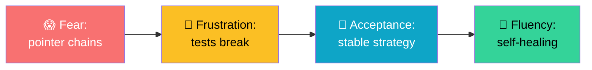
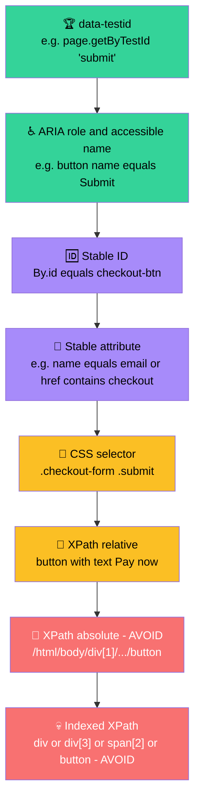
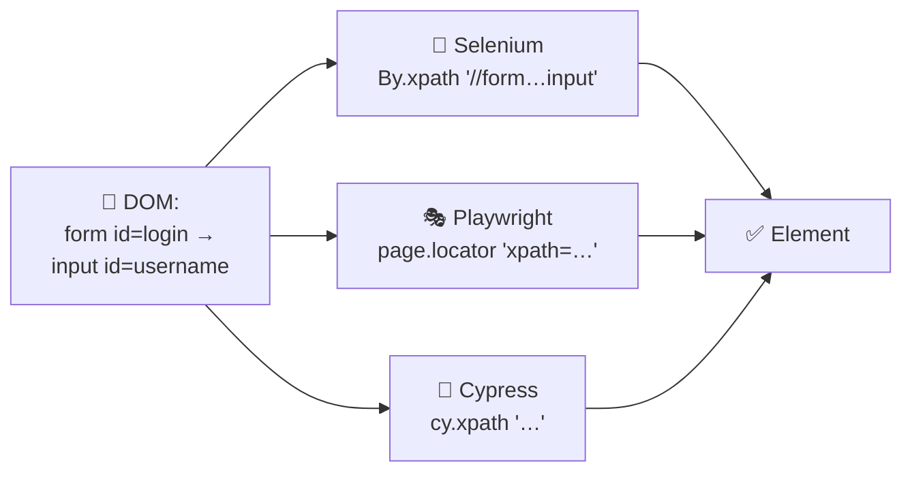
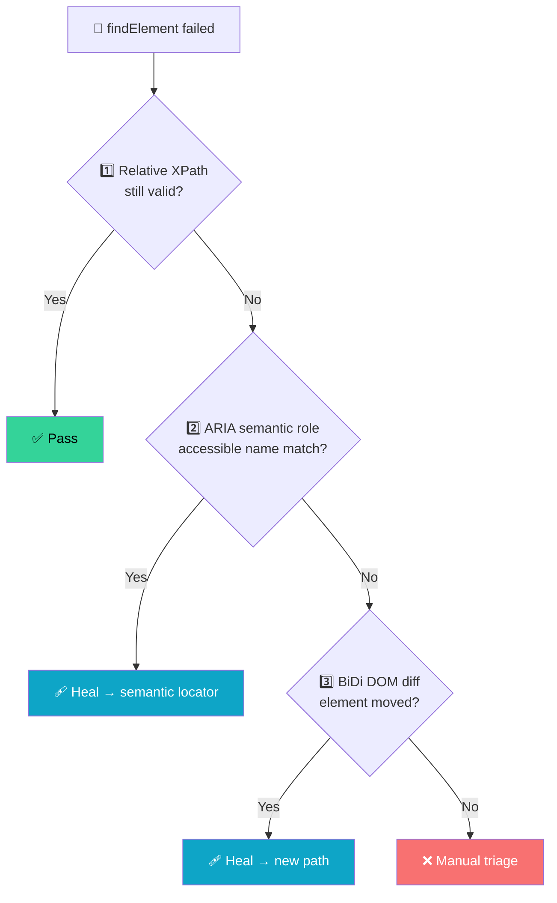
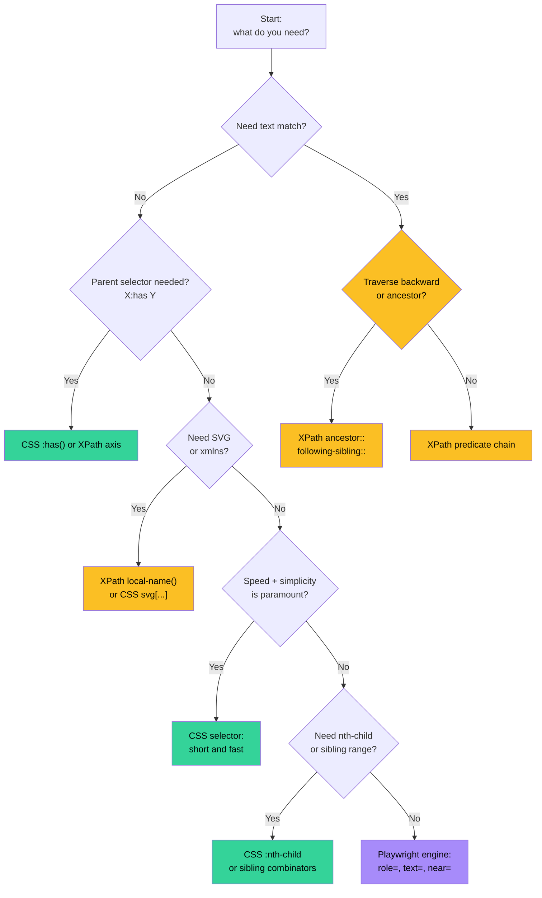

Most QA engineers have a complicated relationship with XPath.

It starts with **fear**. The first time you open a test suite and see `/html/body/div[1]/div[4]/form/div[2]/div[1]/div[1]/div/div[2]/input`, your eyes glaze over. Then comes **frustration** when a one-character CSS change breaks 87% of your tests at 2 AM. Eventually — usually after you write your third self-healing helper — you reach **acceptance**: XPath isn't the enemy, writing XPath badly is.

This post walks the whole arc. You'll learn:

- A **mental model** that makes XPath syntax intuitive (no memorization required)
- The **13 axes** as directions on a DOM map (with a diagram you can stare at until it clicks)
- The **10 functions** you'll actually use in day-to-day test work (and the 30 you can safely forget)
- **7 locator recipes** fired up against real sites like the-internet.herokuapp — annotated, dev-tested, copy-paste-friendly
- The **5 XPath mistakes** I see in every code review (so you can be the one who catches them)
- How XPath **fits into Playwright, Selenium, and Cypress** — including the 2026 shortcut that changes the game

Bookmark it for your first six months of automation work. When you're ready to graduate from article to pocket reference, jump to the companion **[XPath Cheatsheet]()** — dense, scannable, built to sit in your second monitor.

## In this post

13 sections (one is a `9.5` interlude between §9 and §10). Story mode first, reference mode last. If you only need a desk reference, jump to the [cheatsheet]() or the [translation appendix]() instead.

1. **[The Mental Model: Your DOM Is a Map](#1-the-mental-model-your-dom-is-a-map).** The city-map metaphor and the four base templates that unlock every XPath you'll write. *Read first.*
2. **[The Locator Priority Pyramid](#2-the-locator-priority-pyramid).** `data-testid` → ARIA role → ID → CSS → XPath. The decision tree you reach for before writing any locator.
3. **[Axes — The 13 Directions on Your DOM Map](#3-axes-the-13-directions-on-your-dom-map).** All 13 navigation axes plus which five you'll reach for in day-to-day work.
4. **[Your First Three Locators](#4-your-first-three-locators).** Copy-paste templates: By ID, By stable attribute, By relationship to a known anchor.
5. **[Functions You'll Actually Use (Out of ~120)](#5-functions-youll-actually-use-out-of-120).** The 10 XPath 1.0 functions covering ~90% of work, plus which XPath 2.0+ versions silently fail.
6. **[Predicates — The Real Power](#6-predicates-the-real-power).** The progressive-narrowing chain rule plus the *"row containing X"* idiom.
7. **[Seven Locator Recipes, Fired Up Against Real Sites](#7-seven-locator-recipes-fired-up-against-real-sites).** 7 copy-paste-ready XPaths against [the-internet.herokuapp.com](https://the-internet.herokuapp.com/) — login, dynamic button, table row, dropdown, checkout, current-nav, upload widget.
8. **[The 5 XPath Mistakes I See in Every Code Review](#8-the-5-xpath-mistakes-i-see-in-every-code-review).** Absolute paths, indexed XPath, `contains(@class, "btn")` over-match, missing `normalize-space()`, missing iframe/shadow context.
9. **[XPath Across Tools (Selenium, Playwright, Cypress)](#9-xpath-across-tools-selenium-playwright-cypress).** Same syntax, three APIs, plus the 2026 codegen macro-shift (`getByRole`, AI-generated locators).
   1. **9.5. [The SDET Playbook — POM, Waits, CI, and Observability](#sdet-playbook).** Locators as properties (not methods), wait contracts per framework, headless/CI pitfalls, failure-side observability. *The pivot from sandbox to production page-object code.*
10. **[Self-Healing: When XPath Stops Behaving](#10-self-healing-when-xpath-stops-behaving).** Layered healing: XPath → ARIA semantic role → BiDi DOM diff.
11. **[The 12-Question Refresher](#11-the-12-question-refresher).** Self-test before you bookmark, with expandable quick-answers folded.
12. **[Beyond the Basics: Complex XPath & CSS for SDETs](#12-beyond-the-basics-complex-xpath-css-for-sdets).** SVG namespace, computed indices, ARIA chains, iframe and shadow DOM piercing, modern CSS L4 (`:has()` / `:is()` / `:where()` / `:nth-child` formulas / sibling combinators / case-insensitive flag), the XPath-vs-CSS-vs-Playwright decision flowchart.

> **One-screen TL;DR:** [§2](#2-the-locator-priority-pyramid) (priority pyramid) + [§5](#5-functions-youll-actually-use-out-of-120) (10 functions) + [§7](#7-seven-locator-recipes-fired-up-against-real-sites) (7 recipes) + [§8](#8-the-5-xpath-mistakes-i-see-in-every-code-review) (5 mistakes) is the 80/20 — read those four and you can write 80% of the locators you will ever need.



---

## 1. The Mental Model: Your DOM Is a Map

Before syntax, you need a picture in your head. Jargon locks you into memorization. Stories unlock intuition.

> **Think of your DOM as a city.** The `<html>` element is the city center. Each tag is a building. Each attribute is a sign on the building. Text is what's painted on the walls. XPath is the directions you give a delivery driver: *"Go past the library, take the second left, find the red door."*

XPath is therefore two things mashed together:

1. **A path** — *where* in the DOM (which building)
2. **A predicate** — *which one* if there are many (which door)

That's it. Every XPath you've ever seen is some combination of **path** and **predicate**. Once that's internalized, syntax demystifies itself.

| Piece | What it answers | Templated form |
|---|---|---|
| `//tagname` | *Where* in the DOM (any depth) | `//{tag}` |
| `[@attr='value']` | *Which one* (filter by attribute) | `[@{attr}='{value}']` |
| `[n]` | *Which one* (the nth match) | `[{index}]` |
| `function()` | *Compound* which-one (contains, starts-with…) | `contains(@attr,'substring')` |

The cheatsheet is built around these four templates. If you can plug values into brackets, you can write XPath.

<details>
<summary><strong>🧪 Try it yourself (30 seconds)</strong></summary>

Open any browser → DevTools → Console. Run this:

```javascript
$x("//h1")[0]                                  // First h1 anywhere on the page
$x("//a[contains(@href,'github')]")            // All GitHub links
$x("//input[@type='checkbox' and not(@disabled)]") // Enabled checkboxes
document.querySelector("...") // CSS equivalent of above: input[type=checkbox]:not([disabled])
```

You're literally running XPATH from Chrome DevTools. Every time you face a tricky element, that's your sandbox. Use it.
</details>

---

## 2. The Locator Priority Pyramid

Before you ever write an XPath, decide **which kind** of locator deserves the slot. Reach for the most stable rung first; only descend when you must.



**Read it as a decision tree, not a ranking.** Every rung is the *right* choice in some situation:

- **`data-testid` and ARIA** are co-equal champions in 2026. Playwright even auto-generates them via codegen.
- **Stable IDs** are fine when the frontend team keeps them (most do for inputs).
- **CSS selectors** win on speed and readability for layout-driven queries.
- **Relative XPath** wins when the screen is data-driven — tables, dynamic lists, repeated rows.
- **Absolute XPath** is documentation, not testing. If you find yourself writing `/html/body/div[1]`, stop and write a Page Object or a `data-testid` request instead.
- **Indexed XPath** (the kind that breaks when you add a column to a table) is the silent killer of test suites. Extract a helper or use a relative position function (`following-sibling::td[2]`).

> The 2020 Selenium guide in this blog called ID/class/CSS/XPath the strategy ladder. Six years later, **`data-testid` and ARIA replaced them at the top**, and **relative XPath replaced absolute XPath at the bottom**. Same ladder, healthier defaults.

---

<h2 id="3-axes-the-13-directions-on-your-dom-map">3. Axes — The 13 Directions on Your DOM Map</h2>

Axes are XPath's superpower and also the source of 90% of "XPath is unreadable" complaints. Read them as **relationships**, not syntax.

#### The 5 You'll Actually Use (90% of work)

| Axis | Shortcut | Meaning | Real example |
|---|---|---|---|
| `child::` | `tag` or `./tag` | Direct children only | `div/button` = buttons inside div |
| `descendant::` | `//tag` or `.//tag` | Any depth below (greedy) | `//button` = any button on page |
| `parent::` | `..` | One level up | `input/..` = input's parent |
| `ancestor::` | `ancestor::tag` | Up any number of levels | `//button/ancestor::form` = form containing button |
| `following-sibling::` | `/following-sibling::tag` | Same parent, after this node | `label/following-sibling::input` = next input |

#### The 8 You'll Rarely Touch

<details>
<summary><strong>Expand if you need them (you probably don't yet)</strong></summary>

| Axis | When | Example |
|---|---|---|
| `preceding-sibling::` | Find **before** on same level | `input/preceding-sibling::label` |
| `preceding::` | Find **anywhere before** (any depth) | Opposite of `following::` |
| `following::` | Find **anywhere after** (any depth) | Debugging breadcrumbs |
| `ancestor-or-self::` | Up **or the node itself** | `//input/ancestor-or-self::form` finds form or input itself |
| `descendant-or-self::` | Shorthand: `//` is this axis | `descendant-or-self::div` = `//div` |
| `self::` | The current node (`.`) | Rarely written; mostly used in complex expressions |
| `attribute::` | Attributes (shorthand: `@`) | `attribute::href` = `@href` |
| `namespace::` | XML namespaces | Skip unless you're in SVG/XML territory |

</details>

**The shortcuts** you already know (even if you didn't know the names):

```
//tag                → descendant-or-self::tag
./tag                → child::tag
../                  → parent::node()
.                    → self::node()
@attr                → attribute::attr
```

### A story-mode example

You're on a page with:

```html
<form id="checkout">
  <label for="card">Card number</label>
  <input id="card" name="card" type="text"/>
  <label for="expiry">Expiry</label>
  <input id="expiry" name="expiry" type="text"/>
  <button>Pay now</button>
</form>
```

You want the **expiry** input from a known anchor (the form). Each axis gives you a different route:

| Goal | XPath |
|---|---|
| All inputs in the form | `//form[@id='checkout']//input` |
| The expiry only | `//form[@id='checkout']//input[@name='expiry']` |
| Sibling of card | `//input[@name='card']/following-sibling::input` |
| Button below last input | `(//form[@id='checkout']//input)[last()]/following-sibling::button` |
| Form containing the expiry (reverse trip) | `//input[@name='expiry']/ancestor::form` |

<details>
<summary><strong>🤔 When would I use "reverse trip"?</strong></summary>

When the test fails deep in a flow and your Page Object only knows the input, not the form. *"What form am I inside?"* is a debugging breadcrumb — `ancestor::form[@id]` answers it in one call. CSS can't. That's the day XPath earns its keep.
</details>

---

## 4. Your First Three Locators

Let's plant three flags you'll use thousands of times:

### By ID (fastest, most readable)

```xpath
//*[@id='username']
//div[@id='app']
```

### By stable attribute

```xpath
//input[@name='email']
//a[starts-with(@href,'/checkout/')]
//button[@type='submit' and not(@disabled)]
```

### By relationship to a known anchor

```xpath
//label[normalize-space()='Email']/following-sibling::input
//h2[text()='Order summary']/ancestor::section//button
```

That last example is worth dissecting — it's the kind of locator that survives redesigns:

- `h2[text()='Order summary']` — find the **header** for the section you care about (semantic anchor)
- `ancestor::section` — climb to the **container** of that section
- `//button` — find any button **inside** that container

Now if a developer renames `section.checkout-panel` to `.order-summary-card` or moves the section into a `<div role="dialog">`, your locator doesn't care. It still finds that section by what it **says**, not what it's **called**.

---

## 5. Functions You'll Actually Use (Out of ~120)

XPath ships with **120+ functions**. You'll touch **10 of them** in 90% of the work you do. Here are those 10, in priority order:

| Function | Purpose | Example |
|---|---|---|
| `text()` | Match exact visible text | `//button[text()='Pay now']` |
| `contains(@a, 'sub')` | Substring match on attribute | `//a[contains(@href,'/orders/')]` |
| `normalize-space()` | Collapses whitespace, trims | `//h1[normalize-space()='Welcome']` |
| `starts-with(@a, 'pre')` | Prefix match | `//div[starts-with(@class,'order-')]` |
| `translate(s, 'A..Z', 'a..z')` | Case-insensitive match (XPath 1.0 idiom) | `//a[translate(@href,'ABCDEFGHIJKLMNOPQRSTUVWXYZ','abcdefghijklmnopqrstuvwxyz')='/help']` |
| `string-length()` | Length tests | `//input[string-length(@value)=0]` |
| `not()` | Negate a condition | `//input[@type='checkbox' and not(@checked)]` |
| `count()` | Count matches | `//table//tr[count(td)=5]` |
| `position()` / `last()` | Positional access | `//ul/li[last()]` · `//ul/li[position()=2]` |
| `substring(s, start, len)` | Slicing strings | `//td[substring(text(),1,3)='INV']` |

<details>
<summary><strong>🧠 Why only 10?</strong></summary>

Because XPath 1.0 (the version every browser & WebDriver binding supports out of the box) is intentionally small. XPath 2.0+ adds a much richer function library — but Playwright/Selenium/Cypress all evaluate **XPath 1.0** in their built-in locators. If you write `for $i in (1 to 10) return //li[$i]` thinking you've leveled up, you're in for a surprise. Stick to the 10 above until you migrate to XSLT-style tooling.
</details>

---

<h2 id="6-predicates-the-real-power">6. Predicates — The Real Power</h2>

A predicate is anything inside square brackets `[...]` that filters nodes. Chains of predicates are how XPath turns "any button" into "the third enabled button inside the second form on this page."

```xpath
//tr[td[normalize-space()='Apples']]/td[3]
//div[@class='alert'][count(.//li) > 3]
//input[@type='radio' and @name='ship'][not(@disabled)]
```

The chain rule, made memorable:

```
axis::tag[predicate1][predicate2]…
```

Each `[predicate]` is **one filter** applied to the result of the previous step. They multiply, they don't add.

### The reliable way to grab "the row that contains X"

This is the #1 thing every table-heavy test needs:

```xpath
//table//tr[td[normalize-space()='Smith']]/td[4]
```

`tr[td[normalize-space()='Smith']]` — find a row whose **any cell** says "Smith"

`/td[4]` — then take the 4th cell of that row (price, status, action — pick whatever column).

Without this trick, you'd need to count rows by index, which breaks when someone sorts the table. With this trick, sorting doesn't matter.

---

## 7. Seven Locator Recipes, Fired Up Against Real Sites

These are real locators against [the-internet.herokuapp.com](https://the-internet.herokuapp.com/) — an open-by-design playground, no auth needed, free to use in your own framework.

### Recipe #1 — Login form: username field

```xpath
//form[@id='login']//input[@id='username']
```

The HTML is `<form id="login"><input id="username">…`. Anchor on the **form ID**, then descend. Survives any surrounding markup changes.

### Recipe #2 — Dynamic button with visible label

```xpath
//button[normalize-space(.)='Add to cart' and not(@disabled)]
```

`normalize-space(.)` matches the **whole visible text** of the button, not just one text child. `not(@disabled)` adds a guard so you don't try to click before AJAX finishes.

### Recipe #3 — Checkbox inside a table row by row label

```xpath
//table//tr[
    td[normalize-space()='Delete user bob@x.com']
]/td/input[@type='checkbox']
```

Finds any row whose first cell is that email, then narrows to its checkbox. Independent of row position.

### Recipe #4 — Drop-down option containing a substring

```xpath
//select[@name='country']/option[
    contains(., 'United')
]
```

Use `contains(., '…')` to match against **all text descendants**, not just the `@value` attribute. Both work; pick by what's stable in your AUT.

### Recipe #5 — Submit button near last input in a checkout form

```xpath
//form[contains(@class,'checkout')]
    //input[last()]
    /following-sibling::button[
        normalize-space()='Place order'
    ]
```

Level 4 locator: works even when the design team reorders inputs or rebrands the button class. Reads like English.

### Recipe #6 — The "active" item in a navigation list

```xpath
//nav//li[a[@aria-current='page']]
    /a
```

Find the list item whose anchor carries `aria-current='page'` (the standard accessibility attribute for "this is the page you're on"), then grab its anchor. Pattern works for any "current page" indicator — nav, breadcrumbs, tabs. **Bonus:** it actually matches design intent, not class strings, so it survives redesigns without renaming.

### Recipe #7 — File input inside a custom upload component

```xpath
//label[normalize-space()='Upload avatar']
    /following-sibling::input[@type='file']
```

Many upload widgets wrap a real `<input type="file">` inside a styled `<label>`. Find the **label by what it says**, then walk right to the input via `following-sibling`. This anchors on user-visible intent (the label text), not on the wrapper's CSS class — so it survives redesigns of the upload widget.

<details>
<summary><strong>🔍 Want to test these yourself?</strong></summary>

```bash
# Firefox DevTools console
$x("//form[@id='login']//input[@id='username']")

# Chrome DevTools – use $x() the same way
$x("//article[contains(@class,'post')]")

# Playwright inspector (codegen mode generates real XPath)
npx playwright codegen https://the-internet.herokuapp.com/login
```

If `$x()` returns `[object Element]` you found one. If it returns `[]` you haven't — adjust the path.
</details>

---

## 8. The 5 XPath Mistakes I See in Every Code Review

If you internalize these five, you'll be ahead of 80% of test automation engineers:

### Mistake #1 — Absolute paths

```xpath
/html/body/div[1]/div[2]/main/section[3]/form/button
```

Anything changes in the layout — your tests explode. **Always start with `//` or with a stable anchor.**

### Mistake #2 — Index dependence on dynamic content

```xpath
//ul/li[3]/button
```

The third list item is rarely the third you need. **Use predicates** (`li[a[text()='Delete']]/button`) **or text content** (`//button[normalize-space()='Delete']`).

### Mistake #3 — `contains(@class, 'btn')` matching too much

A class named `button-group` contains the substring `button`. So does `btn-primary`. `btn-dark`. A bare `contains(@class,'btn')` matches all of them. Be precise:

```xpath
//button[contains(concat(' ', normalize-space(@class), ' '), ' btn-primary ')]
```

The space-padded trick is the canonical XPath 1.0 way to do what CSS does with `.btn-primary`. Ugly. But it works.

> **Better:** prefer `data-testid` if you can ask the frontend team for one. Playwright's `getByTestId()` uses the same attribute convention.

### Mistake #4 — Not normalizing whitespace

```xpath
//h1[text()='Welcome']
```

Fails when the page renders as `<h1>\n  Welcome\n</h1>`. Use `normalize-space()`:

```xpath
//h1[normalize-space()='Welcome']
```

### Mistake #5 — Crossing into iframes / shadow DOM without realizing it

XPath **cannot pierce iframes or shadow DOM** out of the box. If your element is inside an `<iframe>`, switch the driver context first:

```java
driver.switchTo().frame("payment-iframe");
// Now your XPath runs inside that frame
```

For shadow DOM, you need `shadowRoot.evaluate()` (Playwright/JS) or `driver.findElement(By.cssSelector("css-that-pierces-shadow"))` — XPath on its own stops at the shadow boundary. Use **Playwright's `>>>` shadow-piercing combinator** or **Selenium's JavaScript executor** for shadow DOM:

```javascript
// Playwright — pierces shadow DOM with the >>> combinator
await page.locator('payment-form >>> button.pay').click();
```

---

## 9. XPath Across Tools (Selenium, Playwright, Cypress)

The syntax is identical. Only the API call changes:

### Java — Selenium

```java
WebElement username = driver.findElement(
    By.xpath("//form[@id='login']//input[@id='username']")
);
```

### Python — Selenium

```python
username = driver.find_element(
    By.XPATH, "//form[@id='login']//input[@id='username']"
)
```

### Playwright (TypeScript / JavaScript)

```typescript
await page.locator("//form[@id='login']//input[@id='username']").fill("bob");
await page.locator("xpath=//form[@id='login']//input[@id='username']").fill("bob");
```

The `xpath=` prefix is **optional** but recommended — it's portable to other engines.

### Cypress

```javascript
cy.xpath("//form[@id='login']//input[@id='username']").type("bob");
// Or, with the cypress-xpath plugin
```

### Visual selector comparison (same DOM, three tools)



### 2026 macro-shift: codegen beats hand-typing

Both Selenium 4 and Playwright ship **codegen** that emits locators automatically. With the Selenium MCP Server (see [Selenium in 2026: Beginner's Guide]()), an AI agent can **look at a screenshot and write the XPath for you**. Your job shifts from "compose XPath in your head" → "read XPath, decide if it's stable enough, name it, ship it."

---

## 9.5 The SDET Playbook — POM, Waits, CI, and Observability {#sdet-playbook}

The XPaths in §7 work in a sandbox. Real SDET code lives behind a **Page Object Model**, runs in **headless CI**, and breaks when the *ecosystem* around the locator isn't right. Here's the playbook for the four failure modes that show up in every team's CI logs.

### Where XPath lives in your POM

The locator is **a property, not a method**. Define once on the page object, reuse by name from every spec.

```typescript
// pages/LoginPage.ts — Playwright example
export class LoginPage {
  private readonly page: Page;       // declared once, assigned in constructor
  readonly form: Locator;            // initialized in constructor body
  readonly username: Locator;
  readonly password: Locator;
  readonly submitBtn: Locator;

  constructor(page: Page) {
    this.page    = page;
    this.form     = page.locator("//form[@id='login']");
    this.username = this.form.locator("//input[@id='username']");
    this.password = this.form.locator("//input[@id='password']");
    this.submitBtn = this.form.locator(
      "//button[normalize-space()='Login' and not(@disabled)]"
    );
  }

  async loginAs(user: string, pass: string) {
    await this.username.fill(user);
    await this.password.fill(pass);
    await this.submitBtn.click();
  }
}
```

> **TS pitfall:** declaring locators as `readonly foo = this.page.locator(...)` (when `page` is declared as a class field without parameter-property syntax — so field initializers run before the constructor-body assignment) trips `strictPropertyInitialization` in strict TS configs. Initialize in the constructor body — that pattern compiles cleanly under any `strict` flag and survives test fixture inheritance.

```java
// pages/LoginPage.java — Selenium + Java
public class LoginPage {
  private final WebDriver driver;
  public LoginPage(WebDriver driver) { this.driver = driver; }

  private final By form      = By.xpath("//form[@id='login']");
  private final By username  = By.xpath("//form[@id='login']//input[@id='username']");
  private final By submitBtn = By.xpath(
      "//button[normalize-space()='Login' and not(@disabled)]"
  );

  public LoginPage loginAs(String user, String pass) {
    driver.findElement(username).sendKeys(user);
    driver.findElement(By.id("password")).sendKeys(pass);
    driver.findElement(submitBtn).click();
    return this;
  }
}
```

```javascript
// cypress/pages/login-page.js — Cypress
const login = {
  form:      "//form[@id='login']",
  username:  "//form[@id='login']//input[@id='username']",
  submitBtn: "//button[normalize-space()='Login' and not(@disabled)]",
};

export const loginAs = (user, pass) => {
  cy.xpath(login.username).type(user);
  cy.get('#password').type(pass);
  cy.xpath(login.submitBtn).click();
};
```

**Rule of thumb:** locators as `By`/`Locator` constants on the page object — **never inline strings in test specs.** Inline strings defeat the SDET value proposition: one rename should fix 200 specs, not 200 spec files.

### Wait strategies that match your framework

A correct XPath still times out if the framework's wait contract is wrong. Match the contract to the tool:

| Framework | Default wait | What to do | Anti-pattern (causes CI flakiness) |
|---|---|---|---|
| **Selenium 4** | None — `findElement` is a single DOM query | Wrap in `WebDriverWait(expected).until(EC.visibilityOfElementLocated(by))` | Relying on `Thread.sleep(2000)` to be safe |
| **Playwright** | Auto-wait up to 30s on every action | Use `await locator.click()` directly; chain `await expect(locator).toBeVisible()` for asserts | Redundant `.waitFor()` before `.click()` — `.click()` already auto-waits for actionability |
| **Cypress** | Auto-retry on `cy.get()` for 4s by default | Use `cy.xpath(...).should('be.visible')` for assertion, `.click()`/`.type()` for action | Calling `.then()` and losing the retry chain |

```typescript
// Playwright — preferred
await page.locator("//button[normalize-space()='Pay' and not(@disabled)]").click();

// Playwright — verbose equivalent (DON'T do this — .waitFor() is redundant)
const btn = page.locator("//button[normalize-space()='Pay' and not(@disabled)]");
await btn.waitFor();      // redundant: .click() already auto-waits for actionability
await btn.click();
```

```java
// Selenium — preferred
new WebDriverWait(driver, Duration.ofSeconds(10))
    .until(d -> {
      WebElement b = d.findElement(
          By.xpath("//button[normalize-space()='Pay' and not(@disabled)]")
      );
      return b.isDisplayed() ? b : null;
    })
    .click();
```

A wrong wait contract turns a correct XPath into a flaky test. **Always match the contract above before blaming the XPath.**

### Headless / CI mode pitfalls

Three patterns that always bite in CI but pass on a laptop:

1. **Viewport size differences.** Headless Chrome's default viewport is 1280×720; CI runners may default smaller. An XPath that finds an element on your 1920×1080 laptop may resolve off-screen in CI. Set explicit viewport in Playwright: `await page.setViewportSize({ width: 1280, height: 720 })`.

2. **Animation timing.** `display: none` → fade-in takes 200ms on a laptop, may stretch to 800ms under load on CI. Anchor on **state**, not animation completion:
   ```xpath
   //div[@role='status' and normalize-space()='Loaded']
   ```

3. **GPU rendering.** CSS transforms that pass `isVisible()` server-side may render after the screenshot fires. Use `await locator.waitFor({ state: 'visible' })` **before** taking the screenshot, not after.

### Observability — capture debug artifacts on failure

When a test fails in CI, you need three things: **the HTML at the moment of failure**, **a screenshot**, and **the network log**. Wire them into each framework from day one:

```typescript
// Playwright — config-level failure hook (already built-in)
// playwright.config.ts
export default {
  use: {
    trace: 'retain-on-failure',     // full trace on failure
    screenshot: 'only-on-failure',  // PNG snapshot
    video: 'retain-on-failure',     // screencast
  },
};
```

```java
// Selenium + TestNG — listener
@AfterMethod(alwaysRun = true)
public void capture(ITestResult result) {
  if (result.getStatus() == ITestResult.FAILURE) {
    WebDriver driver = DriverFactory.get();
    ((TakesScreenshot) driver)
        .getScreenshotAs(OutputType.FILE);   // → save + attach to report
    String html = driver.getPageSource();   // → attach to report
    // Log the failed locator (set via a ThreadLocal in your helper)
    Reporter.log("Failed XPath: " + LastLocatorHolder.get(), true);
  }
}
```

```javascript
// Cypress — automatic via cypress-on-fix
// cypress.config.ts
{
  e2e: {
    setupNodeEvents(on, config) {
      require('cypress-on-fix')(on);   // auto-captures HTML + screenshot on failure
    }
  }
}
```

**The XPath that failed is the *first* thing you want printed.** Most teams log the locator string + failed predicate to the report next to the screenshot. Without it, you're staring at a PNG guessing which of 41 buttons in the hierarchy is the broken one.

### The SDET ↔ Frontend data-testid contract

You own the **naming convention**, not individual test IDs. Negotiate this upfront with the frontend team:

```typescript
// Frontend convention (one-line in the style guide)
// `data-testid="<page>-<component>-<intent>"`

<button data-testid="checkout-pay-button">Pay $42.00</button>
<button data-testid="checkout-pay-button" disabled>Pay $42.00</button>
<button data-testid="cart-remove-button">Remove</button>
```

Then in your POM:

```typescript
readonly payButton = page.getByTestId("checkout-pay-button");
readonly removeBtn = page.getByTestId("cart-remove-button");
```

XPath becomes the **fallback** you reach for when the frontend team can't or won't add a `data-testid` (third-party widgets, embedded `<iframe>`s, legacy modals). §7's recipes show those escape hatches. §9.5 shows the path-of-least-resistance for the 90%.

> For the full setup pipeline — when AI finds your locators by looking at screenshots, when BiDi/CDP replaces WebDriver, when you shard parallel runs across CI stages — see the [CI/CD Pipelines for Test Automation (Jun 2026)]() and the [Selenium BiDi vs Playwright CDP deep dive (Jul 2026)]() posts.

---

## 10. Self-Healing: When XPath Stops Behaving

Even the best XPath breaks eventually. Frontend rename. Class merge. Element moves into a modal. **That's normal — that's the frontend doing its job.**

The 2026 answer is layered healing:



Layer 1 is your well-written XPath. Layer 2 is semantic healing by ARIA role. Layer 3 is BiDi/CDP DOM diff. **The XPath you write today is the input to Layer 1 of tomorrow's AI healer.** It's still worth writing well.

---

## 11. The 12-Question Refresher

Before you bookmark this page, answer these in your head. If any stumps you, scroll back to the relevant section.

1. What's the difference between `/` and `//`?
2. When do you use `text()` vs `normalize-space()` vs `.`?
3. Name three axes you'd reach for today and what they do.
4. What's the space-padded `concat` trick and why does it exist?
5. Give the XPath for "the third `<td>` of the row containing the cell that says 'Total'".
6. How do you check a button is enabled before clicking?
7. Why does `contains(@class,'btn')` match too much?
8. Can XPath cross an iframe boundary on its own?
9. Why prefer `data-testid` over XPath when you can?
10. When is relative XPath the right tool over CSS?
11. How do you make self-healing fit on top of your XPath?
12. Which functions make up the "10 you'll actually use"?

<details>
<summary><strong>📋 Quick answers (no peeking first!)</strong></summary>

1. `/` is child (one level); `//` is descendant-or-self (any depth).
2. `text()` matches exact text node; `normalize-space()` collapses whitespace; `.` is the **whole** descendant text concatenated.
3. `child::` (down one), `descendant::` (down many), `parent::` or `..` (up one), `following-sibling::` (sideways right), `ancestor::` (up many).
4. To do exact CSS-class matching, you surround the class with spaces — like `.btn` in CSS — because `@class` is a space-separated list.
5. `//tr[td[normalize-space()='Total']]/td[3]`
6. `//button[normalize-space()='Pay' and not(@disabled)]`
7. Class names share substrings (`btn` ⊂ `btn-primary` ⊂ `button-group`).
8. No — switch frame context first, or use Playwright's `>>>` shadow chain.
9. It's an explicit, frontend-stable string the dev team owns — your locator stops breaking on CSS refactors.
10. When you need backward navigation (parent/ancestor), text-based filtering, or DOM wildcards. CSS only goes forward.
11. Layer your healers — primary anchor → semantic role → DOM diff. Treat your XPath as the first layer of defense.
12. `text()`, `contains()`, `normalize-space()`, `starts-with()`, `translate(s, 'A..Z', 'a..z')`, `string-length()`, `not()`, `count()`, `position()/last()`, `substring()`.

> Note: `lower-case()` and `upper-case()` are **XPath 2.0+** functions. They look tidier than `translate()` but they **silently fail** in WebDriver XPath 1.0 evaluation. Stick to `translate()` for browser-side XPath. Reserve `lower-case()` for XSLT/saxon pipelines where 2.0 is available.

</details>

---

<h2 id="12-beyond-the-basics-complex-xpath-css-for-sdets">12. Beyond the Basics: Complex XPath & CSS for SDETs</h2>

Section 7 showed locators that work in the happy path. Real AUTs hand you **SVG icons with namespace prefixes**, **dynamic tables that re-order on every refresh**, **components nested three iframes deep**, and **accessibility trees that diverge from the DOM**. This section is precisely the patterns those scenarios demand.

### 12.1 SVG namespace handling — the silent killer of `//path`

Inline SVG inside HTML is parsed as XML with `xmlns="http://www.w3.org/2000/svg"`. Element names you see in DevTools as `path`, `rect`, `circle` are *prefixed* in the DOM — a naive `//path` returns **zero matches**:

```html
<svg viewBox="0 0 24 24">
  <path d="M..." fill="#0ea5c7"/>
  <circle cx="12" cy="12" r="10" fill="#fbbf24"/>
</svg>
```

```xpath
<!-- Portable: match by local-name (strips prefix) -->
//*[local-name()='svg']//*[local-name()='path' and @fill='#0ea5c7']

<!-- Or full URI + local-name (rare, advanced) -->
//*[namespace-uri()='http://www.w3.org/2000/svg' and local-name()='circle']
```

```typescript
// Playwright — paths inside SVG via X&amp;Y multi-engine
await page.locator("//*[local-name()='svg']//*[local-name()='circle']").click();
// CSS works in Chrome/Firefox 2026+ for SVG attribute selectors
await page.locator("svg circle[fill='#fbbf24']").click();
```

> **CSS vs XPath for SVG:** Chromium 105+ and Firefox 121+ honor CSS selectors on SVG attributes, but Safari and some test-runner versions still lag. Always keep the XPath `local-name()` form in your fallback kit.

### 12.2 Computed indices without `li[3]`

Indexed XPath breaks every time someone inserts a row above. **Computed indices** count siblings — they survive inserts, deletes, and reorderings:

```xpath
<!-- "the 3rd li" — survives anything before it -->
//ul/li[count(preceding-sibling::li) = 2]

<!-- "the last 3 items" — works regardless of total count -->
//ul/li[count(following-sibling::li) < 3]

<!-- "rows 6–10 of a paginated list" -->
//ul/li[position() > 5 and position() <= 10]

<!-- "the row whose 2nd cell reads 'Open'" — schema-stable -->
//table//tr[td[2][normalize-space()='Open']]/td[3]

<!-- "every 2nd row, 1-indexed" -->
//table//tr[position() mod 2 = 1]

<!-- "the cell that spans 3 columns, then its sibling" -->
//td[@colspan=3]/following-sibling::td[1]
```

### 12.3 Role + state machine + ARIA chains

Modern frontends announce semantics through ARIA. Chain the predicate on **role → state → content** and your XPath becomes an accessibility-tree query:

```xpath
<!-- expanded tree item, not disabled, inside the nav -->
//div[@role='treeitem'
        and @aria-expanded='true'
        and not(@aria-disabled='true')]
    /following-sibling::div[@role='group']
    //a[normalize-space()='Settings']

<!-- progress bar at a specific value, in a wizard -->
//div[@role='progressbar' and @aria-valuenow='3']
    /ancestor::section
    //button[normalize-space()='Next']

<!-- the visible tabpanel that contains an editable input -->
//div[@role='tabpanel' and @aria-hidden='false']
  //input[not(@readonly) and not(@disabled)]
```

```typescript
// Playwright — when ARIA chains express intent, prefer engine selectors
await page.getByRole('treeitem', { expanded: true })
    .getByRole('link', { name: 'Settings' })
    .click();
```

**Rule:** when your predicate list climbs to 4+ conditions, slide it into Playwright's ARIA chain instead. For Selenium/Cypress, the ARIA-predicate-XPath is the only path.

### 12.4 iframe + shadow DOM — pure XPath can't pierce either

This trips up every first-time SDET. Three rules:

| Boundary | Pure XPath pierces? | What actually works |
|---|---|---|
| `<iframe>` (same-origin) | ❌ | `driver.switchTo().frame(...)` (Selenium); `frameLocator` (Playwright); `cy.frame` plugin (Cypress) |
| `<iframe>` (cross-origin) | ❌ | BiDi/CDP snapshot diff, or `cy.origin` (Cypress) |
| Shadow DOM open root | ❌ | Playwright `>>>` chain; `shadowRoot.evaluate(...)` JS, or CSS piercing in Cypress |

```typescript
// Playwright — iframe: frameLocator wraps the inner frame's DOM
await page.frameLocator('iframe[name="payment"]')
    .locator("//input[@name='card']").fill('4111111111111111');

// Playwright — shadow DOM: >>> chains host CSS to inner XPath
await page.locator('my-payment-form >>> //button:has-text("Pay")').click();
```

```java
// Selenium — manual frame switch + XPath inside
driver.switchTo().frame("payment");
driver.findElement(By.xpath("//input[@name='card']")).sendKeys("4111111111111111");
driver.switchTo().defaultContent();          // always switch back
```

```javascript
// Cypress — iframe via plugin + jQuery selector inside (XPath would need cypress-xpath)
cy.frameLoaded({ url: '/payment' });
cy.iframe({ url: '/payment' })
    .find("input[name='card']")
    .type('4111111111111111');
```

**Pure XPath stops at both boundaries — that's the spec, not a bug.** Reach for the framework's boundary-crossing API, never a "clever" XPath expression that quietly returns 0.

### 12.5 Modern CSS — `:has()` and `:is()` / `:where()`

The `:has()` parent selector is the biggest CSS change since `>` and `~` (Chromium 105+, Firefox 121+, Safari 15.4+, supported in Playwright 1.40+ and Cypress 13+):

```css
.card:has(.icon.danger)              /* card containing a danger icon */
.form-row:has(.error-msg:visible)    /* row currently showing an error */
li:not(:has(label))                  /* list item with no label */
form:has(input:invalid)              /* form containing any invalid input */
```

```typescript
// Playwright — :has() in locator() + filter({ has })
await page.locator('.card:has(.icon.danger)').click();
await page.locator('li').filter({ has: page.locator('a') }).count();

// And the inverse
await page.locator('li').filter({ hasNot: page.locator('label') }).count();
```

```java
// Selenium 4 — :has() once the underlying engine supports it
driver.findElement(By.cssSelector(".card:has(.icon.danger)"));
```

`is()` and `where()` collapse comma-separated OR groups:

```css
.title:is(h1, h2, h3, h4)            /* keeps specificity of the most-specific branch */
.title:where(h1, h2, h3, h4)         /* specificity 0 (overridable) */
button:is([type='submit'], .btn-primary, [aria-label*='Pay' i])   /* OR with type + class + ARIA */
```

### 12.6 Advanced CSS — `:nth-child()` formulas + sibling combinators

`nth-child(an+b)` is a tiny DSL you keep reusing:

```css
tr:nth-child(2n)                     /* every 2nd row (even rows) */
tr:nth-child(2n+1)                   /* every 2nd row starting at row 1 (odd) */
li:nth-child(-n+5)                   /* first 5 items */
td:nth-last-child(-n+2)              /* last 2 cells */
:nth-child(3n+1)                     /* every 3rd item, starting at position 1 */
tr:only-child                        /* row with no siblings */
td:nth-of-type(4)                    /* 4th td by element type (ignores other tag kinds) */
```

Sibling combinators handle adjacency and range — they shine in **form validation** and **tab spacing**:

```css
button + button                      /* button immediately after another button */
input:invalid ~ .error-icon          /* any error-icon sibling after an invalid input */
input:invalid ~ .error-icon:first-of-type   /* first error icon only */
form label:first-of-type ~ input:not([type='hidden']):first-of-type   /* first visible input after the first label */
```

```typescript
// Playwright — ;nth-child() works inside locator() strings
await page.locator('tr:nth-child(2n+1) td:nth-child(3)').allInnerTexts();

// Or use the locator API for clarity
await page.locator('tr').nth(0).click();
await page.locator('tr:nth-child(2n)').filter({ hasText: 'Total' }).count();
```

### 12.7 Case-insensitive attribute flags + state pseudos

The 2026 CSS spec adds the `i` flag to attribute selectors — your case-insensitive matcher no longer needs `translate()` gymnastics in CSS:

```css
a[href*="github" i]                  /* matches "GitHub", "GITHUB", "github" */
input[name*="email" i]               /* match in any casing */
[type="checkbox" i]                  /* exact match, insensitive */
[title*="Pay" i]                     /* anywhere in attr value */
```

State pseudos let CSS *behave* like assertion logic — perfect for SDET locators that depend on UI state:

```css
input:placeholder-shown              /* empty input currently showing the placeholder */
form:focus-within                    /* form containing the focused field */
button:not(:disabled):hover          /* interactive; flaky under CI animation frames */
li:empty                             /* <li></li> with no children at all */
input:placeholder-shown ~ label      /* label next to an empty input */
```

```typescript
// Playwright — assert by computed class instead of pseudo
await expect(page.locator('.checkout-form')).toHaveClass(/focus-within/);

// Or: focus an input and assert the parent form contains the focused class
await page.locator('input[name="card"]').focus();
await expect(page.locator('form')).toHaveClass(/has-focus/);
```

### 12.8 The XPath vs CSS vs Playwright decision flowchart



### 12.9 Where Playwright's engine selectors beat both XPath & CSS

Playwright's selector engine adds a third category — engine-specific selectors that aren't strictly CSS or XPath:

| Selector | What it does | When to reach for it |
|---|---|---|
| `text="Sign in"` | Match visible text node | Faster + more readable than `//*[text()=...]` |
| `role=button[name="Pay"]` | ARIA role + accessible name | Cleanest accessibility-first locator |
| `internal:text="Pay"` | Strict multi-element text across shadow DOM | Shadow-rooted text |
| `:near(button:has-text("Total"))` | Visual proximity CSS pseudo-class | Date pickers, dense tables with many "Total" cells |
| `>>>` | Shadow-DOM piercing | Components with nested shadow roots |
| `nth=0`, `nth=2` | Zero-indexed positional | Easier to reason about than `:nth-child(2n+1)` |

```typescript
// Playwright — when engine selectors express intent best
await page.getByRole('button', { name: 'Pay $42.00', exact: true }).click();
await page.locator('text="Sign in"').click();
await page.locator('button:near(:text("Total"))').click();
await page.locator('my-app >>> //button:has-text("Pay")').click();   // shadow+text
```

For Selenium/Cypress projects (no Playwright engine), fall back to the XPath/CSS patterns from §12.5/§12.6. For multi-engine projects, **learn all three categories** so you can review generated locators confidently and reject the ones that won't survive.

> When AI agents generate these locators from screenshots, the output mixes all three. Knowing the **boundaries between XPath, CSS, and Playwright engine selectors** lets you triage generated selectors fast and keep only the ones that survive CI.

---

## Where the Cheatsheet Fits

This article is the **story mode**. It contains interactive try-it-yourself boxes, diagrams, recipes against real test sites, and mistakes to avoid. Open it the first six times you face a tricky locator.

After that, you'll want the **[XPath Cheatsheet for Test Automation Engineers]()** — dense, scannable, anchored TOC, code samples in five languages. It's the pocket reference. The two posts are designed to live side by side in your bookmarks bar.

```mermaid
flowchart LR
    POST[📖 This article<br/>story mode] -->|graduates into| SHEET[📋 Cheatsheet<br/>pocket reference]
    POST -->|graduates into| PLAY[🎭 Playwright locators<br/>(once you outgrow XPath)]
    SHEET --> PLAY
    style POST fill:#0ea5c7,color:#fff
    style SHEET fill:#34d399,color:#000
    style PLAY fill:#a78bfa,color:#000
```

## Sources & Further Reading

1. [XPath — devhints.io](https://devhints.io/xpath) — the cheatsheet that inspired this article's pocket-reference sibling
2. [Selenium locators — official docs](https://www.selenium.dev/documentation/webdriver/elements/locators/) — the canonical WebDriver locator reference
3. [Playwright locators](https://playwright.dev/docs/locators) — when you're ready to graduate from XPath to semantic selectors
4. [Chrome DevTools Console API](https://developer.chrome.com/docs/devtools/console/) — `$x(path)` returns a JS array of matched elements from the active document; `$x('.//button', node)` scopes to any subtree you pass in
5. [MDN — Comparison of CSS Selectors with XPath](https://developer.mozilla.org/en-US/docs/Web/XPath/Comparison_with_CSS_selectors) — XPath spec explained alongside CSS selectors

## What to Do Next

1. **Run the Try-It-Yourself box** in Section 1 right now. Open DevTools on this very page, run `$x("//h2")`, see the headings in your console. Cost: 30 seconds.
2. **Bookmark the [companion cheatsheet]()**. The cheatsheet is your desk reference; this article is your training wheel.
3. **Pick 3 brittle locators** in your current suite. Translate them into the space-padded `concat`/`normalize-space`/`following-sibling` patterns from Section 7. Run your suite. Watch the false-negatives drop.
4. **Add a `data-testid` request** to your dev team's frontend story. Show them the Locator Priority Pyramid from Section 2 and the SDET ↔ Frontend contract from Section 9.5. They'll thank you in three months.
5. **Audit your POM placement** — pull every inline `By.xpath(...)` literal out of your test specs into a page object as a `By`/`Locator` property. One rename should fix 200 specs.
6. **Wire failure-side observability** using the patterns from §9.5 — HTML + screenshot + the failed XPath in the report. Cost: ~30 min of config, saves weeks of triage later.
7. **For the next level of stability**, layer semantic healing on top using self-healing locators and fallback strategies.
8. **For pipeline-side stability** (parallel sharding, BiDi/CDP, screenshot-on-failure in CI), read [CI/CD Pipelines for Test Automation (Jun 2026)]().

*See also:* [Selenium Page Locator Strategies (May 2020)]() — the foundational ID/class/CSS/XPath strategy guide. · [AI-Driven Test Strategy (Jun 2026)]() — the overarching thesis on AI finding your locators when no string can. · [CI/CD Pipelines for Test Automation (Jun 2026)]() — sharding, parallel runs, observability in CI. · [Playwright TypeScript Beginner to Timeouts (Jul 2026)]() — locator discipline in TypeScript. · [XPath ↔ CSS Translation Appendix (Jul 2026)]() — a compact one-page map from XPath 1.0 to CSS 2/3/4 and Playwright engine selectors, with a Selenium→Playwright migration playbook (the natural next step after this article).
