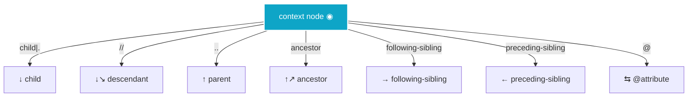

Keep this page in your second monitor. The companion to [XPath for Test Automation: From \"I Hate This\" to \"I Write It in My Sleep\"](), this cheatsheet skips the storytelling and goes straight to **patterns you can copy-paste**.

## Table of Contents

1. [Locator priority pyramid](#1-locator-priority-pyramid)
2. [Five syntax patterns you must memorize](#2-five-syntax-patterns-you-must-memorize)
3. [The 13 axes](#3-the-13-axes)
4. [10 functions you'll actually use](#4-10-functions-youll-actually-use)
5. [Predicate recipes](#5-predicate-recipes)
6. [Common-target patterns](#6-common-target-patterns)
7. [Multi-language code samples](#7-multi-language-code-samples)
8. [Gotchas per framework](#8-gotchas-per-framework)
9. [When NOT to use XPath](#9-when-not-to-use-xpath)
10. [SDET playbook — POM, waits, CI, observability](#10-sdet-playbook-pom-waits-ci-observability)
11. [Advanced & complex patterns — SVG, shadow DOM, modern CSS](#11-advanced-complex-patterns-svg-shadow-dom-modern-css)

---

## 1. Locator priority pyramid

Reach for the top first. Descend only when you must.

```text
🏆  data-testid              //*[@data-testid='checkout']
🥇  ARIA role + name         //button[@aria-label='Submit order']
🥈  Stable ID                //*[@id='user-email']
🥉  Stable attribute         //input[@name='email']
4️⃣  Stable CSS selector      #checkout-form .submit
5️⃣  Relative XPath           //form[@id='checkout']//button[normalize-space()='Pay']
6️⃣  Absolute XPath           ⛔ avoid in tests
7️⃣  Indexed XPath            ⛔ avoid in tests (//ul/li[3]/button)
```

---

## 2. Five syntax patterns you must memorize

```xpath
//tag[@attr='value']                          <!-- attr equality -->
//*[contains(@attr, 'sub')]                   <!-- substring attr match -->
//tag[normalize-space()='Visible Text']       <!-- exact visible text, whitespace-safe -->
//tag[text()='Exact']                          <!-- exact text node (no descendants) -->
//ancestor[@id='x']//descendant[@name='y']    <!-- relationship chain -->
```

Everything else is composition.

---

## 3. The 13 axes

The full family. In practice you use 5; the others are there when you need them.

| Axis | Abbrev | Direction | Reach |
|---|---|---|---|
| `child` | `.` (relative path) / direct slash | down | one level |
| `descendant` | (no abbrev, use nested predicates) | down | any depth |
| `descendant-or-self` | `//` | down | any depth + self |
| `parent` | `..` | up | one level |
| `ancestor` | — | up | any level |
| `ancestor-or-self` | — | up | any level + self |
| `following-sibling` | — | sideways (right) | same level, after |
| `preceding-sibling` | — | sideways (left) | same level, before |
| `following` | — | right | any depth, after |
| `preceding` | — | left | any depth, before |
| `self` | `.` | none | the node itself |
| `attribute` | `@` | sideways | attribute of node |
| `namespace` | — | sideways | namespace of node |

### Visual axes map



### Shortcut glossary

| Long form | Shortcut | Example |
|---|---|---|
| `child::div` | `div` | `./div` (children named `div`) |
| `descendant-or-self::node()` | `//` | `//input` (any descendant) |
| `parent::node()` | `..` | `..` (one level up) |
| `self::node()` | `.` | `.` (the node itself) |
| `attribute::href` | `@href` | attribute selection |

---

## 4. 10 functions you'll actually use

XPath ships with 120+ functions. You'll touch these 10 in most work:

| Function | Purpose | Example |
|---|---|---|
| `text()` | Match exact text node | `//h1[text()='Welcome']` |
| `contains(@a, 'sub')` | Substring match | `//a[contains(@href,'/orders/')]` |
| `normalize-space()` | Trim + collapse whitespace | `//h1[normalize-space()='Welcome']` |
| `starts-with(@a, 'pre')` | Prefix match | `//div[starts-with(@class,'order-')]` |
| `translate(s, 'A..Z', 'a..z')` | Case-insensitive match (XPath 1.0 idiom) | `//a[translate(@href,'ABCDEFGHIJKLMNOPQRSTUVWXYZ','abcdefghijklmnopqrstuvwxyz')='/help']` |
| `string-length()` | Length tests | `//input[string-length(@value)=0]` |
| `not()` | Negate a condition | `//input[not(@disabled)]` |
| `count()` | Count matches | `//tr[count(td)>=5]` |
| `position()` / `last()` | Positional access | `//ul/li[last()]` · `//ul/li[position()=2]` |
| `substring(s, start, len)` | Slicing strings | `//td[substring(text(),1,3)='INV']` |

### Combo expressions (copy-paste ready)

```xpath
<!-- Match a CSS class exactly (not just substring) -->
//button[contains(concat(' ', normalize-space(@class), ' '), ' btn-primary ')]

<!-- Match visible text ignoring whitespace, ENABLED only -->
//button[normalize-space()='Pay now' and not(@disabled)]

<!-- Case-insensitive attribute match (XPath 1.0 only) -->
//a[translate(@href,'ABCDEFGHIJKLMNOPQRSTUVWXYZ','abcdefghijklmnopqrstuvwxyz')='/help']

<!-- Match repeated cell in a row, by header label -->
//table//tr[th[normalize-space()='Total'] or td[normalize-space()='Total']]/td[2]

<!-- Match last item of a list -->
//ul/li[last()]

<!-- First three items -->
//ul/li[position() <= 3]
```

> **XPath 2.0+ shortcuts that look tempting but won't work in browsers:** `lower-case()`, `upper-case()`, regex matching, FLWOR expressions (`for $i in ... return ...`), string join/parse functions. WebDriver, Playwright, and Cypress all evaluate **XPath 1.0** for `By.xpath`/`xpath=…`/`cy.xpath()`. These 2.0 functions return empty with **no error**, which is the worst kind of silent failure. If you genuinely need them, switch to a Saxon pipeline or server-side XPath 2.0 eval. For case-insensitive work, use the `translate()` idiom above.

---

## 5. Predicate recipes

### Locate by visible text

```xpath
//button[normalize-space()='Sign In']
//button[text()='Sign In']
//button[starts-with(normalize-space(),'Sign')]
```

### Locate by attribute (with and)

```xpath
//input[@type='checkbox' and @name='agree']
//a[@role='button' and @aria-disabled='false']
```

### Locate by attribute (with or)

```xpath
//input[@type='submit' or @type='button']
```

### Locate by absence

```xpath
//input[not(@disabled)]
//div[not(contains(@class,'hidden'))]
```

### Locate by position

```xpath
(//ul/li)[1]                        <!-- first li overall (parens matter) -->
//ul/li[1]                           <!-- first li of each ul -->
//ul/li[last()]                      <!-- last li of each ul -->
//table//tr[position() mod 2 = 0]    <!-- even rows -->
```

### Locate by count

```xpath
//table[count(.//tr) > 5]           <!-- tables with more than 5 rows -->
//table[count(.//tr[td[normalize-space()='X']]) > 0]   <!-- tables containing cell 'X' -->
```

### Locate by relationship

```xpath
//label[normalize-space()='Email']/following-sibling::input
//button[@data-testid='submit']/parent::form
//section[.//h2[text()='Billing']]//input[@name='card']
```

### Locate by structural pattern

```xpath
//div[@class='row' and count(./div) = 3]    <!-- rows with exactly 3 children -->
//ul[li and not(@hidden)]                   <!-- visible non-empty lists -->
```

---

## 6. Common-target patterns

### Forms

```xpath
//form[@id='login']//input[@name='username']
//form[contains(@action,'/checkout')]//button[@type='submit']
//label[normalize-space()='Email']/following-sibling::input
```

### Tables

```xpath
//table//tr[td[normalize-space()='bob@x.com']]/td[4]    <!-- row containing cell, then column -->
//table//thead/tr/th[normalize-space()='Status']/following-sibling::th[1]   <!-- column header lookup -->
//table//tr[position()=1]/td    <!-- first data row -->
```

### Modals & dialogs

```xpath
//div[@role='dialog']//button[normalize-space()='Confirm']
//div[contains(@class,'modal') and not(contains(@class,'hidden'))]//button
```

### Repeating rows (to-do lists, cart items)

```xpath
//ul[@class='cart-items']/li[.//span[@class='price' and text() > '50']]    <!-- XPath 2.0 only, but commonly written -->
//ul[@class='cart-items']/li[contains(., 'Premium')]
```

> Many "filter by content" patterns need XPath **2.0+** (Playwright's `getByText`, Cypress's `.contains()` are usually easier). Stick to XPath 1.0 expressions above unless you've explicitly opted in.

### Dynamic IDs (auto-generated)

```xpath
//div[starts-with(@id,'react-select-') and @aria-expanded='true']    <!-- React-Select open dropdown -->
//*[@aria-label='Close']    <!-- dialog close button -->
```

### Upload widgets

```xpath
//div[contains(@class,'upload')]/input[@type='file']
//label[normalize-space()='Upload avatar']/input[@type='file']
```

### Drag-and-drop handles

```xpath
//li[normalize-space()='Item to drag']    <!-- source -->
//ul[@id='target-list']    <!-- destination -->
```

---

## 7. Multi-language code samples

Same XPath. Five flavors of API.

### Java — Selenium

```java
import org.openqa.selenium.By;
import org.openqa.selenium.WebDriver;
import org.openqa.selenium.chrome.ChromeDriver;

WebDriver driver = new ChromeDriver();
driver.get("https://the-internet.herokuapp.com/login");

WebElement username = driver.findElement(
    By.xpath("//form[@id='login']//input[@id='username']")
);
username.sendKeys("tomsmith");
```

### Python — Selenium

```python
from selenium import webdriver
from selenium.webdriver.common.by import By

driver = webdriver.Chrome()
driver.get("https://the-internet.herokuapp.com/login")

username = driver.find_element(
    By.XPATH, "//form[@id='login']//input[@id='username']"
)
username.send_keys("tomsmith")
```

### TypeScript / JavaScript — Playwright

```typescript
import { chromium } from "playwright";

const browser = await chromium.launch();
const page = await browser.newPage();
await page.goto("https://the-internet.herokuapp.com/login");

// XPath — both work; 'xpath=' is more explicit
await page.locator("xpath=//form[@id='login']//input[@id='username']").fill("tomsmith");

// Playwright semantic alternatives (preferred when possible)
await page.getByLabel("Username").fill("tomsmith");
await page.locator("#username").fill("tomsmith");
```

### Cypress

```javascript
cy.visit("https://the-internet.herokuapp.com/login");

// Requires cypress-xpath plugin; otherwise stick to Cypress's built-in selectors
cy.xpath("//form[@id='login']//input[@id='username']").type("tomsmith");

// Cypress-native equivalent is usually better
cy.get("#username").type("tomsmith");
```

### C# — Selenium

```csharp
using OpenQA.Selenium;
using OpenQA.Selenium.Chrome;

var driver = new ChromeDriver();
driver.Navigate().GoToUrl("https://the-internet.herokuapp.com/login");

var username = driver.FindElement(
    By.XPath("//form[@id='login']//input[@id='username']")
);
username.SendKeys("tomsmith");
```

### Side-by-side comparison

| Operation | Java | Python | TS/JS | C# |
|---|---|---|---|---|
| By id | `By.id("x")` | `By.ID, "x"` | `page.locator("#x")` | `By.Id("x")` |
| By xpath | `By.xpath("//x")` | `By.XPATH, "//x")` | `page.locator("xpath=//x")` | `By.XPath("//x")` |
| By CSS | `By.cssSelector(".x")` | `By.CSS_SELECTOR, ".x"` | `page.locator(".x")` | `By.CssSelector(".x")` |
| ARIA role | (no built-in) | (no built-in) | `page.getByRole("button")` | (no built-in) |
| Test-id | (no built-in) | (no built-in) | `page.getByTestId("x")` | (no built-in) |

---

## 8. Gotchas per framework

### Selenium (Java / Python / C#)

1. **`NoSuchElementException` ≠ "element missing forever."** Could be iframe context wrong. Wrap with `driver.switchTo().frame(...)` or `.defaultContent()`.
2. **`findElement` vs `findElements`.** Singular throws on empty; plural returns list. Use plural when 0/1/many is acceptable.
3. **Implicit waits stack across tests.** Always reset in `@BeforeEach` or your setup hook.
4. **Stale element refs** happen after DOM mutation. Re-find; don't cache element references across page transitions.
5. **XPath 1.0 only.** `for $i in …`, regex, `lower-case` with Unicode normalization — all 2.0+ and silently fail.

### Playwright

1. **Strict mode** is on by default — `locator()` returning >1 match throws. Use `.first()` / `.nth(i)` deliberately.
2. **Locators are lazy.** They re-resolve on every action. That's a feature, not a bug. Don't call `.elementHandle()` unless you need the snapshot.
3. **Auto-retries** are unlimited by default within `expect()`. Use `expect(locator).toBeVisible()` rather than `.waitFor()` + `.isVisible()`.
4. **XPath auto-pierces shadow DOM** via `>>>` chains. Pure XPath alone does not — use `page.locator('css=host-element >>> inner-shadow-html')`.
5. **Prefer semantic over xpath** when the role is unambiguous: `getByRole('button', { name: 'Pay' })` beats `//button[normalize-space()='Pay']`.

### Cypress

1. **XPath needs the plugin** (`cypress-xpath`). Out of the box, Cypress is CSS-first.
2. **`.contains()`** is the Cypress-native way to do `"contains text"` — easier than XPath substring for visible-text filters.
3. **Auto-retry** is built in. `cy.get(locator).should('be.visible')` polls for you.
4. **Element isolation:** tests run inside one giant iframe; explicit shadow-DOM traversal rarely needed but XPath-on-shadow still won't pierce.
5. **`cy.xpath()` returns a wrapper**, not a DOM element. Chain `.click()` / `.type()` directly.

### Cross-framework

| Gotcha | Selenium | Playwright | Cypress |
|---|---|---|---|
| Default XPath engine | 1.0 | 1.0 | 1.0 |
| Shadow DOM piercing | ❌ | ✅ (`>>>`) | partial |
| Iframe switching | manual `switchTo().frame` | auto via locator chain | manual |
| Default strictness | permissive (1 match OK) | strict | permissive |
| Best locator style | explicit `By.xpath()` | `getByRole` / `getByTestId` | `cy.get` + `.contains` |

---

## 9. When NOT to use XPath

Some signals that you should reach for a different tool:

- **You're matching visible text only.** Use Playwright's `getByText('Sign in')` or Cypress's `cy.contains('Sign in')` — both auto-retry.
- **You need a screenshot/visual assertion.** XPath finds nodes, not pixels. Reach for image-diff tools (Playwright's `expect(page).toHaveScreenshot()`).
- **You're chaining into shadow DOM.** Use Playwright's `>>>` selector syntax — it's purpose-built.
- **You need cross-origin iframe traversal.** XPath stops at iframe boundaries regardless of tool. Switch contexts, or use CDP/BiDi for snapshot diff.
- **You're navigating the accessibility tree.** That's ARIA's job — use semantic locators instead.
- **The locator depends on element coordinates.** XPath can't. Use `Relative Locator` (Selenium 4: `above/below/near`) or `locator.boundingBox()` (Playwright).

---

<h2 id="10-sdet-playbook-pom-waits-ci-observability">10. SDET playbook — POM, waits, CI, observability</h2>

This section is for SDETs shipping production test suites in **Selenium, Playwright, or Cypress**. The XPaths above are correct; this section makes them *survive*.

### 10.1 Where XPath lives in your POM

The locator is a **property**, not a method. Locators as `By`/`Locator` constants on the page object — never inline strings in test specs.

| Layer | Lives in | Style |
|---|---|---|
| Locator strings | `BasePage` / `ComponentPage` | Const `By` / `Locator` properties |
| Wait wrappers | `BasePage` helpers | `waitForVisible(by)`, `waitForEnabled(locator)` |
| Flow actions | Component / Page Object methods | `loginAs(user, pass)`, `submitCheckout()` |
| Test assertions | Spec file | Calls page-object methods, only ever in `.should(...)` |

```typescript
// Playwright TypeScript
export class CheckoutPage {
  readonly form        = this.page.locator("//form[@id='checkout']");
  readonly payButton   = this.form.locator(
    "//button[normalize-space()='Pay' and not(@disabled)]"
  );

  constructor(private page: Page) {}

  async pay() { await this.payButton.click(); }
}
```

```java
// Selenium Java
public class CheckoutPage {
  private final WebDriver driver;
  public CheckoutPage(WebDriver driver) { this.driver = driver; }

  private final By payBtn = By.xpath(
      "//form[@id='checkout']//button[normalize-space()='Pay' and not(@disabled)]"
  );

  public CheckoutPage pay() {
    new WebDriverWait(driver, Duration.ofSeconds(10))
        .until(ExpectedConditions.elementToBeClickable(payBtn))
        .click();
    return this;
  }
}
```

```javascript
// Cypress
export const checkout = {
  payBtn: "//form[@id='checkout']//button[normalize-space()='Pay' and not(@disabled)]",
};
export const pay = () => {
  cy.xpath(checkout.payBtn).should('be.enabled').click();
};
```

### 10.2 Wait strategies per framework

A correct XPath still times out if the framework's wait contract is wrong.

```text
Selenium (Java/Python/C#)  → wrap in WebDriverWait, return element when state met
Playwright (TS/JS)         → auto-wait up to 30s; use expect(locator).toBeVisible()
Cypress                    → auto-retry on cy.get/chained assertions for 4s default
```

| Tool | Default | Wait helper | Anti-pattern |
|---|---|---|---|
| Selenium 4 | None — synchronous query | `WebDriverWait(driver, 10).until(ExpectedConditions.elementToBeClickable(by))` | `Thread.sleep(2000)` |
| Playwright | Auto-wait 30s on every action | `await locator.click()` · `await expect(locator).toBeVisible()` | Redundant `.waitFor()` + `.click()` (.click() already auto-waits) |
| Cypress | `cy.get` retries 4s on retry-ability | `cy.xpath(...).should('be.visible').click()` | `.then(...)` swallows auto-retry |

### 10.3 Headless / CI failure modes

Three patterns that always bite in CI but pass on a laptop:

```xpath
<!-- Always pin state, never animation timing -->
//div[@role='status' and normalize-space()='Loaded']
//button[@data-testid='submit' and not(@disabled)]
//img[contains(@alt,'avatar') and not(starts-with(@src,'data:'))]
```

| Symptom in CI | Root cause | Fix |
|---|---|---|
| Locator times out only on CI runner | Default viewport too small | `await page.setViewportSize({ width: 1280, height: 720 })` (Playwright) |
| Screenshot shows element "missing" but DOM has it | Animation timing under load | Pin a state predicate (`@data-state='ready'`); don't wait on `display:none → visible` |
| Visual diff fails in headless but works headed | GPU compositing differs | Use Playwright's `await locator.waitFor({ state: 'visible' })` **before** screenshot |

### 10.4 Observability hooks — capture on failure

When a CI test fails, three artifacts tell you *why*. Wire them in from day one.

| Framework | Screenshot | HTML snapshot | Failed XPath logged | Trace/Video |
|---|---|---|---|---|
| **Playwright** | `screenshot: 'only-on-failure'` in config | `trace: 'retain-on-failure'` | Add to `expect()` failure message in custom matcher | `video: 'retain-on-failure'` |
| **Selenium** | `((TakesScreenshot) driver).getScreenshotAs(File)` in `@AfterMethod` | `driver.getPageSource()` | Log `by.toString()` before failure | CI runner captures: video, console |
| **Cypress** | Built-in (`cypress-on-fix` plugin) | Built-in | Extend Cypress `cypress-xpath` to expose failed path | Built-in screencast for failures |

```typescript
// Playwright — config already covers this, but make the XPath visible
// playwright.config.ts
export default {
  use: {
    trace: 'retain-on-failure',
    screenshot: 'only-on-failure',
    video: 'retain-on-failure',
  },
};
```

```java
// Selenium — listener that always logs the failed By
@AfterMethod(alwaysRun = true)
public void onFailure(ITestResult result) {
  if (result.getStatus() != ITestResult.FAILURE) return;
  WebDriver d = DriverFactory.get();
  // 1. Screenshot
  File shot = ((TakesScreenshot) d).getScreenshotAs(OutputType.FILE);
  Reporter.log("Screenshot: " + shot.getAbsolutePath(), true);
  // 2. HTML
  String html = d.getPageSource();
  Reporter.log("HTML at failure (first 4KB):\n" + html.substring(0, 4096), true);
  // 3. Last-tried locator (set in catch block of helper)
  Reporter.log("Last XPath tried: " + LastLocatorHolder.get(), true);
}
```

```javascript
// Cypress — fail-fast that prepends the failing XPath to the error
// (idiomatic; works with cypress-xpath v2.1+ and Cypress 12+)
Cypress.on('fail', (err) => {
  const tried = Cypress.env('lastXpath');
  if (tried) err.message = `Failed XPath: ${tried}\n${err.message}`;
  throw err;
});

// Helper: set the env var before any assertion
export const xpathClick = (expression) => {
  Cypress.env('lastXpath', expression);
  return cy.xpath(expression).should('be.visible').click();
};

// Usage:
// xpathClick("//button[normalize-space()='Pay' and not(@disabled)]")
```

> **Why not `Commands.overwrite('xpath', …)`?** Re-throwing inside a `.then(null, errFn)` swallows the rejection inside Cypress's `chainer` and the override never actually surfaces in the reporter. The `Cypress.on('fail')` global hook is the reliable place to rewrite the failing message.

### 10.5 The SDET ↔ Frontend `data-testid` contract

You own the **naming convention**, not individual test IDs. Negotiate this with frontend in one paragraph:

```text
Convention: data-testid = "<page>-<component>-<intent>"

Examples:    checkout-pay-button · cart-remove-button · settings-save-button
Forbidden:   numbers (button-1), intent-free (right-button), leak class (btn-primary)
```

Then in your POM, replace 80% of the XPaths in this cheatsheet with `getByTestId(...)`:

```typescript
readonly payButton = page.getByTestId("checkout-pay-button");
readonly removeBtn = page.getByTestId("cart-remove-button");
```

XPath becomes the **fallback** for the remaining 20% — third-party widgets, embedded `<iframe>`s, legacy modals, SVG nodes, Canvas (no DOM at all). Those escape hatches are precisely what §§3–7 teach.

### 10.6 Browser matrix sanity

When the same XPath runs across Chrome/Firefox/Safari/Edge, three things break first:

```xpath
<!-- 1. text() is engine-sensitive — always normalize-space() -->
//h1[normalize-space()='Welcome']

<!-- 2. SVG is namespace-prefixed in some browsers, not others -->
//*[local-name()='svg']//*[local-name()='path' and @fill='#0ea5c7']

<!-- 3. case-insensitivity — use translate(), not lower-case() (XPath 2.0+) -->
//a[translate(@href,
            'ABCDEFGHIJKLMNOPQRSTUVWXYZ',
            'abcdefghijklmnopqrstuvwxyz') = '/help']
```

### 10.7 SDET cleanup checklist before commit

```text
☐  No inline By.xpath("//...") literal in spec files (must live in POM)
☐  Each XPath is anchored on stable feature (role/id/data-testid/text), not on index
☐  Effective wait contract matches framework (WebDriverWait / auto-wait / should())
☐  Failure hook captures {screenshot, HTML, last XPath} in the report
☐  No lower-case() / upper-case() / FLWOR / regex (XPath 2.0+ silently fails)
☐  No substring-class matching (contains(@class,'btn')) — use space-padded concat
☐  data-testid request ticket exists for new selector buckets the team hasn't covered
```

---

<h2 id="11-advanced-complex-patterns-svg-shadow-dom-modern-css">11. Advanced & complex patterns — SVG, shadow DOM, modern CSS</h2>

Use this section when the basic patterns from §§1–10 don't reach the element. The four "complex" categories here are **SVG namespace**, **computed indices without `li[3]`**, **iframe + shadow DOM piercing**, and **modern CSS Level 4 selectors** (`:has()`, `:is()`, `:where()`, `:nth-child()` formulas, sibling combinators, case-insensitive attribute flags).

### 11.1 Complex XPath — quick reference table

| Pattern | XPath | Notes |
|---|---|---|
| SVG `<path>` (any depth) | `//*[local-name()='path']` | `local-name()` strips namespace prefix |
| SVG with attribute filter | `//*[local-name()='path' and @fill='#0ea5c7']` | Two predicates, AND-combined |
| Computed nth (3rd `<li>`) | `//ul/li[count(preceding-sibling::li) = 2]` | Survives inserts above |
| Last N items | `//ul/li[count(following-sibling::li) < 3]` | count-following rule |
| Skip first 5 of 10 | `//li[position() > 5 and position() <= 10]` | Compound position predicate |
| Row by header label | `//table//tr[th[normalize-space()='X']]/td[2]` | Multi-axis via header semantics |
| Row by computed cells | `//table//tr[td[2][normalize-space()='Open']]/td[3]` | Predicate across two cell positions |
| Every 2nd row (1-indexed odd) | `//table//tr[position() mod 2 = 1]` | `mod 2 = 0` for even |
| colspan-aware next cell | `//td[@colspan=3]/following-sibling::td[1]` | Tables with merged columns |
| ARIA expanded tree item | `//*[@role='treeitem' and @aria-expanded='true']` | State predicate |
| Visible tabpanel + editable input | `//*[@role='tabpanel' and @aria-hidden='false']//input[not(@readonly)]` | Multi-predicate nested |
| Negate prefix (submit vs submit-draft) | `//button[starts-with(@id,'submit-') and not(starts-with(@id,'submit-draft-'))]` | Two starts-with() |
| Compound OR (3 attr sources) | `//button[(@type='submit' or @type='button' or @role='button') and not(@disabled)]` | OR group + state filter |
| Compound AND (case-insensitive + state) | `//a[translate(@href,'ABCDEFGHIJKLMNOPQRSTUVWXYZ','abcdefghijklmnopqrstuvwxyz')='/help' and not(@target='_blank')]` | Use `translate()` not `lower-case()` |
| Compound text concat with descendant | `//div[normalize-space() = concat('Status: ', normalize-space(.//span))]` | `concat()` joins strings |
| Reverse navigation + state | `//section[.//h2[normalize-space()='Billing']]//input[@name='card']` | Section contains matching h2 |

### 11.2 SVG namespace — portably

```xpath
<!-- Match by stripped local name (preferred) -->
//*[local-name()='svg']//*[local-name()='path']

<!-- Match by namespace URI + local name (rare, advanced) -->
//*[namespace-uri()='http://www.w3.org/2000/svg' and local-name()='rect']

<!-- Match by prefixed name when output is engine-consistent -->
//*[name()='svg:circle']
```

```typescript
// Playwright — SVG via CSS works in 2026+ for major browsers
await page.locator("svg circle[fill='#0ea5c7']").click();
// XPath fallback for cross-engine reliability
await page.locator("//*[local-name()='svg']//*[local-name()='circle']").click();
```

### 11.3 iframe + shadow DOM — what works where

| Boundary | Selenium 4 | Playwright | Cypress |
|---|---|---|---|
| iframe (same-origin) | `driver.switchTo().frame(name)` | `page.frameLocator(iframe).locator(...)` | `cy.frameLoaded` + `cy.iframe` |
| iframe (cross-origin) | Via BiDi CDP proxy; otherwise unreachable | `page.frame(url, ...)` via BiDi; otherwise proxy | `cy.origin(url, fn)` then XPath inside |
| Shadow DOM (open root) | `shadowRoot.findElement(By.css("css"))` after `getShadowRoot()` | `page.locator('host-css >>> inner')` (auto-pierces) | CSS pierces partially; XPath alone cannot |

```typescript
// Playwright — iframe + selector across frames
await page.frameLocator('iframe[name="payment"]')
    .locator("//input[@name='card']").fill('4111111111111111');

// Playwright — shadow DOM via >>> chaining (CSS host, XPath inside)
await page.locator('my-payment-form >>> //button:has-text("Pay")').click();
```

### 11.4 Modern CSS — `:has()`, `:is()`, `:where()`

| Selector | Meaning | Available since |
|---|---|---|
| `:has(selector)` | Parent contains a child matching selector | Chromium 105+, Firefox 121+, Safari 15.4+ |
| `:is(h1, h2, h3)` | Matches any of; keeps specificity of the most-specific branch | Chrome 88+, Firefox 78+, Safari 14+ |
| `:where(h1, h2, h3)` | Matches any of; specificity 0 (overridable) | Chrome 88+, Firefox 78+, Safari 14+ |
| `:not(:disabled):not(:checked)` | Multi-condition negation | Universal |

```css
/* :has — parent selector */
.card:has(.icon.danger)             /* card with a danger-icon descendant */
li:has(a) ~ li:not(:has(a))         /* sibling-of-a-having-a followed by a sibling-without-a */
form:has(input:invalid)             /* form containing any invalid input */

/* :is — OR grouping with combined specificity */
.title:is(h1, h2, h3, h4)           /* any of these headings with class title */

/* :where — OR grouping with zero specificity */
.title:where(h1, h2, h3, h4)        /* same semantic, easier for downstream override */

/* Multi-source button OR with type + class + ARIA */
button:is([type='submit'], .btn-primary, [aria-label*='Pay' i])
```

```typescript
await page.locator('.card:has(.icon.danger)').click();
await page.locator('li').filter({ has:     page.locator('a') }).count();
await page.locator('li').filter({ hasNot: page.locator('label') }).count();
```

```java
// Selenium 4 — :has() works in cssSelector once the browser engine supports it
// requires: import org.openqa.selenium.By;
driver.findElement(By.cssSelector(".card:has(.icon.danger)"));
```

### 11.5 `:nth-child()` and `:nth-of-type()` formulas

```css
/* Common nth-child formulas */
tr:nth-child(2n)                       /* even rows (2nd, 4th, 6th...) */
tr:nth-child(2n+1)                     /* odd rows (1st, 3rd, 5th...) */
li:nth-child(-n+5)                     /* first 5 items */
td:nth-last-child(-n+2)                /* last 2 cells */
:nth-child(3n+1)                       /* every 3rd, starting at position 1 */
tr:only-child                          /* row with no siblings */

/* Type-aware */
td:nth-of-type(4)                      /* 4th td by element type */
h2:nth-of-type(2) ~ p:nth-of-type(1)   /* 2nd h2 then 1st p after it */
section > :nth-child(2)                /* 2nd direct child of any section */
```

```typescript
// Playwright — nth-child() inside locator() strings
await page.locator('tr:nth-child(2n+1) td:nth-child(3)').allInnerTexts();

// Or, more idiomatic, via locator API
await page.locator('tr').nth(0).click();
await page.locator('tr:nth-child(2n)').filter({ hasText: 'Total' }).count();
```

### 11.6 Case-insensitive attribute flags + state pseudos

```css
/* Case-insensitive attribute matching (CSS Level 4 flag form) */
a[href*="github" i]                    /* matches GitHub / GITHUB / github */
input[name*="email" i]
[type="checkbox" i]                    /* exact match, insensitive */
[title*="Pay" i]                       /* substring match, insensitive */

/* State pseudos */
input:placeholder-shown                /* empty input currently showing placeholder */
form:focus-within                      /* form containing the focused field */
button:not(:disabled):hover            /* interactive (flaky in CI animation frames) */
li:empty                               /* <li></li> with no children at all */
input:placeholder-shown ~ label        /* label adjacent to a currently-empty input */
:is(:disabled, [aria-disabled='true']) /* group OR negation */
```

### 11.7 Sibling combinators (`+`, `~`)

```css
/* Adjacent sibling — directly following element */
button + button                          /* button immediately after another button */

/* General sibling — any element after, sharing parent */
input:invalid ~ .error-icon              /* any error-icon after an invalid input */
form label:first-of-type ~ input:not([type='hidden']):first-of-type
                                        /* first visible input after first label */
header > nav > ul > li + li              /* li directly after another li in nav */
```

```typescript
// Playwright — sibling combinators inside locator() + filter({ has })
await page.locator('button + button').click();
await page.locator('input:invalid ~ .error-icon').first().textContent();
```

### 11.8 XPath vs CSS vs Playwright engine — when each wins

| Need | XPath | CSS | Playwright engine (`role=`, `text=`, `near=`) |
|---|---|---|---|
| Visible-text match | ✅ `text()`, `normalize-space()` | ⚠️ via `:has-text`/Playwright only | ✅ best (auto-retry, intent-clear) |
| Forward-only traversal | ✅ | ✅ fastest | ❌ |
| Backward / ancestor traversal | ✅ only | ❌ | ❌ |
| Parent selector (X:has Y) | ✅ via axis | ✅ `:has()` in 2026+ | ⚠️ `filter({ has })` |
| SVG / xmlns elements | ✅ via `local-name()` | ⚠️ browser-version dependent | ❌ |
| Compound attribute predicates | ✅ best | ⚠️ attribute selectors + pseudos | ⚠️ partial |
| `:nth-child()` / sibling combinators | ✅ via `position()`, `count()` | ✅ native `:nth-child()`, `+`, `~` | ❌ |
| Shadow DOM piercing | ❌ (spec stops) | ❌ without `>>>` | ✅ `>>>` chain |
| iframe boundary | ❌ | ❌ | ✅ via `frameLocator(url)` |
| Speed (browser engine) | ⚠️ slower (~25% vs CSS) | ✅ fastest | ❌ slowest (semantic resolution) |
| Cross-runner portability (Selenium + Playwright + Cypress) | ✅ XPath 1.0 portable everywhere | ⚠️ L4 selectors partially portable | ❌ Playwright-only |

> **Rule of thumb:** CSS for speed and forward-only structural patterns; XPath for text matching and reverse/ancestor; Playwright engine selectors when ARIA role + accessible name expresses intent.

### 11.9 Common complex-target patterns

```xpath
<!-- Date picker: 'next-month' button regardless of month label -->
//button[@aria-label='Next month' or normalize-space()='›']

<!-- Aria-disabled checkbox (selector target still in the DOM but inert) -->
//*[@role='checkbox' and @aria-disabled='true']

<!-- Active step in a wizard's progress bar -->
//li[@role='tab' and @aria-selected='true']/following-sibling::li

<!-- Cell inside a row whose second cell holds partial text -->
//table//tr[contains(td[2],'Open')]/td[3]

<!-- The form whose submit button is currently disabled -->
//form[.//button[@type='submit' and @disabled]]

<!-- Last row whose first cell is not empty, in a striped table -->
//table//tr[td[1][normalize-space()!='']][position()=last()]
```

```css
/* The currently focused form row (compound state) */
.form-row:focus-within

/* A button whose tooltip is currently visible */
button[aria-describedby]:hover

/* Every other cell starting from column 2 */
td:nth-child(2n+1):nth-child(n+2)

/* A list with at least one selected child */
ul:has(li[aria-selected='true'])

/* Inputs that have ever been interacted with (focus or blur) */
input:focus, input:focus-within

/* Inputs with a sibling error indicator */
input:invalid ~ .error-icon:visible
```

---
```

---

## Anchor index (for the rest of the article)

- [Locator priority pyramid](#1-locator-priority-pyramid) — when to use what
- [Five syntax patterns](#2-five-syntax-patterns-you-must-memorize) — base grammar
- [The 13 axes](#3-the-13-axes) — full directions library
- [10 functions](#4-10-functions-youll-actually-use) — day-to-day toolkit
- [Predicate recipes](#5-predicate-recipes) — copy-paste catalog
- [Common-target patterns](#6-common-target-patterns) — forms, tables, modals, lists
- [Multi-language samples](#7-multi-language-code-samples) — Java · Python · TS/JS · C# · Cypress
- [Gotchas per framework](#8-gotchas-per-framework) — Selenium · Playwright · Cypress
- [When NOT to use XPath](#9-when-not-to-use-xpath) — better alternatives
- [SDET playbook](#10-sdet-playbook-pom-waits-ci-observability) — POM, waits, CI, observability
- [Advanced & complex patterns](#11-advanced-complex-patterns-svg-shadow-dom-modern-css) — SVG, shadow DOM, modern CSS

## Sources & Further Reading

1. [XPath — devhints.io](https://devhints.io/xpath) — the inspiration for this page
2. [Playwright locators](https://playwright.dev/docs/locators) — when to graduate from XPath
3. [Selenium By API reference](https://www.selenium.dev/documentation/webdriver/elements/locators/) — official locator docs
4. [MDN — Introduction to XPath in JavaScript](https://developer.mozilla.org/en-US/docs/Web/XML/XPath/Introduction_to_using_XPath_in_JavaScript) — friendly spec
5. [MDN — CSS Selectors Level 4](https://developer.mozilla.org/en-US/docs/Web/CSS/CSS_selectors) — `:has()`, `:is()`, `:where()`, `:nth-child()` formulas

## Cross-links from this blog

- [XPath for Test Automation: From \"I Hate This\" to \"I Write It in My Sleep\" (Jul 2026)]() — the story-mode article that teaches the mental model behind this cheatsheet
- [Selenium in 2026: Beginner's Guide (Jul 2026)]() — Selenium Manager, BiDi, MCP server
- [Selenium Page Locator Strategies (May 2020)]() — the foundational ID/class/CSS/XPath guide
- [Playwright Typescript Beginner to Timeouts (Jul 2026)]() — locators and assertions in TypeScript
- [CI/CD Pipelines for Test Automation (Jun 2026)]() — sharding, parallel runs, observability in CI
- [Selenium BiDi vs Playwright CDP (Aug 2026)]() — when BiDi/CDP replaces WebDriver

*See also:* [AI-Driven Test Strategy (Jun 2026)]() — when AI finds your locators by looking at the page. · [XPath ↔ CSS Translation Appendix (Jul 2026)]() — the compact one-page translation map and Selenium→Playwright migration playbook this cheatsheet complements.
