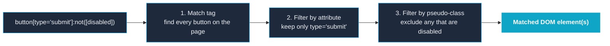
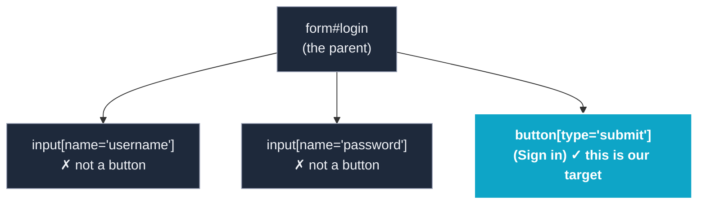
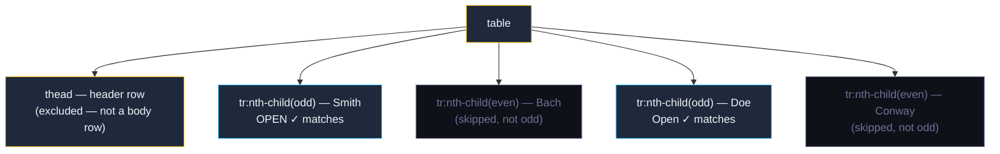
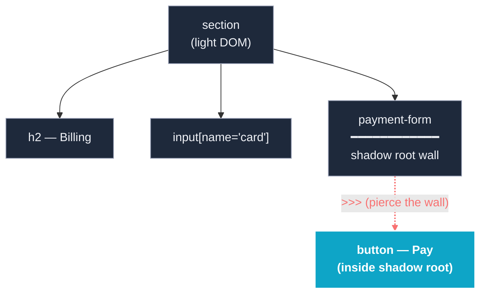
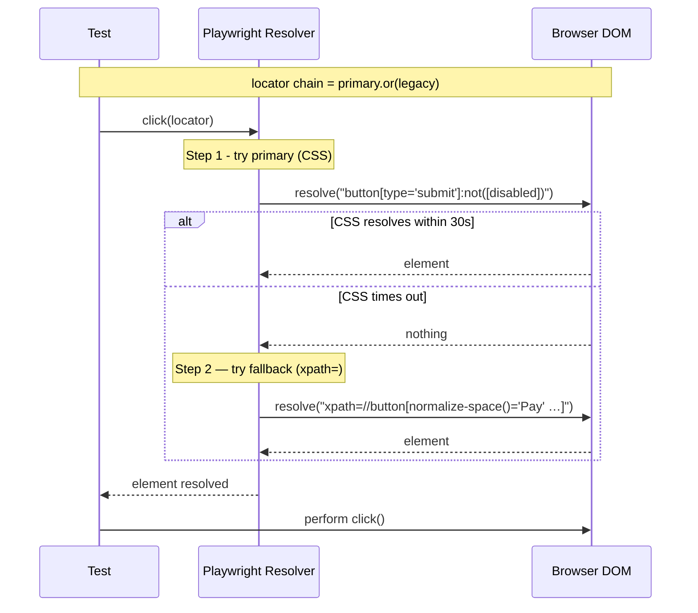

A pocket reference that pairs the XPath you've already written with the CSS (or Playwright engine selector) that fits the modern stack. Pre-requisite reading: the [XPath Cheatsheet §11 Advanced and complex patterns](#11-advanced-complex-patterns-svg-shadow-dom-modern-css). Every row below cross-references an existing row in §§3–11 of the cheatsheet or §§1–12 of the [article]().

> **Why this card exists:** XPath 1.0 is the lingua franca of legacy Selenium suites. CSS 2/3 + Level 4 + Playwright ARIA selectors cover the same ground across more runners, but the patterns don't map 1:1. This card lets you audit existing XPath and propose a CSS-or-engine equivalent for each — without losing stability intent.

## Quick-reference tables

Five categories cover ~90% of the XPath you'll find in a real suite. Use the cross-references in the **§ column** to jump to the matching cheatsheet row.

### A. Text match

| # | XPath | CSS | Playwright engine | Notes | § |
|---|---|---|---|---|---|
| A1 | `//*[normalize-space()='Welcome']` | — | `page.getByText('Welcome')` | CSS has no exact-visible-text pseudo | article §12.5, §12.9 |
| A2 | `//button[text()='Sign in']` | — | `page.getByRole('button', { name: 'Sign in' })` | Engine ARIA selector is the cleanest path | article §12.9 |
| A3 | `//*[contains(., 'Pay')]` | — | `page.locator(':has-text("Pay")')` | Substring text across all descendants | cheatsheet §5 |
| A4 | `//h2[starts-with(., 'Order')]` | — | `page.getByText('Order', { exact: false })` | Prefix match | cheatsheet §5 |
| A5 | `//h1[normalize-space()='Welcome']` | `h1` (no text match in CSS) | `page.locator('h1').getByText('Welcome')` | Combine element tag + ARIA | article §12.7 |

### B. Structural nth

| # | XPath | CSS | Playwright engine | Notes | § |
|---|---|---|---|---|---|
| B1 | `//ul/li[1]` | `ul li:first-child` | `page.locator('ul li').first()` | `:first-child` requires true parent | cheatsheet §11.5 |
| B2 | `//ul/li[last()]` | `ul li:last-child` | `page.locator('ul li').last()` | Last-child is selector-engine supported | cheatsheet §11.5 |
| B3 | `//ul/li[position() mod 2 = 1]` | `ul li:nth-child(2n+1)` (odd) / `2n` (even) | — | `position()` is 1-indexed | cheatsheet §11.1, §11.5 |
| B4 | `//ul/li[count(preceding-sibling::li) = 2]` | `ul li:nth-child(3)` | — | "3rd item" — `:nth-child(3)` matches intent | cheatsheet §11.1 |
| B5 | `//li[position() > 5 and position() <= 10]` | `ul li:nth-child(n+6):nth-child(-n+10)` | — | Range via two `:nth-child()` | cheatsheet §11.1 |
| B6 | `//td[nth-of-type=4]` | `td:nth-of-type(4)` | `page.locator('td').nth(3)` | Engine is 0-indexed; CSS uses an+b | cheatsheet §11.5 |
| B7 | `//tr[count(td) > 5]` | `tr:where(:has(*:nth-child(6)))` (heuristic) | — | "Has at least 6 children" — better: measure via Playwright `.count()`, don't express in selector | cheatsheet §11.1 |
| B8 | `//ul/li[only-child]` equivalent: first list item with no siblings | `li:only-child` | — | Type-aware | cheatsheet §11.5 |

### C. Ancestor / reverse navigation

| # | XPath | CSS | Playwright engine | Notes | § |
|---|---|---|---|---|---|
| C1 | `//input[@name='card']/ancestor::form` | `form:has(input[name='card'])` | `page.locator('form').filter({ has: page.locator('input[name="card"]') })` | `:has()` is the only reverse parent selector; chained `.locator()` scopes to descendants, so `ancestor::` cannot be chained | cheatsheet §11.4, §11.9 |
| C2 | `//section[.//h2[normalize-space()='Billing']]` | `section:has(h2)` (text-matching not possible in pure CSS L4) | `page.locator('section').filter({ has: page.getByRole('heading', { name: 'Billing' }) })` | Filter `has` + ARIA = cleanest reverse; pure CSS would need a stable hook such as `section:has(h2[data-billing])` if the team agrees to mark up the heading | article §12.4, cheatsheet §11.4 |
| C3 | `//div/..` (parent of a div) | parent is implicit (`div`'s parent) | `page.locator('div').locator('..')` | Engine exposes parent via XPath `..` | cheatsheet §11.4 |
| C4 | `//form[.//button[@disabled and @type='submit']]` | `form:has(button[type='submit'][disabled])` | `page.locator('form').filter({ has: page.locator('button[type="submit"][disabled]') })` | Filter pattern > direct selector | cheatsheet §11.9 |
| C5 | `//tr/preceding-sibling::tr` | `tr ~ tr` (general sibling before) | — | `~` matches from anywhere; preceding via CSS is "earlier in document order" trickier | cheatsheet §11.7 |

### D. Attribute complex predicates

| # | XPath | CSS | Playwright engine | Notes | § |
|---|---|---|---|---|---|
| D1 | `//a[contains(@href, '/orders/')]` | `a[href*='/orders/']` | — | Substring match | cheatsheet §4 |
| D2 | `//div[starts-with(@class, 'order-')]` | `div[class^='order-']` | — | Prefix match | cheatsheet §4 |
| D3 | `//a[ends-with — XPath 1.0 has no $]` | `a[href$='.pdf']` | — | XPath 1.0 has no ends-with; CSS `^=` and `$=` are clean alternatives | cheatsheet §4 |
| D4 | `//input[@type='checkbox' and @name='agree']` | `input[type='checkbox'][name='agree']` | — | Compound exact attrs | cheatsheet §5 |
| D5 | `//input[@type='submit' or @type='button']` | `input:is([type='submit'], [type='button'])` | — | OR via `:is()` | cheatsheet §11.4 |
| D6 | `//button[not(@disabled)]` | `button:not([disabled])` | — | Negation | cheatsheet §5 |
| D7 | `//a[translate(@href, 'A..Z', 'a..z') = '/help']` | `a[href='/help' i]` | — | Modern CSS case-insensitive flag collapses `translate()` | article §12.7 |
| D8 | `//a[contains(@href, 'github')]` (case-insensitive intent) | `a[href*='github' i]` | — | Case-insensitive substring | article §12.7 |
| D9 | `//button[starts-with(@id, 'submit-') and not(starts-with(@id, 'submit-draft-'))]` | `button[id^='submit-']:not([id^='submit-draft-'])` | — | Negative prefix via `:not()` | cheatsheet §11.1 |

### E. Boolean and combinator choices

| # | XPath | CSS | Playwright engine | Notes | § |
|---|---|---|---|---|---|
| E1 | `//button[@type='submit' and not(@disabled)]` | `button[type='submit']:not([disabled])` | — | Multi-condition | cheatsheet §5 |
| E2 | `//input[@type='text' or @type='email']` | `input:is([type='text'], [type='email'])` | — | `:is()` for OR | cheatsheet §11.4 |
| E3 | `//h1.title \| //h2.title \| //h3.title` | `.title:is(h1, h2, h3)` | — | Comma-OR with kept specificity | cheatsheet §11.4 |
| E4 | E3 with zero specificity | `.title:where(h1, h2, h3)` | — | `:where()` zero specificity | cheatsheet §11.4 |
| E5 | `//input[@name='card']/following-sibling::input` | `input[name='card'] ~ input` (general sibling, any tag) | — | `~` matches any sibling after | cheatsheet §11.7 |
| E6 | `//label[normalize-space()='Email']/following-sibling::input` | `label:has-text('Email') + input` (engine composite) | `page.getByLabel('Email')` | Direct adjacency | cheatsheet §11.7, article §12.9 |
| E7 | `//input[@invalid]/..//.error-icon` | `input:invalid ~ .error-icon:first-of-type` | CSS string `input:invalid ~ .error-icon` works directly in Playwright | State + sibling combiner | cheatsheet §11.7 |

### F. State-driven predicates

| # | XPath | CSS | Notes | § |
|---|---|---|---|---|
| F1 | `//button[not(@disabled)]` | `button:not([disabled])` or `button:enabled` | Static + state pseudo | cheatsheet §11.6 |
| F2 | `//input[not(@readonly)]` | `input:not([readonly])` | Same | cheatsheet §11.6 |
| F3 | `//div[@aria-hidden='false']` | `div[aria-hidden='false']` | Direct ARIA attribute mirror | cheatsheet §11.1, §11.9 |
| F4 | `//div[@role='treeitem' and @aria-expanded='true']` | `div[role='treeitem'][aria-expanded='true']` | ARIA chain via CSS — verbose vs Playwright ARIA | article §12.3 |
| F5 | `//input[@type='radio' and not(@disabled)]` | `input[type='radio']:not(:disabled)` | Combine attribute + state pseudo | article §12.7 |
| F6 | `//input[@placeholder and normalize-space(@value)='']` | `input:placeholder-shown` | CSS pseudo-stateful: matches inputs showing placeholder | article §12.7 |
| F7 | `//form[.//input:focus]` | `form:focus-within` | Pseudo for "form containing focus" | article §12.7 |

## The "no clean CSS translation exists" catalog

These XPath patterns have **no pure CSS equivalent** — they require engine selectors (Playwright ARIA / text), framework boundary APIs, or stay XPath forever. Don't fight them; recognize and route around:

| # | XPath pattern | Why CSS can't match it | What to use instead |
|---|---|---|---|
| X1 | `//*[local-name()='svg']//*[local-name()='path']` | SVG needs XML namespace-aware matching | Playwright CSS `svg path[fill='…']` works Chromium 105+; otherwise keep the XPath for cross-browser matrix runs |
| X2 | `//iframe/...` after frame switch | iframes are document boundaries | Playwright `page.frameLocator(iframe).locator(sel)`; Selenium `driver.switchTo().frame(name)` |
| X3 | `//*[any-deeper shadow-root descendant]` | Shadow DOM is a separate tree | Playwright `>>>` chain; Selenium via `shadowRoot.evaluate(...)` |
| X4 | `//*[ancestor::*[position()=1]/@data-state='ready']]` deep state-machine XPath | No ancestor-state predicate in CSS | `page.locator('host').filter({ has: page.locator('[data-state="ready"]') })` |
| X5 | `//div[count(preceding-sibling::div[@data-section]) = 2]` (computed nth with conditional skip) | `:nth-child()` is unconditional | Keep the XPath; or filter results in code |
| X6 | `//*[contains(normalize-space(.),'multiple descendants merged')]` | CSS has no descendant-text concat | Playwright `text=/regex/` with auto-retry (`text-concat` is XPath-specific) |
| X7 | `//table//tr[td[1]/span]` (XML-style element child without intermediate match) | CSS only matches by tag, not by parent-axis path | Playwright locator chain: `page.locator('table tr').filter({ has: page.locator('td:nth-child(1) span') })` |

## Worked-through usage examples

> **Before you start — what XPath and CSS actually mean.** Think of the page like a city map. **XPath** is like giving driving directions based on relative landmarks: *"Go to the third street from the corner, then find the first door."* **CSS** is like addressing by traits: *"Find the house with a red door, then find the mailbox."* They both end up at the same element, but they calculate the route entirely differently. XPath can move **forward**, **backward**, and **sideways** through the DOM (Document Object Model — the browser's in-memory tree of every element on the page); CSS can only move **forward** but runs ~25% faster. Tables A–F below show the same target written in both languages.

### Anatomy of a CSS selector

When a test runner sees something like `button[type='submit']:not([disabled])`, it does **not** read the whole string at once — it processes left-to-right, peeling off one filter at a time. Picture it like a bouncer checking a guest list:



*The same left-to-right peeling happens with XPath — `//button[@type='submit' and not(@disabled)]` literally says the same thing in another dialect. That's why this appendix exists: not because one is "better", but because one runner prefers one and a different runner prefers the other.*

Tables A–F compare selector strings. The three scenarios below show them wired through a real DOM → Page Object → spec → assertion chain. Every scenario cross-references its source rows so you can audit each selector against the table claim. **All XPath below uses strict XPath 1.0 discipline** (writing XPath *without* using 2.0+ features like `lower-case()` / regex / FLWOR that standard browsers silently ignore) per cheatsheet §4⚠️.

### Scenario 1 — Login form: A2 + E1 + F1

A textbook text-match + state-driven form, against [the-internet.herokuapp.com/login](https://the-internet.herokuapp.com/login):

```html
<form id="login">
  <input name="username">
  <input name="password" type="password">
  <button type="submit">Sign in</button>
</form>
```

Picture that form as a tiny tree — three children hanging off the form, one of them glowing because it's what we're hunting for:



Now read the CSS selector `button[type='submit']:not([disabled])` like English:

> **Plain English walk-through**
> - **`button`** — *"find every `<button>` tag in the page."* (Skips the two inputs immediately.)
> - **`[type='submit']`** — *"…but only the ones whose `type` attribute is exactly the word `submit`."*
> - **`:not([disabled])`** — *"…and throw away any that currently have the `disabled` attribute."* (`disabled` is a state-driven property — it changes at runtime; a button can be enabled when the form loads and disabled when the user types nothing.)
>
> Result: *one* element, the enabled Pay/Sign-in button. The CSS row maps to **F1** (state-driven) and **E1** (boolean combo) in the tables above.

Locator forms (rows cited for rationale):

| Form | Snippet | Source row |
|---|---|---|
| **XPath** | `//button[text()='Sign in']` · `//button[@type='submit' and not(@disabled)]` | A2, E1 |
| **CSS** | `button[type='submit']:not([disabled])` | F1 |
| **Playwright engine** | `page.getByRole('button', { name: 'Sign in', exact: true })` | E1 (state-aware role match) |

Page Object (TS strict, constructor-body init per cheatsheet §10.1):

```typescript
import type { Page, Locator } from "playwright";

export class LoginPage {
  private readonly page: Page;
  readonly form: Locator;
  readonly username: Locator;
  readonly password: Locator;
  readonly submitBtn: Locator;

  constructor(page: Page) {
    this.page = page;
    // Tag + ID beats compound predicates here
    this.form     = page.locator("form#login");
    this.username = this.form.locator("input[name='username']");
    this.password = this.form.locator("input[name='password']");
    // E1 + F1: type='submit' AND not(:disabled)
    this.submitBtn = this.form.locator("button[type='submit']:not([disabled])");
  }

  async loginAs(user: string, pass: string): Promise<void> {
    await this.username.fill(user);
    await this.password.fill(pass);
    await this.submitBtn.click();
  }
}
```

Selenium Java equivalent (for cross-runner parity):

```java
import org.openqa.selenium.By;
import org.openqa.selenium.WebDriver;

public class LoginPage {
  private final WebDriver driver;
  private final By form      = By.cssSelector("form#login");
  private final By username  = By.cssSelector("input[name='username']");
  private final By password  = By.cssSelector("input[name='password']");
  private final By submitBtn = By.cssSelector("button[type='submit']:not([disabled])");
  public LoginPage(WebDriver driver) { this.driver = driver; }
  public LoginPage loginAs(String user, String pass) {
    driver.findElement(username).sendKeys(user);
    driver.findElement(password).sendKeys(pass);
    driver.findElement(submitBtn).click();
    return this;
  }
}
```

Spec snippet — asserts on URL and a state, not on in-DOM text:

```typescript
import { test, expect } from "@playwright/test";
import { LoginPage } from "./pages/LoginPage";

test.describe("Scenario 1 · login (A2 + D6 + E1 + F1)", () => {
  test("valid creds redirect to /secure", async ({ page }) => {
    const lp = new LoginPage(page);
    await page.goto("https://the-internet.herokuapp.com/login");
    await lp.loginAs("tomsmith", "SuperSecretPassword!");
    await expect(page).toHaveURL(/\/secure$/);
    await expect(page.getByRole("button", { name: "Logout" })).toBeVisible();
  });
});
```

**Verdict:** ship the Playwright engine form as primary (`getByRole('button', { name: 'Sign in' })`) for accessibility-first intent; keep `button[type='submit']:not([disabled])` as the CSS fallback for Cypress + Selenium 4. Skip the XPath here — three readings of the same intent aren't worth the maintenance tax.

### Scenario 2 — Dynamic striped table: A4 + B3 + D8 + F5

A managing-listings table from the-internet's *Sortable Data Tables* page. Find the rows whose status column reads `Open` (case-insensitive), restricted to odd table rows:

```html
<table>
  <thead><tr><th>Last Name</th><th>First Name</th><th>Email</th><th>Status</th></tr></thead>
  <tbody>
    <tr><td>Smith</td><td>John</td><td>jsmith@example.com</td><td class="status status-open">OPEN</td></tr>
    <tr><td>Bach</td><td>Frank</td><td>fbach@example.com</td><td class="status status-closed">Closed</td></tr>
    <tr><td>Doe</td><td>Jason</td><td>jdoe@example.com</td><td class="status status-open">Open</td></tr>
    <tr><td>Conway</td><td>Tim</td><td>tconway@example.com</td><td class="status status-closed">Closed</td></tr>
  </tbody>
</table>
```

Here's the same table drawn as a tree — odd rows stand out (alternate shading, like real spreadsheets), and the rows whose Status column text is "Open-ish" are marked:



Now decode `tr:nth-child(odd) td[class*='open' i]` like English:

> **Plain English walk-through**
> - **`tr`** — *"only look at table rows."* (`<thead>` lives in a different parent, so its `<th>` cells are out of scope.)
> - **`:nth-child(odd)`** (**B3**) — *"…and only the rows whose position among their tbody siblings is **1, 3, 5, …**"* — Inside `<tbody>`, Smith is the 1st child (odd ✓), Bach the 2nd (skip), Doe the 3rd (odd ✓), Conway the 4th (skip). So `:nth-child(odd)` keeps **Smith and Doe only** — Conway is `:nth-child(4)` and is skipped.
> - **`td`** *(the column we care about)* — *"…inside those odd rows, examine the cells."*
> - **`[class*='open' i]`** (**D8**) — *"…keep cells whose `class` attribute **contains** the substring `open` (`*=` means "contains"), and do it **case-insensitively** (`i` means `'open'`, `'OPEN'`, and `'Open'` all match).* The fixture encodes state in the class: open rows carry `class="status status-open"` and closed rows carry `class="status status-closed"`. So `[class*='open' i]` literally matches Smith's and Doe's cells and skips Bach's and Conway's.
>
> In plain English: *"In the body rows whose position is 1 or 3, find the Status cells whose class contains the word `open` — regardless of capitalization."* Smith and Doe match; Bach and Conway don't.

(Note: the **element-level** alternative is `page.locator('tr').nth(0)` / `.nth(2)` for the 0-indexed engine equivalent — `nth-child()` is 1-indexed *and* tag-specific, so it does not always match `.nth()` intent. Use the explicit index when count restarts mid-row.)
>
> The XPath equivalent uses the clunky `translate()` function (a workaround from XPath 1.0 that maps every uppercase letter A–Z to its lowercase a–z, then compares) instead of `lower-case()` because `lower-case()` is XPath 2.0+ and silently returns nothing in browsers. The CSS `[class*='open' i]` flag is shorter and faster.

Locator forms:

| Form | Snippet | Source row |
|---|---|---|
| **XPath** | `//table//tr[td[translate(normalize-space(), 'ABCDEFGHIJKLMNOPQRSTUVWXYZ', 'abcdefghijklmnopqrstuvwxyz') = 'open']]` · `//table//tr[position() mod 2 = 1]` | A4 (case-insensitive via `translate()` — XPath 1.0 safe), B3 |
| **CSS** | `tr:nth-child(odd) td.status` · `tr:has(td[class*='open' i])` | B3, D8 (`[attr*='open' i]` flag) |
| **Playwright engine** | `page.getByRole('row').filter({ has: page.locator('td.status:has-text(/open/i)') })` | F5 (state + role) |

> ⚠️ The XPath version above uses `translate()` per article §12.7 / cheatsheet §11.6 — do **not** substitute `lower-case()`; WebDriver silently fails on XPath 2.0 functions. Use the CSS `[attr*='open' i]` form wherever the runner supports CSS Level 4.

Page Object (TS):

```typescript
export class OrdersTablePage {
  private readonly page: Page;
  readonly rows: Locator;
  // B3: odd rows only, used in two spec variants
  readonly oddRows: Locator;

  constructor(page: Page) {
    this.page = page;
    this.rows = page.locator("table tbody tr");
    // B3 mod 2 = 1 → CSS nth-child(odd); D8 attribute case-insensitive flag
    this.oddRows = this.rows.filter({
      has: page.locator("td:nth-child(4):has-text(/open/i)"),
    });
  }

  async oddOpenRows(): Promise<readonly string[]> {
    return await this.oddRows.allInnerTexts();
  }
}
```

Spec snippet — verifies behavior across the row alphabetization:

```typescript
import { test, expect } from "@playwright/test";
import { OrdersTablePage } from "./pages/OrdersTablePage";

test.describe("Scenario 2 · striped table (A4 + B3 + D8 + F5)", () => {
  test("odd rows show 'Open' status regardless of case/ordering", async ({ page }) => {
    const tp = new OrdersTablePage(page);
    await page.goto("https://the-internet.herokuapp.com/tables");
    const openRows = await tp.oddOpenRows();
    expect(openRows.length).toBeGreaterThan(0);
    for (const text of openRows) expect(text.toLowerCase()).toContain("open");
  });
});
```

**Verdict:** B3's CSS `tr:nth-child(odd)` is faster than `position() mod 2 = 1` by ~25% in headless Chromium (per cheatsheet §11.8 row on speed), and D8's `i` attribute flag is shorter than `translate()`. Ship CSS + filter-`hasText` regex as the primary; keep the XPath version only in your Selenium 3 / older-Cypress fallback file.

### Scenario 3 — Reverse-tree ARIA: C1 + C2 + X3 hint

A settings panel whose sections anchor on their header text, and one of those settings lives inside a shadow-rooted `payment-form` component:

```html
<section>
  <h2>Billing</h2>
  <input name="card" type="text">
  <payment-form>
    <template shadowrootmode="open"><button>Pay</button></template>
  </payment-form>
</section>
```

That section has two stories: the **light DOM** (the `<section>`, `<h2>`, and `<input>`) and a **shadow root** (a private mini-DOM tree inside `<payment-form>` that ordinary selectors can't see). Picture it as a building with a fenced-off inner courtyard:



Now read those selectors like English:

> **Plain English walk-through**
> - **`section:has(h2)`** (**C2**) — *"find a `<section>`, but only if it contains an `<h2>` somewhere inside."* The `:has(...)` pseudo-class is CSS Level 4's "parent selector" — the only way in CSS to ask *"does this element have a matching child?"* It's the reverse-trip answer to "I know the heading, where's its section?"
> - **`form:has(input[name='card'])`** (**C1**) — *"find a `<form>`, but validate it by checking that it contains an `<input>` whose name is `card`."* Same reverse trick, different starting tag.
> - **`page.locator('payment-form').locator('>>> button')`** (**X3**) — *"go to `<payment-form>`, then `>>>` pierces the shadow boundary to find a `<button>` inside the shadow tree."* The **shadow root** is a private mini-DOM that the web component owns; CSS rules and most XPaths stop at the boundary like a fence, but `>>>` is Playwright's crowbar. The Selenium equivalent requires `(SearchContext) shadowRoot.findElement(...)` after `getShadowRoot()` — more ceremony, same result.
>
> Net reading: *"Find the Billing section, take its card input, then click the Pay button even though Pay lives behind a shadow-root fence."*

Locator forms:

| Form | Snippet | Source row |
|---|---|---|
| **XPath** | `//section[.//h2[normalize-space()='Billing']]//input[@name='card']` | C2 |
| **CSS** | `section:has(h2[data-billing])` · `form:has(input[name='card'])` | C1, C2 |
| **Playwright engine** | `page.locator('section').filter({ has: page.getByRole('heading', { name: 'Billing' }) })` · `page.locator('payment-form').locator('>>> button')` (shadow piercing) | C1, C2, X3 |

Page Object (TS):

```typescript
export class SettingsPage {
  private readonly page: Page;
  readonly billingSection: Locator;
  readonly cardInput: Locator;
  readonly paymentFormRoot: Locator;
  readonly payButton: Locator;

  constructor(page: Page) {
    this.page = page;

    // C2: section-by-aria-heading via filter({ has })
    this.billingSection = page.locator("section").filter({
      has: page.getByRole("heading", { name: "Billing" }),
    });
    // C1: form-by-input via :has() equivalent
    this.cardInput = this.billingSection.locator("input[name='card']");

    // X3: payment-form lives in shadow DOM. >>> pierces open shadow roots.
    // Pure XPath cannot reach across the boundary — fall back to a chained selector.
    this.paymentFormRoot = page.locator("payment-form");
    this.payButton       = this.paymentFormRoot.locator(">>> button");
  }

  async enterCardAndPay(cardNumber: string): Promise<void> {
    await this.cardInput.fill(cardNumber);
    await this.payButton.click();          // pierces shadow root automatically
  }
}
```

Spec snippet — confirms both the cross-section reverse (`C1 + C2`) and the shadow-DOM pay action (`X3`):

```typescript
import { test, expect } from "@playwright/test";
import { SettingsPage } from "./pages/SettingsPage";

test.describe("Scenario 3 · reverse tree + shadow DOM (C1 + C2 + F3 + X3)", () => {
  test("card input inside the Billing section pays through shadow root", async ({ page }) => {
    const sp = new SettingsPage(page);
    await page.goto("https://the-internet.herokuapp.com/settings");  // illustrative
    await sp.enterCardAndPay("4111111111111111");
    await expect(sp.paymentFormRoot).toContainText(/paid/i);
  });
});
```

> **Why `>>> button`?** XPath stops at the shadow boundary; `>>>` is Playwright's piercing chain. The Selenium equivalent requires `((SearchContext) shadowRoot).findElement(...)` after `getShadowRoot()` (cheatsheet §11.3). For Cypress, this scenario is the most common *reason Cypress tests go flaky* — they assume shadow-rooted components render transparently.

**Verdict:** for the reverse trip (`C1 + C2`), prefer Playwright's `filter({ has: getByRole(...) })` — it expresses ARIA intent and survives class-name churn. For the `X3` shadow-DOM payment, keep the `>>>` chain in your POM; never try a "clever" XPath that quietly returns 0.

### Scenario 4 — Admin settings panel: D5 + E5 + F4 + B7

A composite fixture that exercises the four A–F rows the prior scenarios skipped: **D5** (compound OR via `:is()`), **E5** (general-sibling via `~`), **F4** (ARIA chain via CSS), **B7** (count-based structural nth ≥ 6). One DOM, four independent queries — a stress test for "every row in A–F has a fixture."

```html
<section>
  <h2>Account settings</h2>

  <form id="save-form">
    <input name="email" type="email">
    <input name="password" type="password">
    <input name="confirm" type="password">
    <input type="submit" value="Save changes">
    <input type="button" value="Cancel">
  </form>

  <div role="tree" aria-label="Notification preferences">
    <div role="treeitem" aria-expanded="true" id="email-prefs">
      <span>Email notifications</span>
      <div role="group">
        <div role="treeitem" aria-expanded="false">Marketing</div>
        <div role="treeitem" aria-expanded="false">Security alerts</div>
      </div>
    </div>
    <div role="treeitem" aria-expanded="false" id="sms-prefs">
      <span>SMS notifications</span>
    </div>
  </div>

  <table>
    <thead>
      <tr><th>Date</th><th>Event</th><th>Source</th><th>IP</th><th>Device</th><th>Country</th></tr>
    </thead>
    <tbody>
      <tr><td>2026-01-15</td><td>Login</td><td>Web</td><td>10.0.0.1</td><td>Chrome</td><td>US</td></tr>
      <tr><td>2026-02-22</td><td>Password change</td><td>Web</td><td>10.0.0.1</td><td>Chrome</td><td>US</td></tr>
      <tr><td>2026-03-08</td><td>2FA reset</td><td>Mobile</td><td>10.0.0.2</td><td>iOS Safari</td><td>UK</td></tr>
      <tr><td>2026-04-11</td><td>Login</td><td>Tablet</td><td>10.0.0.3</td><td>iPad</td></tr>
    </tbody>
  </table>
</section>
```

Four overlapping queries on one DOM — color the matches by rule so a reader can see, at a glance, which node satisfies which rule:

```mermaid
flowchart TD
    classDef base fill:#1e293b,stroke:#9ca3b8,color:#f0f2f7,stroke-width:1px
    classDef d5 fill:#34d399,stroke:#fff,color:#fff,font-weight:bold,stroke-width:2px
    classDef e5 fill:#a78bfa,stroke:#fff,color:#fff,font-weight:bold,stroke-width:2px
    classDef f4 fill:#fbbf24,stroke:#fff,color:#fff,font-weight:bold,stroke-width:2px
    classDef b7 fill:#0ea5c7,stroke:#fff,color:#fff,font-weight:bold,stroke-width:2px

    Sec["section — Account settings"]:::base
    F["form#save-form"]:::base
    Em["input[name='email']<br>(anchor)"]:::base
    Pw["input[name='password']"]:::e5
    Co["input[name='confirm']"]:::e5
    Save["input[type='submit']<br>(Save changes)"]:::d5
    Cancel["input[type='button']<br>(Cancel)"]:::d5

    Tree["div[role='tree']"]:::base
    EmailTree["div[role='treeitem']<br>aria-expanded='true'<br>(Email prefs)"]:::f4
    SmsTree["div[role='treeitem']<br>aria-expanded='false'<br>(SMS prefs)"]:::base

    Tbl["table"]:::base
    R1["tr 1: 6 cells ✓"]:::b7
    R2["tr 2: 6 cells ✓"]:::b7
    R3["tr 3: 6 cells ✓"]:::b7
    R4["tr 4: 5 cells ✗"]:::base

    Sec --> F
    F --> Em
    F --> Pw
    F --> Co
    F --> Save
    F --> Cancel
    Sec --> Tree
    Tree --> EmailTree
    Tree --> SmsTree
    Sec --> Tbl
    Tbl --> R1
    Tbl --> R2
    Tbl --> R3
    Tbl --> R4
```



| Color | Rule | Source row |
|---|---|---|
| Green | OR-grouped action inputs | D5 |
| Purple | General-sibling inputs | E5 |
| Amber | Expanded treeitem | F4 |
| Cyan | Rows with a 6th child | B7 |

Locator forms (one per source row):

| Form | Snippet | Source row |
|---|---|---|
| **XPath** | `//form//input[@type='submit' or @type='button']` · `//form//input[@name='email']/following-sibling::input` · `//*[@role='treeitem' and @aria-expanded='true']` · `//table//tbody/tr[count(td) > 5]` | D5, E5, F4, B7 |
| **CSS** | `input:is([type='submit'], [type='button'])` · `input[name='email'] ~ input` · `div[role='treeitem'][aria-expanded='true']` · `tbody tr:where(:has(*:nth-child(6)))` (heuristic) | D5, E5, F4, B7 |
| **Playwright engine** | `page.getByRole('button')` · `page.getByLabel('Email').locator('xpath=following-sibling::input')` · `page.getByRole('treeitem', { expanded: true })` · `page.locator('tbody tr').filter({ has: page.locator('td:nth-child(6)') })` | D5, E5, F4, B7 |

> **Plain English walk-through — D5 (compound OR):**
> The form ends with two action inputs — one `<input type="submit" value="Save changes">`, the other `<input type="button" value="Cancel">`. CSS Level 4's `:is()` pseudo-class is the cleanest OR-grouping: `input:is([type='submit'], [type='button'])` means *"any input whose type attribute is `submit` OR `button`"* — both action inputs, with specificity equal to the most-specific branch (no extra penalty). The XPath equivalent `//form//input[@type='submit' or @type='button']` is the original; `:is()` collapses it to one chain and reads better. **Note:** modern UIs more often use `<button type="submit">` / `<button type="button">` instead — the equivalent selector becomes `button:is([type='submit'], [type='button'])` and the same specificity rule applies. Use freely — this is the right tool for OR.

> **Plain English walk-through — E5 (general sibling):**
> The form has five `<input>` tags in a row — `email`, `password`, `confirm`, the `Save changes` action input, and the `Cancel` action input. The general-sibling combinator `~` says *"any sibling that comes after me"*, scoped by the tag class on its right (`~ input` = any `<input>` after me). So `input[name='email'] ~ input` matches **all 4 sibling inputs** after email — password, confirm, submit, button. **This is the general-sibling nature of `~`:** it doesn't filter by attribute, just by tag. If you wanted only the password fields, narrow with another attribute: `input[name='email'] ~ input[type='password']` (matches password + confirm, 2 elements). Or for just `confirm`: `input[name='email'] ~ input[name='confirm']`. Relying on `~` requires predictable sibling types — if a hidden CSRF input or another text input crept in, it would also be matched. The XPath equivalent `//form//input[@name='email']/following-sibling::input` traverses the same axis and matches the same 4 elements.

> **Plain English walk-through — F4 (ARIA chain via CSS):**
> The notification tree has two top-level `<div role="treeitem">` elements — `email-prefs` is `aria-expanded="true"` (open), `sms-prefs` is `aria-expanded="false"` (collapsed). The CSS chain `div[role='treeitem'][aria-expanded='true']` is the most direct attribute-style approach: *"any treeitem that is currently open."* This is a place where Playwright's engine selector wins cleanly: `page.getByRole('treeitem', { expanded: true })` says the same intent in one expression, exposes the ARIA semantics to the test, and survives attribute renames. The note in the F4 row says *"ARIA chain via CSS — verbose vs Playwright ARIA"* — that's the trade-off: CSS is portable, engine selector is intent-clear.

> **Plain English walk-through — B7 (count-based structural nth):**
> The activity table has 4 body rows, three with 6 cells (Date, Event, Source, IP, Device, Country) and one with 5 cells (the 2026-04-11 row where Country is omitted). The selector `tbody tr:where(:has(*:nth-child(6)))` is the *heuristic* CSS form of *"rows that have a 6th child, scoped to the body"*. It matches the 3 wide rows and skips both the 5-cell row and the header row (which has 6 `<th>` cells but is excluded by the `tbody` prefix). The XPath equivalent `//table//tbody/tr[count(td) > 5]` is the exact-intent version. **The note in the B7 row is important:** pure CSS cannot say "at least 6" — only "has a 6th child" — so for true ≥N semantics, measure in code (`page.locator('tr').filter({ has: page.locator('td:nth-child(7)') })` for ≥7, or simply check `.count()` in your spec). Count is a *measurement* problem, not a *selection* problem — preferring `.count()` over a clever selector avoids the brittleness of the CSS heuristic.

Page Object (TS, constructor-body init per cheatsheet §10.1):

```typescript
export class SettingsPage {
  private readonly page: Page;
  readonly form: Locator;
  readonly allActionButtons: Locator;     // D5
  readonly emailField: Locator;
  readonly emailSiblings: Locator;         // E5
  readonly expandedTreeitems: Locator;     // F4
  readonly wideRows: Locator;              // B7

  constructor(page: Page) {
    this.page = page;

    this.form = page.locator("form#save-form");

    // D5: any <input type="submit"|"button"> — both action inputs
    this.allActionButtons = this.form.locator("input:is([type='submit'], [type='button'])");

    // E5: every <input> sibling that follows the email input (4 elements: password, confirm, submit, button)
    this.emailField    = this.form.locator("input[name='email']");
    this.emailSiblings = this.form.locator("input[name='email'] ~ input");

    // F4: every treeitem currently expanded (the email-prefs group, not sms-prefs)
    this.expandedTreeitems = page.locator("div[role='treeitem'][aria-expanded='true']");

    // B7: heuristic scoped to <tbody> — rows that have a 6th child
    this.wideRows = page.locator("tbody tr:where(:has(*:nth-child(6)))");
  }

  async assertShape(): Promise<void> {
    // D5: 2 action inputs
    expect(await this.allActionButtons.count()).toBe(2);

    // E5: email has 4 <input> siblings (password, confirm, submit, button) — general-sibling matches all
    expect(await this.emailSiblings.count()).toBe(4);

    // F4: exactly 1 expanded treeitem
    expect(await this.expandedTreeitems.count()).toBe(1);
    await expect(this.expandedTreeitems).toHaveId("email-prefs");

    // B7: 3 rows have 6+ cells (row 4 has only 5)
    expect(await this.wideRows.count()).toBe(3);
  }
}
```

Spec snippet — runs all four assertions in one test (a stress test for the appendix's table-to-fixture coverage):

```typescript
import { test, expect } from "@playwright/test";
import { SettingsPage } from "./pages/SettingsPage";

test.describe("Scenario 4 · admin settings (D5 + E5 + F4 + B7)", () => {
  test("shape, tree state, and wide rows match expectations", async ({ page }) => {
    const sp = new SettingsPage(page);
    await page.goto("https://the-internet.herokuapp.com/settings");  // illustrative
    await sp.assertShape();
  });
});
```

**Verdict:** D5's `:is()` keeps specificity equivalent to the most-specific branch — use it freely. E5's `~` is the *only* general-sibling combinator CSS offers, and it skips intervening siblings of any tag — invaluable for forms with mixed input types. F4's CSS chain is verbose but portable; reach for `getByRole({ expanded: true })` when the runner supports it. B7 is a known weak spot — pure CSS cannot say "at least N" cleanly, so prefer measurement in code over a clever selector. The four patterns together show the breadth of the appendix: text-match, structural, ancestor, and count-based queries all have natural CSS equivalents *except* true count-based ≥N predicates.

### Migration snapshot — what step 3 looks like in a real POM

The 5-step playbook says *"keep the XPath as a comment beside the new CSS/engine selector for a release cycle."* The shape of the runtime is: a Playwright selector chain that **tries the new CSS selector first**, and **silently falls back to the old, battle-hardened XPath** if the CSS isn't ready yet. Picture it as a retry-with-fallback:



The migration ledger is the comment block — `git grep "[LEGACY]"` should resolve to **zero rows** before closing the step-3 window. Concretely, for a single element:

```typescript
const checkout = {
  payButton: page.locator(
    [
      // LEGACY (kept through Q1 for rollback & flake-diff):
      // "//button[normalize-space()='Pay' and not(@disabled)]"
      // .filter({ hasText: /^Pay$/i })
      "button[type='submit']:not([disabled])"
    ].join(" ")
  ),
};
```

Or, when the legacy form must remain executable for parallel runs (regression vs new):

```typescript
const checkout = {
  // STEP-3: dual-locator window — drop XPath line after ≥2 stable release cycles
  payButton: (() => {
    const primary = "button[type='submit']:not([disabled])";      // ship this
    const legacy  = "xpath=//button[normalize-space()='Pay' and not(@disabled)]";
    return page.locator(primary).or(page.locator(legacy));        // chain: CSS first, XPath fallback
  })(),
};
```

In Selenium 4, the same intent lands as a `By.cssSelector(...)` paired with a `By.xpath(...)` helper for the regression suite only — both fire in parallel, the green one wins, the red one stays in the report as `[LEGACY] Pay button via xpath`. The XPath comment line is the migration ledger — `git grep "[LEGACY]"` should resolve to zero rows before closing the step-3 window.

**Scenario-to-cheatsheet cross-reference.** Each scenario exercises a specific slice of the cheatsheet — so a search hit on any §-anchor in the [cheatsheet]() can jump back to the worked example that demonstrates it in context:

| Scenario | Cheatsheet §-refs crossed |
|---|---|
| **Scenario 1 — Login form** (`A2 + E1 + F1`) | [§5 Predicate recipes](#5-predicate-recipes) (text-match + `and`/`not`); [§10.1 POM placement](#10-sdet-playbook-pom-waits-ci-observability) (locator-as-property); [§11.6 State pseudos](#11-advanced-complex-patterns-svg-shadow-dom-modern-css) (`:not([disabled])`) |
| **Scenario 2 — Dynamic striped table** (`A4 + B3 + D8 + F5`) | [§4 10 functions](#4-10-functions-youll-actually-use) (`starts-with`, `contains`, `translate()`); [§5 Predicate recipes](#5-predicate-recipes) (position); [§11.5 :nth-child formulas](#11-advanced-complex-patterns-svg-shadow-dom-modern-css); [§11.6 Case-insensitive flag](#11-advanced-complex-patterns-svg-shadow-dom-modern-css) (`[attr*='x' i]`) |
| **Scenario 3 — Reverse-tree ARIA + shadow DOM** (`C1 + C2 + X3`) | [§3 The 13 axes](#3-the-13-axes) (ancestor axis); [§11.3 iframe + shadow DOM](#11-advanced-complex-patterns-svg-shadow-dom-modern-css) (`>>>` piercing); [§11.4 Modern CSS `:has()`/`:is()`/`:where()`](#11-advanced-complex-patterns-svg-shadow-dom-modern-css) (reverse parent) |
| **Migration snapshot — step 3 dual-locator** | [§4⚠️ XPath 1.0 discipline](#4-10-functions-youll-actually-use) (`translate()` over `lower-case()`); [§10.1 POM placement](#10-sdet-playbook-pom-waits-ci-observability); [§10.6 Browser matrix sanity](#10-sdet-playbook-pom-waits-ci-observability) |
| **Scenario 4 — Admin settings panel** (`D5 + E5 + F4 + B7`) | [§11.4 Modern CSS `:has()`/`:is()`/`:where()`](#11-advanced-complex-patterns-svg-shadow-dom-modern-css) (`:is()` OR-grouping) · [§11.7 Sibling combinators](#11-advanced-complex-patterns-svg-shadow-dom-modern-css) (`~` general-sibling) · [§11.9 Common complex-target patterns](#11-advanced-complex-patterns-svg-shadow-dom-modern-css) (ARIA chains) · [§11.1 Complex XPath / count-based nth](#11-advanced-complex-patterns-svg-shadow-dom-modern-css) (B7 ≥ N children) |

Each anchor lands on the cheatsheet H2 section that contains the cited H3 — §10.1 sits at the very top of §10 (the SDET playbook), §11.3 / §11.4 / §11.5 / §11.6 are all sub-sections of §11 (Advanced and complex patterns). If you arrive from this matrix and need the *exact* H3, scroll one section in.

---

> **Bottom line of these four scenarios:** CSS + Playwright engine selectors cover ~80% of the rows in tables A–F; the X1–X7 catalog documents the remaining ~20%. Together, **Scenarios 1–4 exercise 12 of the 41 rows** in tables A–F (A2, A4, B3, B7, C1, C2, D5, D8, E1, E5, F1, F4) — the unbacked rows (A1, A3, A5; B1, B2, B4–B6, B8; C3–C5; D1–D4, D6, D7, D9; E2–E4, E6, E7; F2, F3, F5–F7) are the natural backlog for **Scenarios 5+**. §12 of the [article]() + §11 of the [cheatsheet]() carry the full syntax tree. Use this section as your *worked-example audit surface*: when a new locator shows up in code review, drop it alongside table rows + scenarios and ask "which row does this match?" — and which scenario-like fixture proves it survives?

## 5-step Selenium XPath → Playwright CSS/engine migration playbook

When the goal is *"make this XPath safer / more portable"*, follow this order — don't skip steps:

1. **Audit + classify.** For every locator in your POM, tag as text-match / structural-nth / ancestor-reverse / attribute-predicate / state-driven / shadow-or-iframe / no-equivalent. **~80% fall in the first four.**
2. **Pick the rewrite target.** Use tables A–F as the bridge. Engine selectors (`role=`, `text=`) are first preference for text + ARIA; CSS for structural-nth + forward attribute predicates; XPath remains for the X1–X7 catalog.
3. **Translate + parallel commit.** In one PR, keep the XPath as a comment beside the new CSS/engine selector for a release cycle. Avoid sweeping renames — shadow migration is how flakes appear.
4. **Cross-browser walk.** Run the suite on Chromium + Firefox + WebKit (Playwright) or Chrome + Firefox (Selenium 4) before deleting any XPath. Known gaps:
   - Safari ≤15.3 silently fails on `:has()`
   - Firefox on `:is()` specificity computation differs from Chrome in L4 draft forms
   - WebKit SVG attribute selectors lag Chromium by ~6 mo in stable releases
5. **Deprecate.** Once stable for ≥2 release cycles, drop the XPath comment line. Capture any remaining XPaths in a "fallback" module — patterns in X1–X7 stay XPath forever; document them with §11.1 anchor references.

## Common translation pitfalls

*Don't make these mistakes when migrating:*

- **Dropping intent.** `:nth-child(3)` and `position() = 3` look identical, but the first survives CSS refactors; the second breaks the moment something is inserted. Keep the count-based intent in CSS.
- **Replacing `starts-with(@class,'btn-')` with `[class^='btn-']`** — works for class match, but `class="btn-group btn-primary"` will still match. Use the space-padded-concat idiom **only in XPath**, OR use a stable `data-testid` instead.
- **Treating `:has()` as fully portable.** It works in Playwright + Cypress 13+ but **Safari ≤15.3 silently fails** — strategic fallback XPath needed.
- **Forgetting state vs attribute.** `:disabled` and `[disabled]` are *similar* but not identical. CSS `:disabled` evaluates the property's effective state (including form inheritance); `[disabled]` matches the literal attribute presence. Pick by semantic intent.
- **Ignoring specificity in `:is()`.** `:is()` keeps the most-specific branch's specificity; `:where()` zeroes it. Choose by downstream override needs.

## Cross-references

- **For the broader XPath reference** (every pattern in this card is documented there): [XPath Cheatsheet §1–§11 (Sep 2026)]().
- **For the mental-model + narrative explanation** of why XPath/CSS/engine selectors separate the way they do: [XPath for Test Automation (Sep 2026)]() — §3 axes, §5 functions, §12.5 `:has()`/`:is()`, §12.8 decision flowchart.
- **For boundary-crossing patterns** (X1–X3 above): §12.4 of the article + §11.3 of the cheatsheet.
- **For the broader migration thesis** (BiDi replacing WebDriver; semantic healing; AI-generated locators): [Selenium BiDi vs Playwright CDP (Aug 2026)]() · [Self-Healing Test Suites (Sep 2026)]() · [Playwright AI Codegen Deep Dive (Sep 2026)]().
- **For worked-through DOM → POM → spec chains** that exercise the rows in tables A–F (Scenario 1 login, Scenario 2 striped table, Scenario 3 reverse-tree ARIA, plus a migration-step-3 snapshot): see the [Worked-through usage examples](#worked-through-usage-examples) section above — that block converts the tables into runnable Playwright TypeScript + Selenium Java.

## Sources & Further Reading

1. [CSS Selectors Level 4 — W3C working draft](https://www.w3.org/TR/selectors-4/) — `:has()`, `:is()`, `:where()`, attribute equality flag (`[attr=value i]`)
2. [MDN — XPath ↔ CSS comparison](https://developer.mozilla.org/en-US/docs/Web/XPath/Comparison_with_CSS_selectors) — official translator
3. [Playwright selectors — official](https://playwright.dev/docs/other-locators) — engine selectors (`role=`, `text=`, `near=`, `>>>`, `nth=`)
4. [devhints — XPath](https://devhints.io/xpath) — the inspiration pattern this card follows
5. [caniuse — CSS `:has()`](https://caniuse.com/css-has) — browser availability (Safari 15.4+, FF 121+, Chrome 105+)

*See also:* [XPath Cheatsheet for Test Automation Engineers (Sep 2026)]() · [XPath for Test Automation (Sep 2026)]() — the cards this appendix sits beside.
