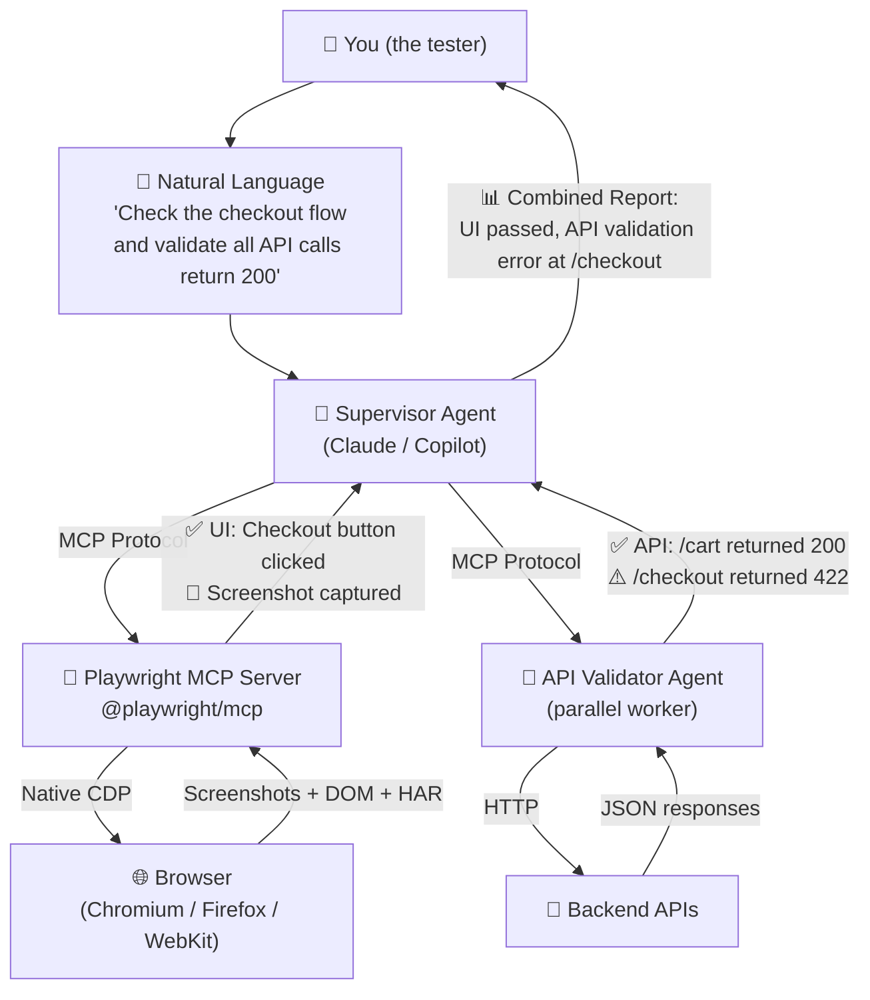
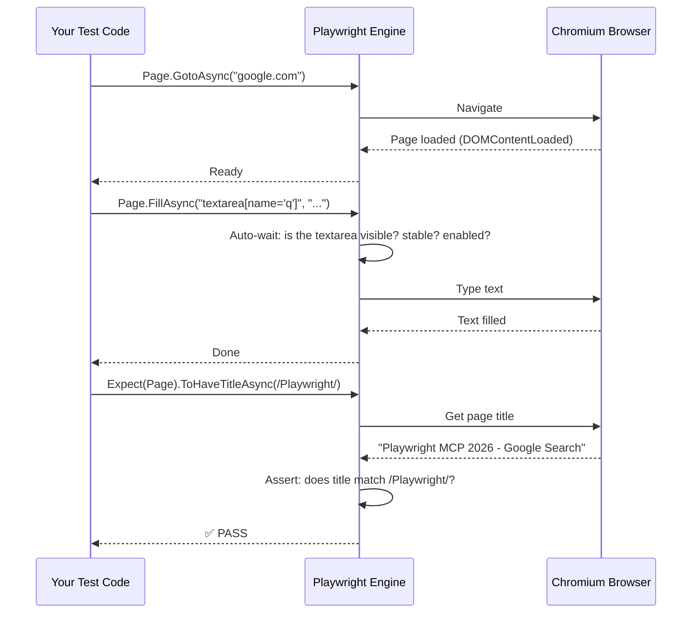
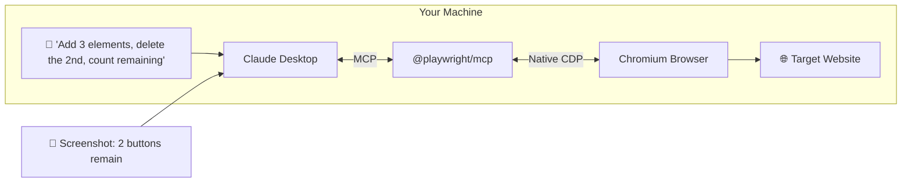
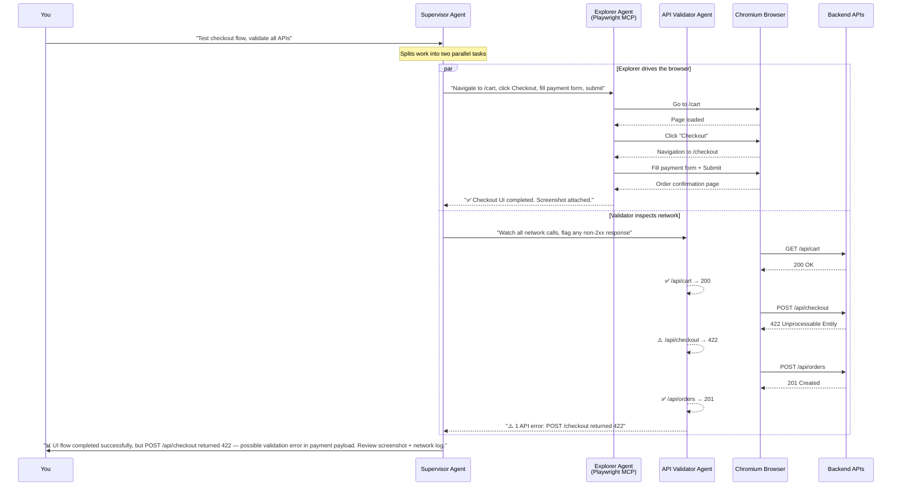
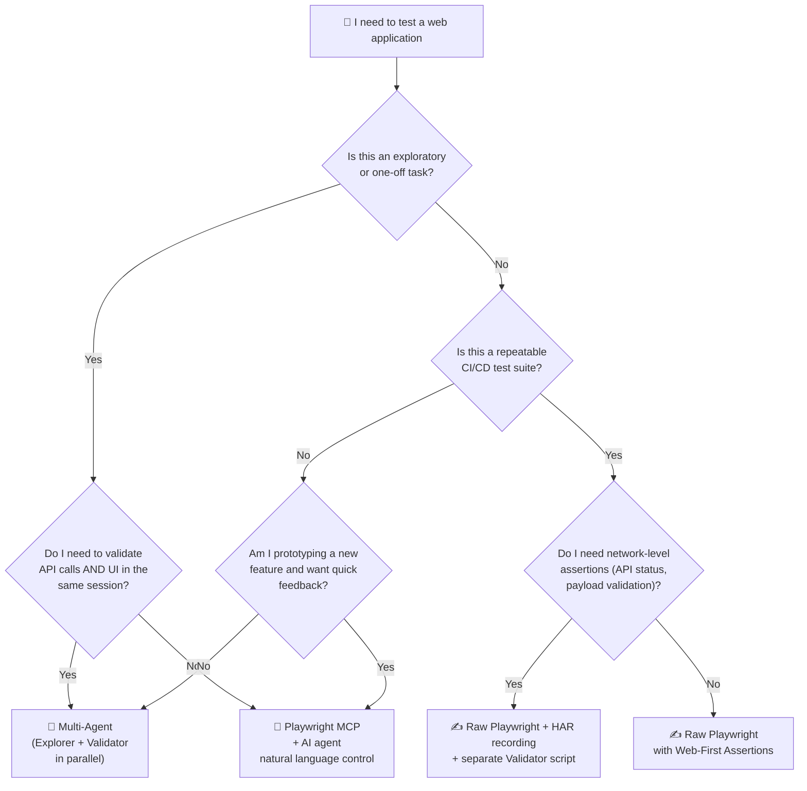

In the [previous guide](), you learned how to set up Selenium with MCP and let an AI agent drive your browser. Now we go a step further: **Playwright** — the browser automation engine that was built for the modern web — plus **multi-agent orchestration**, where two or more AI agents collaborate on the same test run.

If Selenium + MCP is like handing one expert a remote control, Playwright + multi-agent is like giving a **team** of experts simultaneous access to the same browser session, each watching a different layer of your app from network calls to visual snapshots to accessibility violations.

This guide picks up where the Selenium post left off. No prior Playwright experience needed.

## What Makes Playwright Different in 2026

Playwright was already faster than Selenium because it talks to the browser directly through the DevTools Protocol — no WebDriver middleman. In 2026, the gap is even wider:

| Capability | Playwright (v1.50+) | Selenium 4 + BiDi |
|---|---|---|
| Browser communication | **Native CDP** — direct browser socket | WebDriver BiDi — WebSocket bridge |
| Auto-waiting | **Built into every action** — `page.ClickAsync()` waits for clickable state automatically | Manual `WebDriverWait` or BiDi event subscription |
| MCP server | **`@playwright/mcp`** — official, zero-config | `selenium-mcp` — community-driven |
| Multi-browser | Chromium + Firefox + **WebKit** (bundled) | Chrome/Edge/Firefox, no WebKit |
| Mobile emulation | Built-in viewport + geolocation + touch | Requires Appium |
| AI codegen | `npx playwright codegen --ai` — natural language to script | Not available |
| Assertions | **Web-First Assertions** — auto-retry, no manual waits | Standard test-framework asserts |

The biggest beginner win: Playwright **auto-waits**. You never write `Thread.Sleep(3000)` or `WebDriverWait`. The engine pauses until the element is ready — clickable, visible, stable — and only then proceeds.

## Architecture Overview

Here's how the pieces fit together when you add MCP and multi-agent orchestration on top of Playwright:



The Supervisor agent delegates to two workers simultaneously: the **Playwright MCP server** drives the browser while the **API Validator** watches every network call. If the UI looks right but an API returns an error, you catch it immediately — no separate API test suite needed.

## Step 1: Install Playwright (60 Seconds)

Playwright bundles its own browser binaries. One command installs everything.

**.NET / C#:**

```bash
dotnet new nunit -n MyFirstPlaywrightTest
cd MyFirstPlaywrightTest
dotnet add package Microsoft.Playwright.NUnit
dotnet build
playwright install
```

**Python:**

```bash
pip install playwright
playwright install
```

**JavaScript / Node.js:**

```bash
npm init playwright@latest
# Select "TypeScript" or "JavaScript" when prompted
```

That's it. No WebDriver binaries, no `PATH` configuration, no `chromedriver.exe` version mismatch. Playwright downloads the exact browser versions it expects into a local cache.

## Step 2: Your First Test — Web-First Assertions

Create a test file. Here's the C# version (Python and JS versions follow the same pattern):

```csharp
using Microsoft.Playwright.NUnit;
using System.Threading.Tasks;

public class FirstTest : PageTest
{
    [Test]
    public async Task HelloPlaywright()
    {
        // Navigate — Playwright auto-waits for the page to load
        await Page.GotoAsync("https://www.google.com");

        // Type into the search box — auto-waits for the element to be visible
        await Page.FillAsync("textarea[name='q']", "Playwright MCP 2026");

        // Press Enter
        await Page.PressAsync("textarea[name='q']", "Enter");

        // Web-First Assertion: auto-retries until the title matches or times out
        await Expect(Page).ToHaveTitleAsync(new System.Text.RegularExpressions.Regex("Playwright"));
    }
}
```



**Key takeaway:** you wrote zero wait logic. `FillAsync` waited for the element to be visible. `Expect` auto-retried until the condition was true. This is the Playwright baseline — no flaky tests, no manual timeout tuning.

## Step 3: Web-First Assertions — Why You Never Write `Thread.Sleep` Again

In traditional Selenium, you spend 30% of your test code on waits:

```csharp
// ❌ Old way: guess how long to wait
Thread.Sleep(3000);
var text = driver.FindElement(By.ClassName("success-message")).Text;
Assert.AreEqual("Order confirmed", text);
```

Playwright's Web-First Assertions have **built-in auto-retry**. You describe the *expected state*, and Playwright polls the browser until that state is true (or a 5-second default timeout expires):

```csharp
// ✅ Playwright way: describe the outcome, let the engine wait
await Expect(Page.Locator(".success-message")).ToHaveTextAsync("Order confirmed");

// More Web-First assertion examples:
await Expect(Page.Locator("button#submit")).ToBeEnabledAsync();
await Expect(Page.Locator(".error-banner")).ToBeVisibleAsync();
await Expect(Page.Locator(".cart-count")).ToContainTextAsync("3");
await Expect(Page.Locator("input#email")).ToHaveValueAsync("user@example.com");
```

Each assertion polls the browser every ~100ms for up to 5 seconds. If the condition becomes true at 300ms, it passes immediately — no wasted time.

### Multi-Language Assertion Patterns

| Language | Web-First Assertion Syntax |
|---|---|
| **C# / NUnit** | `await Expect(Page.Locator(".msg")).ToHaveTextAsync("Done");` |
| **Python / pytest** | `expect(page.locator(".msg")).to_have_text("Done")` |
| **JS / TypeScript** | `await expect(page.locator(".msg")).toHaveText("Done");` |

All three follow the same pattern: `expect(locator).<condition>(expectedValue)`. The auto-retry logic is identical across languages.

## Step 4: Playwright MCP Server — Let AI Drive the Browser

This is the step that makes Playwright feel like the future. **MCP (Model Context Protocol)** turns your AI agent into a browser operator.

### How Playwright MCP Differs from Selenium MCP

In the [Selenium 2026 guide](), you set up `selenium-mcp` — a Python package that translates AI commands into WebDriver calls. Playwright MCP is **simpler and faster**:

- **Zero-config install** — one npm package, no Python dependency
- **Native CDP** — no WebDriver protocol overhead
- **Full Playwright surface** — network interception, HAR recording, mobile emulation, visual comparison, all exposed as MCP tools
- **Auto-wait baked in** — the AI says "click the login button" and Playwright handles timing

### Setup (3 Minutes)

**1. Install the Playwright MCP server:**

```bash
npm install -g @playwright/mcp
```

**2. Register it with Claude Desktop.**

Open your Claude Desktop config file:
- **Windows:** `%APPDATA%\Claude\claude_desktop_config.json`
- **macOS:** `~/Library/Application Support/Claude/claude_desktop_config.json`
- **Linux:** `~/.config/Claude/claude_desktop_config.json`

Add the Playwright MCP entry:

```json
{
  "mcpServers": {
    "playwright": {
      "command": "npx",
      "args": ["-y", "@playwright/mcp"],
      "env": {
        "PLAYWRIGHT_HEADLESS": "false"
      }
    }
  }
}
```

**3. Restart Claude Desktop. You'll see a new tool icon for Playwright.** 🔌

**4. Start talking to your browser:**

```
You:    "Go to https://the-internet.herokuapp.com/add_remove_elements/,
         click 'Add Element' three times, then click 'Delete' on the
         second button. How many buttons are left?"

Claude: [Opens Chromium, navigates, clicks Add Element ×3, clicks
         Delete on button #2]
        "There are 2 buttons remaining. Screenshot attached."
```



### What the Playwright MCP Server Exposes

The AI agent can call these tools directly — you don't write the code:

| MCP Tool | What it does | Natural-language equivalent |
|---|---|---|
| `browser_navigate` | Navigate to a URL | "Go to example.com" |
| `browser_click` | Click an element | "Click the Submit button" |
| `browser_type` | Type into a field | "Enter 'test@example.com' into the email field" |
| `browser_snapshot` | Capture full-page screenshot | "Take a screenshot" |
| `browser_take_screenshot` | Accessibility tree snapshot | "What's on the page right now?" |
| `browser_network_requests` | List all network requests | "Show me every API call the page made" |
| `browser_console_messages` | Read console logs | "Are there any JavaScript errors?" |
| `browser_evaluate` | Run arbitrary JS in the page | "What's the value of `window.__STATE__`?" |

## Step 5: Multi-Agent Testing — Two Agents, One Test Run

This is where Playwright in 2026 surpasses everything else. **Multi-agent testing** means you run two or more AI agents in parallel, each watching a different layer of your application, coordinated by a single Supervisor.

### The Supervisor-Worker Pattern

```
 ┌─────────────────────────────────────┐
 │         Supervisor Agent            │
 │  "Test the checkout flow and        │
 │   validate all API responses."      │
 └──────────┬──────────────┬───────────┘
            │              │
      ┌─────▼─────┐  ┌─────▼──────────┐
      │  Explorer │  │  API Validator  │
      │  Agent    │  │  Agent          │
      │ (Playwright│  │ (Network        │
      │  MCP)     │  │  Inspector)     │
      └─────┬─────┘  └─────┬──────────┘
            │              │
   Clicks buttons,    Intercepts every
   fills forms,       XHR/fetch call,
   takes screenshots  validates status
            │         codes + payloads
            │              │
      ┌─────▼──────────────▼─────┐
      │     Combined Report      │
      │  ✅ UI: All steps passed │
      │  ⚠️ API: /checkout 422  │
      └──────────────────────────┘
```

Here's what happens step-by-step:



### Concrete Example: Running a Multi-Agent Test

You don't need a custom framework to start. Here's a practical three-step workflow using tools you already have:

**Step 1 — Write a Playwright script that records everything:**

```csharp
using Microsoft.Playwright;
using System.Text.Json;

// Explorer Agent: navigate the checkout flow, capture every detail
var playwright = await Playwright.CreateAsync();
var browser = await playwright.Chromium.LaunchAsync(new() { Headless = false });
var context = await browser.NewContextAsync(new()
{
    // Record every network request and response
    RecordHarPath = "checkout-trace.har",
    RecordHarMode = HarMode.Full
});

var page = await context.NewPageAsync();

// Collect all API responses for the Validator to inspect
var apiResponses = new List<object>();
page.Response += (_, response) =>
{
    apiResponses.Add(new
    {
        url = response.Url,
        status = response.Status,
        method = response.Request.Method,
        timestamp = DateTime.UtcNow
    });
};

// Explorer: run the flow
await page.GotoAsync("https://your-app.com/cart");
await page.ClickAsync("button#checkout");
await page.FillAsync("input#card-number", "4111111111111111");
await page.FillAsync("input#expiry", "12/28");
await page.ClickAsync("button#place-order");

// Take a final screenshot for visual validation
await page.ScreenshotAsync(new() { Path = "checkout-final.png", FullPage = true });

// Save the API trace for the Validator agent
File.WriteAllText("api-responses.json",
    JsonSerializer.Serialize(apiResponses, new JsonSerializerOptions { WriteIndented = true }));

await browser.CloseAsync();
```

**Step 2 — The Validator agent checks the collected data:**

```csharp
// Define the response record that matches what the Explorer captured
public record ApiResponse(string Url, int Status, string Method, DateTime Timestamp);

// Validator Agent: read the Explorer's output and verify constraints
var responses = JsonSerializer.Deserialize<List<ApiResponse>>(
    File.ReadAllText("api-responses.json"));

var errors = responses
    .Where(r => r.Status < 200 || r.Status >= 300)
    .ToList();

if (errors.Any())
{
    Console.WriteLine($"⚠️ {errors.Count} API error(s) detected:");
    foreach (var err in errors)
        Console.WriteLine($"  {err.Method} {err.Url} → {err.Status}");
}
else
{
    Console.WriteLine("✅ All API calls returned 2xx");
}

// Validate critical endpoints were called
var requiredEndpoints = new[] { "/api/cart", "/api/checkout", "/api/orders" };
foreach (var endpoint in requiredEndpoints)
{
    var found = responses.Any(r => r.Url.Contains(endpoint));
    Console.WriteLine(found
        ? $"✅ Required endpoint {endpoint} was called"
        : $"❌ Missing required endpoint: {endpoint}");
}
```

**Step 3 — The Supervisor agent (you, or an LLM) reviews both outputs:**

- Explorer report: screenshot shows the order confirmation page — **UI passed** ✅
- Validator report: `/api/checkout` returned 422 — **API validation error** ⚠️
- Verdict: the frontend rendered a success page, but the backend rejected the payment payload. **This bug would be invisible in a UI-only test.**

### Why Multi-Agent Catches What Single-Agent Misses

| Testing approach | What it sees | What it misses |
|---|---|---|
| **Manual click-through** | "The confirmation page loaded" | API 422 errors, slow backend responses, missing audit trail |
| **Single-agent UI test** | "All buttons worked, no exceptions" | Network errors that the UI silently ignored |
| **Multi-agent (Explorer + Validator)** | **Both** — UI state AND network state in the same run | Almost nothing; any discrepancy between frontend and backend is flagged |

## Step 6: When to Use Each Approach

After setting up all three layers (Raw Playwright, Playwright MCP, Multi-Agent), here's how to choose:



- **Raw Playwright + Web-First Assertions** → best for CI/CD regression suites where you need fast, deterministic results with no AI variability.
- **Playwright MCP + AI agent** → best for exploratory testing, accessibility audits, one-off validations, and prototyping.
- **Multi-Agent (Explorer + Validator)** → best for end-to-end flows where you cannot afford to miss a single API error or frontend-backend mismatch.

## Where Existing Posts on This Blog Fit

This post is the 2026 Playwright refresh that connects to four earlier articles on techtalkwith-veeresh:

| Earlier post | What it covered | What changed by 2026 |
|---|---|---|
| [Mastering E2E Testing with C# Playwright (Jul 2024)]() | Playwright setup, cross-browser, API calls, SQL Server, tracing | Web-First Assertions replace manual `Assert.AreEqual`; MCP replaces manual script-writing for exploratory work |
| [Mastering Async Ops in C# Playwright (Aug 2024)]() | `WaitForResponseAsync`, manual deserialization, explicit waits | Web-First Assertions handle wait-and-assert in one call; multi-agent Validator watches all responses automatically |
| [Playwright .NET Framework Guide (Sep 2024)]() | NUnit + DI + Page Objects + Allure reporting | Page Objects become optional when MCP agents resolve interactable elements dynamically; add `@playwright/mcp` as a parallel testing mode |
| [Playwright vs Selenium in 2026 (Jun 2026)]() | Speed, reliability, multi-browser comparison | Playwright now has MCP + multi-agent orchestration — capabilities Selenium's ecosystem is still building toward |

## Sources & Further Reading

1. [Playwright Documentation](https://playwright.dev/docs/intro) — official guides, API references, and best practices for all languages
2. [Playwright for .NET](https://playwright.dev/dotnet/docs/intro) — C#-specific API reference used in this post's code examples
3. [@playwright/mcp on npm](https://www.npmjs.com/package/@playwright/mcp) — the official Playwright MCP server package
4. [Model Context Protocol Specification](https://modelcontextprotocol.io/) — the open protocol that enables AI agents to control browsers and other tools

## What to Do Next

1. **Run Step 1–2 right now.** Install Playwright and write the Hello World test. It takes under 3 minutes, and the auto-wait behavior will immediately click — you'll never want to write `Thread.Sleep` again.
2. **Try Playwright MCP.** If you have Claude Desktop, add the `@playwright/mcp` config and ask it to navigate to any site. Compare the experience to the [Selenium MCP setup]() — you'll notice the speed difference immediately.
3. **Experiment with multi-agent.** Take any existing Playwright test, add HAR recording, and write a 15-line Validator that checks for non-2xx responses. You'll probably find a bug your UI test was silently ignoring.
4. **For CI/CD pipelines:** stick with raw Playwright + Web-First Assertions. MCP and multi-agent add AI variability — fine for exploration, not ideal for deterministic pass/fail gates.
5. **Subscribe to this blog's [feed.xml]()** — next up: a deep-dive on Playwright's AI codegen (`npx playwright codegen --ai`) and how to generate an entire test suite from a requirements document.

*See also:* [AI-Driven Test Strategy: From Copilot to Multi-Agent Orchestration (Jun 2026)]() — the overarching thesis on how multi-agent systems are reshaping QA, from test generation to self-healing suites. · [Playwright AI Codegen in 2026 (Sep 2026)]() — the deep-dive teased above: generating test suites from natural language.
