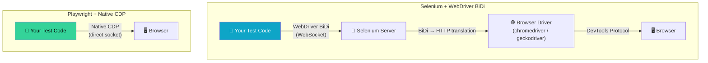
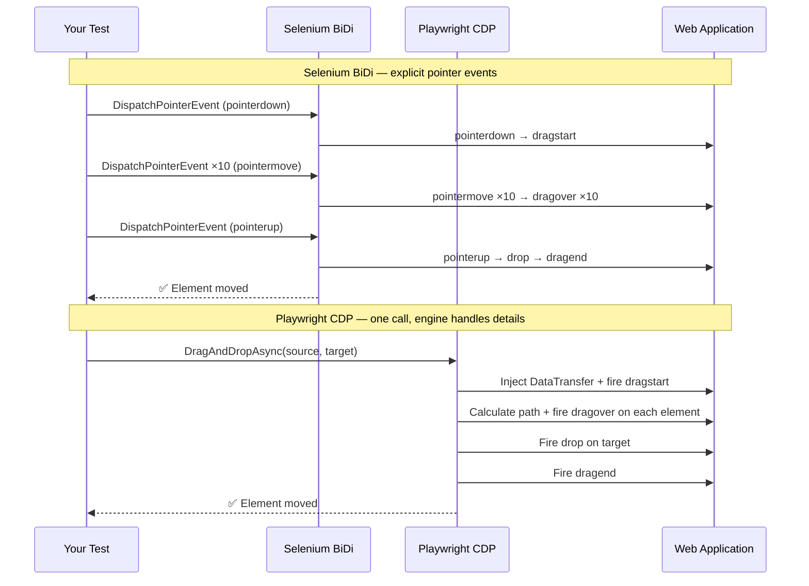
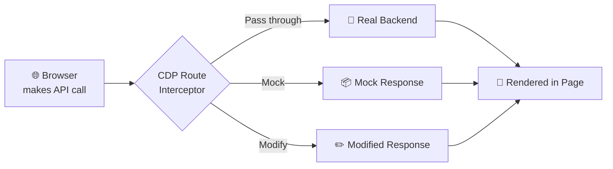
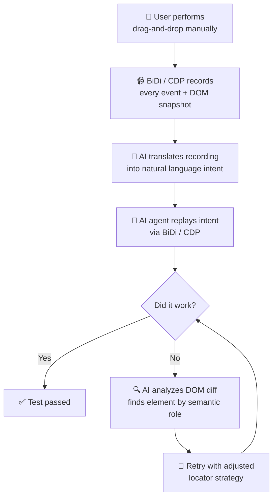
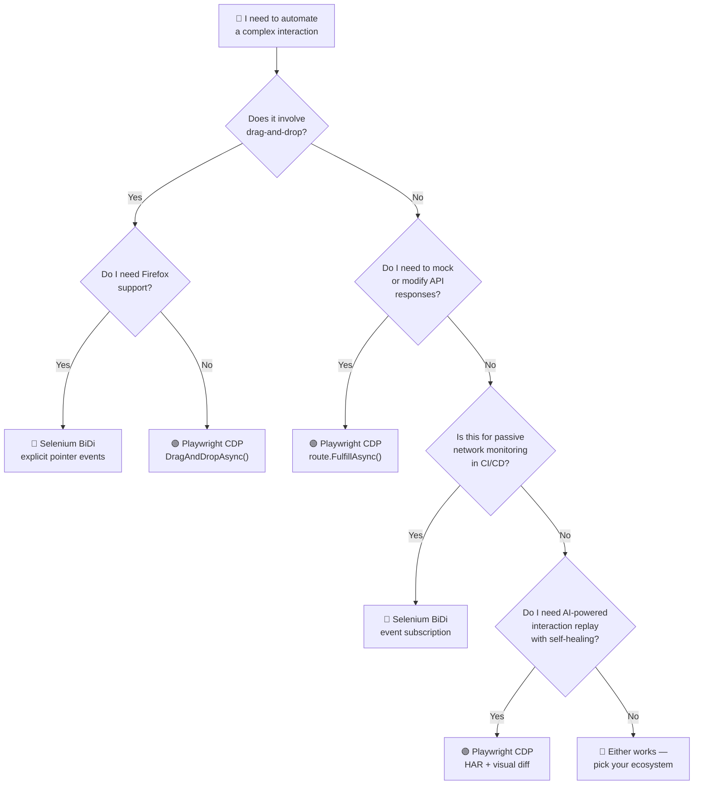

Two years ago, automating drag-and-drop meant writing JavaScript fallbacks because Selenium's `Actions` class couldn't keep up with custom web components. Today, both Selenium and Playwright have low-level browser protocol access — **BiDi** and **CDP** — that let you simulate interactions at the engine level, intercept network traffic, and even replay sessions with AI assistance.

This post compares the two approaches side-by-side for the three hardest interaction types: drag-and-drop, network interception, and AI-powered replay. If you read the [Selenium 2026 guide]() and the [Playwright MCP guide](), this is the next step — going deeper into the protocol layer.

## How BiDi and CDP Actually Work

Before comparing code, let's understand what's happening under the hood.



The critical difference: **Selenium BiDi adds a translation layer**. The browser speaks CDP natively, but Selenium wraps it in the WebDriver BiDi protocol — a WebSocket-based standard that all browser vendors agreed on. Playwright skips the translation and talks CDP directly.

| Characteristic | Selenium BiDi | Playwright CDP |
|---|---|---|
| Protocol | WebDriver BiDi (W3C standard) | Chrome DevTools Protocol (Chromium-native) |
| Browser support | Chrome, Edge, Firefox | Chromium, Firefox, WebKit |
| Setup | Selenium Manager auto-downloads driver | Playwright bundles browser binaries |
| Network events | `NetworkResponseReceived` event | `page.route()` interceptor |
| Low-level access | BiDi log + network domains | Full CDP surface (DOM, CSS, Performance, etc.) |
| Learning curve | Moderate — BiDi has fewer domains than CDP | Steeper — CDP has 50+ domains |

The tradeoff: BiDi is simpler but less powerful. CDP is deeper but Chromium-only for the most advanced features.

## Drag-and-Drop: From JavaScript Hacks to Protocol-Level Events

In the [2024 drag-and-drop guide](), most methods relied on JavaScript fallbacks because Selenium's `Actions` class couldn't reliably trigger custom drag handlers. In 2026, both BiDi and CDP let you fire the raw `dragstart`, `dragover`, and `drop` events that the application is actually listening for.

### Selenium BiDi: Dispatch Input Events

BiDi's input domain lets you synthesize pointer events. You describe the interaction as a sequence of low-level actions:

```csharp
using OpenQA.Selenium;
using OpenQA.Selenium.Chrome;

using IWebDriver driver = new ChromeDriver();
driver.Navigate().GoToUrl("https://your-app.com/kanban");

var source = driver.FindElement(By.CssSelector(".card[draggable='true']"));
var target = driver.FindElement(By.CssSelector(".column:nth-child(3)"));

// BiDi: use the BrowsingContext to dispatch low-level input events
var browsingContext = driver.GetBrowsingContext();

// Dispatch a pointer down on the source element
await browsingContext.DispatchPointerEventAsync(new()
{
    Type = PointerEventType.PointerDown,
    X = source.Location.X + source.Size.Width / 2,
    Y = source.Location.Y + source.Size.Height / 2
});

// Move the pointer toward the target (multiple small moves for smooth animation)
for (int i = 0; i < 10; i++)
{
    double progress = (i + 1) / 10.0;
    await browsingContext.DispatchPointerEventAsync(new()
    {
        Type = PointerEventType.PointerMove,
        X = source.Location.X + (int)((target.Location.X - source.Location.X) * progress),
        Y = source.Location.Y + (int)((target.Location.Y - source.Location.Y) * progress)
    });
    await Task.Delay(30); // Small delay between moves for natural feel
}

// Release on the target
await browsingContext.DispatchPointerEventAsync(new()
{
    Type = PointerEventType.PointerUp,
    X = target.Location.X + target.Size.Width / 2,
    Y = target.Location.Y + target.Size.Height / 2
});
```

The advantage: BiDi fires actual `pointerdown`/`pointermove`/`pointerup` events that the browser dispatches natively. No JavaScript injection. No `DataTransfer` hacks. The application's `dragstart` listener fires as if a real user dragged the element.

### Playwright CDP: Route and Simulate at the Protocol Level

Playwright can go even deeper — it can intercept and modify the HTML5 drag events before they reach the page:

```csharp
using Microsoft.Playwright;

var playwright = await Playwright.CreateAsync();
var browser = await playwright.Chromium.LaunchAsync(new() { Headless = false });
var page = await browser.NewPageAsync();

// Playwright's DragAndDropAsync uses CDP under the hood:
// 1. Injects a DataTransfer into the drag event pipeline
// 2. Fires dragstart → dragover → drop → dragend natively
// 3. No JavaScript hacks, no coordinate math
await page.GotoAsync("https://your-app.com/kanban");
await page.DragAndDropAsync(".card[draggable='true']", ".column:nth-child(3)");
```

Playwright's `DragAndDropAsync` is a single call. Under the hood it uses CDP to:
1. Inject a `DataTransfer` into the drag event pipeline
2. Fire `dragstart` with the correct payload
3. Fire `dragover` on each element the cursor passes over
4. Fire `drop` on the target
5. Fire `dragend` to clean up



### Which Wins for Drag-and-Drop?

| | Selenium BiDi | Playwright CDP |
|---|---|---|
| **API simplicity** | Explicit pointer events (more code) | `DragAndDropAsync()` (one line) |
| **Reliability** | Must calculate coordinates correctly | Engine handles coordinate math |
| **Debugging** | Easy to step through each pointer event | Black-box — one call, pass or fail |
| **Browser support** | Chrome, Edge, Firefox | Chromium, Firefox, WebKit |
| **Custom drag handlers** | Fires native events — works with any handler | Injects DataTransfer — compatible with HTML5 drag API |

**Winner: Playwright** for simplicity. **Selenium BiDi** for debugging and Firefox support.

## Network Interception: Watch, Modify, and Mock API Calls

Both BiDi and CDP let you intercept network requests mid-flight. This is the superpower that eliminates the need for separate API mocking tools in many cases.

### Selenium BiDi: Network Event Subscription

```csharp
var driver = new ChromeDriver();

// Subscribe to network events BEFORE navigating
var network = driver.Manage().Network;

network.NetworkRequestSent += (_, e) =>
{
    Console.WriteLine($"➡️ {e.RequestMethod} {e.RequestUrl}");
};

network.NetworkResponseReceived += (_, e) =>
{
    var status = e.ResponseStatusCode;
    var icon = status switch
    {
        >= 200 and < 300 => "✅",
        >= 400 and < 500 => "⚠️",
        >= 500 => "❌",
        _ => "ℹ️"
    };
    Console.WriteLine($"{icon} {status} ← {e.ResponseUrl}");
};

network.StartMonitoring();

driver.Navigate().GoToUrl("https://your-app.com/dashboard");

// After navigation, assert every API call succeeded
var failedCalls = network.GetReceivedResponses()
    .Where(r => r.ResponseStatusCode >= 400)
    .ToList();

Assert.IsEmpty(failedCalls, 
    $"Found {failedCalls.Count} failed API calls: " +
    string.Join(", ", failedCalls.Select(c => $"{c.ResponseStatusCode} {c.ResponseUrl}")));
```

BiDi's network domain is event-driven: you subscribe to `NetworkRequestSent` and `NetworkResponseReceived`, and the browser pushes events to you in real time. No polling, no explicit waits.

### Playwright CDP: Route Interception

Playwright's `page.RouteAsync()` is more powerful — you can intercept, modify, or mock responses mid-flight:

```csharp
var page = await browser.NewPageAsync();

// Intercept ALL API calls to /api/
await page.RouteAsync("**/api/**", async route =>
{
    var request = route.Request;

    // Option 1: Let it through but log
    Console.WriteLine($"📡 {request.Method} {request.Url}");

    // Option 2: Mock the response
    if (request.Url.Contains("/api/slow-endpoint"))
    {
        await route.FulfillAsync(new()
        {
            Status = 200,
            ContentType = "application/json",
            Body = """{ "mocked": true, "message": "This response was intercepted by CDP" }"""
        });
        return;
    }

    // Option 3: Let it pass through
    await route.ContinueAsync();
});

await page.GotoAsync("https://your-app.com/dashboard");

// The slow endpoint now returns instantly with mocked data
```



### Which Wins for Network Interception?

| | Selenium BiDi | Playwright CDP |
|---|---|---|
| **Event subscription** | Simple event handlers | `page.RouteAsync()` with pattern matching |
| **Mock responses** | Not supported (read-only) | `route.FulfillAsync()` — full mock capability |
| **Modify in-flight** | Not supported | `route.ContinueAsync()` with modified headers/body |
| **Real-time monitoring** | Built-in — subscribe and forget | Requires explicit route handlers |
| **Use case** | Passive monitoring, assertion on response codes | Active interception, mocking, throttling |

**Winner: Playwright CDP** for power and flexibility. **Selenium BiDi** for simple monitoring — the event subscription model is cleaner for "watch everything and report" scenarios.

## AI-Powered Interaction Replay

This is the 2026 differentiator. Both BiDi and CDP can record a user session and replay it through an AI agent that adapts to UI changes.

### How It Works

```
1. RECORD  →  User performs drag-and-drop manually in the browser
2. CAPTURE  →  BiDi/CDP records every event + DOM state at each step
3. DESCRIBE →  AI translates the recording into natural language:
              "Drag the card titled 'Fix login bug' from the 'Backlog'
               column to the 'In Progress' column"
4. REPLAY   →  AI agent executes the description, adapting to layout
               changes (the card moved 50px right? AI finds it by title)
5. HEAL     →  If replay fails, AI analyzes DOM diff and retries with
               an adjusted strategy
```



### Selenium BiDi + AI Replay

```csharp
// Step 1: Record a BiDi session
var driver = new ChromeDriver();
var recorder = new BiDiSessionRecorder(driver);

recorder.StartRecording();
driver.Navigate().GoToUrl("https://your-app.com/kanban");

// User performs the drag-and-drop manually (or via Actions)
// ... manual interaction happens here ...

recorder.StopRecording();
var sessionTrace = recorder.GetTrace(); // JSON: every event + timestamps + DOM snapshots

// Step 2: AI translates trace → natural language intent
var intent = await AITranslator.TraceToIntentAsync(sessionTrace);
// Output: "Drag the card with title 'Fix login bug' from column #1 to column #3"

// Step 3: Replay with self-healing
var replayer = new BiDiSessionReplayer(driver);
var result = await replayer.ReplayWithHealingAsync(intent);

if (result.Succeeded)
    Console.WriteLine($"✅ Replayed successfully after {result.Retries} retries");
else
    Console.WriteLine($"❌ Replay failed: {result.Error}");
```

### Playwright CDP + AI Replay

Playwright's deeper CDP access gives the AI agent more information for self-healing:

```csharp
// Playwright records a HAR file + DOM snapshots automatically
var context = await browser.NewContextAsync(new()
{
    RecordHarPath = "session-trace.har",
    RecordHarMode = HarMode.Full
});

var page = await context.NewPageAsync();

// CDP: inject a visual marker that tracks element positions
await page.EvaluateAsync(@"() => {
    document.addEventListener('dragstart', e => {
        window.__dragSourceRect = e.target.getBoundingClientRect();
    });
    document.addEventListener('drop', e => {
        window.__dropTargetRect = e.target.getBoundingClientRect();
    });
}");

// User performs interaction...
await page.GotoAsync("https://your-app.com/kanban");
// ... manual drag-and-drop ...

// AI replay with CDP-enhanced healing
var healer = new CDPHealer(page);
await healer.ReplayFromHARAsync("session-trace.har", new()
{
    SemanticFallback = true,  // Find elements by ARIA role + text content
    VisualDiff = true,        // Compare screenshots to detect layout shifts
    MaxRetries = 3
});
```

| AI Replay Feature | Selenium BiDi | Playwright CDP |
|---|---|---|
| **Event recording** | WebSocket event log | HAR + DOM snapshots |
| **Semantic healing** | By element attributes | By ARIA role + text + visual position |
| **Visual diff** | Not built-in | Screenshot comparison via CDP |
| **AI translation** | Community tools | Playwright's `codegen --ai` integration |

## When to Use Which



**Rule of thumb:**
- **Playwright CDP** for Chromium-first teams that want maximum power (mock, modify, replay with visual diff)
- **Selenium BiDi** for cross-browser teams that need Firefox and prefer explicit control over each event

## Where Existing Posts Fit

| Earlier post | What it covered | What changed by 2026 |
|---|---|---|
| [Drag-and-Drop in C# Selenium (Aug 2024)]() | 8 methods using `Actions` + JavaScript fallbacks | BiDi fires native pointer events — no JS injection, no `DataTransfer` hacks |
| [Selenium 2026 Beginner's Guide (Jul 2026)]() | WebDriver BiDi basics, MCP setup, Relative Locators | This post goes deeper into BiDi's input and network domains |
| [Playwright MCP + Multi-Agent (Aug 2026)]() | MCP server, multi-agent pattern, Web-First Assertions | CDP gives the Explorer agent network-level visibility; the Validator agent uses CDP route interception |
| [Playwright vs Selenium in 2026 (Jun 2026)]() | Speed, reliability, multi-browser comparison | Now with protocol-level comparison: BiDi vs CDP for complex interactions |

## Multi-Language Quick Reference

This post used C# examples. Here's the equivalent syntax in **Java**, **TypeScript**, **JavaScript**, and **Python** for key BiDi and CDP operations:

### Selenium BiDi — Drag-and-Drop

| Language | Pointer event dispatch |
|---|---|
| **C#** | `browsingContext.DispatchPointerEventAsync(new() { Type = PointerEventType.PointerDown, X = 100, Y = 200 })` |
| **Java** | `browsingContext.dispatchPointerEvent(new PointerEvent(PointerEventType.POINTER_DOWN, 100, 200))` |
| **TypeScript** | `await browsingContext.dispatchPointerEvent({ type: 'pointerDown', x: 100, y: 200 })` |
| **JavaScript** | `await browsingContext.dispatchPointerEvent({ type: 'pointerDown', x: 100, y: 200 })` |
| **Python** | `await browsing_context.dispatch_pointer_event(type="pointerDown", x=100, y=200)` |

### Selenium BiDi — Network Monitoring

| Language | Event subscription pattern |
|---|---|
| **C#** | `network.NetworkResponseReceived += (_, e) => { if (e.ResponseStatusCode >= 400) ... }` |
| **Java** | `network.onNetworkResponseReceived(response -> { if (response.getResponseStatusCode() >= 400) ... })` |
| **TypeScript** | `network.on('networkResponseReceived', (response) => { if (response.statusCode >= 400) ... })` |
| **JavaScript** | `network.on('networkResponseReceived', (response) => { if (response.statusCode >= 400) ... })` |
| **Python** | `network.on_network_response_received(lambda response: ... if response.status_code >= 400)` |

### Playwright CDP — Drag-and-Drop

| Language | One-line drag-and-drop |
|---|---|
| **C#** | `await page.DragAndDropAsync(".source", ".target");` |
| **Java** | `page.dragAndDrop(".source", ".target");` |
| **TypeScript** | `await page.dragAndDrop('.source', '.target');` |
| **JavaScript** | `await page.dragAndDrop('.source', '.target');` |
| **Python** | `await page.drag_and_drop(".source", ".target")` |

### Playwright CDP — Route Interception

| Language | Route mock pattern |
|---|---|
| **C#** | `await page.RouteAsync("**/api/**", async route => { await route.FulfillAsync(new() { Status = 200, Body = mockJson }); })` |
| **Java** | `page.route("**/api/**", route -> route.fulfill(new Route.FulfillOptions().setStatus(200).setBody(mockJson)))` |
| **TypeScript** | `await page.route('**/api/**', async route => { await route.fulfill({ status: 200, body: mockJson }) })` |
| **JavaScript** | `await page.route('**/api/**', async route => { await route.fulfill({ status: 200, body: mockJson }) })` |
| **Python** | `await page.route("**/api/**", lambda route: route.fulfill(status=200, body=mock_json))` |

### Playwright — Browser Launch

| Language | Launch pattern |
|---|---|
| **C#** | `var browser = await playwright.Chromium.LaunchAsync(new() { Headless = false })` |
| **Java** | `Browser browser = playwright.chromium().launch(new BrowserType.LaunchOptions().setHeadless(false))` |
| **TypeScript** | `const browser = await playwright.chromium.launch({ headless: false })` |
| **JavaScript** | `const browser = await playwright.chromium.launch({ headless: false })` |
| **Python** | `browser = await playwright.chromium.launch(headless=False)` |

> **TypeScript vs JavaScript:** Playwright's TypeScript API uses the same syntax as JavaScript for most operations — the difference is type safety (`const browser: Browser`). Both benefit from Playwright's auto-complete in VS Code.

## Sources & Further Reading

1. [WebDriver BiDi W3C Specification](https://w3c.github.io/webdriver-bidi/) — the W3C standard for bidirectional browser automation
2. [Chrome DevTools Protocol Documentation](https://chromedevtools.github.io/devtools-protocol/) — the CDP surface Playwright accesses natively and Selenium accesses via BiDi translation
3. [Playwright CDP Session API](https://playwright.dev/docs/api/class-cdpsession) — official docs for the CDP session used in drag-and-drop and network interception examples
4. [Selenium WebDriver BiDi Guide](https://www.selenium.dev/documentation/webdriver/bidi/) — official BiDi documentation including network and input domains

## What to Do Next

1. **Try the drag-and-drop examples.** Take any drag-based UI (Kanban, file upload, sortable list) and test both the BiDi pointer-event approach and Playwright's `DragAndDropAsync()`. See which one handles your app's custom drag handlers.
2. **Set up network monitoring in CI.** Subscribe to BiDi's `NetworkResponseReceived` in your existing Selenium suite. One event handler, and you'll catch every 500 error your UI tests were silently ignoring.
3. **Experiment with AI replay.** Record a manual drag-and-drop session in Playwright (HAR recording is built-in), then ask an LLM to describe what happened in natural language. You've just built a self-documenting test.
4. **Subscribe to this blog's [feed.xml]()** — next up: a deep-dive on self-healing locators and how AI can find elements by their semantic role when CSS selectors break.

*See also:* [AI-Driven Test Strategy: From Copilot to Multi-Agent Orchestration (Jun 2026)]() — the overarching thesis on multi-agent QA systems, including the self-healing locator pattern referenced above. · [Self-Healing Test Suites (Jul 2026)]() — full implementation: Java SemanticHealer, CDP accessibility tree, DOM diff, CI/CD healing log.
