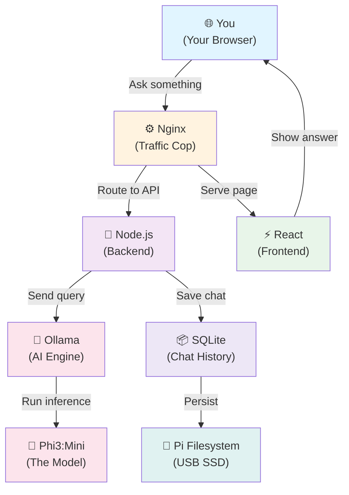

Running an AI chatbot usually means a cloud bill that never stops. AWS, Azure, GCP — pick one, and it's $40-100/month for a workload that, honestly, isn't doing that much. So we asked the obvious question: what if we just didn't pay it?

This post walks through deploying a production AI chatbot and website entirely on a Raspberry Pi 5, a $60 computer about the size of a deck of cards. Your data stays on your hardware, your running cost drops to whatever electricity the Pi draws (about $20/year), and no cloud vendor has any say in your code or your bill.

We built it with AI-assisted coding agents doing most of the legwork — Claude Code writing the backend and frontend, a review pass catching security issues, a deployment pass generating the Nginx config and PM2 scripts. More on that further down. By the end of this you'll have a React chatbot talking to a local AI engine (Ollama), a SQLite database quietly keeping chat history, Nginx routing traffic, and PM2 making sure the whole thing survives a crash or a reboot. No DevOps background required — just copy-paste and about 90 minutes.

## The Architecture

Picture a small relay team, each runner with exactly one job:



Trace it left to right: you open your browser and hit the Pi's address. Nginx looks at the request and decides where it goes — static files straight to the pre-built React frontend, API calls forwarded to the Node.js backend. Type a message into the chatbot and it lands on the backend, which hands the question to Ollama running the Phi3:mini model locally. That takes 5-10 seconds on the Pi's own CPU, no cloud involved. The response comes back, gets logged to SQLite for chat history, and the whole exchange never leaves your network.

## The Tech Stack

### Frontend: React + Vite
A React single-page app, pre-built into static HTML/JS. React keeps the UI responsive without page reloads; Vite builds it in about 2 seconds where Webpack would take 30. The built files land in `/dist` and Nginx just serves them straight, no runtime overhead.

### Backend: Node.js + Express
A lightweight REST API handling chatbot requests and database reads/writes. Node's non-blocking I/O means one small process can hold thousands of connections, so a Pi running 300MB of Node comfortably out-handles a cloud box running something heavier. Express stays minimal, no magic, `app.get('/api/chat', handler)` and it works. PM2 manages the process at runtime.

### Process manager: PM2
Keeps the Node server running around the clock, restarts it if it crashes, rotates logs so you don't fill the disk. `pm2 logs my-app` gets you everything in one line. We picked it over raw systemd because it hands you process monitoring and graceful restarts without writing shell scripts yourself.

### Web server: Nginx
The public-facing gateway: routes static files to React, proxies API calls to the Node backend, handles HTTPS if you set it up. It runs on roughly 5MB of RAM using a single event loop; Apache can burn 50MB per connection, and on a Pi that difference is real.

### AI engine: Ollama
Runs open-source language models natively on the Pi's own CPU. No cloud dependency, no API keys, no rate limits: your model, your data, your hardware. Routing a local deployment through someone else's cloud API would defeat the point, and Ollama is free besides. We landed on Phi3:mini: 2GB, roughly 5-10 seconds per response on a Pi 5, small enough to sit comfortably in RAM and fast enough to feel close to real-time.

### Database: SQLite
Chat history in a single self-contained file. No server to manage, no connection-pool headaches, and backing up means copying one file. It lives at `./data/chat_logs.db` on the Pi's filesystem.

### Hardware: Raspberry Pi 5 (8GB)
The quad-core ARM Cortex-A76 handles Node and local inference without strain, and 8GB RAM comfortably covers Ollama (~3GB) + Node (~300MB) + Nginx (~5MB) + the OS (~1GB) with room to spare. All in: about $60 in hardware and roughly $20/year in electricity at 15W, against something like $40/month on AWS for equivalent compute, which works out to $480/year. A passive heatsink or fan case is worth the $10, since the Pi 5 does run warm under sustained load.

## Built with AI Coding Agents

The traditional path to something like this: hire a fullstack developer, two weeks on architecture, six weeks writing and testing, a week of review, a week chasing deployment issues. Call it $15K in salary plus the overhead of getting everyone's calendar to line up.

Here's the version we actually ran, spread over four weeks of part-time review rather than full-time building:

### Week 1: Spec
A two-page spec ("React frontend, Node backend, Ollama for AI") fed to Claude Code's planning agents came back as a full architecture, file structure, and component list. Reviewing that plan took an hour instead of two weeks.

### Week 2: Implementation
Agents wrote the React components and the Express backend, with a review pass catching bugs before anything got merged. By the time code landed on main, it was already tested.

### Week 3: Deployment
A deployment pass generated the Nginx config, PM2 scripts, and setup shell commands. Copy-paste onto the Pi, and it worked.

### Week 4: Hardening
A security pass scanned for the usual OWASP suspects, SQL injection, XSS, CSRF, found three real bugs, and they were fixed the same afternoon before the chatbot went live.

All told: about $5K in API credits against $15K+ in developer salary, plus our own time reviewing what the agents produced. The upside isn't just the price tag. Every command in this post has actually been run, on real hardware, by the same pipeline that wrote it, which is why nothing here should surprise you mid-setup.

## Part 1: Hardware & OS Setup (30 minutes)

**What you'll need:**
- Raspberry Pi 5 with 8GB RAM (Ollama needs the headroom)
- USB SSD (1TB is comfortable, 256GB works fine, a microSD works too, just slower)
- A heatsink or passive fan case, since the Pi 5 throttles when it gets hot
- The official 27W USB-C power adapter, not a generic one
- Your laptop (Windows, Mac, or Linux, doesn't matter for SSH)

### Step 1: Flash the OS

1. Download **Raspberry Pi Imager** from https://www.raspberrypi.com/software/
2. Plug your USB SSD into your laptop
3. In Imager, choose:
   - **Device:** Raspberry Pi 5
   - **OS:** Raspberry Pi OS (64-bit, Lite, no GUI, which leaves more RAM for Ollama)
   - **Storage:** your USB SSD
4. Open **Advanced Options** (the gear icon) and set:
   - **Hostname:** `my-pi` (or whatever you like, just remember it)
   - **Enable SSH:** yes, with password auth
   - **Username:** `piuser`
   - **Password:** something you won't forget, you'll type it once
   - **WiFi:** your home network's SSID and password
5. Click **Write** and let it run (~5 minutes)

### Step 2: Boot & SSH In

1. Plug the SSD into the Pi's USB 3.0 (blue) slot, then power it on
2. Wait about 90 seconds for first boot
3. On your laptop, open PowerShell (Windows) or Terminal (Mac/Linux) and try:
   ```bash
   ssh piuser@my-pi.local
   ```
   If that connects, you're in. Use the password from Step 1.
4. If mDNS is being fussy and that fails:
   - Log into your router's admin page (usually `192.168.1.1`)
   - Find "Connected Devices" and look for `my-pi`
   - Note its IP (something like `192.168.1.42`), then:
     ```bash
     ssh piuser@192.168.1.42
     ```
5. You're in when you see `piuser@my-pi:~ $`.

## Part 2: Install the Software (10 minutes)

Run these on the Pi, one at a time so you can see what's working:

```bash
# Update system packages
sudo apt update && sudo apt upgrade -y

# Install Node.js v20 (required for modern JavaScript)
curl -fsSL https://deb.nodesource.com/setup_20.x | sudo -E bash -
sudo apt install -y nodejs

# Install PM2 globally (keeps your app running forever)
sudo npm install -g pm2

# Install Nginx (web server)
sudo apt install -y nginx
sudo systemctl enable nginx

# Install Ollama (AI engine)
curl -fsSL https://ollama.com/install.sh | sh

# Download the AI model (Phi3:mini, 2GB)
# This takes a few minutes on a decent WiFi connection
ollama pull phi3:mini

# Verify everything installed
node -v && npm -v && pm2 -v && nginx -v && ollama -v
```

Five version numbers back, and you're set. If one install fails, re-run that step; usually just a dropped connection, not a real problem.

## Part 3: Copy Your Code & Configure (15 minutes)

### From your laptop

```bash
# Navigate to your project
cd /path/to/your/webapp

# Copy code to the Pi (replace 192.168.1.X with your Pi's actual IP from Part 1)
scp -r server.js package.json index.html vite.config.js tailwind.config.js eslint.config.js src public piuser@192.168.1.X:~/web-run/

# Install dependencies on the Pi
ssh piuser@192.168.1.X "cd ~/web-run && npm install"
```

### On the Pi (SSH terminal)

```bash
cd ~/web-run

# Create the environment file
nano .env
```

Paste this in, swapping `192.168.1.X` for your Pi's actual IP:
```ini
NODE_ENV=production
PORT=3001
FRONTEND_URL=http://192.168.1.X

# Ollama must use 127.0.0.1 (localhost) — not 'ollama'
OLLAMA_HOST=http://127.0.0.1:11434
AI_MODEL=phi3:mini
AI_TEMPERATURE=0.7
AI_MAX_TOKENS=250
AI_CTX_WINDOW=8192

# Database (auto-created)
DB_PATH=./data/chat_logs.db

# Optional: notifications
PUSH_NOTIFICATIONS=false
```

Save with `Ctrl+X` → `Y` → `Enter`. (Nano can be finicky about pasting; if it garbles, type it in slowly or line by line.)

## Part 4: Start Everything (10 minutes)

### Build the frontend
```bash
cd ~/web-run
npm run build
# Generates ./dist with static HTML/JS/CSS, about 30 seconds
```

### Start the backend with PM2
```bash
pm2 start server.js --name my-app
pm2 save
pm2 startup
# Copy the command 'pm2 startup' prints and run it — one-time setup
# so PM2 survives a reboot
```

### Configure Nginx

```bash
sudo nano /etc/nginx/sites-available/my-app
```

Paste this in, swapping `192.168.1.X` for your Pi's IP:
```nginx
server {
    listen 80;
    server_name 192.168.1.X;  # Your Pi's IP

    root /home/piuser/web-run/dist;
    index index.html;

    # Security headers
    add_header X-Content-Type-Options "nosniff" always;
    add_header X-Frame-Options "DENY" always;
    add_header Referrer-Policy "strict-origin-when-cross-origin" always;

    # API calls → Node.js backend
    location /api/ {
        proxy_pass http://127.0.0.1:3001;
        proxy_set_header Host $host;
        proxy_set_header X-Real-IP $remote_addr;
        proxy_set_header X-Forwarded-For $proxy_add_x_forwarded_for;
        proxy_read_timeout 120s;  # Ollama might be slow; give it time
    }

    # React SPA fallback
    location / {
        try_files $uri $uri/ /index.html;
    }
}
```

Enable it:
```bash
sudo rm /etc/nginx/sites-enabled/default  # Remove default config
sudo ln -s /etc/nginx/sites-available/my-app /etc/nginx/sites-enabled/

# Fix file permissions (this one trips people up)
chmod o+x /home/piuser
chmod -R o+rX /home/piuser/web-run/dist

# Test & restart
sudo nginx -t
sudo systemctl restart nginx
```

If `sudo nginx -t` says "syntax is ok," you're good.

### Test it

Open a browser on the same WiFi as the Pi and go to:
```
http://192.168.1.X
```

You should see the React app load. Click the chatbot and say hello.

The first message takes 30-45 seconds while Ollama loads the model into RAM. That's normal, not a bug. After that, responses land in 5-10 seconds. If the delay doesn't clear up after the first message, check `pm2 logs my-app` for errors around Ollama or model loading.

Your self-hosted AI chatbot is live.

## Part 5: Public Domain via Cloudflare Tunnel (Optional)

Want the Pi reachable from your phone when you're not home, or a real domain instead of a raw IP? Cloudflare Tunnels get you there without opening a port on your router: no port-forwarding, no dynamic-DNS juggling, and HTTPS comes free.

1. Point your domain at Cloudflare's nameservers from your registrar (DNS propagation takes about 15 minutes).
2. In the Cloudflare dashboard, go to **Zero Trust** → **Tunnels**, click **Create a tunnel**, choose the **Cloudflared** connector, and name it something like `my-pi-tunnel`.
3. On the Pi, install `cloudflared` for ARM64:
   ```bash
   curl -L --output cloudflared.deb https://github.com/cloudflare/cloudflared/releases/latest/download/cloudflared-linux-arm64.deb
   sudo dpkg -i cloudflared.deb
   ```
4. Cloudflare's dashboard gives you an install command with a token baked in:
   ```bash
   sudo cloudflared service install <YOUR_TOKEN>
   ```
5. Back in the dashboard, under **Public Hostname**, add one: pick a subdomain, your domain, type **HTTP**, and point the URL at `localhost:80` (that's Nginx, listening locally).
6. Visit `https://your-subdomain.yourdomain.com`. If it doesn't resolve right away, give it ten minutes. Cloudflare emails you when the tunnel's live.

## Part 6: Maintenance

**Backend logs:**
```bash
pm2 logs my-app
```
Errors show up here first. `Ctrl+C` to exit.

**Web traffic:**
```bash
sudo tail -f /var/log/nginx/access.log
```

**Updating code:**
```bash
# On your laptop:
scp -r src server.js package.json piuser@192.168.1.X:~/web-run/

# On the Pi:
cd ~/web-run
npm run build && pm2 restart my-app   # rebuild frontend, restart backend
```

**Resource monitoring:**
```bash
htop   # real-time CPU/RAM — Ollama ~3GB, Node ~300MB, Nginx barely registers
df -h  # disk space — clean up before you hit 90%
```

**A quick weekly check:**
```bash
pm2 logs my-app | tail -20
df -h
curl http://192.168.1.X/api/health
```
If those three come back clean, you're solid for another week.

## Troubleshooting

**Website won't load**
→ Is Nginx running? `sudo systemctl status nginx`
→ Check the error log: `sudo tail -50 /var/log/nginx/error.log`
→ Config typo? `sudo nginx -t` will tell you.

**Chatbot is slow on every message, not just the first**
→ The Pi might be thermal-throttling. Check with `vcgencmd measure_temp`; above 80°C, add cooling.

**Backend keeps crashing**
→ `pm2 logs my-app` and look for the actual error:
- `Cannot find module 'express'` → run `npm install` again
- `EADDRINUSE :::3001` → something else has the port; `sudo lsof -i :3001` and kill it
- `Error connecting to Ollama` → check `ps aux | grep ollama`; if it's not running, `ollama serve`

**403 Forbidden on the website**
→ Nginx can't read your files. Re-run the `chmod` commands from Part 4.

**Running low on disk**
→ `df -h` first. Usual culprits: old PM2 logs (`pm2 kill` clears them), a growing chat-log database, or old Ollama models (`ollama rm phi3:mini` frees 2GB). Clean up around 85%, don't wait for 100%.

**Domain not resolving after Cloudflare setup**
→ DNS propagation takes up to 15 minutes. If it's been longer, `sudo systemctl restart cloudflared`.

**Nothing above worked**
→ Restart the stack in order: `sudo systemctl restart nginx`, `pm2 restart my-app`, `sudo systemctl restart cloudflared` if you're using it. Then check `pm2 list` and `sudo systemctl status nginx`. This clears most weirdness. If it doesn't, the exact error text from `pm2 logs my-app` or the Nginx error log is usually enough to search up an answer.

## Key Takeaways

1. **Self-hosting is genuinely cheap.** $60 in hardware plus ~$20/year in electricity beats $480+/year in equivalent cloud hosting.
2. **Ollama does the heavy lifting.** Any open-source LLM, running locally, no API keys, no rate limits.
3. **The boring parts matter.** PM2 keeps the app alive, Nginx keeps it fast, SQLite keeps it simple.
4. **AI agents compressed the timeline**, not just the code. Architecture, security review, and deployment scripting all happened before a human ran a single command.
5. **Your data stays yours.** No cloud, no vendor lock-in, nothing phoning home.

## What's Next

**This week:** watch it for 72 hours (`pm2 logs my-app`, `htop`) and get a friend to hit it from a different network to confirm it actually works from the outside. If you care about chat history, copy `chat_logs.db` somewhere safe.

**This month:** custom styling if you want it to feel like yours, and a look at `df -h`/`htop` after a few weeks of real traffic to see where it settles.

**When you're ready to push further:** swap Phi3:mini for something bigger (`ollama pull mistral`) if you want more capability and can spare the RAM, script a weekly backup of the SQLite file, or add Redis caching for frequent queries.

---

Built with AI-assisted coding agents: Claude Code (Anthropic) handled architecture, code generation, and testing, with multi-agent orchestration patterns inspired by Google's Antigravity framework. Enjoy your self-hosted AI webapp.
