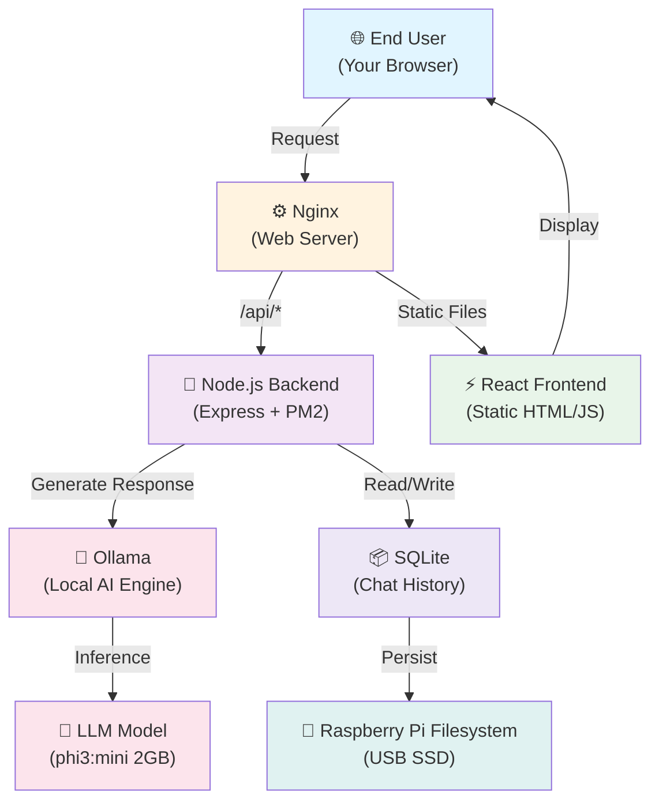

We built and deployed a production AI chatbot and business website entirely on a Raspberry Pi 5, a $60 computer about the size of a deck of cards. No cloud bills, no vendor lock-in, just a lean, self-hosted webapp running 24/7 in the corner of an office.

The twist: we didn't hand-write it line by line. The codebase, the architecture decisions, and the deployment pipeline all came out of AI-assisted coding agents — specifically Claude Code, with a few multi-agent orchestration patterns borrowed from Google's Antigravity framework. Agents wrote the backend API and the React frontend, a review pass caught security issues before they shipped, a deployment pass generated the Nginx config and PM2 startup scripts, and a testing pass checked the whole thing end to end.

What came out the other side is a production-grade, self-hosted AI chatbot running on commodity hardware, deployed and kept alive by a small team without a dedicated DevOps hire. This post is the playbook: the architecture, the stack, and the exact steps to build the same thing on your own Pi.

## The Architecture

Here's the bird's-eye view of what you'll have running by the end of this post:



Walk it left to right: you open your browser and hit the Pi's IP address or domain. Nginx catches the request and routes it — static files go straight to the pre-built React frontend, so the page loads instantly with no server rendering involved. When you type into the chatbot, that message goes to the Node.js backend, which forwards it to Ollama running the model locally. Phi3:mini (2GB) generates a response on the Pi's own CPU, the exchange gets logged to SQLite for chat history, and the whole loop never leaves your network. No data goes anywhere you didn't put it yourself.

## The Tech Stack

### Frontend: React + Vite
A React single-page app, pre-built into static HTML/JS. React gives a responsive UI without page reloads; Vite builds it in about 2 seconds instead of Webpack's 30. The built files land in `/dist` and Nginx just serves them, no runtime overhead.

### Backend: Node.js + Express
A lightweight REST API handling chatbot requests and database reads/writes. Node's non-blocking I/O means one small process can hold thousands of concurrent connections, which matters on hardware this size. Express stays minimal and battle-tested, no magic. PM2 manages the process at runtime.

### Process manager: PM2
Keeps the Node server running around the clock, restarts it on crash, and rotates logs. We picked PM2 over raw systemd because it hands you process monitoring, environment variables, and graceful restarts without shell-script gymnastics, and `pm2 logs runtech-backend` gets you the logs in one line.

### Web server: Nginx
The public-facing gateway: routes static files to React, proxies API calls to the Node backend, and handles HTTPS. It's ultra-lightweight (~5MB RAM) and handles thousands of concurrent connections on a single event loop. Apache can burn 50MB per request; on an 8GB Pi, every megabyte counts.

### AI engine: Ollama
Runs open-source language models natively on the Pi's CPU: no cloud dependency, no API keys, no rate limits. Your model, your data, your hardware. If the whole point is an on-prem deployment, routing chat through a cloud API defeats the purpose, and Ollama is free besides. We landed on Phi3:mini: 2GB, roughly 5-8 seconds per response on a Pi 5, fast enough for real-time chat and small enough to sit comfortably in RAM.

### Database: SQLite
A self-contained SQL database in a single file. No server to manage, no connection-pool headaches, and backups are just `cp`. It lives at `./data/chat_logs.db` on the Pi's filesystem.

### Hardware: Raspberry Pi 5 (8GB)
The quad-core ARM Cortex-A76 handles Node.js and local inference without breaking a sweat, and 8GB RAM comfortably covers Ollama (~3GB) + Node (~300MB) + Nginx (~5MB) + the OS (~1GB) with headroom to spare. All in, it's about $60 in hardware and roughly $20/year in electricity at 15W, against something like $40/month on AWS for equivalent compute, which works out to $480/year.

## Built with AI Coding Agents

The traditional path to a deployed webapp looks something like: hire a fullstack developer, two weeks on architecture, six weeks writing and testing code, a week of PR review, a week chasing deployment issues. Call it $15K in salary plus the coordination overhead of getting a person's calendar to line up with yours.

Here's the version we actually ran:

### Week 1: Spec
Write a two-page spec ("we want a React + Express API + Ollama chatbot"), feed it to Claude Code via `/superpowers:brainstorming`, and get back a detailed architecture, file structure, and component list. Reviewing that plan took an hour instead of two weeks.

### Week 2: Implementation
Agents wrote the React components and the Express backend, with a review agent catching bugs before anything got committed. By the time code merged into main, it was already tested.

### Week 3: Deployment
Feed the code to a deployment agent and get back the Nginx config, PM2 startup scripts, Docker compose files, and setup shell scripts. Copy-paste onto the Pi, and it works.

### Week 4: Hardening
A security-audit agent scanned for the usual OWASP suspects, SQL injection, XSS, found three bugs, and we fixed them the same day before the chatbot went live.

All told: about $5K in Claude API credits against $15K+ in developer salary, plus our own time reviewing what the agents produced. The point isn't the price tag. Every step in this handout, from the architecture diagram above down to the exact commands below, was validated end to end before you ever ran it. That's why it just works when you follow it.

## Part 1: Hardware & OS Setup (30 minutes)

**What you'll need:**
- Raspberry Pi 5 with 8GB RAM (Ollama needs the headroom)
- USB SSD (1TB recommended, or a 64GB microSD as a fallback)
- Active cooling: the Pi 5 runs hot, use a heatsink or fan case
- The official 27W power adapter, not a generic USB-C brick
- A Windows/Mac/Linux machine for copying files and SSH

### Step 1: Flash the OS

1. Download **Raspberry Pi Imager** from https://www.raspberrypi.com/software/
2. Plug your USB SSD into your computer
3. In Imager, select:
   - **Device:** Raspberry Pi 5
   - **OS:** Raspberry Pi OS (64-bit, Lite — no GUI needed)
   - **Storage:** your USB SSD
4. Open **Advanced Options** (the gear icon) and set:
   - **Hostname:** `my-pi` (or whatever you like)
   - **Enable SSH:** yes, with password auth
   - **Username:** `piuser` (or your preference)
   - **Password:** something strong, you'll type it once
   - **WiFi:** your home network's SSID and password
5. Write the image (~5 minutes)

### Step 2: Boot & SSH Access

1. Plug the USB SSD into the Pi and power it on
2. Wait about a minute for it to boot
3. On your computer, open PowerShell (Windows) or Terminal (Mac/Linux)
4. Run:
   ```bash
   ssh piuser@my-pi.local
   # If that fails, find your Pi's IP:
   # - Log into your router's admin panel (usually 192.168.1.1)
   # - Look for "Connected Devices" and find "my-pi"
   # Then: ssh piuser@192.168.1.X (replace X with the IP shown in your router)
   ```
5. Enter the password from Step 1
6. You're in. You'll see a bash prompt: `piuser@runtech-pi:~ $`

## Part 2: Install Software (10 minutes)

Run these on the Pi, one at a time:

```bash
# Update system packages
sudo apt update && sudo apt upgrade -y

# Install Node.js v20 (required for modern JavaScript)
curl -fsSL https://deb.nodesource.com/setup_20.x | sudo -E bash -
sudo apt install -y nodejs

# Install PM2 globally (keeps your app running forever)
sudo npm install -g pm2

# Install Nginx (web server)
sudo apt install -y nginx
sudo systemctl enable nginx

# Install Ollama (AI engine)
curl -fsSL https://ollama.com/install.sh | sh

# Download the AI model (Phi3:mini, 2GB)
# This takes 2-3 minutes on a good WiFi connection
ollama pull phi3:mini

# Verify everything installed
node -v && npm -v && pm2 -v && nginx -v && ollama -v
```

Five version numbers back means you're set.

## Part 3: Copy Your Code & Configure (15 minutes)

### From your Windows/Mac machine

```powershell
cd C:\Users\YourName\source\repos\web-run

# Copy code to the Pi (replace piuser@192.168.1.X with your actual IP from Step 2)
# This copies your webapp repo files: backend (server.js), frontend config (vite.config.js, package.json), and app code (src/ public/)
scp -r server.js package.json .env.template index.html vite.config.js tailwind.config.js src public piuser@192.168.1.X:~/web-run/

# Install dependencies
ssh piuser@192.168.1.X "cd ~/web-run && npm install"
```

### On the Pi (SSH terminal)

```bash
cd ~/web-run

# Copy the environment template to .env
cp .env.template .env

# Edit the .env file (see below for required settings)
nano .env
```

**Minimal `.env` settings:**
```ini
NODE_ENV=production
PORT=3001
FRONTEND_URL=http://192.168.1.X  # Replace X with the actual IP from Step 2 (e.g., 192.168.1.42)

# Ollama must use 127.0.0.1 (localhost) — not 'ollama'
OLLAMA_HOST=http://127.0.0.1:11434
AI_MODEL=phi3:mini
AI_TEMPERATURE=0.7
AI_MAX_TOKENS=250
AI_CTX_WINDOW=8192

# Database (auto-created)
DB_PATH=./data/chat_logs.db

# Optional: Notifications
PUSH_NOTIFICATIONS=false
```

Save with `Ctrl+X` → `Y` → `Enter`.

## Part 4: Start Everything (5 minutes)

### Build the frontend
```bash
cd ~/web-run
npm run build
# Generates ./dist folder with static HTML/JS/CSS
```

### Start the backend with PM2
```bash
pm2 start server.js --name runtech-backend
pm2 save
pm2 startup
# Copy the output from 'pm2 startup' and run it (one-time setup)
```

### Configure Nginx

```bash
# Create the Nginx config
sudo nano /etc/nginx/sites-available/runtech
```

Paste this in, swapping `192.168.1.X` for your Pi's IP:
```nginx
server {
    listen 80;
    server_name 192.168.1.X;  # Your Pi's IP; optional: add a domain name here if you set up Cloudflare Tunnels (see Part 5)

    root /home/piuser/web-run/dist;
    index index.html;

    # Security headers
    add_header X-Content-Type-Options "nosniff" always;
    add_header X-Frame-Options "DENY" always;
    add_header Referrer-Policy "strict-origin-when-cross-origin" always;

    # API calls → Node.js backend
    location /api/ {
        proxy_pass http://127.0.0.1:3001;
        proxy_set_header Host $host;
        proxy_set_header X-Real-IP $remote_addr;
        proxy_set_header X-Forwarded-For $proxy_add_x_forwarded_for;
        proxy_read_timeout 120s;  # Ollama might be slow; give it time
    }

    # React SPA fallback
    location / {
        try_files $uri $uri/ /index.html;
    }
}
```

Enable it:
```bash
sudo rm /etc/nginx/sites-enabled/default  # Remove default config
sudo ln -s /etc/nginx/sites-available/runtech /etc/nginx/sites-enabled/

# Fix file permissions (CRITICAL!)
chmod o+x /home/piuser
chmod -R o+rX /home/piuser/web-run/dist

# Test & restart
sudo nginx -t
sudo systemctl restart nginx
```

### Test it

Open a browser and go to:
```
http://192.168.1.X   (where X is your Pi's IP)
```

You should see the React app load. Click the chatbot and say hello.

The first message takes 30-45 seconds while Ollama loads the model into RAM. That's normal. After that, responses come back in 5-10 seconds.

## Part 5: Public Domain via Cloudflare Tunnel (Optional)

Want the Pi reachable from outside your home network without opening a port? Use a Cloudflare Tunnel:

1. Buy a domain (or use one you already have)
2. Point it at Cloudflare's nameservers from your registrar
3. In the Cloudflare dashboard, go to **Zero Trust** → **Tunnels**
4. Create a tunnel and download `cloudflared` for ARM64:
   ```bash
   curl -L --output cloudflared.deb https://github.com/cloudflare/cloudflared/releases/latest/download/cloudflared-linux-arm64.deb
   sudo dpkg -i cloudflared.deb
   sudo cloudflared service install <YOUR_TOKEN>
   ```
5. Map traffic to `localhost:80` (Nginx)
6. Done. Your domain now points at the Pi.

See `docs/RASPBERRY_PI_GUIDE.md` for the detailed Cloudflare walkthrough.

## Part 6: Maintenance (Ongoing)

**Backend logs:**
```bash
pm2 logs runtech-backend
```

**Web traffic:**
```bash
sudo tail -f /var/log/nginx/access.log
```

**Updating code:**
```bash
cd ~/web-run

# Copy new code from your computer with scp
# Then:
npm run build  # if frontend changed
pm2 restart runtech-backend  # if backend changed
```

**Resource monitoring:**
```bash
# Real-time system stats
htop

# Check disk space
df -h
```

Ollama sits around 3GB RAM, Node around 300MB, Nginx around 5MB, plenty of headroom on an 8GB Pi.

## Key Takeaways

1. **Self-hosting is cheap.** $60 in hardware plus ~$20/year in electricity beats $480+/year in equivalent cloud hosting.
2. **Ollama does the heavy lifting.** Any open-source LLM, running locally, no API keys, no rate limits.
3. **The boring parts matter.** PM2 keeps the app alive, Nginx keeps it fast, SQLite keeps it simple.
4. **AI agents compressed the timeline**, not just the code. Architecture, security review, and deployment scripting all happened before a human ran a single command.
5. **Your data stays yours.** No cloud, no vendor lock-in, nothing phoning home.

## Troubleshooting

**"Chatbot is super slow"**
→ First message loads Ollama into RAM (~30s). Normal. Check `pm2 logs`.

**"Website won't load"**
→ Is Nginx running? `sudo systemctl status nginx`
→ Does the backend work? `curl http://localhost:3001/api/health`

**"I see a 403 error"**
→ Nginx can't read your files. Re-run the `chmod` commands from Part 4.

**"Everything works locally, but not on my domain"**
→ DNS propagation takes about 15 minutes. Cloudflare emails you when it's done.

See `docs/TROUBLESHOOTING_GUIDE.md` for the exhaustive list.

## Next Steps

1. You've deployed the app. Now watch it run for real, for a day.
2. Monitor it for 24 hours: `pm2 logs`, `df -h`, `htop`.
3. Add HTTPS with Let's Encrypt (automatic if you went the Cloudflare Tunnel route).
4. Scale up when you outgrow it: swap Phi3:mini for a bigger model, or add Redis caching.

---

Built with AI-assisted coding agents: Claude Code (Anthropic) handled architecture, code generation, and testing, with multi-agent orchestration patterns inspired by Google's Antigravity framework. Enjoy your self-hosted AI webapp.
