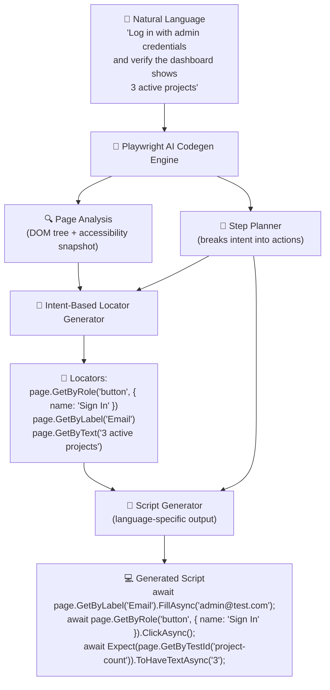
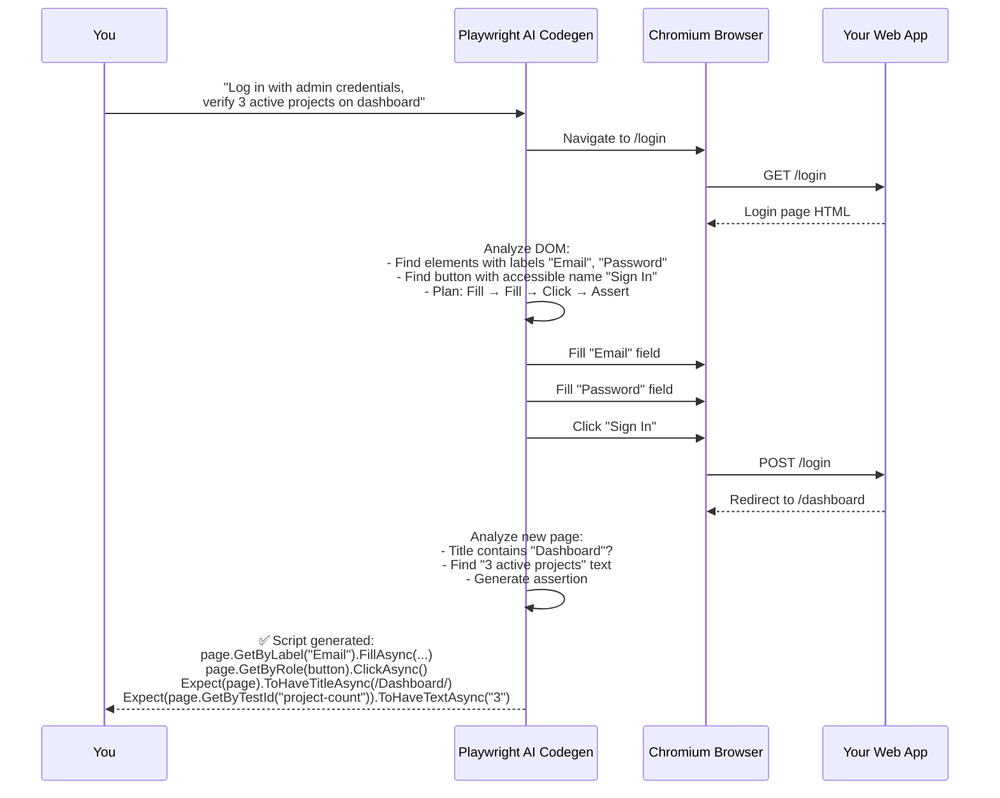
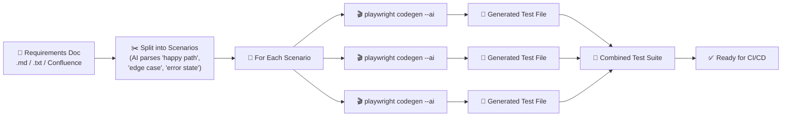
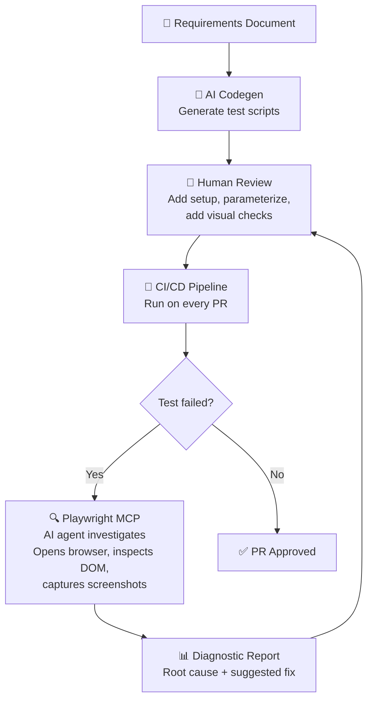
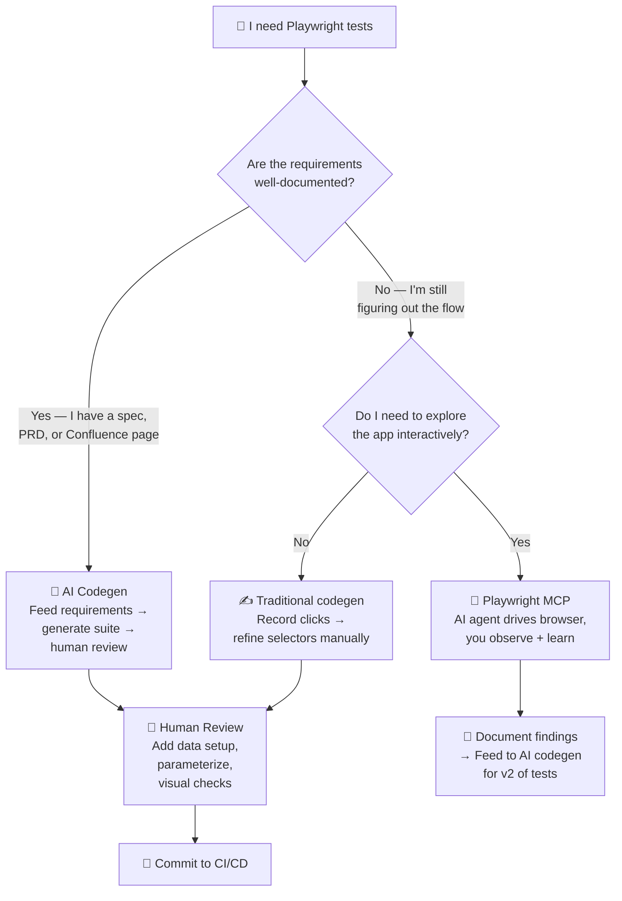

In the [Playwright MCP guide](), you learned how to let an AI agent drive your browser through natural language. Now we go one step deeper: **AI codegen** — where Playwright *writes the test script for you*, not just executes your commands. You describe what you want in plain English, and Playwright generates idiomatic, maintainable code in your language of choice (C#, Python, TypeScript, or Java).

If Playwright MCP is like having an AI chauffeur drive your car, AI codegen is like the chauffeur writing you the driver's manual — so you can replay the journey anytime, tweak the route, and commit it to CI/CD.

This post is the natural next step after the Selenium 2026 and Playwright MCP guides. No prior AI experience needed — just a working Playwright install.

## What `npx playwright codegen --ai` Actually Does

Traditional `playwright codegen` (no `--ai` flag) records your clicks and keystrokes and translates them into Playwright scripts mechanically:

```
Click on button #checkout  →  await page.ClickAsync("#checkout")
Type "test@example.com"   →  await page.FillAsync("#email", "test@example.com")
```

It works, but it's brittle. The selectors are whatever CSS path Playwright guesses at the moment of recording. Change the DOM, and the script breaks.

**AI codegen** (`--ai` flag, stable since Playwright v1.50) is fundamentally different:



The engine doesn't just record — it **understands intent**. Instead of generating `page.Locator("#email-17abc")`, it generates `page.GetByLabel("Email")` — a semantic locator that survives DOM reshuffles.

## Step 1: Basic AI Codegen — From Sentence to Script

Open a terminal and run:

```bash
npx playwright codegen --ai https://your-app.com/login
```

A Chromium window opens alongside the Playwright Inspector. In the inspector, instead of clicking around, **type what you want**:

```
Log in with:
  - Email: admin@example.com
  - Password: SuperSecret123!
After login, verify the page title contains "Dashboard"
Click on "Projects" in the sidebar
Verify the project list has at least 5 items
```

Playwright watches the page, plans the steps, and generates:

```csharp
// Generated by Playwright AI Codegen — C# / NUnit
using Microsoft.Playwright.NUnit;

public class LoginFlowTests : PageTest
{
    [Test]
    public async Task AdminLoginAndVerifyProjects()
    {
        await Page.GotoAsync("https://your-app.com/login");

        // Fill login form using semantic locators
        await Page.GetByLabel("Email").FillAsync("admin@example.com");
        await Page.GetByLabel("Password").FillAsync("SuperSecret123!");
        await Page.GetByRole(AriaRole.Button, new() { Name = "Sign In" }).ClickAsync();

        // Web-First assertion: auto-waits for title match
        await Expect(Page).ToHaveTitleAsync(new System.Text.RegularExpressions.Regex("Dashboard"));

        // Navigate to Projects
        await Page.GetByRole(AriaRole.Link, new() { Name = "Projects" }).ClickAsync();

        // Assert project list has at least 5 items
        var projectItems = Page.GetByTestId("project-list-item");
        await Expect(projectItems.First).ToBeVisibleAsync();
        
        var count = await projectItems.CountAsync();
        Assert.That(count, Is.GreaterThanOrEqualTo(5));
    }
}
```



### Multi-Language Output

AI codegen supports all Playwright languages. The same natural-language input generates idiomatic code for each:

| Language | Command | Generated assertion style |
|---|---|---|
| **C# / NUnit** | Default on .NET projects | `await Expect(Page.GetByText("Success")).ToBeVisibleAsync();` |
| **Python / pytest** | `--ai --lang python` | `expect(page.get_by_text("Success")).to_be_visible()` |
| **TypeScript** | `--ai --lang ts` | `await expect(page.getByText("Success")).toBeVisible();` |
| **Java / JUnit** | `--ai --lang java` | `assertThat(page.getByText("Success")).isVisible();` |

## Step 2: From Requirements Document to Full Test Suite

The real power of AI codegen emerges when you feed it a **requirements document** instead of one-off instructions. This is the workflow teased in the [AI-Driven Test Strategy]() post — Phase 2 in practice.

### The Requirements-to-Tests Pipeline



### Practical Example

Say you have this requirements snippet for an e-commerce checkout:

```markdown
# Checkout Flow Requirements

## Happy Path
- User adds item to cart from product page
- User proceeds to checkout
- User enters valid shipping address
- User selects credit card payment
- User confirms order
- System displays order confirmation with order number
- System sends confirmation email

## Edge Cases
- User tries to checkout with empty cart → show "Cart is empty" message
- User enters invalid credit card → show inline validation error
- User's session expires during checkout → redirect to login, preserve cart

## Error States
- Payment gateway timeout → show "Payment processing, do not refresh" with retry
- Inventory goes out of stock between add-to-cart and checkout → show "Item unavailable" with alternatives
```

**Feed each section separately** to AI codegen for best results:

```bash
# Happy path
npx playwright codegen --ai https://your-store.com/product/123 \
  --prompt "Add the item to cart, proceed to checkout, fill valid shipping
  address, select credit card payment, confirm order, verify order
  confirmation appears with an order number."

# Edge case: empty cart
npx playwright codegen --ai https://your-store.com/checkout \
  --prompt "Navigate directly to /checkout with an empty cart. Verify
  the page shows 'Cart is empty' and the checkout button is disabled."

# Edge case: invalid credit card
npx playwright codegen --ai https://your-store.com/checkout \
  --prompt "Add an item to cart, go to checkout, enter credit card
  number '0000-0000-0000-0000', verify an inline error appears
  below the card field saying 'Invalid card number'."

# Error state: payment timeout
npx playwright codegen --ai https://your-store.com/checkout \
  --prompt "Complete checkout up to payment step, then simulate a
  payment gateway timeout (use the test card 4444-3333-2222-1111
  which triggers a timeout on this app). Verify 'Payment processing'
  message appears with a retry button."
```

AI codegen generates a separate test file per scenario. Combine them into a single test class, add a `[Test]` attribute per method, and you have a complete checkout test suite — **generated from the requirements doc** in under 10 minutes.

### What AI Codegen Gets Right (and Wrong)

| What it nails | What needs human review |
|---|---|
| Semantic locators (`GetByRole`, `GetByLabel`, `GetByTestId`) | Business logic assertions (did the order *really* succeed?) |
| Web-First Assertions with auto-retry | Test data setup (creating test users, seeding the database) |
| Error handling patterns (`Try/Catch`, timeout configuration) | Test isolation (does test B depend on test A's state?) |
| Consistent naming conventions per language | Edge cases the requirements doc didn't mention |
| `using` statements and imports | Performance (did it generate 50 sequential tests when 10 parallel ones would work?) |

**The human's job shifts from writing code to reviewing code.** You spend 80% less time typing and 100% more time thinking about what could go wrong.

## Step 3: Refining AI-Generated Tests

AI codegen gives you an 80% solution. Here's how to get to 95%.

### Add Test Data Setup

AI codegen works against live pages. It doesn't know how to seed your database. Add setup methods manually:

```csharp
[SetUp]
public async Task Setup()
{
    // AI can't generate this — you know your data model
    await ApiClient.SeedAsync(new TestData
    {
        User = new User { Email = "admin@example.com", Role = "Admin" },
        Projects = Enumerable.Range(1, 5).Select(i => new Project { Name = $"Project {i}" }).ToList()
    });

    await Page.GotoAsync("https://your-app.com/login");
}
```

### Replace Hardcoded Values with Test Parameters

AI codegen generates hardcoded values. Parameterize them:

```csharp
// ❌ AI-generated: hardcoded values
await Page.GetByLabel("Email").FillAsync("admin@example.com");

// ✅ After human refinement: parameterized
[TestCase("admin@example.com", "SuperSecret123!", ExpectedResult = true)]
[TestCase("user@example.com", "wrong-password", ExpectedResult = false)]
public async Task<bool> LoginFlow(string email, string password)
{
    await Page.GetByLabel("Email").FillAsync(email);
    await Page.GetByLabel("Password").FillAsync(password);
    await Page.GetByRole(AriaRole.Button, new() { Name = "Sign In" }).ClickAsync();
    
    return await Page.GetByText("Dashboard").IsVisibleAsync();
}
```

### Add Visual Regression Checks

AI codegen doesn't generate visual assertions. Add them:

```csharp
// After AI-generated checkout flow completes
await Expect(Page).ToHaveScreenshotAsync("checkout-confirmation.png", new()
{
    MaxDiffPixelRatio = 0.01f  // Allow 1% pixel difference
});
```

## Step 4: AI Codegen + MCP — Two Sides of the Same Coin

AI codegen and Playwright MCP (from the [previous guide]()) solve different problems:

| | AI Codegen | Playwright MCP |
|---|---|---|
| **What it does** | Generates Playwright scripts you commit to your repo | Lets AI agents control the browser in real time |
| **Output** | `.cs` / `.py` / `.ts` / `.java` files | Browser actions + screenshots + network traces |
| **Best for** | CI/CD pipelines, regression suites, repeatable tests | Exploratory testing, one-off audits, debugging |
| **Determinism** | Deterministic (same script, same result) | Non-deterministic (AI decides next action) |
| **Human review** | Review once, run forever | Review per session |

### The Combined Workflow



AI codegen creates the tests, MCP debugs them when they fail. Together, they form a **self-improving test pipeline** — the Phase 4 vision from the [AI-Driven Test Strategy]() post.

## Step 5: CI/CD Integration — Generated Tests in Your Pipeline

AI-generated tests slot into any CI/CD pipeline. Here's a GitHub Actions example:

```yaml
name: AI-Generated E2E Tests
on:
  pull_request:
    branches: [main]

jobs:
  playwright-tests:
    runs-on: ubuntu-latest
    steps:
      - uses: actions/checkout@v4
      
      - name: Setup .NET
        uses: actions/setup-dotnet@v4
        with:
          dotnet-version: '8.0'
      
      - name: Install Playwright browsers
        run: npx playwright install --with-deps chromium
      
      - name: Run AI-generated test suite
        run: dotnet test tests/GeneratedE2E/ --filter "Category=Smoke"
      
      - name: Upload Playwright trace on failure
        if: failure()
        uses: actions/upload-artifact@v4
        with:
          name: playwright-trace
          path: test-results/
```

Key point: the generated tests use `GetByRole`, `GetByLabel`, and `GetByTestId` — locators that are **resilient to DOM changes**. Your CI/CD pipeline won't break because a CSS class was renamed.

## Where Existing Posts Fit

This post completes the 2026 Playwright trilogy:

| Earlier post | What it covered | What this post adds |
|---|---|---|
| [Playwright MCP + Multi-Agent (Aug 2026)]() | Letting AI drive the browser via MCP, multi-agent orchestration | AI *writing* the test scripts you commit to version control |
| [Playwright .NET Framework (Sep 2024)]() | Manual Playwright setup: DI, Page Objects, Allure reports | AI-generated Page Objects and test classes replace manual wiring |
| [AI-Driven Test Strategy (Jun 2026)]() | Phase 2: AI-assisted test generation with structured prompts | Phase 2 in practice: `codegen --ai` as the implementation |
| [Selenium 2026 Beginner's Guide (Jul 2026)]() | Selenium setup, BiDi, MCP server | Playwright's AI codegen is the capability Selenium doesn't yet match — see [BiDi vs CDP]() for the architectural reasons why |

## When to Use AI Codegen vs. Alternatives



## Sources & Further Reading

1. [Playwright Codegen Documentation](https://playwright.dev/docs/codegen) — official guide to the test generator, including `--ai` mode
2. [Playwright .NET API Reference](https://playwright.dev/dotnet/docs/intro) — C# API docs for the locator and assertion patterns used throughout
3. [Model Context Protocol Specification](https://modelcontextprotocol.io/) — the MCP standard that enables the combined AI codegen + MCP debugging workflow in Step 4
4. [Angie Jones / mcp-selenium](https://github.com/angiejones/mcp-selenium) — the original Selenium MCP server for comparison with Playwright's native `@playwright/mcp`

## What to Do Next

1. **Try basic AI codegen right now.** Run `npx playwright codegen --ai` against any public website and type "Log in, verify the page title contains Dashboard, then click the first item in the list." Watch the semantic locators appear in real time.
2. **Feed a real requirements doc.** Take a Confluence page or PRD you already have, split it into scenarios, and feed each section to `codegen --ai`. You'll have a test suite in under 30 minutes.
3. **Combine with MCP for debugging.** When an AI-generated test fails in CI, spin up [Playwright MCP]() to investigate the failure interactively instead of staring at a trace file.
4. **Compare to Selenium.** Read the [BiDi vs CDP comparison]() to understand why Playwright's native CDP architecture enables AI codegen while Selenium's WebDriver layer makes it harder.
5. **Subscribe to this blog's [feed.xml]()** — next up: self-healing test suites that automatically fix broken locators in CI/CD using the same intent-based AI that powers codegen.

*See also:* [Playwright vs Selenium in 2026 (Jun 2026)]() — the speed, reliability, and ecosystem comparison that explains why Playwright leads on AI-native features like codegen.
