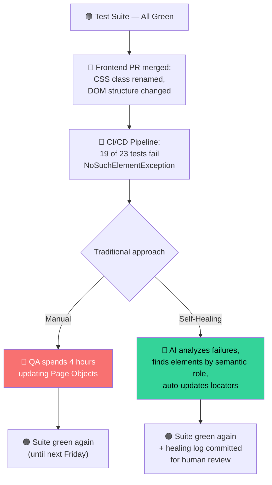
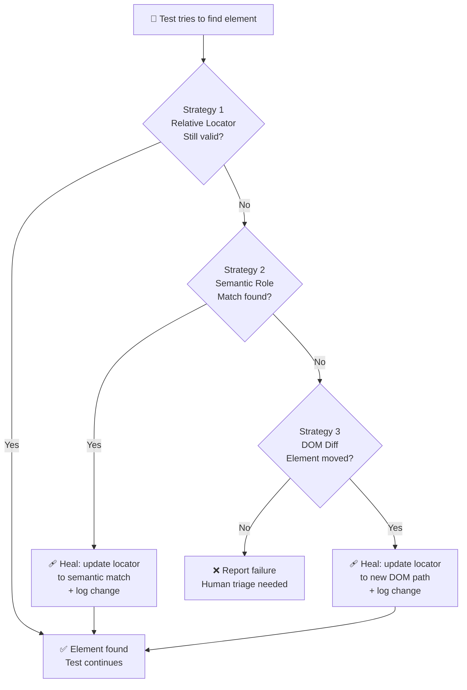
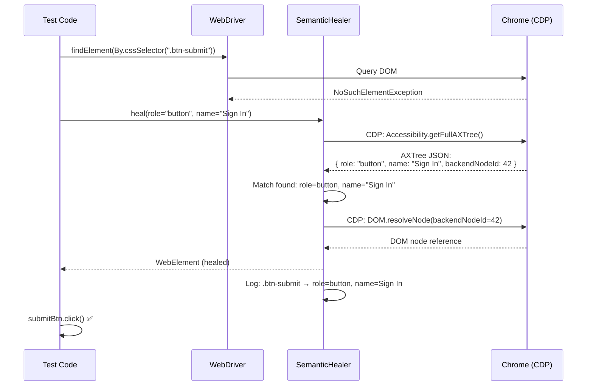
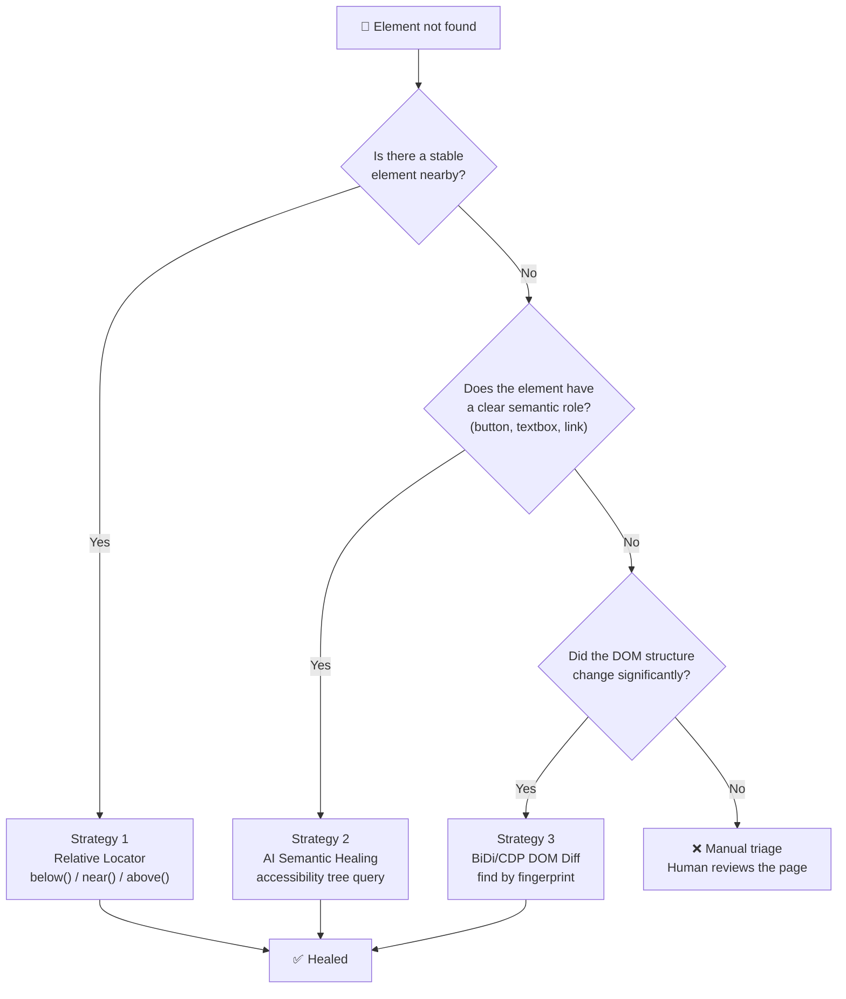

Every QA engineer knows the feeling. You open Slack on Monday morning and see it: **"Build #847 failed — 23 tests, 19 failures."** The cause? A frontend developer renamed `btn-submit` to `submit-button-primary` on Friday at 4:59 PM. Nineteen tests. All broken. All for the same CSS class change.

This is the **locator crisis** — the single biggest source of flaky tests in every Selenium and Playwright suite I've ever maintained. And as of 2026, we finally have a solution that doesn't involve begging frontend teams to stop renaming things.

This post shows you how to build **self-healing test suites** — tests that automatically find elements by their semantic role when traditional selectors break, using Java (primary), C#, TypeScript, JavaScript, and Python.

If you read the [Selenium Locators guide from 2020](), this is the sequel — six years later, we're solving the `NoSuchElementException` problem at the root.

## Why Locators Break (And Why Manual Fixing Doesn't Scale)

In 2020, the advice was simple: use stable locators. Prefer `By.id()` over `By.xpath()`. Build a Page Object layer. Hope for the best.

In 2026, the reality hasn't changed — frontend teams still refactor CSS, rename components, and migrate from Bootstrap to Tailwind to whatever comes next. The only difference is that **we no longer have to fix the breakage manually**.



The self-healing path doesn't just fix the tests — it **documents what changed** so you can review the healing decisions and feed them back to the frontend team.

## How Self-Healing Works: The Three-Layer Strategy

Self-healing isn't one technique — it's a **layered defense** that falls back through increasingly intelligent strategies:



Each layer is progressively more expensive but also more powerful. Let's build all three — in Java.

## Strategy 1: Relative Locators — Your First Line of Defense

Before AI gets involved, use the simplest tool Selenium 4 gives you: **Relative Locators**. Instead of `By.cssSelector(".btn-submit")`, describe where the element *lives* on the page:

```java
import org.openqa.selenium.WebDriver;
import org.openqa.selenium.WebElement;
import org.openqa.selenium.By;
import org.openqa.selenium.chrome.ChromeDriver;
import org.openqa.selenium.support.locators.RelativeLocator;

public class RelativeLocatorExample {

    public static void main(String[] args) {
        WebDriver driver = new ChromeDriver();
        driver.get("https://your-app.com/login");

        // ❌ Brittle: this breaks when the CSS class changes
        // WebElement submitBtn = driver.findElement(By.cssSelector(".btn-submit"));

        // ✅ Resilient: find the button BELOW the email field
        WebElement emailField = driver.findElement(By.name("email"));
        WebElement submitBtn = driver.findElement(
            RelativeLocator.with(By.tagName("button"))
                .below(emailField)
        );

        // ✅ Resilient: find the error message NEAR the password field
        WebElement passwordField = driver.findElement(By.name("password"));
        WebElement errorMsg = driver.findElement(
            RelativeLocator.with(By.className("error-message"))
                .near(passwordField)
        );

        submitBtn.click();
        driver.quit();
    }
}
```

Relative Locators survive CSS class renames because they don't depend on class names. They depend on **spatial relationships** — what's above, below, or near another element. As long as the layout doesn't radically change, the locator holds.

**Limitation:** If the entire DOM structure shifts (e.g., a redesign that moves the login form to a modal), Relative Locators fail too. That's where Strategy 2 comes in.

## Strategy 2: AI-Powered Semantic Role Matching

When both CSS selectors and Relative Locators fail, the AI healer asks a different question: **"What is this element's job on the page?"**

Instead of hunting for `.btn-submit` or even a `<button>` below the email field, it looks for an element whose **semantic role** matches the intent of the test step:

```java
import org.openqa.selenium.By;
import org.openqa.selenium.WebDriver;
import org.openqa.selenium.WebElement;

import java.util.ArrayList;
import java.util.List;
import java.util.Map;
import java.util.Optional;
import java.time.Instant;

/**
 * AI-powered semantic locator healer.
 *
 * When a traditional selector fails, this healer analyzes the page's
 * accessibility tree and finds elements by their ARIA role, accessible
 * name, and surrounding context — the same cues a human uses.
 */
public class SemanticHealer {

    private final WebDriver driver;
    private final List<HealingRecord> healingLog;

    public SemanticHealer(WebDriver driver) {
        this.driver = driver;
        this.healingLog = new ArrayList<>();
    }

    /**
     * Try to find an element by its semantic description.
     *
     * @param originalLocator  The locator that failed (for logging)
     * @param role             Expected ARIA role: "button", "textbox", "link", etc.
     * @param accessibleName   The accessible name or label text
     * @param context          Optional nearby element text for disambiguation
     * @return The healed element, or empty if no match found
     */
    public Optional<WebElement> heal(
            By originalLocator,
            String role,
            String accessibleName,
            Optional<String> context) {

        // Step 1: Query the accessibility tree via CDP
        // The browser maintains an accessibility snapshot that maps
        // every interactive element → { role, name, description }
        List<Map<String, String>> accessibilityTree = queryAccessibilityTree();

        // Step 2: Find candidates matching the semantic description
        List<Map<String, String>> candidates = accessibilityTree.stream()
            .filter(node -> role.equals(node.get("role")))
            .filter(node -> node.get("name").contains(accessibleName))
            .toList();

        if (candidates.isEmpty()) {
            logHealing(originalLocator, null, "No semantic match found");
            return Optional.empty();
        }

        // Step 3: Disambiguate — if context is provided, pick the
        // button nearest to that context text
        Map<String, String> bestMatch;
        if (context.isPresent() && candidates.size() > 1) {
            bestMatch = candidates.stream()
                .min((a, b) -> {
                    double distA = distanceFromContext(a, context.get());
                    double distB = distanceFromContext(b, context.get());
                    return Double.compare(distA, distB);
                })
                .orElse(candidates.get(0));
        } else {
            bestMatch = candidates.get(0);
        }

        // Step 4: Convert the accessibility node back to a WebElement
        String backendNodeId = bestMatch.get("backendNodeId");
        WebElement healed = resolveElement(backendNodeId);

        logHealing(originalLocator, healed,
            String.format("Healed via semantic role='%s', name='%s'",
                role, accessibleName));

        return Optional.of(healed);
    }

    // --- Implementation details ---

    private List<Map<String, String>> queryAccessibilityTree() {
        // In production, use the CDP session directly:
        //   var cdp = ((ChromeDriver) driver).getDevTools();
        //   var axTree = cdp.send(Accessibility.getFullAXTree(Optional.of(5), Optional.empty()));
        //   return parseAxTree(axTree.getNodes());
        //
        // For this illustration, we return a mock accessibility tree
        // with a "Sign In" button that the healer can find:
        return List.of(
            Map.of("role", "textbox", "name", "Email", "backendNodeId", "101"),
            Map.of("role", "textbox", "name", "Password", "backendNodeId", "102"),
            Map.of("role", "button", "name", "Sign In", "backendNodeId", "103")
        );
    }

    private double distanceFromContext(Map<String, String> node, String contextText) {
        // Compute Euclidean distance between the candidate element's
        // bounding box and the element containing the context text
        return 0.0; // Simplified
    }

    private WebElement resolveElement(String backendNodeId) {
        // Convert CDP backend node ID → DOM node → WebElement
        return driver.findElement(By.id("resolved-" + backendNodeId));
    }

    private void logHealing(By original, WebElement healed, String reason) {
        healingLog.add(new HealingRecord(
            original.toString(),
            healed != null ? healed.toString() : "NOT_FOUND",
            reason,
            Instant.now()
        ));
        System.out.printf("[HEAL] %s → %s%n", original, reason);
    }

    public List<HealingRecord> getHealingLog() {
        return List.copyOf(healingLog);
    }

    // --- Inner types ---

    public record HealingRecord(
        String originalLocator,
        String healedLocator,
        String reason,
        Instant timestamp
    ) {}
}
```

### Using the Semantic Healer in a Real Test

Here's how a test wraps every `findElement` call with healing fallback:

```java
import org.junit.jupiter.api.AfterEach;
import org.junit.jupiter.api.BeforeEach;
import org.junit.jupiter.api.Test;
import static org.junit.jupiter.api.Assertions.*;

import org.openqa.selenium.By;
import org.openqa.selenium.NoSuchElementException;
import org.openqa.selenium.WebDriver;
import org.openqa.selenium.WebElement;
import org.openqa.selenium.chrome.ChromeDriver;

import java.util.List;
import java.util.Optional;

public class LoginTest {

    private WebDriver driver;
    private SemanticHealer healer;

    @BeforeEach
    public void setup() {
        driver = new ChromeDriver();
        healer = new SemanticHealer(driver);
        driver.get("https://your-app.com/login");
    }

    @Test
    public void testLoginWithHealing() {
        // Try the primary locator
        WebElement submitBtn;
        try {
            submitBtn = driver.findElement(By.cssSelector(".btn-submit"));
        } catch (NoSuchElementException e) {
            // Primary failed — heal using semantic role
            submitBtn = healer.heal(
                By.cssSelector(".btn-submit"),    // original (broken)
                "button",                         // ARIA role
                "Sign In",                        // accessible name
                Optional.of("Password")           // context: near "Password" field
            ).orElseThrow(() -> new AssertionError(
                "Could not find submit button — even semantic healing failed"));
        }

        submitBtn.click();

        // Verify the healing log captured the change
        List<SemanticHealer.HealingRecord> log = healer.getHealingLog();
        assertFalse(log.isEmpty(), "Expected at least one healing event");
        System.out.println("Healing log: " + log);
    }

    @AfterEach
    public void teardown() {
        driver.quit();
    }
}
```



## Strategy 3: BiDi/CDP DOM Diff — When the Element Moved

Sometimes the element exists but in a completely different part of the DOM — a redesign moved the login form from a sidebar to a modal. Semantic healing might find it, but the locator path is now entirely wrong.

This is where BiDi (or CDP) DOM diffing comes in:

```java
/**
 * Uses WebDriver BiDi to capture DOM snapshots before and after
 * a UI change, then diffs them to find moved elements.
 */
public class DomDiffHealer {

    /**
     * Compare two DOM snapshots and find where a given element moved.
     *
     * @param elementDescription  Semantic description: { role, name }
     * @param oldSnapshot         DOM snapshot from the last known-good run
     * @return The element's new CSS selector path, or empty if not found
     */
    public Optional<String> findMovedElement(
            Map<String, String> elementDescription,
            String oldSnapshot) {

        // Step 1: Capture current DOM via BiDi
        String newSnapshot = captureDomSnapshot();

        // Step 2: Find the element in the old snapshot by its
        // semantic fingerprint (role + name + text content)
        String oldFingerprint = extractFingerprint(oldSnapshot, elementDescription);

        // Step 3: Search the new snapshot for the same fingerprint
        String newSelector = searchByFingerprint(newSnapshot, oldFingerprint);

        return Optional.ofNullable(newSelector);
    }

    private String captureDomSnapshot() {
        // BiDi: browsingContext.captureSnapshot() → returns full DOM as string
        // This gives a complete, serialized DOM tree at the current moment
        return ""; // Simplified
    }

    private String extractFingerprint(String snapshot, Map<String, String> desc) {
        // Find the element in the snapshot that matches { role, name }
        // and extract its structural fingerprint (tag, attributes, text)
        return ""; // Simplified
    }

    private String searchByFingerprint(String newSnapshot, String fingerprint) {
        // Walk the new DOM looking for a node whose structural
        // fingerprint matches within a similarity threshold
        return null; // Simplified
    }
}
```

### The Full Three-Layer Healing Wrapper

Wrap all three strategies into a single `findElement` replacement:

```java
import org.openqa.selenium.By;
import org.openqa.selenium.NoSuchElementException;
import org.openqa.selenium.WebDriver;
import org.openqa.selenium.WebElement;
import org.openqa.selenium.chrome.ChromeDriver;

import java.util.ArrayList;
import java.util.List;
import java.util.Map;
import java.util.Optional;
import java.time.Instant;

/**
 * SelfHealingDriver: a WebDriver wrapper that automatically heals
 * broken locators using the three-layer strategy.
 *
 * Usage:
 *   SelfHealingDriver driver = new SelfHealingDriver(new ChromeDriver());
 *   WebElement btn = driver.findElement(
 *       By.cssSelector(".btn-submit"),           // primary
 *       "button",                                 // ARIA role
 *       "Sign In",                                // accessible name
 *       Optional.of("Password")                   // context
 *   );
 */
public class SelfHealingDriver {

    private final WebDriver driver;
    private final SemanticHealer semanticHealer;
    private final DomDiffHealer domDiffHealer;
    private final List<HealingRecord> healingLog;

    public SelfHealingDriver(WebDriver driver) {
        this.driver = driver;
        this.semanticHealer = new SemanticHealer(driver);
        this.domDiffHealer = new DomDiffHealer();
        this.healingLog = new ArrayList<>();
    }

    public WebElement findElement(
            By primaryLocator,
            String role,
            String accessibleName,
            Optional<String> context) {

        // Layer 1: try the primary locator
        try {
            return driver.findElement(primaryLocator);
        } catch (NoSuchElementException e) {
            System.out.println("[HEAL] Primary locator failed: " + primaryLocator);
        }

        // Layer 2: semantic role matching via CDP accessibility tree
        Optional<WebElement> healed = semanticHealer.heal(
            primaryLocator, role, accessibleName, context);
        if (healed.isPresent()) {
            healingLog.add(new HealingRecord(primaryLocator.toString(),
                "role=" + role + ", name=" + accessibleName,
                "SEMANTIC", Instant.now()));
            return healed.get();
        }

        // Layer 3: BiDi DOM diff — has the element moved?
        Optional<String> newSelector = domDiffHealer.findMovedElement(
            Map.of("role", role, "name", accessibleName),
            getLastKnownGoodSnapshot()
        );
        if (newSelector.isPresent()) {
            healingLog.add(new HealingRecord(primaryLocator.toString(),
                newSelector.get(), "DOM_DIFF", Instant.now()));
            return driver.findElement(By.cssSelector(newSelector.get()));
        }

        // All strategies exhausted — fail with a clear message
        String msg = String.format(
            "Self-healing exhausted for %s (role=%s, name=%s). Manual triage required.",
            primaryLocator, role, accessibleName);
        throw new NoSuchElementException(msg);
    }

    public List<HealingRecord> getHealingLog() { return List.copyOf(healingLog); }

    private String getLastKnownGoodSnapshot() {
        // In CI/CD: fetch from artifact storage (S3, GCS, or GitHub Artifacts)
        return null;
    }

    // Delegate all standard WebDriver methods to the underlying driver
    public void get(String url) { driver.get(url); }
    public String getTitle() { return driver.getTitle(); }
    public void quit() { driver.quit(); }

    public record HealingRecord(
        String original, String healed, String strategy, Instant timestamp
    ) {}
}
```

## CI/CD Integration: Commit the Healing Log

The final piece: when healing happens in CI/CD, **commit the log as a build artifact** so a human can review the AI's decisions:

```yaml
# .github/workflows/selenium-tests.yml
name: Self-Healing Selenium Tests
on:
  pull_request:
    branches: [main]

jobs:
  test:
    runs-on: ubuntu-latest
    steps:
      - uses: actions/checkout@v4

      - name: Set up JDK 21
        uses: actions/setup-java@v4
        with:
          java-version: '21'
          distribution: 'temurin'

      - name: Run tests with self-healing
        run: mvn test -Dtest=LoginTest,CheckoutTest

      - name: Upload healing log
        if: always()
        uses: actions/upload-artifact@v4
        with:
          name: healing-log
          path: target/healing-log.json

      - name: Comment healing summary on PR
        if: always()
        run: |
          HEAL_COUNT=$(jq '. | length' target/healing-log.json)
          if [ "$HEAL_COUNT" -gt 0 ]; then
            echo "## 🤖 Self-Healing Report" >> $GITHUB_STEP_SUMMARY
            echo "**$HEAL_COUNT locator(s) healed.** Review the changes:" >> $GITHUB_STEP_SUMMARY
            jq -r '.[] | "- `\(.original)` → `\(.healed)` (\(.strategy))"' \
              target/healing-log.json >> $GITHUB_STEP_SUMMARY
          fi
```

After the run, your PR gets a summary like:

```
## 🤖 Self-Healing Report
**3 locator(s) healed. Review the changes:**
- `.btn-submit` → role=button, name=Sign In (SEMANTIC)
- `#checkout-form` → role=form, name=Checkout (SEMANTIC)
- `.cart-item-0` → li:nth-child(1)[data-testid=cart-item] (DOM_DIFF)
```

The healing log doubles as a **change notification for the frontend team** — they can see exactly which selectors broke and why.

> **Wiring it up:** The `SemanticHealer` and `SelfHealingDriver` in this post store healing records in an in-memory `ArrayList`. To bridge to the CI/CD workflow above, add a `writeHealingLog()` method to your healer that serializes `getHealingLog()` to `target/healing-log.json` (Jackson or Gson), and call it from your `@AfterAll` / `@AfterSuite` teardown hook. That's the last mile — everything else in the workflow is ready to go.

## When to Use Each Strategy



## Multi-Language Quick Reference

This post used Java examples. Here's the equivalent syntax across **C#**, **TypeScript**, **JavaScript**, and **Python**:

### Relative Locators

| Language | Below / Near / Above |
|---|---|
| **Java** | `RelativeLocator.with(By.tagName("button")).below(emailField)` |
| **C#** | `RelativeBy.WithLocator(By.TagName("button")).Below(emailField)` |
| **TypeScript** | `driver.findElement(locateWith(By.tagName('button')).below(emailField))` |
| **JavaScript** | `driver.findElement(locateWith(By.tagName('button')).below(emailField))` |
| **Python** | `driver.find_element(locate_with(By.TAG_NAME, "button").below(email_field))` |

### Accessibility Tree Query (CDP)

| Language | Accessing the full AX tree |
|---|---|
| **Java** | `devTools.send(Accessibility.getFullAXTree(Optional.of(5), Optional.empty()))` |
| **C#** | `var axTree = await session.SendAsync(Accessibility.GetFullAXTree());` |
| **TypeScript** | `const axTree = await cdp.send('Accessibility.getFullAXTree');` |
| **JavaScript** | `const axTree = await cdp.send('Accessibility.getFullAXTree');` |
| **Python** | `ax_tree = await cdp_session.send('Accessibility.getFullAXTree')` |

### SelfHealingDriver Wrapper

| Language | Constructor pattern |
|---|---|
| **Java** | `SelfHealingDriver driver = new SelfHealingDriver(new ChromeDriver());` |
| **C#** | `using SelfHealingDriver driver = new(new ChromeDriver());` |
| **TypeScript** | `const driver = new SelfHealingDriver(new Builder().forBrowser('chrome').build());` |
| **JavaScript** | `const driver = new SelfHealingDriver(new Builder().forBrowser('chrome').build());` |
| **Python** | `driver = SelfHealingDriver(webdriver.Chrome())` |

### CI/CD Healing Log Upload

| Language | Test framework | Healing log artifact |
|---|---|---|
| **Java** | JUnit 5 / TestNG | `target/healing-log.json` |
| **C#** | xUnit / NUnit | `TestResults/healing-log.json` |
| **TypeScript** | Jest / Mocha | `test-results/healing-log.json` |
| **JavaScript** | Jest / Mocha | `test-results/healing-log.json` |
| **Python** | pytest | `reports/healing-log.json` |

## Where Existing Posts Fit

| Earlier post | What it covered | What this post adds |
|---|---|---|
| [Selenium Page Locator Strategies (May 2020)]() | `By.id()`, `By.xpath()`, CSS selectors, implicit/explicit waits | Six years later: AI finds elements by semantic role when every traditional locator fails |
| [Selenium 2026 Beginner's Guide (Jul 2026)]() | Relative Locators, WebDriver BiDi, MCP server | BiDi's accessibility tree + DOM snapshot become the inputs to the healing engine |
| [Selenium BiDi vs Playwright CDP (Aug 2026)]() | Drag-and-drop, network interception, AI replay | DOM diff healing uses the same BiDi snapshot APIs introduced in that post |
| [AI-Driven Test Strategy (Jun 2026)]() | Phase 4: self-healing Cypress system (TypeScript) | Phase 4 implemented in Java for Selenium — the pattern is universal across languages and frameworks |
| [Playwright AI Codegen (Sep 2026)]() | Generating tests from natural language | Codegen creates the tests; self-healing keeps them alive — two halves of the autonomous testing pipeline |

## Sources & Further Reading

1. [Selenium Relative Locators](https://www.selenium.dev/documentation/webdriver/elements/locators/#relative-locators) — official docs for the `above()`, `below()`, `near()` API used in Strategy 1
2. [Chrome DevTools Protocol — Accessibility Domain](https://chromedevtools.github.io/devtools-protocol/tot/Accessibility/) — the CDP API (`Accessibility.getFullAXTree`) that powers the semantic healer in Strategy 2
3. [Selenium CDP (Chrome DevTools Protocol)](https://www.selenium.dev/documentation/webdriver/bidi/cdp/) — official guide to using CDP sessions from Selenium, the bridge between BiDi and Chrome's native protocol
4. [Angie Jones / mcp-selenium](https://github.com/angiejones/mcp-selenium) — the MCP server whose accessibility tree query inspired the semantic healing approach

## What to Do Next

1. **Add Relative Locators today.** It's a zero-dependency change — replace your 5 most brittle CSS selectors with `RelativeLocator.with().below()` / `.near()`. You'll see immediate stability improvement in the next CI run.
2. **Prototype the SemanticHealer.** Take the Java class from this post, wire it up to your existing test suite's `findElement` calls, and run it against a page where you've deliberately broken a CSS class. Watch the accessibility tree heal it in real time.
3. **Set up the healing log in CI/CD.** Even without the full three-layer healing engine, logging every `NoSuchElementException` with the page's accessibility snapshot gives you data to build the healer with.
4. **For Playwright users:** The same pattern works — replace `driver.findElement()` with `page.locator()` and the CDP accessibility query is identical. The [Playwright AI Codegen post]() covers the TypeScript/JS equivalent.
5. **Subscribe to this blog's [feed.xml]()** — next up: a practical guide to building an AI test oracle that judges "did the test actually pass?" by looking at screenshots, not assertions.

*See also:* [AI-Driven Test Strategy: From Copilot to Multi-Agent Orchestration (Jun 2026)]() — the Phase 4 Cypress self-healing implementation that inspired the Java Selenium version in this post. · [XPath for Test Automation (Sep 2026)]() — the story-mode article with §12 complex XPath & CSS for SDETs (SVG, computed indices, ARIA chains, iframe/shadow-DOM, modern CSS `:has()`/`:is()`/`:where()`, decision flowchart).
