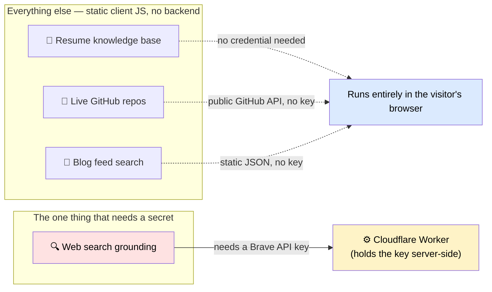
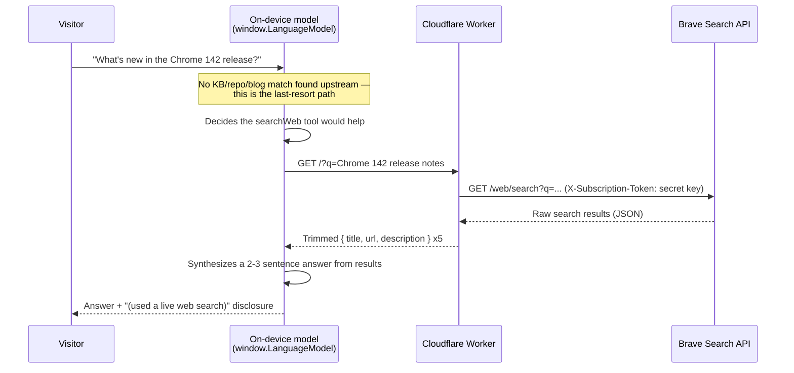

Here's a question that sounds simple until you actually try to ship it: a chatbot on a static site answers questions from a fixed knowledge base — resume, GitHub repos, blog posts. What happens when a visitor asks something that isn't in there?

The obvious answer is "let it search the web." The obvious answer is also where most people get the architecture wrong, because "the browser has an AI built in now" and "the browser can search the web for me" are two very different claims, and only one of them is true.

This post is the write-up of building that path for real — for [Veer](https://veeresh-bikkaneti.github.io), the chat assistant on Veeresh Bikkaneti's portfolio site — including the part that got reverted, and why reverting it was still the right call for now.

## The Assumption That Doesn't Hold

Chrome ships a built-in, on-device language model — Gemini Nano, exposed to the page through `window.LanguageModel` — and as of the current [Prompt API](https://developer.chrome.com/docs/ai/prompt-api), that model supports **tool calling**: you can hand it a function definition, and the model decides for itself, mid-conversation, whether calling that function would help answer the question.

What people hear when they read that: "the browser can search the web for me."

What it actually says: **the model can decide to call a tool you provide.** It does not come with a tool. It has no network access of its own, no search index, no idea what's happened since its training cutoff. If you want it to search the web, you write the `searchWeb` tool yourself and hand it over. The on-device model is the reasoning engine — deciding *whether* to search, and turning raw results into a readable answer — not the search engine itself.

That distinction is the entire architecture of this feature. Get it right and you write about 40 lines of client-side code. Get it wrong and you end up trying to smuggle a paid search API's credentials into a static HTML file, which brings us to the next problem.

## Why the Key Can't Just Live in the Page

Veer's site is, deliberately, 100% static client-side JavaScript. No backend, no server rendering, nothing to patch. That's a fine architecture for a resume knowledge base, a live GitHub feed, a blog search — none of those need a secret.

Web search is different. The [Brave Search API](https://brave.com/search/api/) that backs this feature requires an API key on every request. Any value written into `index.html` — however it's obfuscated, minified, or loaded from a "config" file — ships to the browser and is visible in view-source to every visitor, indexed by anyone who cares to look, and usable by anyone who copies it out. A secret that ships to the client isn't a secret anymore; it's a public key with your name on the bill.

So the one piece of this feature that touches a real backend isn't the AI. It's the thing holding the credential the AI's tool call needs.



Everything on the left runs happily forever with zero backend. The one box on the right is the whole reason a server enters the picture at all — and it exists to do exactly one job: keep a credential off the public internet.

## The Proxy: As Small As the Problem Allows

The fix is a single-purpose [Cloudflare Worker](https://developers.cloudflare.com/workers/) — `veer-search-proxy` — that does nothing but relay a query to Brave and hand back trimmed results. No LLM call happens here. No state. No database binding. It doesn't know anything about Veeresh's resume, repos, or blog; it doesn't even know it's feeding an AI. It's a relay, and it's built to be boring:

```javascript
// worker/src/index.js
const ALLOWED_ORIGIN = "https://veeresh-bikkaneti.github.io";

export default {
  async fetch(request, env) {
    const origin = request.headers.get("Origin") || "";

    if (request.method === "OPTIONS") return new Response(null, { status: 204, headers: corsHeaders(origin) });
    if (request.method !== "GET") return json({ error: "Method not allowed" }, 405, origin);
    if (origin !== ALLOWED_ORIGIN) return json({ error: "Origin not allowed" }, 403, origin);

    const url = new URL(request.url);
    const q = (url.searchParams.get("q") || "").trim().slice(0, 400);
    if (!q) return json({ error: "Missing ?q= query parameter" }, 400, origin);
    if (!env.BRAVE_API_KEY) return json({ error: "Search proxy is not configured" }, 500, origin);

    const braveRes = await fetch(
      `https://api.search.brave.com/res/v1/web/search?q=${encodeURIComponent(q)}&count=5`,
      { headers: { Accept: "application/json", "X-Subscription-Token": env.BRAVE_API_KEY } }
    );
    if (!braveRes.ok) return json({ error: `Search provider returned ${braveRes.status}` }, 502, origin);

    const data = await braveRes.json();
    const results = (data.web?.results || []).slice(0, 5).map(r => ({
      title: r.title || "",
      url: r.url || "",
      description: (r.description || "").replace(/<\/?strong>/g, "")
    }));

    return json({ results }, 200, origin);
  }
};
```

Four things worth calling out, because each one is doing real work despite the file being barely a hundred lines:

- **`env.BRAVE_API_KEY` never appears in `wrangler.toml` or anywhere committed.** It's set with `wrangler secret put BRAVE_API_KEY`, which stores it encrypted on Cloudflare's side and injects it into `env` at runtime. The repo can be fully public with zero risk.
- **CORS is locked to one origin.** `Access-Control-Allow-Origin` only ever echoes back `https://veeresh-bikkaneti.github.io`. It's not a hard security boundary — a non-browser client can forge an `Origin` header — but it stops casual, browser-based abuse of a free-tier quota, which is the actual threat model for a personal-site proxy.
- **The query is capped at 400 characters** before it ever reaches Brave. Small detail, cheap insurance.
- **The response is trimmed to `title`, `url`, `description`** — nothing else Brave returns leaks through. The model gets exactly what it needs for grounding and nothing that increases its context for free.

## The Full Loop: Tool Calling in Practice

With the Worker deployed, the client side is where the "on-device AI decides to search" behavior actually lives. This is `tryWebGroundedAnswer()`, wired in as the absolute last resort in Veer's answer pipeline — only reached when the resume match, the GitHub repo match, and the blog search all come back empty:

```javascript
async function tryWebGroundedAnswer(query) {
  if (!SEARCH_PROXY_URL || !("LanguageModel" in self)) return null;
  try {
    const availability = await LanguageModel.availability();
    if (availability === "unavailable") return null;

    const session = await LanguageModel.create({
      tools: [{
        name: "searchWeb",
        description: "Search the live web for current information not in your training data.",
        inputSchema: { type: "object", properties: { query: { type: "string" } }, required: ["query"] },
        execute: async ({ query: q }) => {
          const res = await fetch(`${SEARCH_PROXY_URL}?q=${encodeURIComponent(q)}`);
          if (!res.ok) return "Search unavailable right now.";
          const data = await res.json();
          return JSON.stringify((data.results || []).map(r => ({ title: r.title, url: r.url, snippet: r.description })));
        }
      }]
    });

    const reply = await session.prompt(
      `You are "Veer", the chat assistant on Veeresh Bikkaneti's portfolio site. A visitor asked something ` +
      `outside what's in your normal knowledge base: "${query}". Use the searchWeb tool if it would help. ` +
      `Answer in 2-3 sentences, plainly, and only state something as fact if the search results actually support it.`
    );
    session.destroy?.();
    return (reply || "").trim() || null;
  } catch (e) {
    return null; // unavailable, model not downloaded, tool calling unsupported — fail silent
  }
}
```

Trace what actually happens on a real question, end to end:



Everything left of the Worker box runs in the visitor's own browser, on their own hardware, using a model that already lives on their machine. The Worker's entire job is the two arrows through it: take a query in, return trimmed JSON out. It never sees the conversation, never sees the visitor's other messages, never calls an LLM itself.

Two gating details matter as much as the happy path:

1. **`SEARCH_PROXY_URL` defaults to an empty string.** Until someone deploys the Worker and pastes its URL in, this function returns `null` on its first line, every time — zero behavior change for every visitor, on every browser. It's opt-in by construction, not by a feature flag someone has to remember to check.
2. **`'LanguageModel' in self` is the whole browser-support check**, and it's deliberately just a feature-detect, not a browser sniff. Firefox, Safari, and Chrome without on-device AI enabled all just skip straight past it to the existing fallback message. No error, no broken UI, no console noise a visitor would ever see.

## The Deployment Friction Nobody Warns You About

The code above shipped clean. Getting it *live* was where the real-world edges showed up — worth documenting honestly rather than pretending the happy path is the whole story.

**Workers Builds' Git integration assumes your `wrangler.toml` sits at the repo root.** Point [Workers Builds](https://developers.cloudflare.com/workers/ci-cd/builds/) at a repo where the Worker lives in a subdirectory — `worker/wrangler.toml`, as here, alongside a portfolio site that isn't a Worker at all — and the build fails looking for a config file that isn't where it expects. The fix is one setting, "Root directory," in the Worker's build configuration, but nothing in the initial setup flow tells you that's the knob you need until the build has already failed once.

**Once a Worker is managed through Wrangler, its dashboard "Variables and Secrets" panel goes read-only.** This one catches people who reasonably expect the dashboard to be the source of truth for everything. Once you deploy via `wrangler`, the CLI becomes canonical, and the dashboard UI for secrets locks to view-only — you set or rotate `BRAVE_API_KEY` with [`wrangler secret put`](https://developers.cloudflare.com/workers/configuration/secrets/), not by clicking into the dashboard and typing a value. It's the correct model — one source of truth beats two that can drift — but it's a surprise the first time the button you expected to work simply isn't clickable.

Neither of these is a Cloudflare bug. Both are the kind of thing that costs twenty minutes the first time and zero minutes every time after, which is exactly the sort of detail worth writing down so the next person doesn't spend the twenty minutes.

## The Tradeoff That Doesn't Go Away

This is the part worth being honest about rather than burying in a footnote: **this feature only works on Chrome, only when Chrome's on-device model is available and downloaded, and it silently does nothing everywhere else.**

That's not a bug to fix later — it's the actual shape of the constraint. On-device AI is still rolling out, gated behind hardware and storage requirements, and Chrome-only by definition since it's a Chrome API, not a web standard every browser implements. Building this feature to *require* it, rather than degrading gracefully in front of it, would mean most visitors get nothing where they currently get a working fallback message. The gating logic isn't defensive boilerplate; it's the feature's actual contract with reality.

## Why It's Reverted, Not Deleted

If you go looking for this in the live site today, you won't find it wired in — it was scaffolded, verified, and then reverted before shipping. That's a deliberate, unglamorous call: the Worker existed in the Cloudflare account but hadn't had its real code deployed yet, `SEARCH_PROXY_URL` was still empty, and shipping a half-deployed dependency isn't the same as shipping a feature. Rather than merge something inert and hope to finish it later under different pressure, the whole thing sits intact in git history — commit `86a4a20` ("Scaffold opt-in web-search grounding: Worker proxy + Chrome AI client"), reverted cleanly by `53ec485`, both on the `claude/portfolio-veer-chatbot-udfmue` branch. Anyone who wants to actually enable it later has a complete, tested starting point to pick back up — worker, README, client gating, all of it — rather than a partial feature bolted onto main.

## Key Takeaways

1. **Tool calling gives a model the ability to decide to use a tool — it doesn't give it the tool.** Every capability the model "has" through tool calling is one you built and handed over.
2. **A secret in client-side JavaScript isn't hidden, it's published.** The only fix is moving the secret behind something that isn't shipped to the browser — here, the smallest possible single-purpose proxy.
3. **The reasoning can live entirely on the client even when a secret can't.** Splitting "who decides" from "who holds the credential" kept 95% of this feature backend-free.
4. **Fail-silent gating is a feature, not a shortcut.** `SEARCH_PROXY_URL` empty by default and a plain `'LanguageModel' in self` check mean unsupported browsers see nothing different, ever.
5. **Shipping the scaffold and reverting the wire-up is a legitimate outcome**, not an abandoned feature — a complete, working starting point beats a half-deployed one sitting on `main`.

## Citations & Further Reading

- Chrome's built-in AI and the Prompt API — [developer.chrome.com/docs/ai/prompt-api](https://developer.chrome.com/docs/ai/prompt-api)
- Chrome's built-in AI APIs overview (`window.LanguageModel` availability, tool calling) — [developer.chrome.com/docs/ai/built-in-apis](https://developer.chrome.com/docs/ai/built-in-apis)
- Cloudflare Workers Builds (Git integration, root directory config) — [developers.cloudflare.com/workers/ci-cd/builds](https://developers.cloudflare.com/workers/ci-cd/builds/)
- Cloudflare Workers secrets (`wrangler secret put`) — [developers.cloudflare.com/workers/configuration/secrets](https://developers.cloudflare.com/workers/configuration/secrets/)
