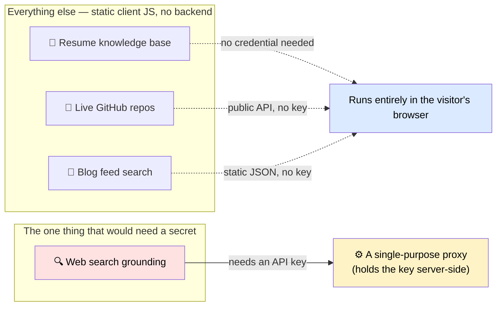
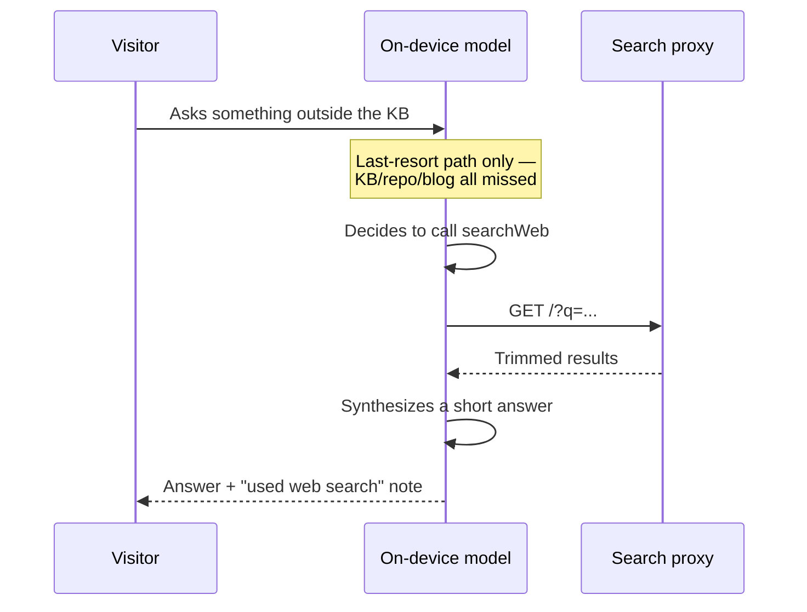

Here's a question that sounds simple until you actually try to ship it: a chatbot on a static site answers questions from a fixed knowledge base — resume, GitHub repos, blog posts. What happens when a visitor asks something that isn't in there?

The obvious answer is "let it search the web." The obvious answer is also where most people get the architecture wrong, because "the browser has an AI built in now" and "the browser can search the web for me" are two very different claims, and only one of them is true.

This post is the write-up of scoping that path for a small portfolio chatbot — what the architecture actually requires, what got built and verified, and what got deliberately left unfinished rather than shipped half-working.

## The Assumption That Doesn't Hold

Chrome ships a built-in, on-device language model — Gemini Nano, exposed to the page through `window.LanguageModel` — and as of the current [Prompt API](https://developer.chrome.com/docs/ai/prompt-api), that model supports **tool calling**: you can hand it a function definition, and the model decides for itself, mid-conversation, whether calling that function would help answer the question.

What people hear when they read that: "the browser can search the web for me."

What it actually says: **the model can decide to call a tool you provide.** It does not come with a tool. It has no network access of its own, no search index, no idea what's happened since its training cutoff. If you want it to search the web, you write the `searchWeb` tool yourself and hand it over. The on-device model is the reasoning engine — deciding *whether* to search, and turning raw results into a readable answer — not the search engine itself.

That distinction is the entire architecture of this feature. Get it right and the client-side piece is maybe 40 lines of code. Get it wrong and you end up trying to smuggle a paid search API's credentials into a static HTML file, which brings us to the next problem.

## Why the Key Can't Just Live in the Page

A chatbot built as 100% static client-side JavaScript — no backend, no server rendering, nothing to patch — is a fine architecture for a resume knowledge base, a live GitHub feed, a blog search. None of those need a secret.

Web search is different. Any real search API requires a key on every request. Any value written into `index.html` — however it's obfuscated, minified, or loaded from a "config" file — ships to the browser and is visible in view-source to every visitor, indexed by anyone who cares to look, and usable by anyone who copies it out. A secret that ships to the client isn't a secret anymore; it's a public key with your name on the bill.

So the one piece of this feature that would need a real backend isn't the AI. It's whatever holds the credential the AI's tool call needs.



Everything on the left runs happily forever with zero backend. The one box on the right is the whole reason a server would enter the picture at all — and its only job would be keeping a credential off the public internet. That's the shape of the fix, independent of which search provider or which serverless platform ends up behind it.

## The Half That Got Built: Tool Calling on the Client

The client-side half of this — the on-device model deciding whether to search, and how — doesn't need a backend to write or to reason about, so that's the part that actually got built and is sitting in git history as a real, syntactically-checked implementation, gated so it changes nothing for any visitor unless someone finishes wiring it up:

```javascript
async function tryWebGroundedAnswer(query) {
  if (!SEARCH_PROXY_URL || !("LanguageModel" in self)) return null;
  try {
    const availability = await LanguageModel.availability();
    if (availability === "unavailable") return null;

    const session = await LanguageModel.create({
      tools: [{
        name: "searchWeb",
        description: "Search the live web for current information not in your training data.",
        inputSchema: { type: "object", properties: { query: { type: "string" } }, required: ["query"] },
        execute: async ({ query: q }) => {
          const res = await fetch(`${SEARCH_PROXY_URL}?q=${encodeURIComponent(q)}`);
          if (!res.ok) return "Search unavailable right now.";
          const data = await res.json();
          return JSON.stringify((data.results || []).map(r => ({ title: r.title, url: r.url, snippet: r.description })));
        }
      }]
    });

    const reply = await session.prompt(
      `A visitor asked something outside your normal knowledge base: "${query}". ` +
      `Use the searchWeb tool if it would help. Answer in 2-3 sentences, plainly, ` +
      `and only state something as fact if the search results actually support it.`
    );
    session.destroy?.();
    return (reply || "").trim() || null;
  } catch (e) {
    return null; // unavailable, model not downloaded, tool calling unsupported — fail silent
  }
}
```

Here's the intended flow this is designed to produce, once a real proxy exists behind `SEARCH_PROXY_URL`:



Two gating details matter as much as the happy path:

1. **`SEARCH_PROXY_URL` defaults to an empty string.** Until a real proxy is deployed and its URL is pasted in, this function returns `null` on its first line, every time — zero behavior change for every visitor, on every browser. It's opt-in by construction, not by a feature flag someone has to remember to check.
2. **`'LanguageModel' in self` is the whole browser-support check**, and it's deliberately just a feature-detect, not a browser sniff. Firefox, Safari, and Chrome without on-device AI enabled all just skip straight past it to the existing fallback message. No error, no broken UI, no console noise a visitor would ever see.

## The Half That Didn't Ship

This is the part worth being honest about rather than glossing over: the proxy side — the actual backend that would hold a search API key and relay queries — was scoped, and a first pass at it was written, but it was never deployed with real credentials and never exercised end-to-end. No live search ever ran through it. Writing up specific vendor deployment steps as lessons learned would be claiming field experience that doesn't exist yet, so this post doesn't do that.

What *is* true, independent of which provider or platform ends up behind the proxy: a credential-holding backend for this feature is the smallest possible surface — a single relay endpoint, no LLM call, no state, no database — and that's a decision worth making deliberately rather than reaching for a heavier pattern (a full RAG pipeline, a vector database, a general-purpose backend) that this specific problem doesn't need.

## The Tradeoff That Doesn't Go Away

Even once the proxy side is finished, this only works on Chrome, only when Chrome's on-device model is available and downloaded, and it silently does nothing everywhere else.

That's not a bug to fix later — it's the actual shape of the constraint. On-device AI is still rolling out, gated behind hardware and storage requirements, and Chrome-only by definition since it's a Chrome API, not a web standard every browser implements. Building this feature to *require* it, rather than degrading gracefully in front of it, would mean most visitors get nothing where they currently get a working fallback message. The gating logic isn't defensive boilerplate; it's the feature's actual contract with reality.

## Why It's Scoped, Not Shipped

If you go looking for this in a live chatbot today, you won't find it wired in — it was scaffolded, then deliberately left unfinished rather than half-deployed. That's a legitimate outcome, not an abandoned one: merging something inert and hoping to finish it later under different pressure isn't the same as shipping a feature, and pretending unverified deployment steps are lessons learned would misrepresent work that didn't happen. The client-side half is complete and sitting in version control as a real starting point — reasoning logic, gating, tool-calling pattern, all of it — for whoever picks it up next.

## Key Takeaways

1. **Tool calling gives a model the ability to decide to use a tool — it doesn't give it the tool.** Every capability the model "has" through tool calling is one you built and handed over.
2. **A secret in client-side JavaScript isn't hidden, it's published.** The only fix is moving the secret behind something that isn't shipped to the browser.
3. **The reasoning can live entirely on the client even when a secret can't.** Splitting "who decides" from "who holds the credential" keeps the client-side half genuinely backend-free, even before the backend half exists.
4. **Fail-silent gating is a feature, not a shortcut.** An empty proxy URL by default and a plain `'LanguageModel' in self` check mean unsupported browsers — and an unfinished backend — see nothing different, ever.
5. **Scoping a feature and stopping before the unverified part is a legitimate outcome.** Writing up deployment lessons you haven't actually lived through is worse than not writing them up at all.

## Citations & Further Reading

- Chrome's built-in AI and the Prompt API — [developer.chrome.com/docs/ai/prompt-api](https://developer.chrome.com/docs/ai/prompt-api)
- Chrome's built-in AI APIs overview (`window.LanguageModel` availability, tool calling) — [developer.chrome.com/docs/ai/built-in-apis](https://developer.chrome.com/docs/ai/built-in-apis)
